<!-- ต้นฉบับเล่ม (แก้ที่ไฟล์นี้เท่านั้น) · เริ่มจากการถอด PDF ฉบับขอสอบ หน้า 23–86 โดย scripts/pdf_to_markdown.py -->

# บทที่ 3 วิธีดำเนินการวิจัย

## 3.1 รูปแบบและขั้นตอนการวิจัย

### 3.1.1 แนวทางการวิจัย

การศึกษานี้เป็นการวิจัยและพัฒนาตามแนวทาง Design Science Research ซึ่ง Hevner และคณะ [15] อธิบายว่าเป็นการสร้างสิ่งประดิษฐ์เชิงสารสนเทศเพื่อตอบปัญหาที่ระบุไว้ แล้วประเมินสิ่งประดิษฐ์นั้นด้วยเกณฑ์ที่กำหนดล่วงหน้า กิจกรรมของการศึกษานี้สัมพันธ์กับแนวทางดังกล่าวสามส่วน ส่วนแรกคือการระบุปัญหาจากงานที่ทบทวนในบทที่ 2 ว่าระบบวิเคราะห์เรซูเมด้วย LLM ยังไม่เปิดให้ผู้ใช้ตรวจสอบที่มาของข้อสรุปรายข้อ ส่วนที่สองคือการสร้างสิ่งประดิษฐ์ ได้แก่ ระบบที่บังคับให้ทุกข้อสรุปผูกกับข้อความในเอกสารและตรวจด้วยกฎที่ประมวลผลซ้ำได้ ส่วนที่สามคือการประเมินตามคำถามการวิจัยสองข้อด้วยชุดคำตอบอ้างอิงและการประเมินแผนโดยผู้ประเมินและผู้เรียน

การประเมินถือว่าระบบที่ใช้โมเดล Generative AI 3 โมเดลร่วมกับกฎตรวจหลักฐานเป็นเงื่อนไขเดียว การศึกษานี้ไม่เปรียบเทียบว่าโมเดลใดดีกว่า ไม่ทดสอบระบบที่ใช้โมเดลเดี่ยว และไม่ทำการทดสอบแบบถอดองค์ประกอบ ข้อมูลรายโมเดลยังถูกเก็บไว้เพื่อการตรวจสอบย้อนหลังและการวิเคราะห์สาเหตุของข้อผิดพลาด

### 3.1.2 ลำดับขั้นตอนการดำเนินงาน

ลำดับการดำเนินงานมีห้าขั้น ขั้นแรกกำหนดนิยามของสถานะ เกณฑ์การให้รหัส และตัวชี้วัดพร้อมตัวหารให้ครบก่อนเก็บข้อมูล ขั้นที่สองพัฒนาระบบและตรวจการทำงานด้วยชุดทดสอบอัตโนมัติและชุดทดสอบสังเคราะห์ ขั้นที่สามทดสอบนำร่องกับผู้เข้าร่วม 5 คนเพื่อตรวจความเข้าใจของคำชี้แจง คู่มือให้รหัส และแบบประเมิน ขั้นที่สี่กำหนดรุ่นของ prompt กฎตรวจหลักฐาน ค่า θ คลังข้อมูล และแบบประเมินให้คงเดิมตลอดการเก็บข้อมูลหลัก ขั้นที่ห้าเก็บข้อมูลจากกลุ่มตัวอย่างหลัก จัดทำชุดคำตอบอ้างอิง และวิเคราะห์ผลตามตัวชี้วัดที่ประกาศไว้

การกำหนดตัวหารของตัวชี้วัดไว้ก่อนมีความสำคัญ เพราะระบบมีสถานะยังสรุปไม่ได้ซึ่งต้องรายงานแยกจากสถานะไม่พบหลักฐาน หากเลือกวิธีคำนวณหลังเห็นผล ค่าที่รายงานอาจดูดีขึ้นจากการไม่นับข้อที่ระบบตัดสินไม่ได้

### 3.1.3 สถานะของการดำเนินงาน

เอกสารฉบับนี้ครอบคลุมบทที่ 1 ถึงบทที่ 3 ผลที่ระบุไว้เกี่ยวกับผู้เข้าร่วม 30 คนจึงเป็นแผนการประเมิน ไม่ใช่ผลที่ดำเนินการแล้ว ตารางที่ 3.1 แยกสถานะของแต่ละกิจกรรมตามหลักฐานที่โครงการมีอยู่ ณ วันที่จัดทำเอกสาร

**ตารางที่ 3.1  สถานะของการดำเนินงานตามระยะของการศึกษา**

| กิจกรรม | สถานะ | หลักฐานหรือเงื่อนไข |
|---|---|---|
| จัดทำชุดข้อกำหนดอ้างอิง 600 ข้อจาก O*NET 31.0 | ดำเนินการแล้ว | ไฟล์ข้อมูลอ้างอิงของโครงการ รุ่น ONET31.0-IS68076026-v1.0 |
| จัดทำคลังรายการเรียนรู้ {{corpus_items}} รายการและความเชื่อมโยง {{map_total}} แถว | ดำเนินการแล้ว | คลังรุ่น {{corpus_version}} ที่สร้างซ้ำได้ด้วยสคริปต์ของโครงการ |
| ตรวจความสอดคล้องของความเชื่อมโยงด้วยสคริปต์ | ดำเนินการแล้ว | ไฟล์สรุปผลการตรวจของโครงการ ลงวันที่ {{review_date_th}} |
| พัฒนา workflow และตรรกะของระบบ | ดำเนินการแล้ว | ไฟล์ workflow 5 ไฟล์และไฟล์ตรรกะเดียวที่ฝังอยู่ใน workflow |
| ทดสอบอัตโนมัติและรันเส้นทางเต็มด้วยผลตอบกลับสังเคราะห์ | ดำเนินการแล้ว | ผลการทดสอบ {{tests_total}} กรณี ผลของตัวตรวจ workflow และผลการรันสามกรณีในภาคผนวก ค |
| ทดสอบ workflow ใน n8n ด้วยบริการจำลอง | กำลังดำเนินการ | ดำเนินการก่อนเชื่อมต่อบริการจริง |
| เชื่อมต่อบริการ OCR โมเดล และบัญชี Google ที่ใช้จริง | กำลังดำเนินการ | ผลการทดสอบการเชื่อมต่อระบุว่ายังไม่ได้ตั้งค่าการเข้าถึงบริการครบ |
| ยื่นขอรับรองจริยธรรมการวิจัยในมนุษย์ | กำลังดำเนินการ | เอกสารประกอบการยื่นอยู่ระหว่างให้อาจารย์ที่ปรึกษาตรวจ |
| ทดสอบนำร่องกับผู้เข้าร่วม 5 คน | ยังไม่ดำเนินการ | ดำเนินการหลังตั้งค่าบริการและได้รับการรับรองจริยธรรม |
| เก็บข้อมูลกลุ่มตัวอย่างหลัก 30 คน ยังไม่ดำเนินการ |  | เริ่มได้หลังได้รับหนังสือรับรองจริยธรรม |

ลำดับการพัฒนา การทดสอบนำร่อง และการเก็บข้อมูลกับกลุ่มหลักแสดงในรูปที่ 3.1

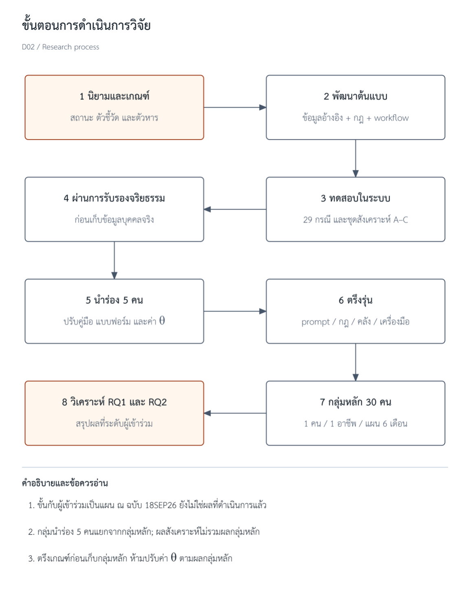

*รูปที่ 3.1  ขั้นตอนการดำเนินการวิจัย*

## 3.2 กลุ่มตัวอย่างและหน่วยวิเคราะห์

### 3.2.1 กลุ่มตัวอย่าง

กลุ่มตัวอย่างหลักเป็นนักศึกษาปริญญาโทด้านเทคโนโลยีสารสนเทศ 30 คนที่มีเรซูเมภาษาอังกฤษและสมัครใจเข้าร่วม คัดเลือกแบบเจาะจงตามคุณสมบัติที่กำหนด ผู้เข้าร่วมเลือกอาชีพเป้าหมายหนึ่งอาชีพจาก 20 อาชีพตามเป้าหมายของตนเอง การกระจายของอาชีพจึงเป็นข้อมูลเชิงพรรณนา และไม่ได้กำหนดโควตาเท่ากันทุกอาชีพ

จำนวน 30 คนกำหนดจากเหตุผลสามข้อ ข้อแรก การศึกษาอยู่ในระยะประเมินต้นแบบ เป้าหมายคือตรวจว่าระบบทำงานได้ตามนิยามและระบุรูปแบบข้อผิดพลาดที่ต้องแก้ ไม่ใช่การประมาณค่าพารามิเตอร์ของประชากร ข้อที่สอง ผู้เข้าร่วมหนึ่งคนให้ข้อมูลระดับข้อกำหนด 30 รายการ จำนวนรายการตรวจรวมสูงสุด 900 รายการจึงเพียงพอต่อการสร้างตารางความสับสนและคำนวณค่า F1 รายสถานะ ข้อที่สาม การจัดทำชุดคำตอบอ้างอิงต้องให้รหัสด้วยมือทุกรายการ จำนวนนี้อยู่ในขอบเขตที่ผู้วิจัยและผู้ตรวจคนที่สองดำเนินการได้ภายในเวลาของการศึกษา การศึกษาไม่อ้างว่าจำนวน 30 คนเพียงพอทางสถิติสำหรับการเปรียบเทียบรายอาชีพหรือการทดสอบสมมติฐานทุกกรณี

การทดสอบนำร่องใช้ผู้เข้าร่วมอีก 5 คนที่ไม่อยู่ในกลุ่มหลัก ผลจากกลุ่มนำร่องใช้ปรับถ้อยคำและเกณฑ์ก่อนตรึงรุ่นของระบบ และไม่นำมารวมกับผลของกลุ่มหลัก ชุดทดสอบสังเคราะห์สามกรณีใช้ตรวจการทำงานของระบบ และไม่นับเป็นข้อมูลของผู้เข้าร่วม

### 3.2.2 หน่วยวิเคราะห์

สำหรับคำถามที่ 1 หน่วยข้อมูลย่อยที่สุดคือหนึ่งข้อกำหนดอ้างอิงของผู้เข้าร่วมหนึ่งคน ผู้เข้าร่วมหนึ่งคนมีข้อกำหนด 30 ข้อ จึงเกิดรายการตรวจสูงสุด 900 รายการ ทั้งนี้รายการที่มาจากเรซูเมฉบับเดียวกันไม่เป็นอิสระต่อกัน หน่วยสรุปผลหลักจึงเป็นผู้เข้าร่วมหนึ่งคน ค่าระดับข้อกำหนดใช้สร้างตารางความสับสนและคำนวณค่า F1 ส่วนค่าเฉลี่ยและช่วงความไม่แน่นอนคำนวณข้ามผู้เข้าร่วมตามหัวข้อ 3.9.4

สำหรับคำถามที่ 2 หน่วยวิเคราะห์คือแผนการเรียนรู้หนึ่งแผนต่อผู้เข้าร่วมหนึ่งคน ตัวชี้วัดที่นับรายการเรียนรู้คำนวณจากรายการที่ไม่ซ้ำกันภายในแผนหนึ่งแผน ไม่นับจากจำนวนแถวความเชื่อมโยงระหว่างรายการกับข้อกำหนด

## 3.3 ข้อมูลและเครื่องมือที่ใช้

### 3.3.1 ข้อกำหนดอ้างอิงของอาชีพ

ข้อกำหนดอ้างอิงมาจากฐานข้อมูล O*NET รุ่น 31.0 [5] ที่โครงการบันทึกเป็นชุดข้อมูลรุ่นคงที่ชื่อ ONET31.0-IS68076026-v1.0 การคัดเลือกใช้กฎคงที่สี่ข้อ ข้อแรก ใช้เฉพาะองค์ประกอบที่มีค่าความสำคัญ (Importance, IM) ตั้งแต่ 3.0 ขึ้นไป ข้อที่สอง ใช้สี่โดเมน ได้แก่ Essential Skills, Transferable Skills, Knowledge และ Work Activities โดยไม่ใช้กลุ่ม Abilities ตามเหตุผลในหัวข้อ 2.5 ข้อที่สาม กำหนดโควตาขั้นต่ำโดเมนละ 3 ข้อเพื่อไม่ให้ข้อกำหนดกระจุกอยู่ในโดเมนเดียว ข้อที่สี่ เรียงตามค่าความสำคัญจากมากไปน้อย ตัดสินกรณีค่าเท่ากันด้วยรหัสองค์ประกอบ แล้วเลือก 30 ข้อแรกต่อหนึ่งอาชีพ รายชื่ออาชีพทั้ง 20 อาชีพพร้อมรหัส SOC แสดงในตารางที่ 3.2 ผลการคัดเลือกของทั้ง 20 อาชีพกระจายตามตารางที่ 3.3

รหัสอาชีพ R01 ถึง R20 ที่ใช้อ้างถึงตลอดรายงานฉบับนี้ พร้อมชื่ออาชีพตามต้นทางและรหัส SOC ที่จับคู่กับฐานข้อมูล O*NET แสดงในตารางที่ 3.2 อาชีพที่ฐานข้อมูลไม่มีรหัสตรงกันใช้การจับคู่แบบใกล้เคียง และเหตุผลของการจับคู่แต่ละรายการอยู่ในภาคผนวก ก

**ตารางที่ 3.2  รายชื่ออาชีพเป้าหมาย 20 อาชีพและรหัสอ้างอิง**

| รหัส | อาชีพเป้าหมาย | ชื่อตามต้นทาง | รหัส SOC | สายงาน |
|---|---|---|---|---|
| R01 | วิศวกรซอฟต์แวร์ หรือนักพัฒนาซอฟต์แวร์ | Software Engineer (Backend/Full-stack) | 15-1252.00 | software |
| R02 | นักพัฒนาเว็บ | Web Developer | 15-1254.00 | software |
| R03 | นักพัฒนาแอปพลิเคชันและโมบายล์ | Application / Mobile Developer | 15-1251.00 | software |
| R04 | วิศวกรทดสอบและ QA Automation | QA & Test Automation Engineer | 15-1253.00 | software |
| R05 | นักออกแบบ UX/UI | UX/UI & Digital Product Designer | 15-1255.00 | software |
| R06 | นักวิทยาศาสตร์ข้อมูล | Data Scientist | 15-2051.00 | data |
| R07 | วิศวกรแมชชีนเลิร์นนิงและปัญญาประดิษฐ์ | Machine Learning / AI Engineer | 15-1221.00 | data |
| R08 | วิศวกรข้อมูล | Data Engineer | 15-1243.00 | data |
| R09 | นักวิเคราะห์ข้อมูลเชิงธุรกิจ | Data / BI Analyst 15-2051.01 |  | analytics |
| R10 | ผู้ดูแลฐานข้อมูล | Database Administrator | 15-1242.00 | data |
| R11 | นักวิเคราะห์ความมั่นคงปลอดภัยสารสนเทศ | Information Security / SOC Analyst | 15-1212.00 | security |
| R12 | วิศวกรความมั่นคงปลอดภัย | Security Engineer 15-1299.05 |  | security |
| R13 | ผู้ทดสอบเจาะระบบ | Penetration Tester | 15-1299.04 | security |
| R14 | นักนิติวิทยาศาสตร์ดิจิทัลและการรับมือเหตุการณ์ | Digital Forensics & Incident Response | 15-1299.06 | security |
| R15 | วิศวกรและสถาปนิกเครือข่าย | Network Engineer / Architect | 15-1241.00 | network |
| R16 | วิศวกรและสถาปนิกระบบคลาวด์ | Cloud Engineer / Solutions Architect | 15-1299.08 | cloud |
| R17 | วิศวกร DevOps และ SRE | DevOps / Site Reliability Engineer | 15-1244.00 | cloud |
| R18 | นักวิเคราะห์ระบบและนักวิเคราะห์ธุรกิจสายไอที | Systems / Business Analyst (IT) | 15-1211.00 | analytics |
| R19 | ผู้จัดการโครงการไอที | IT Project Manager | 15-1299.09 | management |
| R20 | ผู้จัดการฝ่ายสารสนเทศ | IT / IS Manager | 11-3021.00 | management |

ที่มา ประมวลจากฐานข้อมูล O*NET รุ่น 31.0 [5] ชุดข้อมูลรุ่นคงที่ ONET31.0-IS68076026-v1.0 เผยแพร่ภายใต้สัญญาอนุญาต Creative Commons Attribution 4.0 International โดย O*NET เป็นเครื่องหมายการค้าของ USDOL/ETA

**ตารางที่ 3.3  การกระจายของข้อกำหนดอ้างอิง 600 ข้อตามโดเมน**

| โดเมน | จำนวนข้อกำหนด | สัดส่วน |
|---|---|---|
| Work Activities | 343 | 57.2% |
| Essential Skills | 104 | 17.3% |
| Transferable Skills | 77 | 12.8% |
| Knowledge | 76 | 12.7% |
| รวม | 600 | 100.0% |

ที่มา ประมวลจากฐานข้อมูล O*NET รุ่น 31.0 [5] ชุดข้อมูลรุ่นคงที่ ONET31.0-IS68076026-v1.0 เผยแพร่ภายใต้สัญญาอนุญาต Creative Commons Attribution 4.0 International โดย O*NET เป็นเครื่องหมายการค้าของ USDOL/ETA

ตารางที่ 3.4 แสดงตัวอย่างข้อกำหนดอ้างอิงจริงของอาชีพ R01 วิศวกรซอฟต์แวร์ จำนวน 8 ข้อจากทั้งหมด 30 ข้อ เพื่อให้เห็นรูปแบบของรหัสข้อกำหนด ค่าความสำคัญที่ใช้ถ่วงน้ำหนัก และคำพ้องที่กฎ R3 ใช้ตัดสินความเกี่ยวข้อง สิ่งที่เห็นได้จากตารางนี้คือข้อกำหนดที่มีค่าความสำคัญต่ำกว่าอีกหลายข้อยังเข้าชุดได้ เพราะกฎโควตาขั้นต่ำโดเมนละ 3 ข้อดึงขึ้นมา ไม่ใช่เพราะค่าความสำคัญเพียงอย่างเดียว

**ตารางที่ 3.4  ตัวอย่างข้อกำหนดอ้างอิงของอาชีพ R01 จากชุดข้อมูล ONET31.0-IS68076026-v1.0**

| รหัสข้อกำหนด | โดเมน | ชื่อองค์ประกอบ (element_id) | IM | เหตุผลที่ถูกเลือก | ตัวอย่างคำพ้องที่ใช้ในกฎ R3 |
|---|---|---|---|---|---|
| REQ-R01-2.C.3.a | Knowledge | Computers and Electronics (2.C.3.a) |  | 4.75 โควตาโดเมน | computers and electronics, computer systems, hardware |
| REQ-R01-4.A.3.b.1 | Work Activities | Working with Computers (4.A.3.b.1) |  | 4.61 โควตาโดเมน | working with computers, program computer systems |
| REQ-R01-4.A.2.a.2 | Work Activities | Processing Information (4.A.2.a.2) |  | 4.38 โควตาโดเมน | processing information, data processing, etl |
| REQ-R01-2.B.3.e | Transferable Skills | Programming (2.B.3.e) |  | 4.00 โควตาโดเมน | programming, coding, software development |
| REQ-R01-2.A.2.a | Essential Skills | Critical Thinking (2.A.2.a) |  | 3.88 โควตาโดเมน | critical thinking, root cause analysis |
| REQ-R01-2.B.4.e | Transferable Skills | Judgment and Decision Making (2.B.4.e) |  | 3.62 โควตาโดเมน | judgment and decision making, decision making |
| REQ-R01-2.C.4.a | Knowledge | Mathematics (2.C.4.a) |  | 3.57 โควตาโดเมน | mathematics, statistics, algebra |
| REQ-R01-2.A.1.a | Essential Skills | Reading Comprehension (2.A.1.a) |  | 3.50 โควตาโดเมน | reading comprehension, read documentation |

ที่มา ประมวลจากฐานข้อมูล O*NET รุ่น 31.0 [5] ชุดข้อมูลรุ่นคงที่ ONET31.0-IS68076026-v1.0 เผยแพร่ภายใต้สัญญาอนุญาต Creative Commons Attribution 4.0 International โดย O*NET เป็นเครื่องหมายการค้าของ USDOL/ETA

โดเมน Transferable Skills กับ Knowledge อยู่ใกล้กันจนสับสนได้ง่าย เพราะทั้งสองโดเมนอธิบายสิ่งที่ผู้เขียนเรซูเมมีอยู่เหมือนกัน ตารางที่ 3.5 จึงสรุปเกณฑ์ที่ใช้แยกสองโดเมนนี้ เส้นแบ่งนี้มีผลต่อการคัดเลือกโดยตรง เพราะกฎข้อที่สามกำหนดโควตาขั้นต่ำโดเมนละ 3 ข้อ ถ้าองค์ประกอบหนึ่งถูกจัดผิดโดเมน ชุดข้อกำหนด 30 ข้อของอาชีพนั้นจะเปลี่ยนไป และสัดส่วน 12.8 กับ 12.7 เปอร์เซ็นต์ในตารางที่ 3.3 จะสื่อความหมายผิด การศึกษานี้ไม่ได้ตัดสินโดเมนเอง แต่ใช้การจัดกลุ่มตามที่ฐานข้อมูล O*NET กำหนดไว้ทุกรายการ

**ตารางที่ 3.5  การแยกโดเมน Transferable Skills กับ Knowledge**

| ประเด็นที่ใช้แยก | Transferable Skills | Knowledge |
|---|---|---|
| รหัสในฐานข้อมูล | กลุ่ม 2.B Cross-Functional Skills | กลุ่ม 2.C Knowledge |
| สิ่งที่วัด | ความสามารถในการลงมือทำที่ถ่ายโอนข้ามงานได้ | องค์ความรู้เชิงเนื้อหาในสาขาหนึ่ง |
| คำถามที่ใช้แยก | ผู้เขียนเรซูเมทำอะไรได้ | ผู้เขียนเรซูเมรู้เรื่องอะไร |
| ตัวอย่างในอาชีพ R01 | Programming (2.B.3.e) และ Judgment and Decision Making (2.B.4.e) | Computers and Electronics (2.C.3.a) และ Mathematics (2.C.4.a) |
| รูปแบบหลักฐานที่พบบ่อย | ประโยคบรรยายผลงานหรือหน้าที่ที่ขึ้นต้นด้วยคำกริยาการทำงาน | ชื่อรายวิชา ใบรับรอง หรือชื่อเทคโนโลยีที่ระบุไว้ |
| ผลเมื่อจัดกลุ่มผิด | โควตาขั้นต่ำของโดเมนเคลื่อน ชุดข้อกำหนด 30 ข้อจึงเปลี่ยนองค์ประกอบ | เช่นเดียวกัน และทำให้สัดส่วนในตารางที่ 3.3 ถูกตีความผิด |

น้ำหนักของข้อกำหนดที่ i ในอาชีพหนึ่งคำนวณจากการทำให้ค่าความสำคัญเป็นสัดส่วนภายในชุดที่เลือกไว้ 30 ข้อ

$$ w_i = \frac{IM_i}{\sum_{j=1}^{30} IM_j} \tag{3.1} $$

โดย IMi คือค่าความสำคัญของข้อกำหนดที่ i และตัวหารคือผลรวมค่าความสำคัญของข้อกำหนดทั้ง 30 ข้อในอาชีพนั้น ผลรวมของน้ำหนักในแต่ละอาชีพจึงเท่ากับ 1 ระบบยังบันทึกค่า weight_share_of_pool ซึ่งบอกว่าน้ำหนักของ 30 ข้อที่เลือกครอบคลุมกี่ส่วนของชุดข้อกำหนดที่ผ่านเกณฑ์เบื้องต้นก่อนคัดเหลือ 30 ข้อ ค่านี้อยู่ระหว่าง 0.5128 ถึง 0.9749 ในบรรดา 20 อาชีพ ซึ่งแสดงว่าการคัดเหลือ 30 ข้อตัดข้อกำหนดที่มีน้ำหนักรวมต่างกันไปในแต่ละอาชีพ

ขั้นตอนคัดเลือกและเตรียมข้อกำหนดอ้างอิงของอาชีพแสดงในรูปที่ 3.2

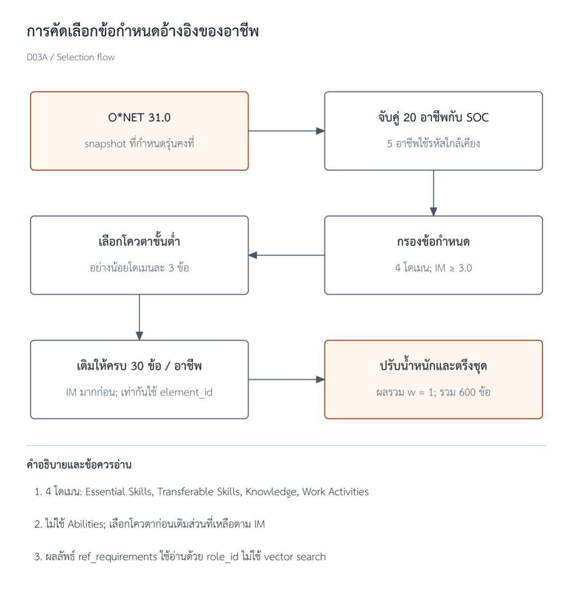

*รูปที่ 3.2  การเตรียมข้อกำหนดอ้างอิงของอาชีพ*

### 3.3.2 คลังรายการเรียนรู้และความเชื่อมโยง

คลังรายการเรียนรู้มี {{corpus_items}} รายการ แบ่งเป็นหลักสูตร {{corpus_courses}} รายการและใบรับรอง {{corpus_certs}} รายการ แต่ละรายการบันทึกชื่อ ผู้ให้บริการ ลิงก์ต้นทาง ชั่วโมงประมาณการ ระยะของการเรียน และประเภทคำแนะนำที่ใช้ได้ ชั่วโมงประมาณการของรายการที่นำไปใช้ได้อยู่ระหว่าง {{hours_min}} ถึง {{hours_max}} ชั่วโมง ค่ามัธยฐานเท่ากับ {{hours_median}} ชั่วโมง ความเชื่อมโยงระหว่างรายการกับข้อกำหนดมี {{map_total}} แถว แบ่งเป็นชั้น L1 ที่ผู้วิจัยกำกับเอง {{map_L1}} แถว และชั้น L2 ที่ได้จากกฎขยายผล {{map_L2}} แถว

รายการในคลังมีสองประเภทตามที่มา ประเภทแรกคือรายการเฉพาะสายงานที่คัดตามอาชีพ ซึ่งเป็นส่วนใหญ่ของคลัง ประเภทที่สองคือรายการพื้นฐานหกรายการที่สอนสมรรถนะที่ทุกอาชีพใช้ร่วมกัน ได้แก่ ภาษาอังกฤษเชิงวิชาชีพ การค้นและประมวลสารสนเทศ การเรียนรู้ด้วยตนเอง การคิดวิเคราะห์ การจัดลำดับงานและเวลา และการประมาณการงาน รายการพื้นฐานถูกเพิ่มเพราะก่อนหน้านั้นไม่มีรายการในคลังที่สอนสมรรถนะเหล่านี้โดยตรง และความเชื่อมโยงชั้น L2 ที่กฎเติมให้กับรายการเชิงเทคนิค เช่น การนับว่าหลักสูตรที่สอนเป็นภาษาอังกฤษครอบคลุมทักษะภาษาอังกฤษ ไม่ผ่านเกณฑ์ของการศึกษา รายการพื้นฐานแต่ละรายการถูกบันทึกเป็นหนึ่งแถวต่ออาชีพที่ต้องใช้ รวม {{foundation_rows}} แถวและความเชื่อมโยงชั้น L1 {{foundation_maps}} แถว โดยจับคู่ด้วยผู้วิจัยเท่านั้นและเลือกเฉพาะรายการที่เรียนได้ฟรีและใช้เวลาสั้น เพราะรายการยาวจะกินเวลาที่ผู้เรียนจัดสรรได้จนแผนครอบคลุมช่องว่างได้น้อยลง นอกจากนี้ความเชื่อมโยงชั้น L2 จำนวน {{promoted}} คู่ที่ผู้วิจัยตรวจทีละคู่แล้วว่าเนื้อหาของรายการสอนองค์ประกอบนั้นจริงถูกยกเป็นชั้น L1 รายละเอียดของทั้งสองส่วนอยู่ในภาคผนวก ฉ

ความเชื่อมโยงทุกแถวเริ่มต้นที่สถานะ pending_review และระบบไม่นำแถวที่ยังไม่ผ่านการตรวจไปใช้แนะนำ การตรวจทำด้วยสคริปต์ที่มีเกณฑ์ห้าข้อ ได้แก่ รายการต้องมีสถานะ verified และลิงก์ต้นทางเป็น https ข้อกำหนดต้องอยู่ในชุด 30 ข้อของอาชีพนั้นจริง ความเชื่อมโยงต้องอยู่ในชั้น L1 รหัสข้อกำหนดต้องปรากฏในคอลัมน์ competency_ids_l1 ของรายการนั้นด้วย ซึ่งเป็นการตรวจว่าข้อมูลสองแหล่งในชุดข้อมูลตรงกัน และรายการต้องมีชั่วโมงประมาณการมากกว่าศูนย์พร้อมประเภทคำแนะนำที่ใช้ได้ ผลการตรวจแสดงในตารางที่ 3.6

**ตารางที่ 3.6  ผลการตรวจความสอดคล้องของความเชื่อมโยงในคลังรายการเรียนรู้**

| รายการ | จำนวน |
|---|---|
| แถวความเชื่อมโยงทั้งหมดที่นำเข้าตรวจ | {{map_total}} |
| แถวที่ผ่านเกณฑ์และได้สถานะ source_checked_by_script | {{map_passed}} |
| แถวที่ไม่ผ่านเพราะไม่ใช่ชั้น L1 และข้อมูลสองแหล่งไม่ตรงกัน | {{map_failed_not_L1}} |
| แถวชั้น L1 ที่ไม่ผ่านเพราะลิงก์ของรายการยังไม่ผ่านการตรวจ | {{map_failed_L1_other}} |
| รายการเรียนรู้ที่ปรากฏในแถวที่ผ่านเกณฑ์ | {{items_in_passed}} จาก {{corpus_items}} |
| ข้อกำหนดอ้างอิงที่มีรายการรองรับอย่างน้อยหนึ่งรายการ | {{req_covered}} จาก 600 |
| อาชีพที่ผ่านการตรวจครบ | 20 จาก 20 |

สถานะ source_checked_by_script หมายถึงแถวนั้นผ่านการตรวจความสอดคล้องของข้อมูลด้วยสคริปต์ ไม่ใช่การรับรองความเหมาะสมของเนื้อหาหลักสูตรโดยผู้เชี่ยวชาญ การประเมินตามคำถามที่ 2 จึงตรวจเนื้อหาของรายการที่ระบบเลือกอีกครั้ง แทนการใช้สถานะนี้เป็นคำตอบอ้างอิงของตนเอง เมื่อพิจารณารายอาชีพ จำนวนข้อกำหนดที่มีรายการรองรับอยู่ระหว่าง {{per_role_min}} ถึง {{per_role_max}} ข้อจาก 30 ข้อ ข้อกำหนดที่คลังยังไม่มีรายการรองรับคือ {{req_uncovered_ids}} ซึ่งเป็นองค์ประกอบด้านการซ่อมบำรุงอุปกรณ์อิเล็กทรอนิกส์ของอาชีพ R14 ที่เข้าชุด 30 ข้อจากค่าความสำคัญ และไม่มีรายการในคลังที่สอนเรื่องนี้โดยตรง ระบบรายงานข้อเหล่านี้ตามจริงพร้อมรหัสข้อกำหนด และการประเมินความครอบคลุมของแผนต้องตีความร่วมกับข้อจำกัดนี้

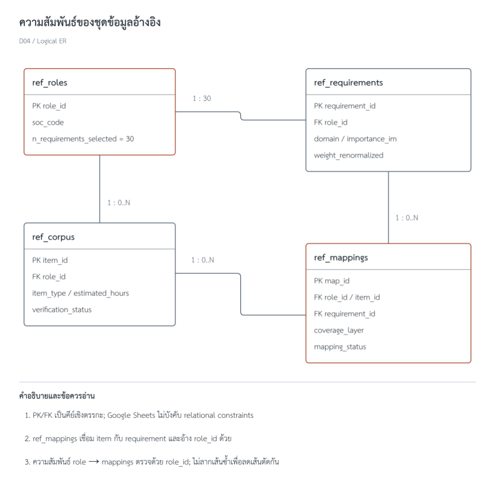

*รูปที่ 3.3  แบบจำลองข้อมูลอ้างอิง*

แบบจำลองนี้แยกชุดข้อมูลอ้างอิงสี่แท็บที่นำเข้าครั้งเดียว แท็บประเมินสองแท็บของคำถามการวิจัยทั้งสองข้อ และแท็บสองแท็บที่ Google Forms เป็นผู้เขียนและระบบอ่านอย่างเดียว รายละเอียดรายคอลัมน์อยู่ในภาคผนวก ง

### 3.3.3 โมเดล Generative AI และบริการอ่านข้อความ

ระบบเรียกโมเดลจากผู้ให้บริการสามรายตามค่าตั้งต้นในตารางที่ 3.7 โมเดลทั้งสามได้รับข้อความชุดเดียวกันและ prompt ชุดเดียวกัน และแต่ละโมเดลไม่ได้รับผลวิเคราะห์ของโมเดลอื่น การตั้งค่านี้ทำให้ผลของโมเดลหนึ่งไม่ขึ้นกับผลของอีกโมเดลภายในรอบเดียวกัน แต่ไม่ได้พิสูจน์ว่าความผิดพลาดของทั้งสามโมเดลเป็นอิสระทางสถิติ

**ตารางที่ 3.7  โมเดล Generative AI และบริการอ่านข้อความที่ระบบเรียกใช้**

| องค์ประกอบ | ผู้ให้บริการ | ค่าควบคุมที่กำหนด | สถานะ |
|---|---|---|---|
| โมเดล A | OpenAI (ปลายทาง chat completions) | temperature 0 · จำกัดผลลัพธ์ 4,096 token · หมดเวลา 90 วินาที · เรียกซ้ำไม่เกิน 2 ครั้ง | รอการทดสอบเชื่อมต่อ |
| โมเดล B | Anthropic (ปลายทาง messages) | ค่าเดียวกับโมเดล A | รอการทดสอบเชื่อมต่อ |
| โมเดล C | Google (ปลายทาง generative language) | ค่าเดียวกับโมเดล A | รอการทดสอบเชื่อมต่อ |
| บริการอ่านข้อความหลัก | Google Document AI ชนิด processor แบบ OCR | บันทึกชื่อบริการและรุ่นทุกรอบ | รอการตั้งค่า |
| บริการอ่านข้อความสำรอง | บริการ OCR ที่ติดตั้งภายในเครื่อง | ใช้เมื่อบริการหลักไม่พร้อม | ยังไม่ได้ตั้งค่า |

การเลือกใช้สามโมเดลจากผู้ให้บริการสามรายมีเหตุผลสามข้อ ข้อแรก เกณฑ์รวมผลของการศึกษานี้ใช้เสียงตรงกันอย่างน้อยสองเสียง จำนวนโมเดลจึงต้องเป็นเลขคี่เพื่อให้เกิดเสียงข้างมากได้โดยไม่ต้องเพิ่มกฎตัดสินเสมอ ข้อที่สอง โมเดลจากผู้ให้บริการเดียวกันมักมีข้อมูลฝึกและพฤติกรรมใกล้เคียงกัน การใช้ผู้ให้บริการต่างรายจึงลดโอกาสที่ทุกโมเดลจะผิดพร้อมกันในลักษณะเดียวกัน ด้วยเหตุนี้ไฟล์ตั้งค่าของโครงการจึงระบุไว้ชัดเจนว่าห้ามเรียกผู้ให้บริการรายเดียวสามครั้งแล้วรายงานว่าเป็นสามโมเดล ข้อที่สาม โมเดลที่เลือกต้องกำหนดรูปแบบผลตอบกลับเป็น JSON ได้ รับข้อความยาวระดับเรซูเมทั้งฉบับได้ในการเรียกครั้งเดียว และเรียกใช้ได้จากประเทศไทยด้วยบัญชีระดับนักพัฒนา

รหัสรุ่นของโมเดลไม่ได้เขียนไว้ในโปรแกรม แต่อ่านจากตัวแปรสภาพแวดล้อมตามตารางที่ 3.8 เพื่อให้เปลี่ยนรุ่นได้โดยไม่แก้ตรรกะ ผลที่ตามมาคือรหัสรุ่นที่เรียกจริงจะทราบเมื่อรันจริงเท่านั้น ก่อนเก็บข้อมูลกลุ่มหลักจึงต้องบันทึกรหัสรุ่นที่เรียกจริง วันและเวลาที่เรียก และรุ่นของ prompt ลงในแท็บ model_calls แล้วคัดมาเติมในตารางที่ 3.8 ของเอกสารเล่มสมบูรณ์ เพื่อให้ผู้อ่านทำซ้ำและอธิบายข้อจำกัดของผลได้

**ตารางที่ 3.8  ทะเบียนรุ่นของโมเดลและบริการอ่านข้อความที่ต้องบันทึกก่อนเก็บข้อมูลกลุ่มหลัก**

| รหัส | ผู้ให้บริการ | ปลายทางที่เรียก | ตัวแปรสภาพแวดล้อมที่เก็บรหัสรุ่น | รหัสรุ่นที่เรียกจริง | สถานะ |
|---|---|---|---|---|---|
| A | OpenAI | api.openai.com/v1/chat/completions | MODEL_A_ID | บันทึกเมื่อผ่านการทดสอบเชื่อมต่อ | รอการทดสอบเชื่อมต่อ |
| B | Anthropic | api.anthropic.com/v1/messages | MODEL_B_ID | บันทึกเมื่อผ่านการทดสอบเชื่อมต่อ | รอการทดสอบเชื่อมต่อ |
| C | Google | generativelanguage.googleapis.com/v 1beta/models | MODEL_C_ID | บันทึกเมื่อผ่านการทดสอบเชื่อมต่อ | รอการทดสอบเชื่อมต่อ |
| บริการอ่านข้อความหลัก | Google | Document AI processor ชนิด OCR | DOCAI_PROCESSOR_ID | บันทึกเมื่อผ่านการทดสอบเชื่อมต่อ | รอการตั้งค่า |
| บริการอ่านข้อความสำรอง | บริการที่ติดตั้งภายในเครื่อง | กำหนดผ่านตัวแปรสภาพแวดล้อม | LOCAL_OCR_URL | บันทึกเมื่อเปิดใช้งาน | ยังไม่ได้ตั้งค่า |

รหัสรุ่นของโมเดลทั้งสามกำหนดผ่านตัวแปรสภาพแวดล้อม และยังอยู่ในสถานะรอการทดสอบเชื่อมต่อ ก่อนเก็บข้อมูลกลุ่มหลักต้องบันทึกรหัสรุ่นที่เรียกจริง วันที่เรียก และรุ่นของ prompt ลงในฐานข้อมูลและในเอกสารเล่มสมบูรณ์ เพื่อให้ผู้อ่านทำซ้ำและอธิบายข้อจำกัดของผลได้ ข้อกำหนดของโครงการระบุว่าห้ามเรียกผู้ให้บริการรายเดียวสามครั้งแล้วรายงานว่าเป็นสามโมเดล

### 3.3.4 เครื่องมือเก็บข้อมูล

เครื่องมือเก็บข้อมูลมีสามชุด ชุดแรกคือแบบฟอร์มรับเรซูเมและเงื่อนไขการเรียนรู้ที่สร้างด้วย Google Forms ซึ่งบันทึกอาชีพเป้าหมาย กรอบเวลา ชั่วโมงที่เรียนได้ต่อสัปดาห์ ประเภทคำแนะนำ และความยินยอม ชุดที่สองคือคู่มือให้รหัสสำหรับจัดทำชุดคำตอบอ้างอิง ซึ่งกำหนดเกณฑ์แยกสถานะตามตารางที่ 3.23 พร้อมตัวอย่างการตัดสิน ชุดที่สามคือแบบประเมินประโยชน์ที่ผู้เรียนเห็นว่าได้รับ ซึ่งให้ผู้เข้าร่วมตอบหลังอ่านรายงาน รายละเอียดของแบบประเมินอยู่ในภาคผนวก ข

## 3.4 การออกแบบระบบ

### 3.4.1 สถาปัตยกรรมของระบบ

ระบบประกอบด้วยสามส่วน ได้แก่ บริการของ Google Workspace ที่ทำหน้าที่รับข้อมูล เก็บไฟล์ และเป็นฐานข้อมูล เครื่องมือจัดลำดับการทำงาน n8n ที่ควบคุมการประมวลผลด้วยตรรกะจากไฟล์เดียว และบริการภายนอกสองชนิด คือบริการอ่านข้อความจากเอกสารและโมเดล Generative AI ที่เรียกผ่าน API

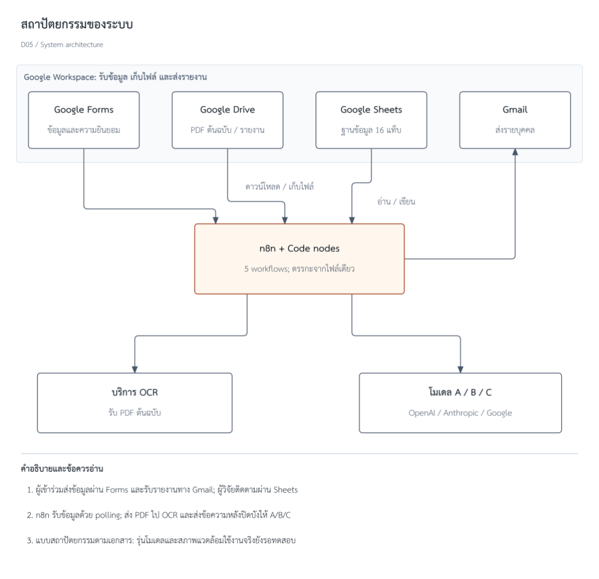

*รูปที่ 3.4  สถาปัตยกรรมของระบบ*

ในรูปนี้จะเห็นสามส่วนของระบบและทิศทางการเรียกใช้ระหว่างส่วน โดย n8n เป็นส่วนที่ควบคุมลำดับการทำงานและเป็นจุดเดียวที่ติดต่อกับบริการภายนอก

ส่วนแรก บริการของ Google Workspace ทำหน้าที่เป็นทั้งหน้ารับข้อมูล ที่เก็บไฟล์ และฐานข้อมูล ผู้ใช้กรอกแบบฟอร์มที่สร้างด้วย Google Forms และแนบไฟล์ PDF Google Forms เขียนไฟล์ลงโฟลเดอร์ใน Google Drive และเขียนคำตอบเป็นแถวใหม่ในสเปรดชีตที่ใช้เป็นฐานข้อมูลของระบบ อีเมลของผู้ตอบมาจากการยืนยันตัวตนของ Google ไม่ใช่ข้อความที่ผู้ใช้พิมพ์เอง เงื่อนไขนี้จำเป็นเพราะระบบส่งผลวิเคราะห์กลับไปยังอีเมลนั้น การรับอีเมลจากช่องข้อความเปิดโอกาสให้ส่งเอกสารของบุคคลหนึ่งไปยังกล่องจดหมายของอีกบุคคลเมื่อพิมพ์ผิด

ส่วนที่สอง n8n ควบคุมการทำงานตั้งแต่ตรวจพบคำตอบใหม่ ดาวน์โหลดและตรวจไฟล์ ไปจนถึงเรียกบริการอ่านข้อความและโมเดลทั้งสาม จากนั้นระบบใช้กฎตรวจผลวิเคราะห์ จัดแผนการเรียนรู้ สร้างรายงาน อัปโหลดไฟล์ขึ้น Google Drive และส่งอีเมลให้ผู้เข้าร่วม พร้อมบันทึกแต่ละขั้นตอนลงฐานข้อมูล การทำงานแบ่งเป็น 5 workflow ตามหน้าที่ในตารางที่ 3.9

ส่วนที่สาม บริการภายนอก ประกอบด้วยบริการอ่านข้อความจากเอกสารและโมเดล Generative AI สามโมเดลตามตารางที่ 3.7 ระบบเรียกบริการเหล่านี้ผ่าน API และบันทึกผลการเรียกทุกครั้ง รวมถึงครั้งที่ล้มเหลว

โครงการไม่ได้พัฒนาบริการฝั่งเซิร์ฟเวอร์ขึ้นเอง ตรรกะทั้งหมดทำงานภายใน Code node ของ n8n และการจัดเก็บข้อมูลใช้ Google Sheets ในระยะพัฒนา n8n รุ่น 2.39.9 ทำงานบน Node.js รุ่น 24 แบบติดตั้งในเครื่องของผู้วิจัยและเรียกใช้ที่ที่อยู่ภายในเครื่อง ค่าลับ เช่น กุญแจ API เก็บในไฟล์ตัวแปรสภาพแวดล้อมที่ไม่ถูกนำเข้าระบบควบคุมรุ่น และบริการของ Google ใช้สิทธิ์สามชุด คือบัญชีบริการสำหรับสเปรดชีต Document AI และการอ่านไฟล์ของแบบฟอร์ม สิทธิ์ OAuth2 ของผู้วิจัยสำหรับการสร้างไฟล์บน Drive และสิทธิ์ OAuth2 สำหรับ Gmail ก่อนเก็บข้อมูลกลุ่มหลักต้องระบุสภาพแวดล้อมที่ใช้รันจริงและผู้ให้บริการที่เกี่ยวข้องไว้ในเอกสารเล่มสมบูรณ์ เพื่อให้ผู้อ่านตรวจสอบเงื่อนไขการทำงานได้

### 3.4.2 workflow และการไหลของข้อมูล

**ตารางที่ 3.9  workflow ทั้งห้าและหน้าที่ของแต่ละ workflow**

| workflow | หน้าที่ | จำนวน node |
|---|---|---|
| WF_Main_Intake | รับคำตอบใหม่ กันงานซ้ำ ดาวน์โหลดและตรวจไฟล์ เรียกบริการอ่านข้อความ ปิดบังข้อมูลระบุตัว แล้วเรียก workflow ย่อยตามลำดับ | 17 |
| WF_SUB_GapEngine | อ่านข้อกำหนดจากฐานข้อมูล ประกอบ prompt เรียกโมเดลสามโมเดล และบันทึกผลการเรียกทุกครั้ง | 11 |
| WF_SUB_Decide | ตรวจและรวมผลด้วยกฎ R0 ถึง R4 คำนวณคะแนน จัดแผนการเรียนรู้ แล้วบันทึกผลรายข้อ | 13 |
| WF_SUB_Deliver | สร้างไฟล์รายงาน อัปโหลดขึ้น Drive ส่งอีเมลรายบุคคล และบันทึกสถานะการส่ง | 13 |
| WF_Error | ดักข้อผิดพลาดจากทุก workflow บันทึกเหตุการณ์ ทำเครื่องหมายว่างานล้มเหลว และแจ้งผู้วิจัย | 6 |

ค่าควบคุมของ workflow ทุกตัวถูกตรึงไว้ในไฟล์ตั้งค่าของโครงการหรือไฟล์ตั้งค่าของโมเดล ไม่ได้กระจายอยู่ในแต่ละโหนด ตารางที่ 3.10 สรุปความหมาย ค่าที่ตรึงไว้ แหล่งที่มาของค่า และผลที่เกิดขึ้นเมื่อเปลี่ยนค่า การแยกค่าควบคุมออกจากตรรกะทำให้ระบุได้ว่ารอบการวิเคราะห์หนึ่งรอบใช้ค่าชุดใด และทำให้การทดสอบนำร่องปรับค่าได้โดยไม่ต้องแก้โปรแกรม

**ตารางที่ 3.10  พารามิเตอร์ควบคุมของ workflow ค่าที่ตรึงไว้ และผลเมื่อเปลี่ยนค่า**

| พารามิเตอร์ | workflow ที่ใช้ | ความหมาย | ค่าที่ตรึงไว้ | แหล่งที่มาของค่า | ผลเมื่อเปลี่ยนค่า |
|---|---|---|---|---|---|
| requirements_per_role | WF_SUB_GapEngine | จำนวนข้อกำหนดอ้างอิงต่อหนึ่งอาชีพ | 30 | ไฟล์ตั้งค่าของโครงการ | เปลี่ยนตัวหารของคะแนน R และสัดส่วน C ทั้งหมด |
| max_file_bytes | WF_Main_Intake | ขนาดไฟล์เรซูเมสูงสุดที่รับ | 10,485,760 ไบต์ หรือ 10 เมกะไบต์ | ไฟล์ตั้งค่าของโครงการ | ไฟล์ที่เกินถูกปฏิเสธตั้งแต่ขั้นรับข้อมูล |
| max_pages | WF_Main_Intake | จำนวนหน้าสูงสุดของเรซูเม | 5 หน้า | ไฟล์ตั้งค่าของโครงการ | เพิ่มค่าแล้วเวลาและค่าใช้จ่ายของการอ่านข้อความเพิ่มตาม |
| temperature | WF_SUB_GapEngine | ความสุ่มของผลตอบกลับของโมเดล | 0 | ไฟล์ตั้งค่าของโมเดล | ค่ามากกว่า 0 ทำให้ผลไม่คงที่และทำซ้ำไม่ได้ |
| max_output_tokens | WF_SUB_GapEngine | เพดานความยาวผลตอบกลับต่อการเรียกหนึ่งครั้ง | 4,096 token | ไฟล์ตั้งค่าของโมเดล | ค่าน้อยเกินไปทำให้ตอบไม่ครบและติดกฎ R0 รหัส incomplete_coverage |
| timeout_ms | WF_SUB_GapEngine | เวลารอผลตอบกลับสูงสุดต่อการเรียกหนึ่งครั้ง | 90,000 มิลลิวินาที หรือ 90 วินาที | ไฟล์ตั้งค่าของโมเดล | หมดเวลาแล้วเรียกซ้ำตาม max_attempts ถ้ายังไม่สำเร็จนับเป็นรหัสสาเหตุ no_output |
| max_attempts | WF_SUB_GapEngine | จำนวนครั้งที่เรียกโมเดลเดิมซ้ำหลังครั้งแรกเมื่อได้รหัส 429 หรือหมดเวลา | 2 ครั้ง (รวมไม่เกิน 3 ครั้งต่อโมเดลต่องาน) | ไฟล์ตั้งค่าของโมเดล | ค่ามากขึ้นลดการล้มเหลวชั่วคราว แต่เพิ่มเวลาและค่าใช้จ่าย |
| theta | WF_SUB_Decide | เกณฑ์คะแนนความเกี่ยวข้องขั้นต่ำของกฎ R3 | 0.15 | ไฟล์ตั้งค่าของโครงการ | ค่าสูงขึ้นทำให้ข้อสรุปถูกปรับเป็น missing มากขึ้น |
| min_usable_models | WF_SUB_Decide | จำนวนโมเดลที่ใช้ได้ขั้นต่ำก่อนรวมผล | 2 โมเดล | ไฟล์ตั้งค่าของโครงการ | ต่ำกว่านี้ระบบหยุดสรุปและให้สถานะ abstained ทั้งรอบ |
| allowed_months | WF_Main_Intake, WF_SUB_Decide | กรอบเวลาที่ผู้เรียนเลือกได้ | 6, 12, 18 และ 24 เดือน โดยการประเมินหลักใช้ 6 เดือน | ไฟล์ตั้งค่าของโครงการ | กำหนดเพดานชั่วโมงเรียนรวมของแผน |
| allowed_modes | WF_Main_Intake, WF_SUB_Decide | ประเภทคำแนะนำที่ผู้เรียนเลือกได้ | course_only, certification_only และ both | ไฟล์ตั้งค่าของโครงการ | จำกัดชนิดของรายการเรียนรู้ที่เข้าแผนได้ |
| approved_mapping_statuses | WF_SUB_Decide | สถานะของความเชื่อมโยงที่นำไปแนะนำได้ | source_checked_by_script และ expert_reviewed | ไฟล์ตั้งค่าของโครงการ | แถวที่ยังเป็น pending_review ไม่ถูกนำไปใช้ ถ้าตัดออกทั้งหมดระบบจะไม่เสนอรายการใดและรายงานข้อผิดพลาดของข้อมูลอ้างอิง |
| ชั้นของความเชื่อมโยงที่ใช้ | WF_SUB_Decide | ชั้นที่ตัวจัดแผนยอมรับ | L1_researcher_tagged เท่านั้น | กำหนดในไฟล์ตรรกะ ไม่ใช่ไฟล์ตั้งค่า | ถ้ายอมรับชั้น L2 ความครอบคลุมของคลังจะสูงขึ้นทันที แต่เป็นการรับความเชื่อมโยงที่กฎเติมให้โดยไม่มีผู้ตรวจ |
| prompt_version | WF_SUB_GapEngine | รุ่นของคำสั่งที่ส่งให้โมเดล | analyst_v1.0 | ไฟล์ตั้งค่าของโครงการ | ต้องบันทึกทุกรอบ เพราะเปลี่ยนรุ่นแล้วผลเทียบกันไม่ได้ |

ชั้นของความเชื่อมโยงถูกกำหนดไว้ในไฟล์ตรรกะโดยตั้งใจ เพื่อไม่ให้เกณฑ์ถูกผ่อนด้วยการแก้ไฟล์ตั้งค่า ตารางนี้แก้จากฉบับขอสอบที่ระบุ workflow ชื่อ WF_SUB_Plan ซึ่งไม่มีอยู่ในระบบ หน้าที่จัดแผนอยู่ใน WF_SUB_Decide ตามตารางที่ 3.9

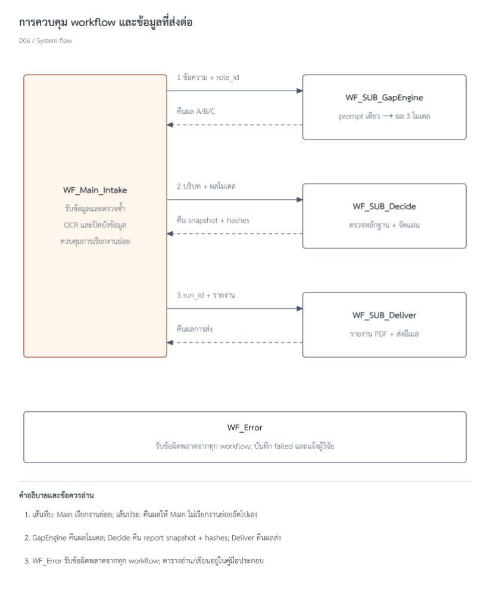

*รูปที่ 3.5  การไหลของข้อมูลระหว่าง workflow และฐานข้อมูล*

รูปนี้ไล่ลำดับการทำงานสี่ขั้นของ n8n พร้อมระบุว่าแต่ละขั้นอ่านและเขียนแท็บใดในสเปรดชีต และ WF_Error ดักข้อผิดพลาดจากทุกขั้น การดึงข้อกำหนดทำด้วยรหัสอาชีพจากแท็บ ref_requirements ซึ่งใช้แทนการค้นด้วยฐานข้อมูลเวกเตอร์

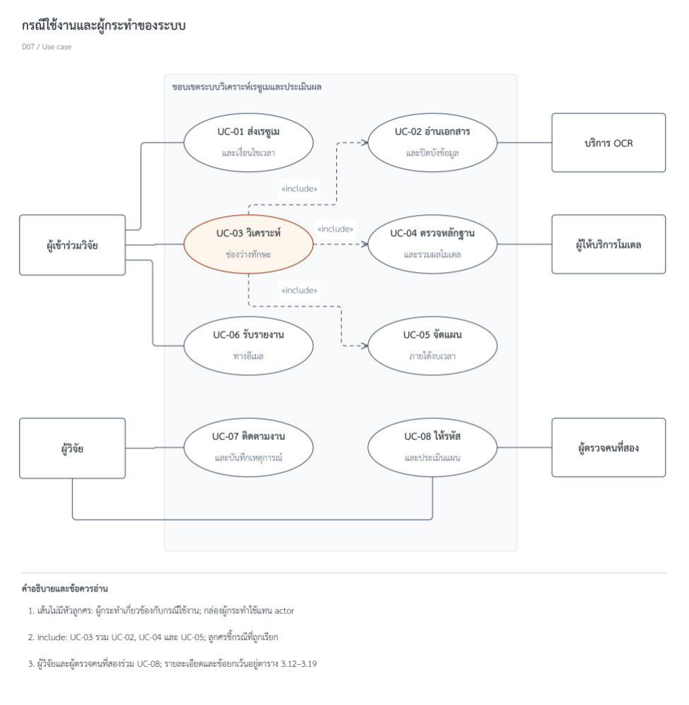

*รูปที่ 3.6  กรณีใช้งานและผู้กระทำของระบบ*

ขอบเขตของระบบในรูปนี้ครอบคลุมผู้กระทำสี่ราย ได้แก่ ผู้เข้าร่วมวิจัย ผู้วิจัย บริการอ่านข้อความจากเอกสาร และผู้ให้บริการโมเดล กับกรณีใช้งานแปดกรณีภายในขอบเขตระบบ โดยกรณี UC-03 รวมกรณีย่อยสามกรณีด้วยความสัมพันธ์ «include» คำอธิบายรายกรณีอยู่ในภาคผนวก ง

กรณีใช้งานทั้งแปดกรณีในรูปที่ 3.6 สรุปไว้ในตารางที่ 3.11 และมีคำอธิบายรายกรณีในตารางที่ 3.12 ถึงตารางที่ 3.19 คำอธิบายแต่ละกรณีระบุผู้กระทำ เงื่อนไขก่อน ลำดับเหตุการณ์หลัก ทางเลือกและข้อยกเว้น และเงื่อนไขหลัง เพื่อให้ตรวจสอบได้ว่าลำดับการทำงานที่อธิบายในหัวข้อถัดไปครอบคลุมทุกกรณีที่ออกแบบไว้

**ตารางที่ 3.11  สรุปกรณีใช้งานทั้งแปดกรณีของระบบ**

| รหัส | ชื่อกรณีใช้งาน | ผู้กระทำ | เงื่อนไขหลังเมื่อจบกรณี |
|---|---|---|---|
| UC-01 | ส่งเรซูเมและกำหนดเงื่อนไขเวลาที่เรียนได้ | ผู้เข้าร่วมวิจัย | เกิดแถวใหม่ในแท็บ form_responses และไฟล์อยู่ในโฟลเดอร์ของแบบฟอร์มบน Drive |
| UC-02 | อ่านข้อความจากเอกสารและปิดบังข้อมูลระบุตัว | ระบบ (WF_Main_Intake) และบริการอ่านข้อความจากเอกสาร | ได้ข้อความชุดเดียวที่ทั้งสามโมเดลและกฎ R2 ใช้ร่วมกัน |
| UC-03 | วิเคราะห์ช่องว่างทักษะเทียบอาชีพเป้าหมาย | ระบบ (WF_Main_Intake) และผู้เข้าร่วมวิจัย | แท็บ decisions มีข้อสรุปครบทุกข้อกำหนด และแท็บ plan_items พร้อมส่ง |
| UC-04 | ตรวจและรวมผลของ 3 โมเดลด้วยกฎ R0 ถึง R4 | ระบบ (WF_SUB_GapEngine, WF_SUB_Decide) และผู้ให้บริการโมเดล | มีแถวในแท็บ findings รายโมเดล และแท็บ decisions รายข้อกำหนดพร้อมข้อความหลักฐาน |
| UC-05 | จัดแผนการเรียนรู้ภายใต้เวลาที่ผู้เรียนจัดสรรได้ | ระบบ (WF_SUB_Decide) | แท็บ plan_items เรียงตามลำดับความสำคัญที่เสนอ ไม่ใช่ลำดับ prerequisite ที่ยืนยันแล้ว |
| UC-06 | รับรายงานและแผนการเรียนรู้ทางอีเมล | ผู้เข้าร่วมวิจัย และระบบ (WF_SUB_Deliver) | สถานะของงานเป็น delivered และผู้ใช้ได้รับรายงาน PDF ฉบับเดียวที่มีผลครบทั้ง 5 ส่วน |
| UC-07 | ติดตามสถานะงานและบันทึกเหตุการณ์ของระบบ | ผู้วิจัย | ทราบสถานะและสาเหตุของทุกงานได้จากสเปรดชีตโดยไม่ต้องเปิด n8n |
| UC-08 | ให้รหัสชุดคำตอบอ้างอิงและตรวจแผนที่ระบบเสนอ | ผู้วิจัย และผู้ตรวจคนที่สอง | ได้ชุดคำตอบอ้างอิงสำหรับคำถามที่ 1 และผลตรวจแผนสำหรับคำถามที่ 2 |

**ตารางที่ 3.12  คำอธิบายกรณีใช้งาน UC-01 ส่งเรซูเมและกำหนดเงื่อนไขเวลาที่เรียนได้**

| หัวข้อ | รายละเอียด |
|---|---|
| ผู้กระทำ | ผู้เข้าร่วมวิจัย |
| เงื่อนไขก่อน | ได้รับลิงก์แบบฟอร์มและคำชี้แจงการวิจัย |
|  | ลงชื่อเข้าใช้บัญชี Google เพื่อให้อีเมลได้รับการยืนยันตัวตน |
| ลำดับเหตุการณ์หลัก | 1. เปิดแบบฟอร์มและอ่านคำชี้แจงที่หัวแบบฟอร์ม |
|  | 2. แนบไฟล์เรซูเมภาษาอังกฤษรูปแบบ PDF |
|  | 3. เลือกอาชีพเป้าหมาย 1 อาชีพจาก 20 อาชีพในแท็บ ref_roles |
|  | 4. ระบุกรอบเวลา ชั่วโมงต่อสัปดาห์ และประเภทคำแนะนำ |
|  | 5. ให้ความยินยอมและส่งแบบฟอร์ม |
| ทางเลือกและข้อยกเว้น | 5a ไม่ให้ความยินยอม → ระบบปฏิเสธตั้งแต่ขั้นตรวจข้อมูลเข้า |
|  | 2a ไฟล์ไม่ใช่ PDF หรือดาวน์โหลดไม่ได้ → หยุดงานพร้อมรหัสสาเหตุ |
| เงื่อนไขหลัง | เกิดแถวใหม่ในแท็บ form_responses และไฟล์อยู่ในโฟลเดอร์ของแบบฟอร์มบน Drive |

**ตารางที่ 3.13  คำอธิบายกรณีใช้งาน UC-02 อ่านข้อความจากเอกสารและปิดบังข้อมูลระบุตัว**

| หัวข้อ | รายละเอียด |
|---|---|
| ผู้กระทำ | ระบบ (WF_Main_Intake) และบริการอ่านข้อความจากเอกสาร |
| เงื่อนไขก่อน | ดาวน์โหลดไฟล์ PDF จาก Drive สำเร็จ |
|  | ค่า response_id ไม่ซ้ำกับงานที่อยู่ในสถานะ running, ready หรือ delivered |
| ลำดับเหตุการณ์หลัก | 1. ส่งไฟล์ไปยังบริการอ่านข้อความจากเอกสาร |
|  | 2. ทำข้อความให้เป็นรูปแบบเดียวกันด้วยกฎคงที่ 5 ข้อ |
|  | 3. แทนอีเมล ลิงก์ หมายเลขโทรศัพท์ และเลขประจำตัว 13 หลัก ด้วยข้อความแทนข้อมูล |
|  | 4. บันทึกชื่อบริการ จำนวนหน้า จำนวนตัวอักษร จำนวนจุดที่ปิดบัง และค่าแฮชของข้อความ |
| ทางเลือกและข้อยกเว้น | 1a บริการหลักล้มเหลว → เปลี่ยนไปใช้บริการสำรองและบันทึกชื่อบริการที่ใช้จริงในรายงานทุกครั้ง |
| เงื่อนไขหลัง | ได้ข้อความชุดเดียวที่ทั้งสามโมเดลและกฎ R2 ใช้ร่วมกัน |
|  | ชื่อบริษัทและชื่อสถาบันการศึกษาไม่ถูกปิดบัง ซึ่งระบุเป็นข้อจำกัดในหัวข้อ 3.10 |

**ตารางที่ 3.14  คำอธิบายกรณีใช้งาน UC-03 วิเคราะห์ช่องว่างทักษะเทียบอาชีพเป้าหมาย**

| หัวข้อ | รายละเอียด |
|---|---|
| ผู้กระทำ | ระบบ (WF_Main_Intake) และผู้เข้าร่วมวิจัย |
| เงื่อนไขก่อน | มีแถวใหม่ในแท็บ form_responses ที่ให้ความยินยอมแล้ว |
|  | รหัสอาชีพที่เลือกอยู่ในแท็บ ref_roles |
| ลำดับเหตุการณ์หลัก | 1. «include» UC-02 เตรียมข้อความและปิดบังข้อมูลระบุตัว |
|  | 2. อ่านข้อกำหนด 30 ข้อของอาชีพจากแท็บ ref_requirements ด้วยรหัสอาชีพ |
|  | 3. «include» UC-04 เรียกโมเดล 3 โมเดลและรวมผลด้วยกฎ R0 ถึง R4 |
|  | 4. «include» UC-05 จัดแผนการเรียนรู้ภายใต้จำนวนชั่วโมงเรียนสูงสุด |
|  | 5. บันทึกชุดข้อมูลรายงานเป็นรุ่นคงที่พร้อมค่าแฮช 5 ค่า และตั้งสถานะเป็น ready |
| ทางเลือกและข้อยกเว้น | 3a มีโมเดลที่ใช้ได้น้อยกว่า 2 โมเดล → ทุกข้อได้ abstained และคะแนน R เป็น N/A |
|  | 1a ขั้นใดขั้นหนึ่งล้มเหลว → WF_Error บันทึกเหตุการณ์และตั้งสถานะเป็น failed |
| เงื่อนไขหลัง | แท็บ decisions มีข้อสรุปครบทุกข้อกำหนด และแท็บ plan_items พร้อมส่ง |

**ตารางที่ 3.15  คำอธิบายกรณีใช้งาน UC-04 ตรวจและรวมผลของ 3 โมเดลด้วยกฎ R0 ถึง R4**

| หัวข้อ | รายละเอียด |
|---|---|
| ผู้กระทำ | ระบบ (WF_SUB_GapEngine, WF_SUB_Decide) และผู้ให้บริการโมเดล |
| เงื่อนไขก่อน | มีข้อกำหนด 30 ข้อของอาชีพและข้อความที่ปิดบังแล้ว |
| ลำดับเหตุการณ์หลัก | 1. ประกอบ prompt ชุดเดียว เรียกโมเดล 3 โมเดล และบันทึกทุกครั้งในแท็บ model_calls |
|  | 2. R0 ตรวจว่าผลตอบกลับเป็น JSON ตรงรูปแบบ รหัสอาชีพและรหัสข้อกำหนดตรงกัน |
|  | 3. R2 ตรวจว่าข้อความที่ยกมาปรากฏจริง แล้วบันทึกตำแหน่งตัวอักษร |
|  | 4. R3 ตรวจความเกี่ยวข้องด้วยคะแนนจากคำที่ปรากฏร่วมกัน โดยเกณฑ์ผ่านคือ ov(q, r) ≥ 0.15 |
|  | 5. R1 รวมเสียง สถานะที่ได้อย่างน้อยสองเสียงจึงเป็นข้อสรุปสุดท้าย |
|  | 6. R4 บันทึกสัดส่วนความเห็นตรงกัน แล้วคำนวณคะแนน R สัดส่วน C และอัตรา U |
| ทางเลือกและข้อยกเว้น | 2a ไม่ผ่าน R0 → ผลของโมเดลนั้นใช้ไม่ได้ทั้งชุด ค่า m ลดลง 1 |
|  | 3a และ 4a ไม่ผ่าน → เสียงของโมเดลนั้นเปลี่ยนเป็น missing และนับในอัตรา U |
|  | 5a ไม่มีสถานะใดได้ถึงสองเสียง → ข้อกำหนดนั้นได้สถานะ abstained |
|  | 5b เสียงเท่ากันที่ระดับชนะ → ใช้ลำดับสำรอง missing ก่อน partially และ evidenced ซึ่งไม่เกิดขึ้นเมื่อใช้ 3 โมเดล |
| เงื่อนไขหลัง | มีแถวในแท็บ findings รายโมเดล และแท็บ decisions รายข้อกำหนดพร้อมข้อความหลักฐาน |

**ตารางที่ 3.16  คำอธิบายกรณีใช้งาน UC-05 จัดแผนการเรียนรู้ภายใต้เวลาที่ผู้เรียนจัดสรรได้**

| หัวข้อ | รายละเอียด |
|---|---|
| ผู้กระทำ | ระบบ (WF_SUB_Decide) |
| เงื่อนไขก่อน | มีช่องว่างทักษะ คือข้อที่สถานะเป็น missing หรือ partially |
|  | ความเชื่อมโยงชั้น L1 ผ่านการตรวจความสอดคล้องแล้ว |
| ลำดับเหตุการณ์หลัก | 1. คำนวณจำนวนชั่วโมงเรียนสูงสุดตามสมการที่ 3.7 |
|  | 2. คัดเฉพาะรายการที่ความเชื่อมโยงผ่านการตรวจ อยู่ชั้น L1 ข้อกำหนดเป็นช่องว่าง และประเภทตรงกับที่ผู้ใช้เลือก |
|  | 3. วนเลือกรายการที่มีค่า dk สูงสุดตามสมการที่ 3.8 |
|  | 4. ข้ามรายการที่ทำให้ชั่วโมงสะสมเกินเพดาน และหยุดเมื่อไม่มีรายการใดเพิ่มความครอบคลุมได้ |
|  | 5. บันทึกลำดับ เหตุผล ชั่วโมงรายการ และชั่วโมงสะสมลงแท็บ plan_items |
| ทางเลือกและข้อยกเว้น | 3a ค่า dk เท่ากัน → ตัดสินด้วยรหัสรายการ เพื่อให้ผลเหมือนเดิมทุกครั้ง |
|  | 2a ช่องว่างที่ไม่มีรายการรองรับ → รายงานตามจริงพร้อมรหัสข้อกำหนด ไม่ซ่อนและไม่แทนด้วยรายการที่ใกล้เคียง |
| เงื่อนไขหลัง | แท็บ plan_items เรียงตามลำดับความสำคัญที่เสนอ ไม่ใช่ลำดับ prerequisite ที่ยืนยันแล้ว |

**ตารางที่ 3.17  คำอธิบายกรณีใช้งาน UC-06 รับรายงานและแผนการเรียนรู้ทางอีเมล**

| หัวข้อ | รายละเอียด |
|---|---|
| ผู้กระทำ | ผู้เข้าร่วมวิจัย และระบบ (WF_SUB_Deliver) |
| เงื่อนไขก่อน | มีชุดข้อมูลรายงานรุ่นคงที่พร้อมค่าแฮช 5 ค่า |
| ลำดับเหตุการณ์หลัก | 1. Code node สร้างเอกสาร HTML ที่แปลงอักขระพิเศษและตรวจว่าลิงก์เป็น https |
|  | 2. อัปโหลดขึ้น Drive โดยระบุชนิดปลายทางเป็นเอกสาร Google Docs |
|  | 3. เรียกส่งออกเป็น application/pdf แล้วเก็บในโฟลเดอร์รายงาน |
|  | 4. ลบเอกสารกลางทิ้ง |
|  | 5. ส่งอีเมลรายบุคคลด้วยโหนด Gmail แบบ OAuth2 ไปยังอีเมลที่ยืนยันตัวตนแล้ว |
|  | 6. บันทึกค่าแฮชของรายงาน รหัสไฟล์ PDF และสถานะการส่งลงแท็บ deliveries |
| ทางเลือกและข้อยกเว้น | 3a สร้างหรือแปลง PDF ไม่สำเร็จ → บันทึกสถานะล้มเหลว ผลวิเคราะห์ยังอยู่ครบ |
|  | 5a ส่งอีเมลไม่สำเร็จ → ไฟล์ยังอยู่บน Drive ผู้วิจัยส่งซ้ำจากแถวที่บันทึกไว้ได้ |
|  | 6a พบค่าแฮชของรายงานเดิมที่ส่งสำเร็จแล้ว → คืนรหัสไฟล์เดิม ไม่สร้างและไม่ส่งซ้ำ |
| เงื่อนไขหลัง | สถานะของงานเป็น delivered และผู้ใช้ได้รับรายงาน PDF ฉบับเดียวที่มีผลครบทั้ง 5 ส่วน |

**ตารางที่ 3.18  คำอธิบายกรณีใช้งาน UC-07 ติดตามสถานะงานและบันทึกเหตุการณ์ของระบบ**

| หัวข้อ | รายละเอียด |
|---|---|
| ผู้กระทำ | ผู้วิจัย |
| เงื่อนไขก่อน | มีสิทธิ์เข้าถึงสเปรดชีตของระบบ |
| ลำดับเหตุการณ์หลัก | 1. เปิดแท็บ runs และดูคอลัมน์ stage ของแต่ละงาน |
|  | 2. ตรวจรหัสสาเหตุและสถานะการส่งอีเมลของงานที่ไม่สำเร็จ |
|  | 3. เปิดแท็บ audit_log เพื่อดูลำดับเหตุการณ์ของงานนั้น |
| ทางเลือกและข้อยกเว้น | 2a งานค้างที่สถานะ running นานผิดปกติ → ตรวจแท็บ model_calls และ ocr_results เพื่อดูว่าติดที่ขั้นใด |
| เงื่อนไขหลัง | ทราบสถานะและสาเหตุของทุกงานได้จากสเปรดชีตโดยไม่ต้องเปิด n8n |

**ตารางที่ 3.19  คำอธิบายกรณีใช้งาน UC-08 ให้รหัสชุดคำตอบอ้างอิงและตรวจแผนที่ระบบเสนอ**

| หัวข้อ | รายละเอียด |
|---|---|
| ผู้กระทำ | ผู้วิจัย และผู้ตรวจคนที่สอง |
| เงื่อนไขก่อน | คู่มือให้รหัสและค่า θ ถูกกำหนดรุ่นคงที่หลังการทดสอบนำร่อง |
|  | ไฟล์งานให้รหัสมีเฉพาะเอกสารของผู้เข้าร่วมและรายการข้อกำหนด โดยไม่มีผลของระบบ |
| ลำดับเหตุการณ์หลัก | 1. ให้รหัส evidenced, partially หรือ missing จากไฟล์ PDF ต้นฉบับ แล้วบันทึกลงแท็บ ground_truth |
|  | 2. ผู้ตรวจคนที่สองให้รหัสอย่างอิสระในตัวอย่างอย่างน้อยร้อยละ 20 ของผู้เข้าร่วม และทบทวนทุกกรณีที่ผู้เข้าร่วมแจ้งไม่เห็นด้วย |
|  | 3. เปิดผลของระบบและเปรียบเทียบกับชุดคำตอบอ้างอิง |
|  | 4. ตรวจรายการที่ระบบเลือกเทียบช่องว่างอ้างอิง แล้วบันทึกลงแท็บ pathway_review |
|  | 5. จำแนกสาเหตุเมื่อคำแนะนำไม่เหมาะสมเป็น 4 ประเภท ตามหัวข้อ 3.8.3 |
| ทางเลือกและข้อยกเว้น | 2a ให้รหัสไม่ตรงกัน → เก็บรหัสเดิมของทั้งสองคน แล้วบันทึกวิธีหาข้อยุติ |
|  | 1a ผู้เข้าร่วมให้ข้อมูลทักษะนอกเรซูเม → บันทึกแยก ไม่ย้อนแก้ชุดคำตอบอ้างอิง |
| เงื่อนไขหลัง | ได้ชุดคำตอบอ้างอิงสำหรับคำถามที่ 1 และผลตรวจแผนสำหรับคำถามที่ 2 |

ระบบไม่ใช้ฐานข้อมูลเวกเตอร์ การดึงข้อกำหนดของอาชีพทำด้วยการอ่านแถวจากแท็บ ref_requirements ด้วยรหัสอาชีพ เหตุผลคือข้อกำหนดของแต่ละอาชีพเป็นชุดคงที่ 30 ข้อที่กำหนดไว้ล่วงหน้าแล้ว การอ่านตามรหัสจึงให้ผลชุดเดิมทุกครั้งและตรวจย้อนกลับได้ ขณะที่การค้นด้วยความคล้ายของเวกเตอร์เพิ่มความไม่แน่นอนที่ต้องอธิบายเพิ่มโดยไม่ได้ประโยชน์ในโจทย์นี้

### 3.4.3 การจัดเก็บข้อมูล

ฐานข้อมูลของระบบคือสเปรดชีตหนึ่งไฟล์ มีแท็บที่สคริปต์สร้าง 14 แท็บ แบ่งเป็นแท็บข้อมูลการทำงาน 8 แท็บ ได้แก่ runs, ocr_results, model_calls, findings, decisions, plan_items, deliveries และ audit_log แท็บประเมิน 2 แท็บ ได้แก่ ground_truth และ pathway_review และแท็บข้อมูลอ้างอิง 4 แท็บ ได้แก่ ref_roles, ref_requirements, ref_corpus และ ref_mappings นอกจากนี้มีแท็บ form_responses และ evaluation_responses ที่ Google Forms เป็นผู้เขียนและระบบอ่านอย่างเดียว รวมทั้งหมด 16 แท็บ

ตารางที่ 3.20 สรุปบทบาทของทุกแท็บ โหมดการเขียนข้อมูล และจำนวนคอลัมน์ โหมดการเขียนเป็นข้อกำหนดเชิงออกแบบที่ต้องแยกให้ชัด แท็บ runs เป็นแท็บเดียวที่ปรับปรุงแถวเดิมได้ตามรหัสงาน ส่วนแท็บบันทึกผลอื่นเพิ่มแถวได้อย่างเดียว เพื่อไม่ให้ผลของรอบก่อนถูกเขียนทับและยังตรวจย้อนหลังได้ รายละเอียดรายคอลัมน์ของทุกแท็บอยู่ในภาคผนวก ง

**ตารางที่ 3.20  แท็บของฐานข้อมูล บทบาท โหมดการเขียน และจำนวนคอลัมน์**

| แท็บ | บทบาท | โหมดเขียน | จำนวนคอลัมน์ |
|---|---|---|---|
| runs | หนึ่งแถวต่อหนึ่งคำตอบที่ประมวลผล เป็นข้อมูลหลักสำหรับตรวจสอบสถานะงาน | upsert ด้วยคีย์ run_id | 24 |
| ocr_results | ผลการอ่านข้อความต่อหนึ่งงาน เก็บสรุปและรหัสไฟล์ข้อความหลังปิดบัง | เพิ่มแถวเท่านั้น | 9 |
| model_calls | หนึ่งแถวต่อหนึ่งครั้งที่เรียกโมเดล รวมครั้งที่ล้มเหลว | เพิ่มแถวเท่านั้น | 12 |
| findings | ข้อสรุปรายโมเดลก่อนรวมผล ใช้ตรวจสอบย้อนหลังและวิเคราะห์สาเหตุของข้อผิดพลาด | เพิ่มแถวเท่านั้น | 12 |
| decisions | ข้อสรุปสุดท้ายหลังกฎ R0 ถึง R4 หนึ่งแถวต่อหนึ่งข้อกำหนด | เพิ่มแถวเท่านั้น | 14 |
| plan_items | รายการในแผนที่เลือกจากความเชื่อมโยงที่ผ่านการตรวจแล้วเท่านั้น | เพิ่มแถวเท่านั้น | 14 |
| deliveries | ไฟล์ที่สร้างและอีเมลที่ส่ง ใช้กันการทำงานซ้ำ | เพิ่มแถวเท่านั้น | 9 |
| audit_log | เหตุการณ์สำคัญทั้งหมดตามลำดับเวลา | เพิ่มแถวเท่านั้น | 5 |
| ground_truth | ชุดคำตอบอ้างอิงของคำถามที่ 1 จัดทำโดยไม่เห็นผลระบบ หนึ่งแถวต่อข้อกำหนด | เพิ่มแถวเท่านั้น | 10 |
| pathway_review | ผลตรวจแผนของคำถามที่ 2 แยกสาเหตุของข้อผิดพลาดรายรายการและรายแผน | เพิ่มแถวเท่านั้น | 10 |
| ref_roles | อาชีพเป้าหมายทั้ง 20 อาชีพและนโยบายการเลือกข้อกำหนด | อ่านอย่างเดียว 20 แถว | 7 |
| ref_requirements | ข้อกำหนดอ้างอิง 600 ข้อที่ระบบอ่านแทนการค้นด้วยฐานข้อมูลเวกเตอร์ | อ่านอย่างเดียว 600 แถว | 10 |
| ref_corpus | คลังหลักสูตรและใบรับรอง {{corpus_items}} รายการ | อ่านอย่างเดียว {{corpus_items}} แถว | 10 |
| ref_mappings | ความเชื่อมโยงรายการกับข้อกำหนด {{map_total}} แถว พร้อมสถานะการตรวจ | อ่านอย่างเดียว {{map_total}} แถว | 7 |
| form_responses | คำตอบจาก Google Forms ระบบอ่านอย่างเดียวและไม่เขียนทับ | เขียนโดย Google Forms | 8 |
| evaluation_responses | แบบประเมินประโยชน์ที่ผู้เรียนเห็นว่าได้รับหลังอ่านรายงาน | เขียนโดย Google Forms | 6 |

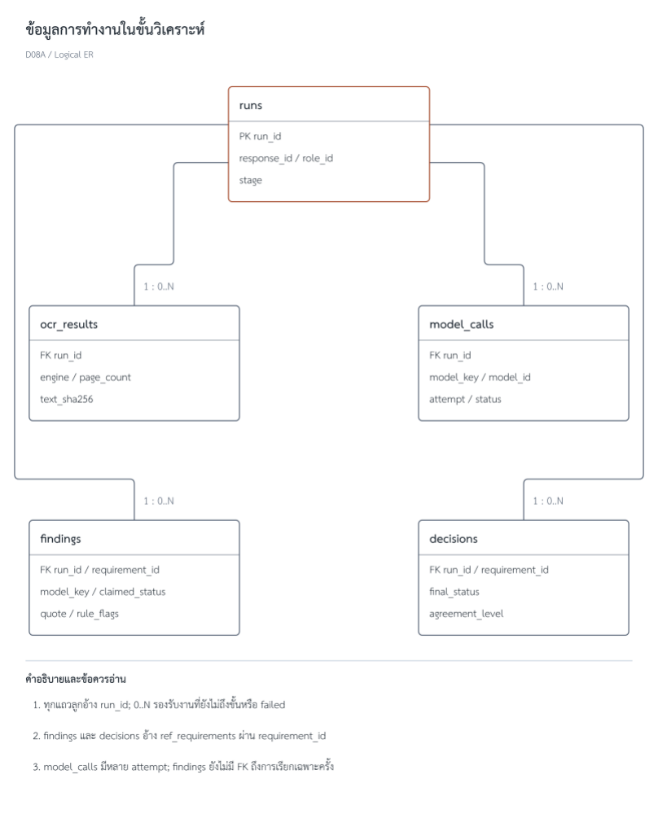

*รูปที่ 3.7  แบบจำลองข้อมูลการวิเคราะห์และการจัดแผน*

แบบจำลองนี้อธิบายความสัมพันธ์ของแท็บการทำงานแปดแท็บ โดยแท็บ runs เป็นตารางหลักที่เก็บหนึ่งแถวต่อหนึ่งคำตอบ และแท็บอื่นอ้างอิงกลับมาที่ run_id ด้วยความสัมพันธ์หนึ่งต่อหลายรายการ รายละเอียดรายคอลัมน์อยู่ในภาคผนวก ง

### 3.4.4 การส่งต่อข้อมูลและสถานะของงาน

เมื่อระบบไม่มีบริการฝั่งเซิร์ฟเวอร์ของตนเอง ข้อตกลงการเชื่อมต่อจึงมีสองอย่าง คือรูปแบบข้อมูลที่ workflow หนึ่งส่งให้อีก workflow หนึ่ง และโครงสร้างของแท็บในฐานข้อมูล

**ตารางที่ 3.21  ข้อมูลที่ส่งต่อระหว่าง workflow**

| การส่งต่อ | ผู้ส่ง | ข้อมูลที่ส่ง |
|---|---|---|
| เข้าสู่ระบบ | Google Forms | หนึ่งแถวในแท็บ form_responses พร้อมลิงก์ไฟล์ใน Drive |
| WF_Main_Intake → WF_SUB_GapEngine | Code node | run_id, role_id และข้อความที่ผ่านการปิดบังข้อมูลระบุตัวแล้ว |
| WF_SUB_GapEngine → WF_Main_Intake | Code node | ผลตอบกลับของทั้งสามโมเดล พร้อมสถานะ รหัสข้อผิดพลาด เวลา และจำนวน token |
| WF_Main_Intake → WF_SUB_Decide | Code node | บริบทของงานทั้งหมดและผลของโมเดล |
| WF_SUB_Decide → WF_Main_Intake | Code node | ชุดข้อมูลรายงานที่บันทึกเป็นรุ่นคงที่ พร้อมค่าแฮชห้าค่า |
| WF_Main_Intake → WF_SUB_Deliver | Code node | run_id และชุดข้อมูลรายงาน |

สถานะของงานเก็บอยู่ในคอลัมน์ stage ของแท็บ runs เดินตามลำดับ running แล้ว ready แล้ว delivered หรือจบที่ failed ผู้วิจัยติดตามความคืบหน้าได้จากคอลัมน์นี้โดยไม่ต้องเปิด n8n

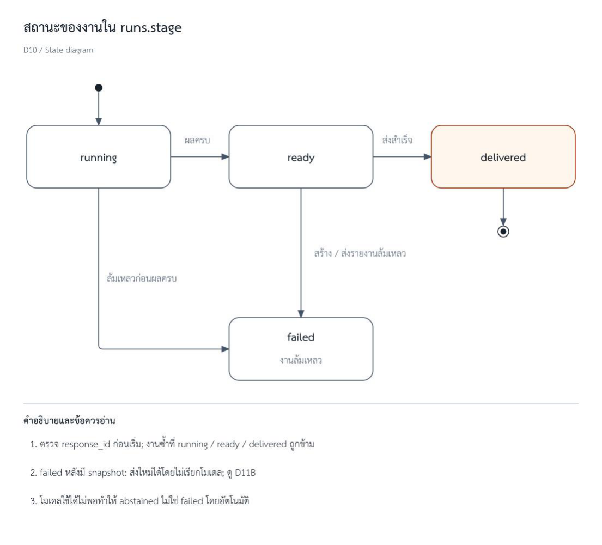

*รูปที่ 3.8  สถานะของงานในคอลัมน์ runs.stage*

รูปนี้ติดตามเส้นทางจาก running ไป ready และ delivered เมื่อทุกขั้นสำเร็จ หรือจบที่ failed เมื่อขั้นใดขั้นหนึ่งล้มเหลว

งานที่ล้มเหลวหลังจากบันทึกผลวิเคราะห์ครบแล้ว เช่น ล้มเหลวตอนสร้างไฟล์รายงานหรือตอนส่งอีเมล สามารถสร้างรายงานและส่งซ้ำจากแถวที่บันทึกไว้ได้โดยไม่ต้องเรียกโมเดลใหม่ ส่วนงานที่ล้มเหลวก่อนบันทึกผลวิเคราะห์ครบต้องประมวลผลใหม่ทั้งรอบ เพราะฐานข้อมูลยังไม่มีข้อสรุปรายข้อกำหนดของงานนั้น

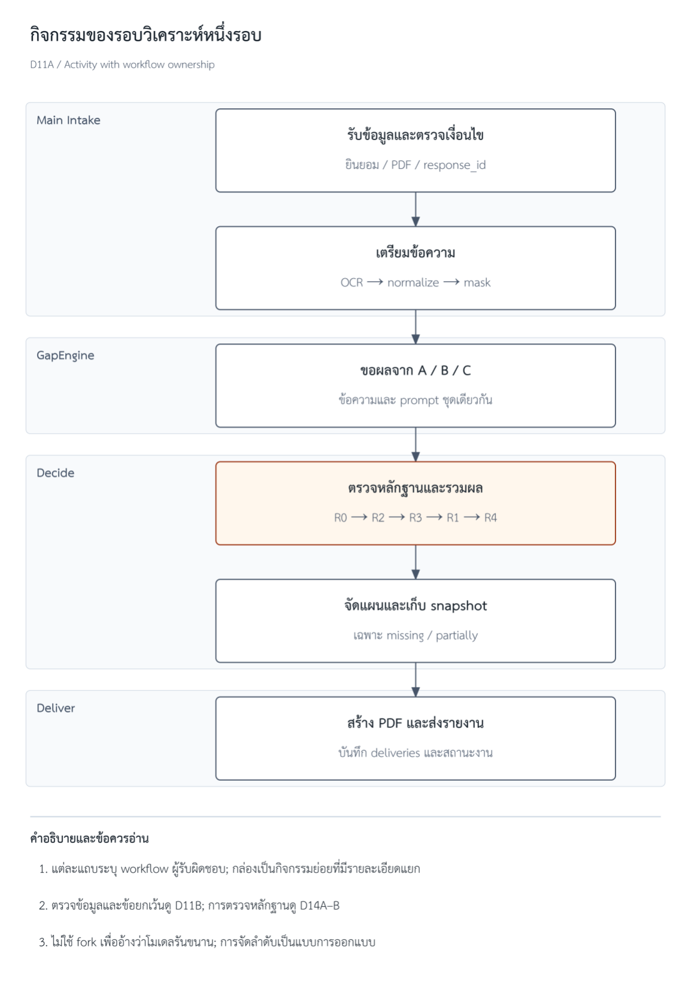

*รูปที่ 3.9  กิจกรรมของรอบการวิเคราะห์หนึ่งรอบ*

จุดสำคัญในรูปนี้คือจุดตัดสินใจสามจุด คือการตรวจความยินยอม การกันงานซ้ำด้วย response_id และเงื่อนไขหยุดสรุปเมื่อมีโมเดลที่ใช้ได้น้อยกว่าสองโมเดล โดยแถบด้านซ้ายระบุว่า workflow ใดรับผิดชอบกิจกรรมช่วงใด

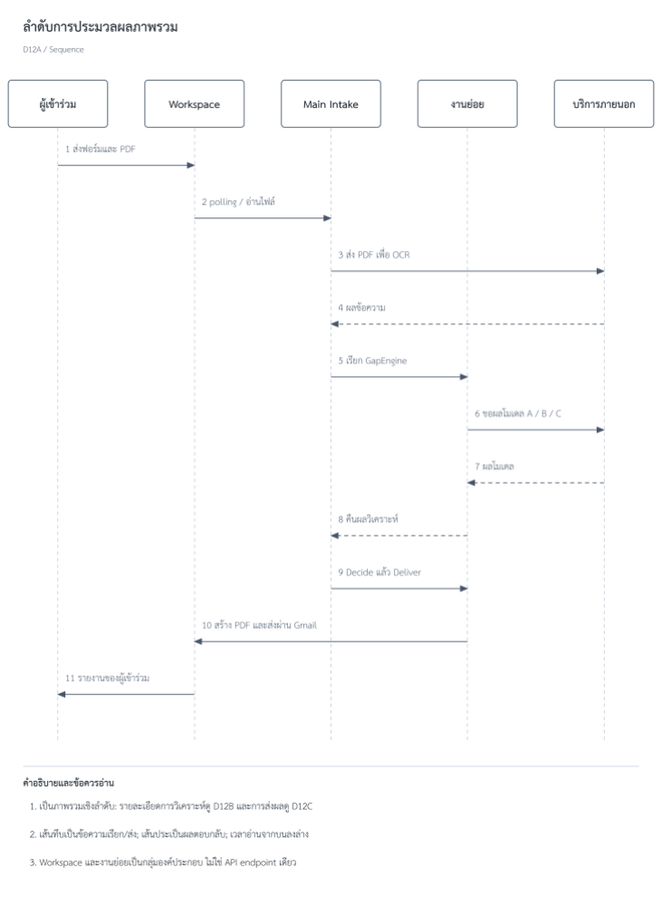

*รูปที่ 3.10  ลำดับการประมวลผลภาพรวม*

รูปนี้เรียงการส่งข้อความระหว่างผู้เข้าร่วมวิจัย บริการของ Google Workspace workflow หลัก workflow ย่อย และบริการภายนอก ตั้งแต่ส่งแบบฟอร์มจนได้รับรายงานทางอีเมล กรอบ loop คือการเรียกโมเดลสามโมเดลด้วย prompt ชุดเดียวกัน

การกันงานซ้ำใช้คีย์ response_id ซึ่งคำนวณจากค่าแฮช SHA-256 ของเวลาที่ส่ง อีเมลของผู้ตอบ และรหัสไฟล์ ก่อนเริ่มงานทุกครั้ง workflow อ่านแท็บ runs ด้วยคีย์นี้ ถ้าพบแถวที่สถานะเป็น running, ready หรือ delivered จะหยุดและบันทึกเหตุการณ์ว่าข้ามเพราะซ้ำ กลไกนี้จำเป็นเพราะการตรวจข้อมูลใหม่เป็นระยะ (polling trigger) อาจอ่านแถวเดิมซ้ำได้เมื่อระบบเริ่มทำงานใหม่ ซึ่งเป็นข้อควรระวังที่เอกสารของผู้ให้บริการระบุไว้ [16]

การส่งออกมีการกันซ้ำในระดับของตนเอง แท็บ deliveries เก็บค่าแฮชของรายงานคู่กับสถานะการส่ง ถ้าพบว่ารายงานที่มีค่าแฮชเดียวกันถูกส่งสำเร็จแล้ว ระบบจะคืนรหัสไฟล์เดิมแทนการสร้างไฟล์ใหม่และส่งอีเมลซ้ำ

### 3.4.5 การเก็บตรรกะไว้ในไฟล์เดียวและการจัดการข้อผิดพลาด

กฎตรวจหลักฐาน การให้คะแนน การจัดแผน การเรียบเรียงรายงาน และการประกอบอีเมล อยู่ในไฟล์ JavaScript ไฟล์เดียวที่ไม่เรียกใช้ไลบรารีภายนอก ไม่ติดต่อเครือข่าย และไม่เก็บสถานะ สคริปต์สร้าง workflow อ่านไฟล์นี้แล้วฝังลงใน Code node ที่ต้องใช้ พร้อมบันทึกค่าแฮชของไฟล์ต้นทางไว้ในไฟล์ workflow ชุดทดสอบอัตโนมัติเรียกฟังก์ชันจากไฟล์เดียวกันนี้ และตัวตรวจ workflow เปรียบเทียบโค้ดที่ฝังอยู่กับไฟล์ต้นทางทีละไบต์ ตัวตรวจจึงระบุความแตกต่างระหว่างโค้ดใน workflow กับไฟล์ต้นทางได้

รุ่นนี้เรียกโมเดล Generative AI สามครั้งต่อรอบวิเคราะห์ และไม่ใช้โมเดลทำหน้าที่แยกวิเคราะห์โครงสร้างเอกสาร จัดอันดับคำแนะนำ หรือเขียนรายงาน งานเหล่านั้นทำด้วยโปรแกรมและแม่แบบทั้งหมด เหตุผลมีสองข้อ ข้อแรก การเพิ่มขั้นตอนที่ใช้โมเดลทำให้ต้องกำหนดวิธีตรวจผลของขั้นตอนนั้นเพิ่มเติม ข้อที่สอง การจัดอันดับและการคำนวณคะแนนมีนิยามชัดเจนอยู่แล้ว การเขียนเป็นโปรแกรมจึงให้ผลเดิมทุกครั้งและอธิบายได้

**ตารางที่ 3.22  การจัดการข้อผิดพลาดและผลต่อรายงาน**

| กรณี | การจัดการ | ผลต่อรายงาน |
|---|---|---|
| บริการอ่านข้อความล้มเหลว | เปลี่ยนไปใช้บริการสำรองและบันทึกชื่อบริการที่ใช้จริง | ระบุชื่อบริการและรุ่นในรายงานทุกครั้ง |
| โมเดลตอบกลับด้วยรหัส 429 หรือหมดเวลา | บันทึกเป็นความล้มเหลวของโมเดลนั้น และเรียกซ้ำตามจำนวนครั้งที่กำหนด | ไม่ถูกแปลงเป็น missing โมเดลนั้นถูกนับว่าใช้ไม่ได้ |
| ผลตอบกลับไม่ตรงรูปแบบที่กำหนด | ปฏิเสธทั้งชุดตามกฎ R0 | โมเดลนั้นถูกนับว่าใช้ไม่ได้ พร้อมรหัสสาเหตุ |
| โมเดลที่ใช้ได้น้อยกว่าสองโมเดล | หยุดสรุปทั้งรายงาน | ทุกข้อกำหนดได้สถานะ abstained และคะแนน R รายงานเป็น N/A |
| ตัวตรวจข้อมูลใหม่อ่านคำตอบเดิมซ้ำ | ตรวจคีย์ response_id ในฐานข้อมูลก่อนเริ่มงาน | ข้ามงานนั้นและบันทึกเหตุการณ์ ไม่ประมวลผลซ้ำ |
| ดาวน์โหลดไฟล์จาก Drive ไม่ได้ | หยุดงานและบันทึกรหัสสาเหตุ | สาเหตุที่พบบ่อยคือยังไม่ได้แชร์โฟลเดอร์ของแบบฟอร์มให้บัญชีที่ใช้ประมวลผล |
| สร้างหรือแปลงไฟล์ PDF ไม่สำเร็จ | บันทึกสถานะการส่งเป็นล้มเหลว | ผลวิเคราะห์ยังอยู่ครบในฐานข้อมูล สร้างไฟล์ใหม่ได้โดยไม่ต้องเรียกโมเดลอีก |
| ส่งอีเมลไม่สำเร็จ | บันทึกสถานะการส่งเป็นล้มเหลวพร้อมรหัสสาเหตุ | ไฟล์รายงานยังอยู่บน Drive ผู้วิจัยส่งซ้ำจากแถวที่บันทึกไว้ได้ |
| ระบบทำงานผิดพลาดโดยไม่คาดหมาย | WF_Error บันทึกเหตุการณ์และแจ้งผู้วิจัย | ผู้เข้าร่วมไม่ได้รับข้อความข้อผิดพลาดทางเทคนิค |

## 3.5 การเตรียมข้อความและการวิเคราะห์หลักฐาน

### 3.5.1 การเตรียมข้อความและการปิดบังข้อมูลระบุตัว

ข้อความที่ได้จากบริการอ่านข้อความผ่านการทำให้เป็นรูปแบบเดียวกันด้วยกฎคงที่ห้าข้อ ได้แก่ การรวมรูปแบบการขึ้นบรรทัด การแทนช่องว่างพิเศษด้วยช่องว่างปกติ การแทนขีดและอัญประกาศรูปแบบต่าง ๆ ด้วยรูปแบบเดียว การยุบช่องว่างซ้ำ และการตัดบรรทัดว่างที่เกินสองบรรทัด จากนั้นระบบปิดบังข้อมูลระบุตัวด้วยรูปแบบค้นหาข้อความ (regular expression) สี่ชุด คือ อีเมล ลิงก์ หมายเลขโทรศัพท์ และเลขประจำตัว 13 หลัก แล้วแทนที่ด้วยข้อความแทนข้อมูล [EMAIL], [URL], [PHONE] และ [ID] ตามลำดับ

โมเดลทั้งสามและกฎตรวจหลักฐานใช้ข้อความชุดเดียวกันหลังผ่านสองขั้นนี้ เงื่อนไขนี้จำเป็นเพราะการตรวจว่าข้อความที่โมเดลยกมาปรากฏจริงต้องเทียบกับข้อความชุดเดียวกัน และตำแหน่งตัวอักษรที่รายงานให้ผู้ใช้ต้องอ้างอิงข้อความชุดเดียวกันด้วย ระบบบันทึกค่าแฮชของข้อความชุดนี้ไว้เพื่อยืนยันว่าทั้งสามโมเดลได้รับข้อความเดียวกัน

การปิดบังครอบคลุมข้อมูลที่ตรงกับรูปแบบสี่ชุดดังกล่าวเท่านั้น ข้อมูลระบุตัวที่ไม่ตรงรูปแบบยังอาจคงอยู่ในข้อความที่ส่งให้โมเดล เช่น ชื่อบุคคล ที่อยู่ ชื่อบริษัท และชื่อสถาบันการศึกษา ข้อจำกัดนี้อธิบายไว้ในหัวข้อ 3.10

เส้นทางเอกสารตั้งแต่รับไฟล์จนถึงข้อความที่ปิดบังข้อมูลระบุตัวแสดงในรูปที่ 3.11

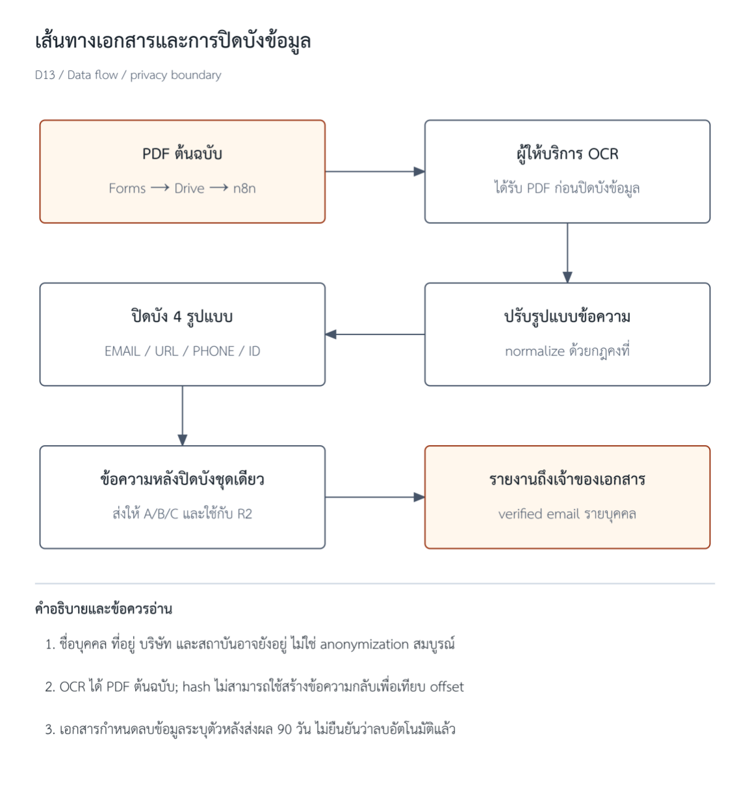

*รูปที่ 3.11  เส้นทางเอกสารและขอบเขตข้อมูลระบุตัว*

### 3.5.2 การออกแบบ prompt และรูปแบบผลตอบกลับ

คำสั่งที่ส่งให้โมเดล (prompt) มีชุดเดียวใช้กับทั้งสามโมเดล และกำหนดกฎไว้เก้าข้อ สาระสำคัญคือให้ตัดสินทีละข้อกำหนดจากข้อความที่ให้เท่านั้น ห้ามอนุมานจากชื่อตำแหน่งงาน ชื่อบริษัท หรือจำนวนปีของประสบการณ์ ให้เลือกสถานะจากสามค่า ได้แก่ evidenced, partially และ missing และเมื่อสถานะไม่ใช่ missing ต้องคัดลอกข้อความย่อยจากเอกสารมาตรงตัว ความยาว 20 ถึง 300 ตัวอักษร ห้ามถอดความ ห้ามแก้คำสะกด และห้ามต่อชิ้นส่วนจากคนละตำแหน่ง ถ้าคัดลอกไม่ได้ให้ตอบ missing เงื่อนไขความยาวข้อความเป็นคำสั่งใน prompt ส่วนกฎ R0 ไม่ได้ตรวจความยาว จึงต้องรายงานการกระจายของความยาวข้อความอ้างอิงเป็นข้อมูลควบคุมคุณภาพ

ระบบไม่ส่งคำพ้องของข้อกำหนดเข้าไปใน prompt เพราะคำพ้องใช้ในขั้นตรวจกฎฝั่งโปรแกรม การส่งเข้าไปพร้อมกันจะทำให้โมเดลคัดลอกคำจากรายการคำพ้องมาเป็นข้อความอ้างอิง ซึ่งทำให้การตรวจไม่มีความหมาย

ผลตอบกลับต้องเป็นวัตถุ JSON ตามรูปแบบที่กำหนด ประกอบด้วยฟิลด์ระบุรุ่นของรูปแบบ รหัสอาชีพ และรายการผลประเมินที่แต่ละรายการมีรหัสข้อกำหนด สถานะ ข้อความอ้างอิง และค่าความมั่นใจที่โมเดลรายงาน ค่าความมั่นใจนี้เป็นค่าที่โมเดลรายงานเอง ไม่ใช่ความน่าจะเป็นที่ข้อสรุปถูกต้อง ยังไม่ได้สอบเทียบกับความถูกต้องจริง และไม่ถูกใช้ลบล้างผลการตรวจข้อความ

### 3.5.3 สถานะผลการตรวจหลักฐาน

ระบบใช้สถานะสี่สถานะตามตารางที่ 3.23 สามสถานะแรกเป็นข้อสรุปที่ระบบตัดสินได้ ส่วนสถานะที่สี่เป็นผลระดับระบบซึ่งเกิดจากเงื่อนไขการรวมผล ตารางนี้ใช้เป็นเกณฑ์เดียวกันทั้งในการอ่านผลของระบบและในการให้รหัสชุดคำตอบอ้างอิง

**ตารางที่ 3.23  นิยามของสถานะผลการตรวจหลักฐานทั้งสี่สถานะ**

| สถานะ | คำแสดงผลในรายงาน | เกณฑ์ตัดสิน |
|---|---|---|
| evidenced | พบหลักฐานตามเกณฑ์ | เอกสารมีข้อความที่ระบุการปฏิบัติงานหรือความรู้ตรงตามองค์ประกอบของข้อกำหนด โดยระบุงาน เครื่องมือ หรือผลงานที่สอดคล้อง ไม่ใช่การกล่าวชื่อทักษะลอย ๆ |
| partially | พบหลักฐานบางส่วน | เอกสารมีข้อความที่สนับสนุนเพียงบางองค์ประกอบของข้อกำหนด หรือกล่าวถึงเรื่องนั้นในระดับรายวิชา การอบรม หรือการกล่าวชื่อทักษะโดยไม่มีบริบทการใช้งาน คู่มือให้รหัสต้องระบุว่าส่วนใดได้รับการสนับสนุนและส่วนใดยังไม่ชัด |
| missing | ไม่พบหลักฐานที่ผ่านเกณฑ์ | เอกสารไม่มีข้อความที่เกี่ยวข้องกับข้อกำหนดนั้น หรือมีข้อความที่โมเดลยกมาแต่ไม่ผ่านกฎ R2 หรือ R3 ระบบบันทึกสองกรณีนี้แยกกันด้วยรหัสกำกับผลการตรวจ |
| abstained | ระบบยังสรุปไม่ได้ | จำนวนโมเดลที่ใช้ได้น้อยกว่าเกณฑ์ หรือไม่มีสถานะใดได้เสียงตรงกันถึงสองเสียง เป็นผลระดับระบบ ไม่ใช่ข้อสรุปเกี่ยวกับเอกสาร |

การตัดสินสถานะเกิดขึ้นสามระดับที่ต้องแยกจากกัน ระดับแรกคือสถานะที่โมเดลเสนอ ซึ่งบันทึกไว้ในแท็บ findings ระดับที่สองคือผลการตรวจข้อความของแต่ละโมเดล ซึ่งอาจเปลี่ยนเสียงของโมเดลนั้นเป็น missing เมื่อไม่ผ่านกฎ ระดับที่สามคือสถานะสุดท้ายหลังรวมผลของทุกโมเดล ซึ่งบันทึกไว้ในแท็บ decisions ค่าที่ใช้ตอบคำถามที่ 1 คือสถานะสุดท้าย ส่วนสองระดับแรกใช้ตรวจสอบย้อนหลังและวิเคราะห์สาเหตุของข้อผิดพลาด

ชุดคำตอบอ้างอิงใช้เพียงสามสถานะแรก เพราะ abstained เป็นผลของกลไกระบบ ไม่ใช่คุณสมบัติของเอกสาร การเปรียบเทียบผลระบบกับคำตอบอ้างอิงจึงต้องรายงานข้อที่ abstained แยกออกมาตามหัวข้อ 3.9.3

### 3.5.4 กฎการตรวจหลักฐาน

รหัสของกฎ R0 ถึง R4 เป็นชื่อเรียกตามที่กำหนดไว้ในระบบ ไม่ใช่ลำดับการประมวลผล ลำดับการทำงานจริงเป็น R0 แล้ว R2 แล้ว R3 แล้ว R1 และ R4 ตามตารางที่ 3.24 กฎเหล่านี้ยังทำงานที่ระดับข้อมูลต่างกัน กฎ R0 ทำงานที่ระดับผลตอบกลับของโมเดลหนึ่งชุด กฎ R2 และ R3 ทำงานที่ระดับข้อสรุปรายข้อของโมเดลหนึ่งโมเดล ส่วนกฎ R1 และ R4 ทำงานที่ระดับข้อกำหนดหลังรวมผลของทุกโมเดล

**ตารางที่ 3.24  กฎการตรวจหลักฐานเรียงตามลำดับการประมวลผล**

| ลำดับ | กฎ | ระดับที่ตรวจ | สิ่งที่ตรวจ | ผลเมื่อไม่ผ่าน |
|---|---|---|---|---|
| 1 | R0 | ผลตอบกลับของหนึ่งโมเดล | แปลงเป็น JSON ได้ ตรงรูปแบบที่กำหนด รหัสอาชีพตรงกัน และรหัสข้อกำหนดอยู่ในชุดที่ส่งไป | ผลของโมเดลนั้นถูกจัดเป็นใช้ไม่ได้ทั้งชุด พร้อมรหัสสาเหตุตามตารางที่ 3.25 |
| 2 | R2 | ข้อสรุปรายข้อของหนึ่งโมเดล | ข้อความที่ยกมาปรากฏจริงในข้อความที่ผ่านการปิดบังแล้ว | เสียงของโมเดลนั้นสำหรับข้อกำหนดนั้นเปลี่ยนเป็น missing และนับเป็นข้อสรุปที่ไม่ผ่านเกณฑ์ตรวจหลักฐาน |
| 3 | R3 | ข้อสรุปรายข้อของหนึ่งโมเดล | ข้อความที่ยกมาเกี่ยวข้องกับข้อกำหนดตามคะแนนจากคำที่ปรากฏร่วมกัน | ผลเช่นเดียวกับ R2 และบันทึกรหัสกำกับแยกจากกรณีไม่พบข้อความ |
| 4 | R1 | ข้อกำหนดหลังรวมผล | มีอย่างน้อยสองเสียงที่ให้สถานะตรงกัน | ข้อกำหนดนั้นได้สถานะ abstained |
| 5 | R4 | ข้อกำหนดหลังรวมผล | บันทึกสัดส่วนโมเดลที่ให้ผลตรงกับข้อสรุปสุดท้าย | ไม่มีผลปฏิเสธ ใช้แสดงต่อผู้ใช้ |

**ตารางที่ 3.25  รหัสสาเหตุที่ทำให้ผลตอบกลับของโมเดลไม่ผ่านกฎ R0**

| รหัสสาเหตุ | เงื่อนไข |
|---|---|
| no_output | ไม่มีผลตอบกลับจากโมเดล |
| invalid_json | ผลตอบกลับแปลงเป็น JSON ไม่ได้ |
| schema_mismatch | รุ่นของรูปแบบไม่ตรง หรือโครงสร้างผลประเมินไม่ถูกต้อง |
| role_mismatch | รหัสอาชีพในผลตอบกลับไม่ตรงกับรหัสที่ส่งไป |
| incomplete_coverage | จำนวนข้อกำหนดที่โมเดลตอบน้อยกว่าครึ่งหนึ่งของข้อกำหนดที่ส่งไป |

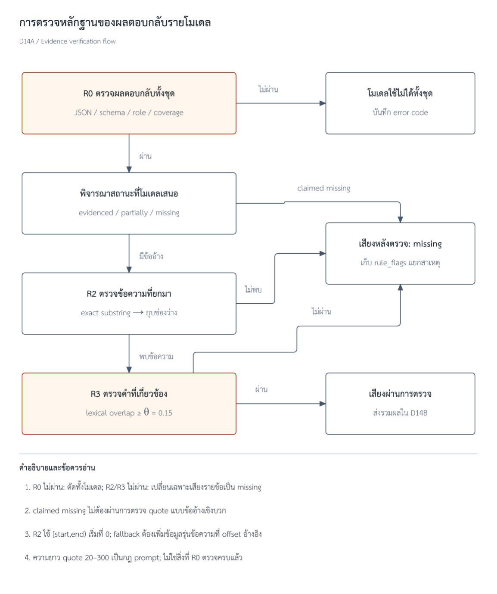

*รูปที่ 3.12  การตรวจหลักฐานของผลตอบกลับรายโมเดล*

ลำดับการตรวจในรูปนี้เดินจากบนลงล่างตามเวลาจริง เริ่มที่ผลตอบกลับของโมเดลหนึ่งชุดซึ่งกฎ R0 ตรวจก่อน ต่อด้วยข้อสรุปรายข้อของโมเดลนั้นซึ่งกฎ R2 แล้วกฎ R3 ตรวจตามลำดับ จากนั้นจึงรวมเสียงของทุกโมเดลให้กฎ R1 และกฎ R4 ทำงานที่ระดับข้อกำหนด เส้นทางด้านขวาของรูปคือผลที่เกิดขึ้นเมื่อไม่ผ่านกฎแต่ละข้อ ได้แก่ ผลทั้งชุดของโมเดลนั้นใช้ไม่ได้เมื่อไม่ผ่าน R0 เสียงของโมเดลนั้นเปลี่ยนเป็น missing เมื่อไม่ผ่าน R2 หรือ R3 และข้อกำหนดนั้นได้สถานะ abstained เมื่อไม่ผ่าน R1 ส่วนกฎ R4 ไม่ปฏิเสธข้อใด ตัวเลขลำดับที่กำกับไว้ในรูปคือลำดับการทำงานจริง ซึ่งไม่ตรงกับลำดับของรหัสกฎ

กฎ R2 ใช้การค้นหาข้อความย่อยแบบตรงตัวก่อน ถ้าไม่พบจะค้นอีกครั้งหลังยุบช่องว่างซ้ำทั้งสองฝั่ง เพื่อรองรับกรณีที่บริการอ่านข้อความใส่ช่องว่างต่างจากต้นฉบับ เมื่อพบ ระบบบันทึกตำแหน่งเริ่มต้นและตำแหน่งสิ้นสุดของข้อความนั้น ตำแหน่งเริ่มต้นนับจาก 0 และตำแหน่งสิ้นสุดคือตำแหน่งถัดจากอักขระสุดท้ายของข้อความ จึงไม่รวมอักขระที่ตำแหน่งนั้น ตำแหน่งคู่นี้บันทึกลงฐานข้อมูลและแสดงในรายงานเพื่อให้ตรวจย้อนกลับได้ เมื่อระบบพบข้อความจากการค้นครั้งที่สอง ตำแหน่งที่ได้อ้างอิงข้อความรุ่นที่ยุบช่องว่างแล้ว ไม่ใช่ข้อความรุ่นที่ส่งให้โมเดล ระบบจึงบันทึกคอลัมน์ quote_text_version ในแท็บ findings ว่าตำแหน่งของแถวนั้นอ้างอิงข้อความรุ่น normalized หรือ whitespace_collapsed เพื่อให้ผู้ใช้เทียบตำแหน่งกับข้อความต้นทางได้ถูกต้อง

กฎ R3 คำนวณคะแนนจากคำที่ปรากฏร่วมกันระหว่างข้อความที่ยกมากับข้อกำหนด หากข้อความที่ยกมามีคำพ้องของข้อกำหนดปรากฏตรงตัวและคำพ้องนั้นยาวตั้งแต่ 4 ตัวอักษร ระบบให้คะแนนเท่ากับ 1 ทันที กรณีอื่นคำนวณตามสมการที่ 3.2

$$ \mathrm{ov}(q, r) = \frac{|T(q) \cap T(r)|}{\min(|T(q)|,\ 25)} \tag{3.2} $$

โดย T(q) คือเซตคำไม่ซ้ำของข้อความที่ยกมาหลังตัดคำทั่วไปที่ไม่นำมาคำนวณ (stop words) ออก เช่น the, and, for, with และ using ส่วน T(r) คือเซตคำเป้าหมายของข้อกำหนด ซึ่งประกอบจากชื่อองค์ประกอบ คำอธิบายองค์ประกอบ และคำพ้องทั้งหมด การตัดคำใช้กฎคงที่ที่คงตัวอักษรภาษาอังกฤษ ตัวเลข และสัญลักษณ์ที่พบในชื่อเทคโนโลยี และตัดคำที่มีความยาวไม่เกินหนึ่งตัวอักษรออก ข้อสรุปผ่านกฎ R3 เมื่อ ov(q, r) ≥ θ การศึกษานี้กำหนด θ เท่ากับ 0.15 ตามค่าที่บันทึกไว้ในไฟล์ตั้งค่าของโครงการ ค่านี้เลือกจากการทดลองกับชุดทดสอบสังเคราะห์ให้ผ่านกรณีที่ข้อความอ้างอิงตรงประเด็นและปฏิเสธกรณีที่อ้างอิงข้อความทั่วไป และกำหนดให้ทบทวนอีกครั้งในขั้นทดสอบนำร่องก่อนตรึงรุ่นตามหัวข้อ 3.7

การหารด้วยค่าที่น้อยกว่าระหว่างขนาดของ T(q) กับ 25 ป้องกันไม่ให้ข้อความยาวเสียเปรียบจากการมีคำที่ไม่เกี่ยวข้องจำนวนมาก เมื่อ T(q) หรือ T(r) เป็นเซตว่าง ระบบกำหนดให้คะแนนเท่ากับ 0 เพื่อไม่ให้เกิดการหารด้วยศูนย์ ค่าที่คำนวณได้อยู่ในช่วง 0 ถึง 1 เมื่อจำนวนคำใน T(q) ไม่เกิน 25 คำ และในทางทฤษฎีอาจมากกว่า 1 ได้เมื่อ T(q) มีคำเกิน 25 คำและคำที่ปรากฏร่วมกันมีจำนวนมากกว่า 25 คำ ระบบไม่จำกัดเพดานของค่าไว้ที่ 1 การเปรียบเทียบกับ θ ไม่ได้รับผลกระทบจากกรณีนี้ เพราะค่าที่มากกว่า 1 ยังผ่านเกณฑ์เช่นเดียวกัน พจนานุกรมข้อมูลในภาคผนวก ง จึงประกาศช่วงค่าของคอลัมน์นี้เป็นจำนวนจริงตั้งแต่ 0 ขึ้นไป ไม่ใช่ 0 ถึง 1

เมื่อข้อสรุปของโมเดลใดไม่ผ่านกฎ R2 หรือ R3 ระบบถือว่าเสียงของโมเดลนั้นสำหรับข้อกำหนดนั้นเท่ากับ missing และบันทึกรหัสกำกับไว้ การแปลงนี้เป็นการตัดสินใจเชิงออกแบบเพื่อไม่ให้ข้อสรุปที่ยังไม่มีข้อความรองรับมีน้ำหนักเท่ากับข้อสรุปที่ผ่านการตรวจ ข้อควรระวังคือการที่ข้อความอ้างอิงชิ้นหนึ่งไม่ผ่านการตรวจ ไม่ได้พิสูจน์ว่าในเรซูเมไม่มีข้อความอื่นที่รองรับข้อกำหนดนั้น ระบบจึงบันทึกจำนวนกรณีที่โมเดลตอบ missing โดยตรงแยกจากจำนวนกรณีที่ถูกปรับเป็น missing หลังการตรวจ และการวิเคราะห์ข้อผิดพลาดตามหัวข้อ 3.9.4 ต้องตรวจอัตราการระบุผิดเป็น missing ของกลุ่มหลังเทียบกับชุดคำตอบอ้างอิงเป็นการเฉพาะ ข้อสรุปเดิม สถานะที่โมเดลเสนอ และเหตุผลที่ถูกปฏิเสธถูกบันทึกไว้ในแท็บ findings และแสดงสรุปไว้ในรายงาน

เพื่อให้เห็นว่ากฎแต่ละข้อทำงานที่จุดใดของลำดับ ตารางที่ 3.26 เดินตามข้อกำหนดหนึ่งข้อผ่านกฎทั้งห้าตามลำดับการประมวลผลจริง ตัวอย่างนี้ใช้ข้อมูลสมมติเพื่ออธิบายกลไก ไม่ใช่ผลของผู้เข้าร่วม กำหนดให้ข้อกำหนดคือ REQ-R01-2.B.3.e ซึ่งเป็นองค์ประกอบ Programming ของอาชีพ R01 และโมเดล A ตอบสถานะ evidenced พร้อมยกข้อความจากเรซูเมว่า Built and deployed a Python programming service for batch data processing

**ตารางที่ 3.26  ตัวอย่างการตรวจข้อกำหนดหนึ่งข้อผ่านกฎ R0 ถึง R4 ตามลำดับการประมวลผล**

| ลำดับ กฎ |  | สิ่งที่ตรวจ | ผลของตัวอย่างนี้ | สถานะหลังจากขั้นนี้ |
|---|---|---|---|---|
| 1 | R0 | ผลตอบกลับของโมเดล A แปลงเป็น JSON ได้ ตรงรูปแบบที่กำหนด รหัสอาชีพตรงกัน และรหัสข้อกำหนดอยู่ในชุดที่ส่งไป | ผ่าน ผลของโมเดล A ใช้ได้ทั้งชุด | ข้อสรุปของโมเดล A เข้าสู่การตรวจรายข้อ |
| 2 | R2 | ข้อความที่ยกมาปรากฏจริงในข้อความที่ผ่านการปิดบังแล้วหรือไม่ | พบจากการค้นแบบตรงตัวครั้งแรก บันทึกคู่ตำแหน่งไว้ในแท็บ findings | เสียงของโมเดล A ยังเป็น evidenced |
| 3 | R3 | คะแนนจากคำที่ปรากฏร่วมกันระหว่างข้อความที่ยกมากับข้อกำหนด | พบคำพ้อง programming ปรากฏตรงตัวและยาวเกินสี่ตัวอักษร ระบบจึงให้คะแนนเท่ากับ 1 ซึ่งไม่น้อยกว่า θ ที่กำหนดไว้ 0.15 | เสียงของโมเดล A ยังเป็น evidenced |
| 4 | R1 | เสียงของทุกโมเดลที่ผ่านการตรวจแล้วมีสถานะตรงกันอย่างน้อยสองเสียงหรือไม่ | โมเดล A และ B ให้ evidenced ส่วนโมเดล C ให้ missing จึงมีสองเสียงตรงกัน | ข้อกำหนดนี้ได้สถานะสุดท้าย evidenced |
| 5 | R4 | สัดส่วนของโมเดลที่ให้ผลตรงกับข้อสรุปสุดท้าย | 2 ใน 3 เท่ากับ 0.67 | ไม่มีผลปฏิเสธ ค่านี้ใช้แสดงในรายงาน |

ตัวอย่างที่ให้ผลต่างออกไปช่วยให้เห็นขอบเขตของกฎชัดขึ้น กรณีแรก ถ้าโมเดลยกข้อความว่า Familiar with database concepts มาประกอบข้อกำหนด Programming ข้อความนั้นผ่านกฎ R2 เพราะปรากฏจริงในเอกสาร แต่ไม่ผ่านกฎ R3 เพราะคะแนนคำที่ปรากฏร่วมกันต่ำกว่าเกณฑ์ เสียงของโมเดลนั้นจึงเปลี่ยนเป็น missing และถูกนับเป็นข้อสรุปที่ไม่ผ่านเกณฑ์ตรวจหลักฐาน กรณีที่สอง ถ้าโมเดลสองโมเดลให้สถานะต่างกันคนละอย่างและโมเดลที่สามไม่ผ่านกฎ R0 จะเหลือเสียงที่ใช้ได้เพียงสองเสียงที่ไม่ตรงกัน ข้อกำหนดนั้นจึงไม่ผ่านกฎ R1 และได้สถานะ abstained ซึ่งเป็นผลของกลไกระบบ ไม่ใช่ข้อสรุปเกี่ยวกับเอกสาร

### 3.5.5 การรวมผลและเงื่อนไขการหยุดสรุป

ระบบนับเฉพาะโมเดลที่ผ่านกฎ R0 เป็นโมเดลที่ใช้ได้ ให้ m คือจำนวนโมเดลที่ใช้ได้ในรอบนั้น ถ้า m < 2 ระบบไม่สรุปข้อใดเลย ทุกข้อกำหนดได้สถานะ abstained และคะแนน R รายงานเป็น N/A เงื่อนไขนี้ทำให้ระบบไม่รายงานผลจากเสียงเดียว

เมื่อ m ≥ 2 ระบบนับเสียงของสถานะที่ผ่านการตรวจแล้วในแต่ละข้อกำหนด สถานะที่ได้เสียงมากที่สุดและได้อย่างน้อยสองเสียงเป็นข้อสรุปสุดท้าย ถ้าไม่มีสถานะใดได้ถึงสองเสียง ข้อกำหนดนั้นได้สถานะ abstained ระบบยังกำหนดลำดับสำรองไว้สำหรับกรณีที่สองสถานะได้เสียงเท่ากันที่ระดับชนะ โดยให้ missing มาก่อน partially และ evidenced ซึ่งเป็นการเลือกทางที่ระมัดระวังกว่า ทั้งนี้เมื่อใช้โมเดลไม่เกิน 3 โมเดลและกำหนดเกณฑ์อย่างน้อยสองเสียง สองสถานะไม่สามารถได้เสียงเท่ากันที่ระดับชนะได้ ลำดับสำรองนี้จึงเป็นกฎรองรับการขยายจำนวนโมเดลในอนาคต ไม่ใช่เงื่อนไขที่เกิดขึ้นในการศึกษาปัจจุบัน

สัดส่วนความเห็นตรงกันของข้อกำหนดหนึ่งคำนวณตามสมการที่ 3.3

agree

$$ a_i = \frac{n_i^{\mathrm{agree}}}{m_i} \tag{3.3} $$

โดย niagree คือจำนวนโมเดลที่ให้สถานะตรงกับข้อสรุปสุดท้ายของข้อกำหนดที่ i และ mi คือจำนวนโมเดลที่ตอบข้อกำหนดนั้นและผ่านกฎ R0 ค่านี้แสดงในรายงานทุกข้อ เพื่อให้ผู้ใช้แยกข้อที่ทุกโมเดลเห็นตรงกันออกจากข้อที่เห็นตรงกันเพียงสองในสาม ค่า ai เป็นสัดส่วนความเห็นตรงกัน ไม่ใช่ความน่าจะเป็นที่ข้อสรุปถูกต้อง

ข้อความที่แสดงเป็นหลักฐานในรายงานเลือกจากโมเดลที่ให้สถานะตรงกับข้อสรุปสุดท้ายและมีข้อความที่ผ่านกฎ R2 โดยเลือกข้อความที่มีคะแนนจากกฎ R3 สูงสุด และเลือกข้อความที่สั้นกว่าเมื่อคะแนนเท่ากัน เกณฑ์นี้ทำให้รายงานแสดงข้อความเดิมทุกครั้งที่ข้อมูลเข้าเหมือนกัน

### 3.5.6 คะแนนหลักฐานและสัดส่วนของข้อกำหนดที่ระบบสรุปได้

ระบบกำหนดคะแนนของแต่ละสถานะดังนี้ evidenced เท่ากับ 1 partially เท่ากับ 0.5 และ missing เท่ากับ 0 ให้ D คือเซตของข้อกำหนดที่ระบบสรุปได้ นั่นคือข้อที่สถานะไม่ใช่ abstained คะแนนหลักฐานตามข้อกำหนดอ้างอิงคำนวณตามสมการที่ 3.4

$$ R = \frac{\sum_{i \in D} s_i w_i}{\sum_{i \in D} w_i} \times 100 \tag{3.4} $$

โดย si คือคะแนนของสถานะที่ข้อกำหนดที่ i ได้รับ และ wi คือน้ำหนักตามสมการที่ 3.1 ตัวหารคือผลรวมน้ำหนักของข้อที่สรุปได้เท่านั้น ข้อที่ abstained ไม่เข้าทั้งเศษและส่วน ถ้า D เป็นเซตว่าง ระบบรายงานค่าเป็น N/A ไม่ใช่ศูนย์ เพราะศูนย์หมายถึงไม่พบหลักฐานในทุกข้อที่สรุปได้ ซึ่งเป็นข้อความคนละความหมายกับการที่ระบบยังสรุปไม่ได้ คะแนนนี้สะท้อนหลักฐานที่ปรากฏในเรซูเมภายใต้เกณฑ์ของการศึกษา ไม่ได้มาจากการทดสอบทักษะหรือผลการทำงาน

เนื่องจากตัวหารของคะแนน R เปลี่ยนตามจำนวนข้อที่สรุปได้ ระบบจึงรายงานสัดส่วนน้ำหนักของข้อกำหนดที่สรุปได้คู่กันเสมอ ตามสมการที่ 3.5

$$ C = \frac{\sum_{i \in D} w_i}{\sum_{i \in A} w_i} \tag{3.5} $$

โดย A คือข้อกำหนดทั้ง 30 ข้อของอาชีพนั้น ค่า C เป็นสัดส่วนของน้ำหนัก ไม่ใช่สัดส่วนของจำนวนข้อ รายงานจึงแสดงทั้งจำนวนข้อที่สรุปได้และค่า C ควบคู่กัน และไม่แปลงจำนวนข้อเป็นค่า C โดยตรง ค่า C ยังต่างจากความครอบคลุมช่องว่างของแผนในหัวข้อ 3.9.2 ซึ่งนับจากช่องว่างอ้างอิงที่มีรายการเรียนรู้รองรับ

ตัวอย่างการคำนวณต่อไปนี้ใช้ข้อมูลสมมติเพื่ออธิบายสูตร ไม่ใช่ผลของผู้เข้าร่วม สมมติว่าอาชีพหนึ่งมีข้อกำหนด 30 ข้อ น้ำหนักรวมเท่ากับ 1 ระบบสรุปได้ 5 ข้อซึ่งมีน้ำหนักรวม 0.20 ในจำนวนนี้มี 2 ข้อที่ได้ evidenced น้ำหนักรวม 0.09 และ 3 ข้อที่ได้ partially น้ำหนักรวม 0.11 คะแนน R เท่ากับ (0.09 × 1 + 0.11 × 0.5) ÷ 0.20 × 100 ซึ่งเท่ากับ 72.50 ขณะที่ค่า C เท่ากับ 0.20 ตัวเลขคู่นี้แสดงว่าคะแนน 72.50 คำนวณจากน้ำหนักเพียงหนึ่งในห้าของอาชีพนั้น จึงอ่านต่างจากคะแนนเดียวกันที่คำนวณจากข้อกำหนดครบทั้ง 30 ข้อ

อัตราข้อสรุปที่ไม่ผ่านเกณฑ์ตรวจหลักฐานคำนวณแยกต่างหากตามสมการที่ 3.6 โดยนับเฉพาะข้อสรุปที่โมเดลระบุสถานะไม่ใช่ missing เพราะเฉพาะกรณีเหล่านั้นที่ต้องมีข้อความอ้างอิง

$$ U = \frac{n_{\mathrm{rejected}}}{n_{\mathrm{claims}}} \tag{3.6} $$

โดย nrejected คือจำนวนข้อสรุปที่ไม่ผ่านกฎ R2 หรือ R3 และ nclaims คือจำนวนข้อสรุปทั้งหมดที่โมเดลระบุสถานะไม่ใช่ missing ค่านี้รายงานทั้งระดับรวมและระดับรายโมเดล อัตราดังกล่าวใช้ประกอบการตรวจสอบคุณภาพและการวิเคราะห์สาเหตุของข้อผิดพลาด ส่วนความถูกต้องของสถานะสุดท้ายประเมินเทียบกับชุดคำตอบอ้างอิงตามหัวข้อ 3.9 ค่า U ยังเป็นตัวชี้วัดที่สะท้อนความคลาดเคลื่อนของข้อมูลตามนิยามในหัวข้อ 1.6 ภายในขอบเขตที่กฎตรวจได้

## 3.6 การจัดแผนการเรียนรู้

### 3.6.1 การกำหนดช่องว่างและจำนวนชั่วโมงเรียนสูงสุด

ช่องว่างทักษะคือเซตของข้อกำหนดที่มีสถานะ missing หรือ partially ข้อที่ abstained ไม่ถูกนับเป็นช่องว่าง เพราะระบบยังไม่ได้ตัดสิน และแสดงแยกไว้ในรายงาน จำนวนชั่วโมงเรียนสูงสุดคำนวณจากกรอบเวลาและชั่วโมงต่อสัปดาห์ที่ผู้ใช้ระบุ ตามสมการที่ 3.7

$$ H_{\max} = M \times 4.33 \times h \tag{3.7} $$

โดย M คือจำนวนเดือนของกรอบเวลา h คือจำนวนชั่วโมงที่ผู้เรียนเรียนได้ต่อสัปดาห์ และค่า 4.33 คือจำนวนสัปดาห์เฉลี่ยต่อเดือน การประเมินหลักกำหนด M เท่ากับ 6

### 3.6.2 การเลือกรายการเรียนรู้ด้วย Greedy algorithm

ระบบพิจารณาเฉพาะรายการที่ผ่านเงื่อนไขสี่ข้อ คือความเชื่อมโยงต้องผ่านการตรวจตามหัวข้อ 3.3.2 ต้องอยู่ในชั้น L1 ข้อกำหนดที่ความเชื่อมโยงนั้นอ้างถึงต้องเป็นช่องว่างของผู้เรียนคนนั้น และประเภทคำแนะนำของรายการต้องตรงกับประเภทที่ผู้ใช้เลือก พร้อมมีชั่วโมงประมาณการมากกว่าศูนย์

การเลือกใช้ Greedy algorithm ซึ่งในแต่ละรอบเลือกรายการที่ได้คะแนนตามเกณฑ์สูงสุดหนึ่งรายการ เกณฑ์ที่ใช้คือน้ำหนักของช่องว่างที่รายการนั้นครอบคลุมเพิ่มได้ต่อชั่วโมง ตามสมการที่ 3.8

$$ d_k = \frac{\sum_{i \in (G_k \cap G_{\mathrm{gap}}) \setminus S} w_i}{h_k} \tag{3.8} $$

โดย Gk คือเซตข้อกำหนดที่รายการ k ครอบคลุมตามความเชื่อมโยงที่ผ่านการตรวจ Ggap คือเซตช่องว่างของผู้เรียนคนนั้น S คือเซตช่องว่างที่รายการซึ่งเลือกไว้ก่อนหน้าครอบคลุมไปแล้ว และ hk คือชั่วโมงประมาณการของรายการนั้น ตัวเศษจึงนับเฉพาะน้ำหนักของช่องว่างที่ยังไม่ถูกครอบคลุม ข้อกำหนดที่ไม่ใช่ช่องว่างไม่เข้าสู่การคำนวณ ทั้งสถานะ missing และ partially ใช้น้ำหนัก wi เต็มจำนวนในสูตรนี้ โดยไม่หักตามคะแนนสถานะในสมการที่ 3.4 เพราะทั้งสองสถานะถือเป็นช่องว่างที่ต้องพัฒนาเช่นเดียวกัน

ในแต่ละรอบ ระบบเลือกรายการที่มีค่า dk สูงสุดจากรายการที่ยังเพิ่มความครอบคลุมได้และไม่ทำให้ชั่วโมงสะสมเกิน Hmax รายการที่ทำให้ชั่วโมงสะสมเกินเพดานจะถูกข้ามในรอบนั้น แต่การเลือกยังดำเนินต่อกับรายการที่สั้นกว่า การเลือกสิ้นสุดเมื่อไม่มีรายการใดที่เพิ่มความครอบคลุมได้ภายในเพดานเวลา กรณีค่า dk เท่ากันตัดสินด้วยรหัสรายการ เพื่อให้ผลการเลือกเหมือนเดิมทุกครั้งที่ข้อมูลเข้าเหมือนกัน ชั่วโมงของรายการหนึ่งนับครั้งเดียวแม้รายการนั้นครอบคลุมหลายข้อกำหนด

ตัวอย่างต่อไปนี้ใช้ข้อมูลสมมติเพื่ออธิบายสูตร สมมติว่าผู้เรียนมีเวลา Hmax เท่ากับ 150 ชั่วโมง และมีรายการให้เลือกสามรายการ รายการที่ 1 ใช้ 100 ชั่วโมง ครอบคลุมช่องว่างน้ำหนักรวม 0.10 จึงได้ dk เท่ากับ 0.0010 รายการที่ 2 ใช้ 40 ชั่วโมง ครอบคลุมช่องว่างน้ำหนักรวม 0.06 จึงได้ 0.0015 และรายการที่ 3 ใช้ 30 ชั่วโมง ครอบคลุมช่องว่างน้ำหนักรวม 0.03 ซึ่งซ้อนทับกับรายการที่ 2 ทั้งหมด จึงได้ 0.0010 ระบบเลือกรายการที่ 2 ก่อนเพราะมีค่าสูงสุด จากนั้นรายการที่ 3 ไม่เพิ่มความครอบคลุมจึงถูกตัดออก และรายการที่ 1 ถูกเลือกต่อเพราะชั่วโมงสะสม 140 ชั่วโมงยังไม่เกินเพดาน แผนที่ได้จึงมีสองรายการและใช้เวลารวม 140 ชั่วโมง

ช่องว่างที่ไม่มีรายการรองรับถูกรายงานตามจริงพร้อมรหัสข้อกำหนด ไม่ถูกซ่อนและไม่ถูกแทนที่ด้วยรายการที่ใกล้เคียง ลำดับที่ระบบเสนอเป็นลำดับความสำคัญสำหรับวางแผน ไม่ใช่ลำดับที่ยืนยันความรู้พื้นฐานที่ต้องมีก่อนเรียน เพราะข้อมูลในคลังไม่ได้ระบุความสัมพันธ์ดังกล่าวไว้ครบทุกรายการ

กลไกเลือกรายการเรียนรู้ตามประโยชน์ส่วนเพิ่มต่อชั่วโมงภายใต้งบเวลาแสดงในรูปที่ 3.13

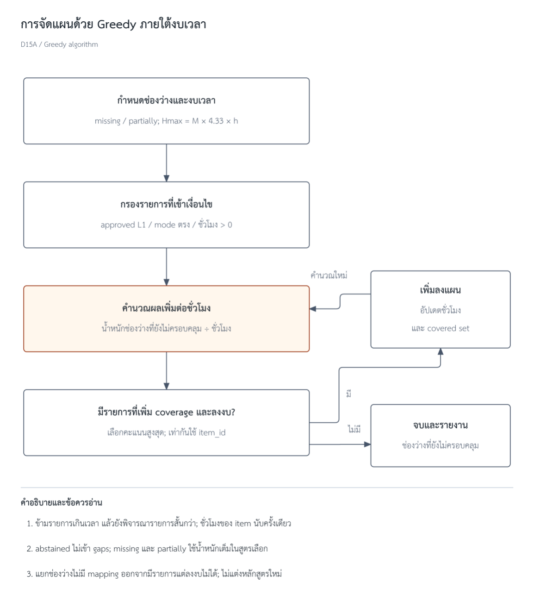

*รูปที่ 3.13  การจัดแผนการเรียนรู้ด้วย Greedy algorithm*

### 3.6.3 รายงานที่ส่งให้ผู้ใช้และเส้นทางการสร้างไฟล์

ผู้ใช้ไม่ได้เฝ้าหน้าจอระหว่างระบบทำงาน ผลทั้งหมดจึงอยู่ในไฟล์รายงานฉบับเดียวที่ส่งกลับทางอีเมล เนื้อหาของรายงานแบ่งเป็นห้าส่วน ส่วนแรกคือสรุปตัวเลขสี่ตัว ได้แก่ คะแนนหลักฐานตามข้อกำหนดอ้างอิง สัดส่วนน้ำหนักของข้อที่สรุปได้ จำนวนข้อสรุปที่ไม่ผ่านเกณฑ์ตรวจหลักฐาน และจำนวนโมเดลที่ใช้ได้ในรอบนั้น ส่วนที่สองคือผลรายข้อจัดกลุ่มตามสถานะ แต่ละข้อแสดงข้อความที่ใช้ตัดสินพร้อมตำแหน่งตัวอักษร ส่วนที่สามคือแผนการเรียนรู้ที่เรียงตามลำดับความสำคัญ พร้อมเหตุผล รหัสช่องว่างที่แต่ละรายการครอบคลุม ชั่วโมงของรายการ และชั่วโมงสะสม ส่วนที่สี่คือรายละเอียดการเรียกโมเดลเพื่อการตรวจสอบย้อนหลัง ซึ่งไม่ใช้จัดอันดับว่าโมเดลใดดีกว่า และส่วนที่ห้าคือข้อจำกัดของผลและค่าแฮชที่ใช้ยืนยันว่าเป็นรายงานฉบับเดียวกัน

ข้อความทุกชิ้นที่มาจากเรซูเมหรือจากโมเดลถูกแปลงอักขระพิเศษก่อนใส่ลงรายงาน และลิงก์ที่แสดงถูกตรวจว่าขึ้นต้นด้วย https เท่านั้น เพื่อไม่ให้เนื้อหาที่ระบบไม่ได้ควบคุมกลายเป็นโค้ดที่ทำงานได้เมื่อเปิดไฟล์

เส้นทางการสร้างไฟล์ใช้ความสามารถของ Google Drive ที่แปลงไฟล์ตอนนำเข้า ลำดับคือ Code node สร้างเอกสาร HTML แล้วอัปโหลดขึ้น Drive โดยระบุชนิดปลายทางเป็นเอกสารของ Google Docs จากนั้นเรียกคำสั่งส่งออกของ Drive เพื่อรับไฟล์รูปแบบ application/pdf ซึ่งเป็นรูปแบบที่เอกสารของ Google Docs รองรับตามเอกสารของผู้ให้บริการ [17] แล้วอัปโหลดไฟล์ PDF ไปเก็บในโฟลเดอร์รายงานและลบเอกสารกลางทิ้ง

ทางเลือกนี้ถูกเลือกเพราะไม่ต้องติดตั้งบริการเพิ่มนอกเหนือจากบัญชี Google ที่ระบบใช้อยู่ และระบบใช้ Google Docs แปลงเอกสารที่มีข้อความภาษาไทยเป็น PDF ข้อแลกเปลี่ยนคือควบคุมการตัดหน้าและรูปแบบได้น้อยกว่าการใช้เครื่องมือแปลงที่ตั้งค่าเองได้ หากรูปเล่มของรายงานไม่เป็นที่พอใจ ทางสำรองคือใช้บริการแปลง HTML เป็น PDF ที่กำหนดรูปแบบการพิมพ์ได้ครบกว่า แต่ต้องติดตั้งบริการเพิ่มหนึ่งชิ้น

การส่งอีเมลใช้โหนด Gmail ผูกกับสิทธิ์แบบ OAuth2 ไม่ใช่บัญชีบริการ เพราะการใช้บัญชีบริการกับ Gmail ต้องเปิดการมอบสิทธิ์ทั้งโดเมน และเอกสารของ n8n ระบุให้ใช้ OAuth2 กับโหนดนี้ [18] ระบบประมวลผลทีละคำตอบ อีเมลของแต่ละคนจึงถูกส่งแยกฉบับ เนื้อความมีสรุปตัวเลข ข้อความอธิบายว่าผลนี้อ่านจากข้อความในเอกสารเท่านั้น ไฟล์รายงานที่แนบมา และช่องทางขอให้ลบข้อมูล ระบบไม่ส่งข้อความข้อผิดพลาดทางเทคนิคให้ผู้เข้าร่วม ข้อผิดพลาดถูกส่งให้ผู้วิจัยเท่านั้น

## 3.7 การทดสอบระบบ การทดสอบนำร่อง และการกำหนดรุ่นของระบบ

การทดสอบก่อนเก็บข้อมูลมีสามชั้น ชั้นแรกคือการทดสอบอัตโนมัติ {{tests_total}} กรณี ครอบคลุมกฎตรวจหลักฐาน การเตรียมข้อความ การเรียกโมเดลซ้ำ ตัวจัดแผน ข้อมูลอ้างอิงและค่าแฮชของไฟล์อ้างอิง เส้นทางเต็มกับชุดทดสอบสามฉบับ และการรันโค้ดของ Code node ใน workflow กับข้อมูลจำลองเพื่อป้องกันข้อบกพร่องที่เคยพบในรุ่นพัฒนาก่อนหน้า 11 ลักษณะ ชุดทดสอบเรียกฟังก์ชันจากไฟล์ตรรกะเดียวกับที่ฝังอยู่ใน workflow และตัวตรวจเปรียบเทียบโค้ดที่ฝังกับไฟล์ต้นทางทีละไบต์ พร้อมตรวจจำนวน node การต่อสายของเส้นทางข้อผิดพลาด และชนิดสิทธิ์ของโหนดบริการ Google การผ่านชุดทดสอบยืนยันพฤติกรรมของระบบภายใต้ผลตอบกลับที่กำหนดไว้ ไม่ใช่การยืนยันคุณภาพของโมเดลจริงหรือผลของผู้เข้าร่วม

ชั้นที่สองคือชุดทดสอบสังเคราะห์สามกรณี สร้างตามลำดับที่ป้องกันการรั่วของเฉลย ขั้นแรกกำหนดว่าข้อกำหนดข้อใดควรได้สถานะใดและหลักฐานควรอยู่ในประโยคใด ขั้นที่สองประกอบประโยคขึ้นจากข้อกำหนดนั้น ขั้นที่สามบันทึกตำแหน่งตัวอักษรของหลักฐานในข้อความที่ได้ ขั้นสุดท้ายแปลงเป็นไฟล์ PDF สองแบบ คือไฟล์ที่มีชั้นข้อความและไฟล์สแกนที่เป็นภาพล้วนพร้อมสัญญาณรบกวนและการเอียงเล็กน้อย

กรณี A เป็นเรซูเมของผู้พัฒนาซอฟต์แวร์ที่มีหลักฐานชัดเจนหลายข้อ กรณี B เป็นเรซูเมสั้นของผู้สมัครสายข้อมูลที่มีหลักฐานชัดเจนน้อย ใช้ทดสอบพฤติกรรมเมื่อข้อมูลไม่พอ และกรณี C เป็นไฟล์สแกนของนักวิเคราะห์ระบบ ใช้ทดสอบเส้นทางการอ่านข้อความจากภาพและกรณีที่โมเดลหนึ่งโมเดลล้มเหลว เฉลยของทุกกรณีเก็บแยกจาก prompt และไม่ถูกส่งเข้าโมเดลใด ผลของการรันสามกรณีแสดงในภาคผนวก ค

ชั้นที่สามคือการทดสอบนำร่องกับผู้เข้าร่วม 5 คนที่ไม่อยู่ในกลุ่มหลัก การทดสอบนี้ตรวจสามเรื่อง เรื่องแรกคือความเข้าใจของคำชี้แจงและแบบฟอร์ม เรื่องที่สองคือความเข้าใจของรายงานและแบบประเมิน โดยให้ผู้เข้าร่วมอธิบายความหมายของข้อคำถามด้วยคำของตนเอง เรื่องที่สามคือความเหมาะสมของเกณฑ์ในคู่มือให้รหัสและค่า θ ผู้วิจัยปรับถ้อยคำและค่าพารามิเตอร์ได้ในระยะนี้ เมื่อผ่านการทดสอบนำร่องแล้วจึงกำหนดรุ่นของ prompt กฎตรวจหลักฐาน ค่า θ คลังข้อมูลอ้างอิง คู่มือให้รหัส และแบบประเมินให้คงเดิมตลอดการเก็บข้อมูลกลุ่มหลัก และห้ามปรับค่าตามผลของผู้เข้าร่วมกลุ่มหลัก

## 3.8 การเก็บข้อมูลและการจัดทำชุดคำตอบอ้างอิง

### 3.8.1 ขั้นตอนการเก็บข้อมูล

ผู้เข้าร่วมส่งเรซูเมและเงื่อนไขการเรียนรู้ผ่านแบบฟอร์ม ระบบประมวลผลและส่งรายงานกลับทางอีเมลของผู้เข้าร่วมแต่ละคน หลังอ่านรายงาน ผู้เข้าร่วมตอบแบบประเมินประโยชน์ที่เห็นว่าได้รับและคำถามปลายเปิด ผู้เข้าร่วมยังตรวจได้ว่าข้อความที่รายงานยกมาเป็นข้อความของตนหรือไม่ และแจ้งความเห็นได้ ข้อมูลทักษะที่ผู้เข้าร่วมให้เพิ่มเติมนอกเหนือจากที่ปรากฏในเรซูเมจะบันทึกแยก และไม่นำไปเปลี่ยนคำตอบอ้างอิงของเอกสารฉบับที่ใช้ในการศึกษา เพราะคำถามที่ 1 ถามถึงความถูกต้องของการอ่านหลักฐานจากเอกสาร ไม่ใช่ความสามารถจริงของบุคคล

### 3.8.2 การจัดทำชุดคำตอบอ้างอิง

ผู้ให้รหัสคนที่หนึ่งคือผู้วิจัย ซึ่งมีพื้นความรู้ด้านเทคโนโลยีสารสนเทศระดับปริญญาโทและเป็นผู้จัดทำคู่มือให้รหัส ผู้ตรวจคนที่สองเป็นผู้ที่มีพื้นความรู้ในระดับเดียวกันและไม่ได้มีส่วนพัฒนาระบบ ทั้งสองคนศึกษาคู่มือให้รหัสตามตารางที่ 3.23 และฝึกให้รหัสกับตัวอย่างจากกลุ่มนำร่องก่อนเริ่มงานจริง เพื่อให้เข้าใจเกณฑ์แยก evidenced กับ partially ตรงกัน

การให้รหัสใช้ไฟล์ PDF ต้นฉบับของผู้เข้าร่วมเป็นหลัก ดังนั้นความถูกต้องที่รายงานตามคำถามที่ 1 ครอบคลุมความผิดพลาดที่เกิดจากการอ่านข้อความจากเอกสารด้วย เมื่อพบว่าข้อความที่ระบบอ่านได้ต่างจากต้นฉบับในลักษณะที่กระทบข้อสรุป ผู้ให้รหัสบันทึกกรณีนั้นไว้เพื่อแยกรายงานเป็นข้อผิดพลาดของขั้นอ่านเอกสาร

ผู้ให้รหัสทั้งสองคนให้รหัสโดยไม่เห็นผลของระบบ การแยกข้อมูลทำด้วยการจัดไฟล์งานให้รหัสที่มีเฉพาะเอกสารของผู้เข้าร่วมและรายการข้อกำหนด 30 ข้อ โดยไม่มีคอลัมน์ผลของระบบ และจำกัดสิทธิ์เข้าถึงแท็บผลวิเคราะห์ไว้จนกว่าการให้รหัสรอบแรกจะเสร็จ ขั้นตอนที่ผู้เข้าร่วมแจ้งความเห็นต่อรายงานบันทึกแยกจากการให้รหัสรอบแรก จึงตรวจได้ว่ารหัสใดถูกทบทวนเพราะข้อทักท้วง

ผู้ตรวจคนที่สองให้รหัสอย่างอิสระในตัวอย่างอย่างน้อยร้อยละ 20 ของผู้เข้าร่วม ซึ่งเท่ากับผู้เข้าร่วม 6 คนจาก 30 คน คิดเป็นรายการข้อกำหนด 180 รายการ เลือกด้วยการสุ่มแบบเป็นระบบจากลำดับการส่งแบบฟอร์ม และทบทวนเพิ่มทุกกรณีที่ผู้เข้าร่วมแจ้งไม่เห็นด้วย ฐานข้อมูลเก็บรหัสเดิมของผู้ให้รหัสทั้งสองคนก่อนหาข้อยุติ พร้อมบันทึกวิธีหาข้อยุติ การรายงานผลแสดงสัดส่วนความเห็นตรงกันของทั้งสองคน ค่า Cohen's kappa [19] ซึ่งปรับผลของความเห็นตรงกันโดยบังเอิญ และจำนวนรายการที่ใช้คำนวณค่านั้น เกณฑ์ขั้นต่ำที่ยอมรับคือ κ ≥ 0.61 ซึ่งเป็นระดับความสอดคล้องมากตามการแบ่งของ Landis และ Koch [20] ถ้าค่าที่ได้ต่ำกว่าเกณฑ์ ผู้ให้รหัสทั้งสองต้องทบทวนเกณฑ์ในคู่มือให้รหัสร่วมกัน บันทึกการเปลี่ยนแปลง และให้รหัสชุดตัวอย่างใหม่ก่อนใช้ชุดคำตอบอ้างอิงในการวิเคราะห์

การจัดทำคำตอบอ้างอิงโดยผู้ให้รหัสไม่เห็นผลระบบในรอบแรกแสดงในรูปที่ 3.14

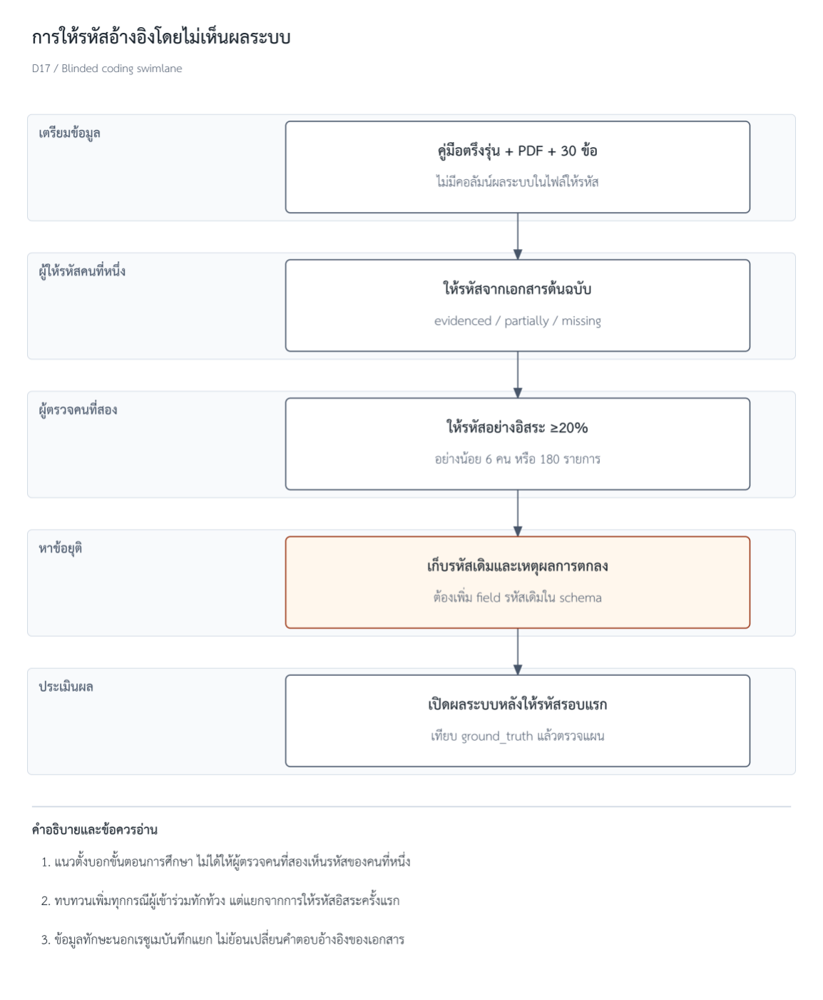

*รูปที่ 3.14  การจัดทำคำตอบอ้างอิงแบบไม่เห็นผลระบบ*

### 3.8.3 การประเมินแผนการเรียนรู้

ระบบสร้างแผนจากผลวิเคราะห์จริงของผู้เข้าร่วม โดยไม่แทนช่องว่างของระบบด้วยช่องว่างอ้างอิงก่อนจัดแผน ผู้ประเมินตรวจเนื้อหาของรายการที่ระบบเลือกเทียบกับช่องว่างอ้างอิง และตรวจรหัส ชื่อ ผู้ให้บริการ ลิงก์ต้นทาง ชั่วโมง และลำดับที่เสนอ เมื่อพบคำแนะนำที่ไม่เหมาะสม ผู้ประเมินจำแนกสาเหตุเป็นสี่ประเภท คือการระบุช่องว่างผิด การเชื่อมโยงรายการกับข้อกำหนดผิด ข้อมูลของรายการผิด และข้อจำกัดของคลัง การจำแนกนี้ทำให้ระบุได้ว่าต้องแก้ที่ขั้นตอนใด

## 3.9 ตัวชี้วัดและการวิเคราะห์ข้อมูล

### 3.9.1 แบบแผนการประเมิน

การประเมินแบ่งเป็นสองส่วนที่เชื่อมต่อกัน ส่วนแรกตรวจความถูกต้องของสถานะผลการตรวจหลักฐานโดยเปรียบเทียบผลของระบบกับชุดคำตอบอ้างอิง ส่วนที่สองตรวจความเหมาะสมของแผนที่ระบบสร้างจากผลวิเคราะห์จริง ทั้งสองส่วนใช้ผลจากรอบการวิเคราะห์ชุดเดียวกัน จึงเชื่อมโยงข้อผิดพลาดของแผนกลับไปยังขั้นวิเคราะห์หลักฐานได้

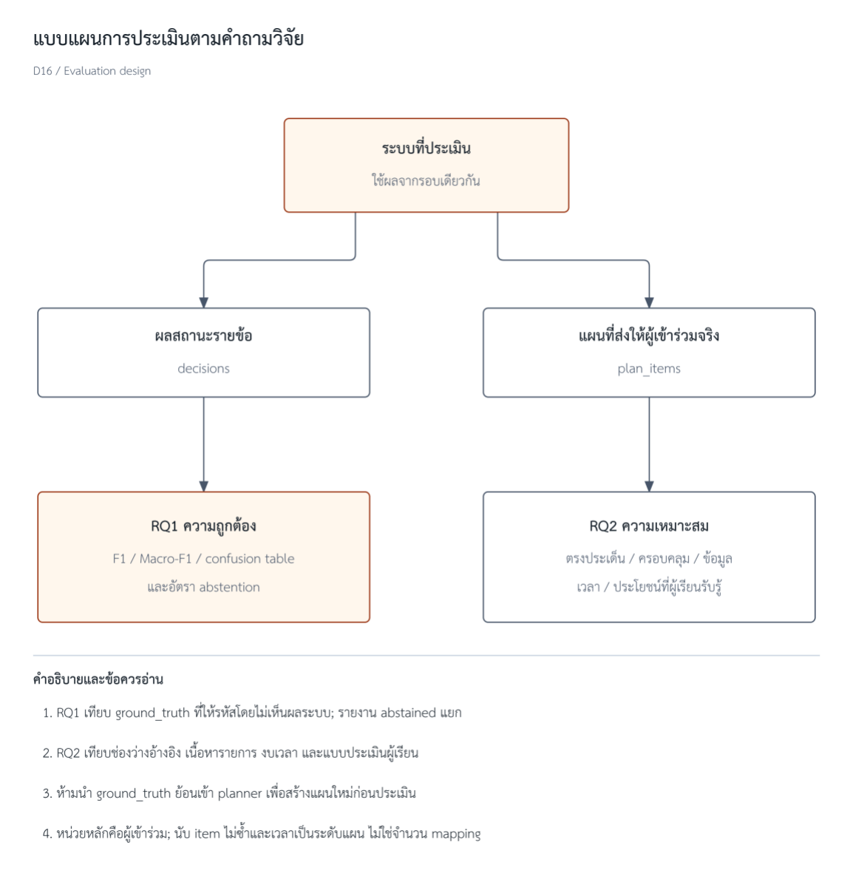

*รูปที่ 3.15  แบบแผนการประเมินตามคำถามการวิจัย*

แบบแผนนี้กำหนดการแยกการตรวจความถูกต้องของสถานะผลการตรวจหลักฐานออกจากการตรวจความเหมาะสมของแผนการเรียนรู้ โดยทั้งสองส่วนใช้ผลจากระบบชุดเดียวกัน

### 3.9.2 นิยามตัวชี้วัด

**ตารางที่ 3.27  ตัวชี้วัดของคำถามการวิจัยทั้งสองข้อ**

| ตัวชี้วัด | วิธีคำนวณหรือเกณฑ์ตรวจ | การใช้ตอบคำถาม |
|---|---|---|
| Macro-F1 ของสามสถานะ | คำนวณค่า F1 แยกสำหรับ evidenced, partially และ missing บนข้อกำหนดที่ระบบสรุปได้ แล้วเฉลี่ยโดยให้น้ำหนักแต่ละสถานะเท่ากัน | ตัวชี้วัดหลักของคำถามที่ 1 |
| อัตราการไม่สรุป | จำนวนข้อกำหนดที่ได้สถานะ abstained หารด้วยจำนวนข้อกำหนดทั้งหมดที่ส่งเข้าวิเคราะห์ | รายงานคู่กับ Macro-F1 เพื่อแสดงขอบเขตที่ระบบตัดสินได้ |
| ตารางสถานะอ้างอิงเทียบผลระบบ ตารางสามแถวของสถานะอ้างอิง | เทียบสี่คอลัมน์ของผลระบบ แสดงจำนวนดิบ | อธิบายรูปแบบข้อผิดพลาดของคำถามที่ 1 |
| อัตราข้อสรุปที่ไม่ผ่านเกณฑ์ตรวจหลักฐาน | ตามสมการที่ 3.6 รายงานทั้งระดับรวมและระดับรายโมเดล | ตัวชี้วัดควบคุมคุณภาพ ไม่ใช้เปรียบเทียบโมเดล |
| ความตรงประเด็นของคำแนะนำ | จำนวนรายการเรียนรู้ไม่ซ้ำในแผนที่เนื้อหาครอบคลุมช่องว่างอ้างอิงอย่างน้อยหนึ่งข้อ หารด้วยจำนวนรายการไม่ซ้ำในแผนนั้น | ตัวชี้วัดของคำถามที่ 2 |
| ความครอบคลุมช่องว่าง | จำนวนช่องว่างอ้างอิงที่มีรายการในแผนซึ่งส่งให้ผู้เรียนรองรับ หารด้วยจำนวนช่องว่างอ้างอิงทั้งหมดของผู้เรียนคนนั้น | ตัวชี้วัดของคำถามที่ 2 ถ้าไม่มีช่องว่างอ้างอิงให้รายงาน N/A |
| ความถูกต้องของข้อมูลรายการ | สัดส่วนรายการไม่ซ้ำในแผนที่รหัส ชื่อ ผู้ให้บริการ ลิงก์ต้นทาง และสถานะตรงกับข้อมูลในคลัง | ตัวชี้วัดของคำถามที่ 2 |
| ความเป็นไปได้ด้านเวลา | จำนวนแผนที่ชั่วโมงรวมไม่เกินจำนวนชั่วโมงเรียนสูงสุดของผู้เรียน หารด้วยจำนวนแผนทั้งหมด นับหนึ่งแผนต่อผู้เข้าร่วมหนึ่งคน | ตัวชี้วัดของคำถามที่ 2 |
| ประโยชน์ที่ผู้เรียนเห็นว่าได้รับ | ค่าเฉลี่ยและส่วนเบี่ยงเบนมาตรฐานรายข้อของคำถาม 3 ข้อ พร้อมจำนวนผู้ตอบจริงของแต่ละข้อ และสรุปประเด็นจากคำถามปลายเปิด | หลักฐานจากผู้ใช้สำหรับคำถามที่ 2 |

ความตรงประเด็นนับรายการที่ไม่ซ้ำกัน เพราะหนึ่งรายการอาจเชื่อมโยงกับข้อกำหนดหลายข้อและปรากฏหลายแถวในตารางผลการตรวจ รายการที่ครอบคลุมช่องว่างอ้างอิงบางข้อแต่ไม่ตรงกับช่องว่างอื่นที่อ้างว่าครอบคลุม ถือว่าตรงประเด็นเมื่อครอบคลุมช่องว่างอ้างอิงอย่างน้อยหนึ่งข้อ และบันทึกจำนวนความเชื่อมโยงที่ไม่ตรงไว้แยกเป็นข้อมูลวิเคราะห์สาเหตุ ความครอบคลุมช่องว่างนับจากช่องว่างอ้างอิงของผู้เรียนคนนั้นเป็นตัวหาร ไม่ใช้จำนวนรายการในคลังเป็นตัวหาร เพราะการนับแบบหลังเป็นการวัดความครอบคลุมของคลัง ไม่ใช่ของแผน

กรณีพิเศษที่ต้องแยกรายงานมีห้ากรณี กรณีแรกคือแผนว่างเพราะผู้เข้าร่วมไม่มีช่องว่าง กรณีที่สองคือแผนว่างเพราะไม่มีรายการในคลังที่ตรงเกณฑ์ กรณีที่สามคือไม่ทราบจำนวนชั่วโมงที่ผู้เรียนจัดสรรได้ กรณีที่สี่คือระบบส่งรายงานไม่สำเร็จ และกรณีที่ห้าคือผู้เข้าร่วมไม่ตอบแบบประเมิน ทั้งห้ากรณีนี้รายงานเป็นจำนวนแยกจากกัน และแผนว่างที่มีชั่วโมงรวมเป็นศูนย์ไม่ถูกนับเป็นหลักฐานว่าแผนมีคุณภาพด้านเวลา

### 3.9.3 การคำนวณ Macro-F1 และการจัดการสถานะ abstained

ค่า F1 ของสถานะหนึ่งคำนวณจากค่าความแม่น (precision) และค่าความระลึก (recall) ของสถานะนั้นตามนิยามปกติ คือ F1 เท่ากับสองเท่าของผลคูณหารด้วยผลบวกของสองค่านั้น ค่าหลักของคำถามที่ 1 คำนวณบนข้อกำหนดที่ระบบสรุปได้เท่านั้น และรายงานคู่กับอัตราการไม่สรุปเสมอ เพื่อไม่ให้ค่าความถูกต้องดูสูงขึ้นจากการที่ระบบเลือกไม่ตัดสินข้อที่ยาก นอกจากค่าหลัก การศึกษารายงานค่าประกอบอีกหนึ่งค่าที่คำนวณบนข้อกำหนดทุกข้อ โดยนับข้อที่ระบบให้สถานะ abstained เป็นการระบุผิดของสถานะอ้างอิงนั้น ค่าประกอบนี้แสดงผลในกรณีที่ต้องการตัวเลขเดียวที่ครอบคลุมทุกข้อ การนับดังกล่าวไม่ถือ abstained เป็นสถานะอ้างอิงที่สี่และไม่นำไปเฉลี่ยเป็นสถานะหนึ่งของ Macro-F1

ตารางสถานะอ้างอิงเทียบผลระบบมีสามแถวและสี่คอลัมน์ เพื่อให้เห็นจำนวนข้อที่ระบบไม่สรุปในแต่ละสถานะอ้างอิงด้วย การเลือกวิธีคำนวณทั้งสองแบบและนโยบายการนับ abstained กำหนดไว้ในเอกสารแผนวิเคราะห์ที่ลงวันที่ก่อนเริ่มเก็บข้อมูลกลุ่มหลัก

นโยบายกรณีตัวหารเป็นศูนย์กำหนดเป็นรายกรณี ถ้าสถานะหนึ่งไม่มีรายการในชุดคำตอบอ้างอิงเลย ค่า recall ของสถานะนั้นไม่นิยาม รายงานเป็น N/A และไม่นำสถานะนั้นเข้าเฉลี่ย ถ้าระบบไม่เคยให้สถานะหนึ่งเลยแต่สถานะนั้นมีรายการในคำตอบอ้างอิง ค่า precision ไม่นิยาม กรณีนี้กำหนดให้ F1 ของสถานะนั้นเท่ากับ 0 เพราะระบบไม่สามารถระบุสถานะที่มีอยู่จริงได้ การรายงานต้องระบุจำนวนสถานะที่นำมาเฉลี่ยทุกครั้ง เพื่อให้ผู้อ่านทราบว่าค่า Macro-F1 คำนวณจากสองหรือสามสถานะ

### 3.9.4 การวิเคราะห์ข้อมูล

คำถามที่ 1 รายงานค่า F1 ค่าความแม่น และค่าความระลึกรายสถานะ ค่า Macro-F1 ตารางสถานะอ้างอิงเทียบผลระบบ และอัตราการไม่สรุป โดยแยกสองระดับที่ต้องเรียกชื่อให้ต่างกัน ระดับแรกคือค่าที่คำนวณจากข้อมูลรวมของทุกผู้เข้าร่วม เรียกว่า Macro-F1 จากข้อมูลรวม ระดับที่สองคือค่าเฉลี่ยของ Macro-F1 รายผู้เข้าร่วม การศึกษานี้กำหนดให้ค่าหลักคือค่าเฉลี่ยรายผู้เข้าร่วม เพราะหน่วยสรุปผลหลักคือผู้เข้าร่วมหนึ่งคนตามหัวข้อ 3.2.2 และรายงานค่าจากข้อมูลรวมไว้เป็นข้อมูลประกอบ

ช่วงความไม่แน่นอนคำนวณด้วยวิธีสุ่มซ้ำแบบ bootstrap ที่ระดับผู้เข้าร่วม คือสุ่มผู้เข้าร่วมแบบแทนที่จำนวน 30 คนในแต่ละรอบ คำนวณค่าสนใจใหม่ และรายงานช่วงเปอร์เซ็นไทล์ที่ 2.5 ถึง 97.5 จากการสุ่มซ้ำ 2,000 รอบ การสุ่มที่ระดับผู้เข้าร่วมจำเป็นเพราะรายการข้อกำหนดภายในเรซูเมฉบับเดียวกันไม่เป็นอิสระต่อกัน จึงไม่ถือรายการตรวจ 900 รายการเป็นหน่วยอิสระ 900 หน่วย

คำถามที่ 2 รายงานสัดส่วนความตรงประเด็น ความครอบคลุมช่องว่าง ความถูกต้องของข้อมูลรายการ และความเป็นไปได้ด้านเวลา พร้อมจำนวนดิบของตัวเศษและตัวหารของทุกค่า ค่าเฉลี่ยและส่วนเบี่ยงเบนมาตรฐานของคำถามการรับรู้รายงานแยกรายข้อพร้อมจำนวนผู้ตอบจริง ไม่รวมคำถามสามข้อเป็นคะแนนเดียว ไม่เติมค่าให้ผู้ที่ไม่ได้ตอบ และไม่รวมตัวชี้วัดต่างชนิดเป็นคะแนนรวม เพราะคะแนนการรับรู้ที่สูงไม่ควรชดเชยคำแนะนำที่ไม่ตรงประเด็นหรือแผนที่เกินเวลา ประเด็นจากคำถามปลายเปิดสรุปเป็นกลุ่มประเด็นและรายงานจำนวนผู้ที่กล่าวถึงแต่ละประเด็น

ข้อมูลรายโมเดลและจำนวนข้อสรุปที่ถูกปฏิเสธใช้สำหรับการตรวจสอบย้อนหลังและอธิบายข้อผิดพลาด ไม่ใช้ตั้งสมมติฐานว่าการใช้ 3 โมเดลดีกว่าโมเดลเดี่ยว จำนวนตัวอย่างรายอาชีพรายงานเป็นข้อมูลประกอบ และไม่ทดสอบความแตกต่างระหว่าง 20 อาชีพ ตารางที่ 3.28 สรุปความเชื่อมโยงระหว่างคำถามการวิจัย ข้อมูลที่ใช้ และตัวชี้วัด

**ตารางที่ 3.28  ความเชื่อมโยงระหว่างคำถามการวิจัย ข้อมูล และตัวชี้วัด**

| คำถาม | ผลที่ประเมิน | ข้อมูลอ้างอิง | ตัวชี้วัดที่รายงาน |
|---|---|---|---|
| คำถามที่ 1 | สถานะสุดท้ายของข้อกำหนดอ้างอิงแต่ละข้อ | ชุดคำตอบอ้างอิงที่ให้รหัสจากเอกสารตามคู่มือ | ค่า F1 รายสถานะ ค่า Macro-F1 ตารางสถานะอ้างอิงเทียบผลระบบ และอัตราการไม่สรุป |
| คำถามที่ 2 ส่วนข้อมูล | รายการเรียนรู้และแผนที่ส่งให้ผู้เข้าร่วมจริง | ช่องว่างอ้างอิง เนื้อหาของรายการ และชั่วโมงที่ผู้เรียนระบุ | ความตรงประเด็น ความครอบคลุมช่องว่าง ความถูกต้องของข้อมูลรายการ และความเป็นไปได้ด้านเวลา |
| คำถามที่ 2 ส่วนผู้เรียน | การรับรู้ประโยชน์หลังอ่านรายงาน | คำตอบแบบประเมินและคำถามปลายเปิด | การกระจายคะแนนรายข้อ จำนวนผู้ตอบ และประเด็นจากข้อเสนอแนะ |

## 3.10 จริยธรรมและการจัดการข้อมูล

การเก็บข้อมูลของผู้เข้าร่วมเริ่มได้หลังได้รับการรับรองจริยธรรมการวิจัยในมนุษย์ของสถาบันเท่านั้น ณ วันที่จัดทำเอกสารฉบับนี้ โครงการยังไม่ได้รับหนังสือรับรอง ชุดทดสอบสังเคราะห์ใช้ตรวจระบบระหว่างการพัฒนาได้ก่อน เพราะไม่มีข้อมูลของบุคคลจริง แต่ไม่นำมาแทนผลการประเมินกับผู้เข้าร่วมตามคำถามการวิจัย

ความยินยอม แบบฟอร์มมีคำถามความยินยอมเป็นข้อบังคับ ระบบตรวจค่านี้ก่อนเริ่มประมวลผล คำตอบที่ไม่ให้ความยินยอมถูกปฏิเสธตั้งแต่ขั้นตรวจข้อมูลเข้า คำชี้แจงที่หัวแบบฟอร์มระบุว่าเก็บข้อมูลอะไร ใช้ทำอะไร ส่งผลกลับอย่างไร ใครเข้าถึงข้อมูลได้ และผู้เข้าร่วมถอนตัวได้อย่างไร

เส้นทางของข้อมูลและการปิดบังข้อมูลระบุตัว ข้อมูลของผู้เข้าร่วมออกจากบัญชีของผู้วิจัยไปยังผู้รับสามกลุ่ม กลุ่มแรกคือบริการอ่านข้อความจากเอกสาร ซึ่งได้รับไฟล์ PDF ต้นฉบับทั้งไฟล์ กลุ่มที่สองคือผู้ให้บริการโมเดลทั้งสามราย ซึ่งได้รับข้อความหลังการปิดบังตามหัวข้อ 3.5.1 และกลุ่มที่สามคือผู้เข้าร่วมเอง ซึ่งได้รับรายงานของตนทางอีเมล ระบบปิดบังข้อมูลที่ตรวจพบตามรูปแบบที่กำหนดสี่ชุดก่อนส่งข้อความให้โมเดล และบันทึกจำนวนจุดที่ปิดบังไว้ในฐานข้อมูล

ข้อจำกัดที่ต้องระบุคือข้อมูลระบุตัวที่ไม่ตรงรูปแบบยังอาจคงอยู่ เช่น ชื่อบุคคล ที่อยู่ ชื่อบริษัท และชื่อสถาบันการศึกษา ไฟล์ที่ส่งให้บริการอ่านข้อความยังไม่ผ่านการปิดบัง เพราะการปิดบังเกิดขึ้นหลังได้ข้อความแล้ว การจัดทำคำชี้แจงผู้เข้าร่วมต้องระบุเส้นทางทั้งสามนี้ตามจริง

ชื่อบริษัทและชื่อสถาบันการศึกษาถูกคงไว้ในข้อความเพื่อเป็นบริบทของประโยค ทั้งนี้ prompt กำหนดห้ามอนุมานทักษะจากชื่อบริษัท ดังนั้นเอกสารนี้ไม่ถือว่าชื่อบริษัทเป็นหลักฐานยืนยันทักษะโดยตัวมันเอง หากการพิจารณาด้านจริยธรรมกำหนดให้ปิดบังข้อมูลเพิ่ม ระบบต้องปรับรูปแบบการปิดบังและรายงานผลกระทบต่อการตัดสินข้อกำหนดที่เกี่ยวข้อง

การส่งข้อมูลออกนอกระบบ การส่งรายงานทางอีเมลเป็นการส่งข้อมูลส่วนบุคคลออกไป ระบบจึงส่งไปยังอีเมลที่ผู้ให้บริการยืนยันตัวตนแล้วเท่านั้น ไม่ใช่อีเมลที่ผู้ใช้พิมพ์ในช่องข้อความ และส่งทีละฉบับต่อหนึ่งคน โดยไม่ส่งแบบหลายผู้รับในฉบับเดียว

การเก็บและการลบ ไฟล์ที่ผู้ใช้อัปโหลดอยู่ในโฟลเดอร์ของแบบฟอร์มบน Google Drive ผลวิเคราะห์อยู่ในสเปรดชีต และไฟล์รายงานอยู่ในโฟลเดอร์รายงาน ทั้งหมดอยู่ในบัญชีของผู้วิจัยและแชร์ให้บัญชีที่ใช้ประมวลผลเท่านั้น ไม่เปิดการเข้าถึงแบบสาธารณะ ระยะเวลาเก็บที่กำหนดไว้คือ 90 วันหลังส่งผล จากนั้นลบทั้งไฟล์และแถวข้อมูลที่ระบุตัวบุคคล ขั้นตอนการลบดำเนินการด้วยการลบไฟล์ในโฟลเดอร์ที่เกี่ยวข้องและลบแถวในแท็บที่มีอีเมลและรหัสไฟล์ อีเมลที่ส่งให้ผู้ใช้ระบุช่องทางขอให้ลบข้อมูลก่อนกำหนด ข้อมูลที่อยู่ในระบบของผู้ให้บริการภายนอกเป็นไปตามนโยบายของผู้ให้บริการนั้น ซึ่งต้องระบุในคำชี้แจงผู้เข้าร่วม

ฐานทางกฎหมาย การประมวลผลข้อมูลส่วนบุคคลของผู้เข้าร่วมอยู่ภายใต้พระราชบัญญัติคุ้มครองข้อมูลส่วนบุคคล พ.ศ. 2562 [21] การศึกษาใช้ความยินยอมโดยชัดแจ้งของผู้เข้าร่วมเป็นฐานในการเก็บรวบรวมและใช้ข้อมูลตามมาตรา 19 คำชี้แจงที่หัวแบบฟอร์มและเอกสารชี้แจงผู้เข้าร่วมแจ้งวัตถุประสงค์ ข้อมูลที่เก็บ ระยะเวลาเก็บ ผู้รับข้อมูล และสิทธิของเจ้าของข้อมูลก่อนเก็บตามมาตรา 23 การส่งไฟล์ให้บริการอ่านข้อความและการส่งข้อความหลังปิดบังให้ผู้ให้บริการโมเดลซึ่งอาจประมวลผลนอกประเทศไทยเป็นการส่งข้อมูลไปต่างประเทศตามมาตรา 28 เอกสารชี้แจงจึงระบุชื่อผู้ให้บริการทั้งสี่ราย และแจ้งว่าประเทศปลายทางอาจมีมาตรฐานการคุ้มครองข้อมูลต่างจากประเทศไทยก่อนขอความยินยอม หากพบการละเมิดข้อมูล ผู้วิจัยต้องแจ้งอาจารย์ที่ปรึกษาและคณะกรรมการจริยธรรมทันที และประเมินหน้าที่แจ้งเหตุตามมาตรา 37 (4) ภายใน 72 ชั่วโมง การตีความข้อกฎหมายในหัวข้อนี้ต้องผ่านการพิจารณาของคณะกรรมการจริยธรรมการวิจัยในมนุษย์ของสถาบัน

ขอบเขตการใช้ผล ระบบไม่ตัดสินใจแทนผู้ใช้และไม่ให้คะแนนผู้สมัครเพื่อการคัดเลือก ผลทั้งหมดเสนอต่อเจ้าของเรซูเมเพื่อวางแผนการเรียนรู้ของตนเอง รายงานทุกฉบับระบุข้อจำกัดว่าผลนี้อ่านจากข้อความในเอกสารเท่านั้น และผู้เข้าร่วมถอนตัวหรือขอลบข้อมูลก่อนครบกำหนดได้ตามช่องทางที่แจ้งไว้

## 3.11 ข้อจำกัดของวิธีดำเนินการ

การใช้กฎตรวจข้อความแทนการให้โมเดลตัดสิน แลกความสามารถในการเข้าใจการถอดความกับความสามารถในการตรวจซ้ำและอธิบายเหตุผล ผู้เข้าร่วมที่เขียนถึงงานเดียวกันด้วยคำที่ไม่อยู่ในรายการคำพ้องและมีคำร่วมกับข้อกำหนดน้อย อาจถูกจัดเป็นไม่พบหลักฐานตามเกณฑ์ของระบบ ทั้งนี้ผลสุดท้ายยังขึ้นกับคะแนนจากคำที่ปรากฏร่วมกันและการรวมเสียงของทั้งสามโมเดล ข้อจำกัดนี้ลดได้ด้วยการขยายรายการคำพ้อง ซึ่งต้องทำบนชุดข้อมูลที่ใช้ปรับค่าและรายงานผลกระทบ ไม่ใช่ปรับระหว่างเก็บข้อมูลกลุ่มหลัก

การกำหนดให้ต้องมีสองเสียงตรงกันทำให้สัดส่วนของข้อที่ระบบไม่สรุปสูงขึ้นเมื่อโมเดลเห็นต่างกันมาก ควรรายงานอัตราการไม่สรุปเพื่อแสดงขอบเขตที่ระบบยังตัดสินไม่ได้ และเพื่อให้ผู้อ่านทราบว่าค่าความถูกต้องคำนวณจากข้อจำนวนเท่าใด

การเลือกคำแนะนำจากคลังที่กำหนดไว้ล่วงหน้าทำให้คุณภาพของแผนขึ้นกับความครอบคลุมของคลังโดยตรง ข้อมูลในหัวข้อ 3.3.2 แสดงว่าข้อกำหนดที่มีรายการรองรับมี {{req_covered}} ข้อจาก 600 ข้อ ค่าความครอบคลุมช่องว่างจึงมีเพดานที่ต่ำกว่า 1 สำหรับผู้เรียนที่มีช่องว่างในข้อที่คลังไม่รองรับ ข้อจำกัดที่ใหญ่กว่าคือเวลาที่ผู้เรียนจัดสรรได้ การจำลองกรณีแย่ที่สุดซึ่งถือว่าทั้ง 30 ข้อของทุกอาชีพเป็นช่องว่างพบว่าที่กรอบ 6 เดือนและ 10 ชั่วโมงต่อสัปดาห์ แผนครอบคลุมช่องว่างได้ {{sim_both_6m10h}} จาก 600 ข้อ และที่ 5 ชั่วโมงต่อสัปดาห์ครอบคลุมได้ {{sim_both_6m5h}} ข้อ ส่วนผู้ที่เลือกรับเฉพาะใบรับรองจะได้แผนที่ครอบคลุมน้อยกว่าโหมดอื่นอย่างเป็นระบบ คือ {{sim_cert_6m10h}} จาก 600 ข้อที่กรอบเดียวกัน เพราะใบรับรองในคลังมี {{corpus_certs}} รายการและใช้เวลาเฉลี่ย {{cert_hours_mean}} ชั่วโมง เทียบกับหลักสูตรที่ใช้เวลาเฉลี่ย {{course_hours_mean}} ชั่วโมง ข้อจำกัดนี้เกิดจากธรรมชาติของประเภทรายการ ไม่ใช่ความผิดพลาดของระบบ และต้องรายงานคู่กับจำนวนผู้เข้าร่วมที่เลือกแต่ละโหมด ระบบรายงานช่องว่างที่ไม่เข้าแผนแยกสองเหตุผล คือไม่มีรายการรองรับในคลัง และมีรายการรองรับแต่เกินเวลาที่จัดสรรได้ นอกจากนี้สถานะ source_checked_by_script เป็นผลการตรวจความสอดคล้องของข้อมูล ไม่ใช่การรับรองความเหมาะสมของเนื้อหา การประเมินจึงต้องตรวจเนื้อหาของรายการที่ระบบเลือกแยกจากการตรวจโครงสร้าง

ชั่วโมงประมาณการของรายการในคลังบันทึกไว้ว่าเป็นค่าประมาณสำหรับวางแผน ไม่ใช่ค่าที่ผู้ให้บริการรับรอง ค่าความเป็นไปได้ด้านเวลาจึงเป็นการตรวจว่าแผนอยู่ภายในเงื่อนไขที่ประกาศไว้ ไม่ใช่การยืนยันว่าผู้เรียนจะใช้เวลาเท่านั้นจริง

ค่าแฮชของข้อความยืนยันได้ว่าข้อความสองชุดตรงกันหรือไม่ แต่ใช้สร้างข้อความกลับมาไม่ได้ ระบบจึงเก็บข้อความฉบับที่ส่งให้โมเดลหลังการปิดบังข้อมูลระบุตัวเป็นไฟล์ในโฟลเดอร์ของผู้วิจัยบน Google Drive และบันทึกรหัสไฟล์ไว้ในคอลัมน์ masked_text_file_id ของแท็บ ocr_results ผู้ให้รหัสและผู้ตรวจจึงเทียบตำแหน่งตัวอักษรที่รายงานกับข้อความเต็มได้ ไฟล์นี้อยู่ภายใต้ระยะเวลาเก็บและขั้นตอนการลบเดียวกับข้อมูลอื่นตามหัวข้อ 3.10

การใช้โมเดล 3 โมเดลช่วยลดการพึ่งพาคำตอบจากแหล่งเดียวและทำให้ระบบงดสรุปเมื่อเสียงไม่พอ แต่การศึกษานี้ไม่มีเงื่อนไขเปรียบเทียบกับระบบโมเดลเดี่ยว จึงสรุปได้เพียงว่ากลไกดังกล่าวเป็นส่วนหนึ่งของระบบที่ประเมิน และไม่อ้างเชิงสาเหตุว่าการใช้สามโมเดลลดความคลาดเคลื่อนของข้อมูลได้มากกว่าวิธีอื่นเพียงใด

ผู้เข้าร่วมเลือกอาชีพได้ 20 อาชีพ แต่จำนวนตัวอย่างรวมมี 30 คน จึงไม่เพียงพอสำหรับเปรียบเทียบผลรายอาชีพ ผลหลักรายงานที่ระดับระบบและแสดงจำนวนผู้เลือกแต่ละอาชีพเพื่อให้ผู้อ่านเห็นขอบเขตของข้อมูล

สุดท้าย เอกสารฉบับนี้ครอบคลุมบทที่ 1 ถึงบทที่ 3 ผลของการประเมินกับผู้เข้าร่วมจึงยังเป็นแผน ตัวเลขที่รายงานในภาคผนวก ค มาจากผลตอบกลับสังเคราะห์ในชุดทดสอบ ไม่ใช่ผลจากการเรียกบริการจริงและไม่ใช่ผลจากผู้เข้าร่วม
