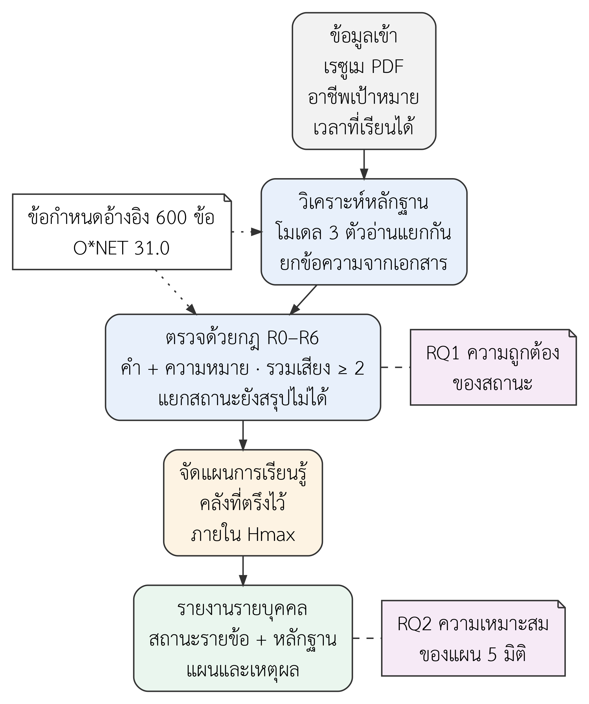

# บทที่ 2 เอกสารและงานวิจัยที่เกี่ยวข้อง

บทนี้ทบทวนแนวคิดที่ใช้ออกแบบงาน เรียงตามลำดับที่ข้อมูลไหลผ่านระบบ คือ เรซูเม การอ่านเอกสาร การให้โมเดลวิเคราะห์ การรวมผลหลายโมเดล ข้อกำหนดอ้างอิงของอาชีพ และการแนะนำรายการเรียนรู้ ท้ายบทสังเคราะห์ว่างานนี้ต่างจากงานเดิมตรงไหน และสรุปเป็นกรอบแนวคิด

## 2.1 ข้อมูลในเรซูเมกับการวางแผนพัฒนาทักษะ

เรซูเมถูกใช้ในสองบริบทที่มีผู้ใช้ผลต่างกัน บริบทแรกคือการคัดเลือกบุคลากร องค์กรเป็นผู้ใช้ผล และเป้าหมายคือจัดอันดับผู้สมัคร บริบทที่สองคือการแนะนำเจ้าของเรซูเมเอง ผู้เรียนเป็นผู้ใช้ผล และเป้าหมายคือรู้ว่าควรพัฒนาอะไร งานนี้อยู่ในบริบทที่สอง ผลจึงส่งให้เจ้าของเรซูเมเท่านั้น และไม่ใช้เทียบระหว่างบุคคล

งานที่ประเมินโมเดลกับเรซูเมให้ข้อมูลที่ใช้ได้กับทั้งสองบริบท Vaishampayan และคณะ [@vaishampayan2025] ให้ GPT-4 ประเมินความเหมาะสมของเรซูเม 736 ฉบับกับตำแหน่งงาน แล้วเทียบกับผู้ประเมินที่เป็นคน พบความสัมพันธ์ระดับต่ำ ส่วน de Quadros และคณะ [@dequadros2025] เทียบโมเดลหกตัวในการสกัดข้อมูลจากเรซูเมภาษาโปรตุเกส ทั้งแบบไม่ให้ตัวอย่างและแบบให้ตัวอย่างหนึ่งรายการ พบว่าโมเดลแต่ละตัวให้ผลต่างกัน

ทั้งสองงานรายงานผลเป็นคะแนนรวมหรือฟิลด์ที่สกัดได้ และไม่ได้ให้โมเดลชี้ว่าใช้ข้อความใดตัดสิน ผู้ใช้จึงตรวจผลรายข้อไม่ได้ งานนี้ตั้งโจทย์ตรงจุดนี้ คือทุกข้อสรุปต้องผูกกับข้อความในเรซูเมที่ผู้ใช้เปิดดูได้

## 2.2 การอ่านเอกสารและการปิดบังข้อมูล

เรซูเมที่ผู้เรียนส่งมีสองแบบ แบบแรกเป็น PDF ที่สร้างจากโปรแกรมพิมพ์เอกสารและมีชั้นข้อความ ระบบดึงข้อความได้ตรง ๆ แบบที่สองเป็นไฟล์สแกนที่มีแต่ภาพ ต้องใช้การรู้จำอักขระด้วยแสง (Optical Character Recognition, OCR) ความต่างนี้ต้องบันทึกไว้ ถ้าระบบอ่านจากชั้นข้อความแต่รายงานว่าใช้ OCR ผู้อ่านจะเข้าใจผิดว่าระบบผ่านการทดสอบกับไฟล์สแกนแล้ว

Tesseract เป็นเครื่องมือ OCR แบบโอเพนซอร์สที่ยังใช้เป็นฐานเทียบในงานรุ่นหลัง [@smith2007] ส่วน Google Document AI มีตัวประมวลผลเฉพาะงาน OCR ที่คืนข้อความพร้อมตำแหน่งในหน้า [@docai] งานนี้ใช้ชั้นข้อความก่อนเมื่อไฟล์มี เพราะได้ข้อความตรงต้นฉบับโดยไม่ส่งไฟล์ออกไปภายนอก และใช้ Document AI เฉพาะไฟล์ที่ไม่มีชั้นข้อความ ระบบบันทึกชื่อบริการที่ใช้จริงทุกงาน

ข้อความในเรซูเมมีข้อมูลส่วนบุคคล เช่น อีเมลและหมายเลขโทรศัพท์ ซึ่งไม่จำเป็นต่อการตัดสินทักษะ การปิดบังข้อมูลก่อนส่งให้โมเดลลดข้อมูลที่ออกไปนอกระบบโดยไม่กระทบการวิเคราะห์ การปิดบังด้วยรูปแบบค้นหาข้อความทำซ้ำได้และตรวจได้ แต่จับได้เฉพาะข้อมูลที่มีรูปแบบชัด ชื่อบุคคลและชื่อองค์กรจึงยังหลุดได้ ข้อจำกัดนี้ต้องแจ้งผู้เข้าร่วมตามหลักของพระราชบัญญัติคุ้มครองข้อมูลส่วนบุคคล [@pdpa2562]

## 2.3 LLM กับปัญหาหลักฐาน

Ji และคณะ [@ji2023] รวบรวมงานเรื่องข้อความจากโมเดลที่ดูสมเหตุสมผลแต่ขัดหรือเกินจากแหล่งข้อมูล และแยกความคลาดเคลื่อนที่ขัดกับแหล่งข้อมูลออกจากความคลาดเคลื่อนที่ตรวจกับแหล่งข้อมูลไม่ได้ งานนี้ใช้แนวคิดดังกล่าวตั้งนิยามความคลาดเคลื่อนของข้อมูล แต่จำกัดให้วัดได้ด้วยกฎ ได้แก่ข้อสรุปซึ่งหาข้อความอ้างอิงในเอกสารไม่พบ หรือพบแต่ไม่เกี่ยวข้องกับข้อกำหนดอ้างอิง

การวัดว่าข้อความมีแหล่งรองรับหรือไม่มีหลายแนวทาง Rashkin และคณะ [@rashkin2023] เสนอกรอบ AIS ที่ให้คนตัดสินว่าข้อความที่ระบบสร้างอ้างอิงได้จากแหล่งที่ระบุหรือไม่ Min และคณะ [@min2023] เสนอ FActScore ที่แตกข้อความยาวเป็นข้อเท็จจริงย่อยแล้วตรวจทีละข้อกับฐานความรู้ ส่วน Gao และคณะ [@gao2023] เสนอ RARR ซึ่งให้โมเดลสร้างคำตอบก่อน จากนั้นค้นแหล่งข้อมูลมายืนยันและปรับคำตอบส่วนที่ขัดกับแหล่งข้อมูล

สามแนวทางนี้มีจุดร่วมคือแยกการสร้างข้อสรุปออกจากการตรวจข้อสรุป งานนี้ใช้หลักเดียวกันในรูปที่แคบลง โมเดลต้องคัดลอกข้อความจากเรซูเมมาตรงตัว จากนั้นโปรแกรมค้นข้อความนั้นในเอกสารและนับคำที่ตรงกับข้อกำหนดอ้างอิง การตรวจแบบนี้ไม่เสียค่าเรียกโมเดลรอบที่สอง และข้อมูลเข้าชุดเดิมได้ผลเดิมเสมอ

สิ่งที่ต้องแลกคือ การตรวจที่ระดับตัวอักษรบอกได้แค่ว่าข้อความผ่านเกณฑ์ ไม่ได้ยืนยันว่าโมเดลตีความถูก ข้อความที่มีคำตรงกันอาจถูกใช้ผิดบริบท และข้อความที่ถอดความดีอาจถูกปฏิเสธ ความถูกต้องของสถานะสุดท้ายจึงต้องวัดกับชุดคำตอบอ้างอิงที่คนให้รหัสแยกจากผลของระบบ

## 2.4 การรวมผลจากหลายโมเดล

Wang และคณะ [@wang2023] พบว่าเมื่อให้โมเดลเดียวให้เหตุผลซ้ำหลายรอบแบบสุ่ม แล้วใช้คำตอบที่ซ้ำกันมากที่สุด แม่นกว่าการเลือกคำตอบเดียวที่มีความน่าจะเป็นสูงสุดในงานให้เหตุผล ผลนี้สนับสนุนแนวคิดว่าการดูคำตอบหลายชุดลดการพึ่งคำตอบเดียว แต่ไม่ได้พิสูจน์ว่าสามโมเดลจากสามผู้ให้บริการดีกว่าวิธีอื่นในงานของเรา

อีกทางหนึ่งคือให้โมเดลหนึ่งตัดสินคำตอบของโมเดลอื่น Zheng และคณะ [@zheng2023] พบว่าโมเดลผู้ตัดสินเห็นตรงกับคนในระดับสูงในงานเทียบคำตอบ แต่มีความลำเอียงตามตำแหน่งของตัวเลือก และมักให้คะแนนคำตอบยาวสูงกว่า ด้วยเหตุนี้ การตัดสินในงานนี้ทำโดยกฎในโปรแกรม ไม่ใช่โมเดล เพราะกฎให้ผลเดิมทุกครั้งและบอกได้ว่าข้อสรุปหนึ่งถูกปฏิเสธเพราะอะไร

การรวมผลด้วยเสียงข้างมากต้องตัดสินใจเรื่องกรณีที่เสียงไม่พอ ถ้าบังคับเลือกคำตอบเสมอ ระบบจะเดาในกรณีที่โมเดลเห็นต่างกันมาก งานนี้เลือกให้ระบบงดสรุปแทนการเดา และรายงานอัตราการงดสรุปคู่กับความถูกต้อง

## 2.5 ข้อกำหนดอ้างอิงของอาชีพจาก O*NET

O*NET เป็นฐานข้อมูลอาชีพของกระทรวงแรงงานสหรัฐอเมริกา [@onet31] อธิบายแต่ละอาชีพด้วยองค์ประกอบหลายกลุ่ม เช่น ทักษะ ความรู้ และกิจกรรมในงาน แต่ละองค์ประกอบมีรหัสและค่าความสำคัญที่ได้จากการสำรวจ รหัสทำให้ระบบผูกผลการวิเคราะห์กลับไปหานิยามต้นทางได้ และค่าความสำคัญใช้เป็นฐานของน้ำหนัก รุ่น 31.0 เผยแพร่ภายใต้สัญญาอนุญาต CC BY 4.0 จึงนำมาใช้ต่อได้เมื่อระบุที่มา

งานนี้ไม่ใช้กลุ่ม Abilities เพราะเป็นความสามารถเชิงจิตวิทยาที่ไม่ค่อยปรากฏเป็นข้อความในเรซูเม และ O*NET อธิบายอาชีพตามบริบทของสหรัฐอเมริกา ผลการวิเคราะห์จึงใช้เป็นเกณฑ์อ้างอิงเพื่อวางแผนพัฒนาทักษะ ไม่ใช่การยืนยันว่าผู้เรียนมีคุณสมบัติตามประกาศรับสมัครงานในประเทศไทย

ฝั่งยุโรปใช้ระบบจัดหมวดหมู่ทักษะ ESCO และงานสกัดทักษะจำนวนมากตั้งโจทย์เป็นการจับข้อความกับรหัสในระบบนี้ Magron และคณะ [@magron2024] สร้างประกาศงานสังเคราะห์ที่กำหนดทักษะไว้ล่วงหน้า แล้วใช้เป็นข้อมูลฝึกและทดสอบการจับทักษะกับ ESCO แนวคิดการกำหนดเฉลยก่อนแล้วสร้างข้อความจากเฉลยเป็นแนวเดียวกับการสร้างเรซูเมสังเคราะห์ของงานนี้

## 2.6 การแนะนำรายการเรียนรู้

Li และคณะ [@li2026] สรุปงานที่ใช้กราฟความรู้แนะนำเส้นทางการเรียนรู้ และจำแนกระหว่างการจัดอันดับรายการตามความเกี่ยวข้องกับการกำหนดลำดับการเรียนตามความสัมพันธ์ของเนื้อหา งานทบทวนชี้ว่าการอธิบายเหตุผลของคำแนะนำยังเป็นจุดอ่อน งานนี้ไม่มีกราฟความสัมพันธ์ของเนื้อหาที่ครบพอจะกำหนดลำดับการเรียน จึงจัดลำดับตามความสำคัญ และบอกเหตุผลของทุกรายการด้วยตัวเลขที่ตรวจได้

การเลือกรายการภายในเวลาจำกัดให้ครอบคลุมช่องว่างมากที่สุดคือปัญหาครอบคลุมสูงสุดภายใต้งบประมาณ Khuller และคณะ [@khuller1999] แสดงว่าวิธีละโมบที่เลือกรายการตามประโยชน์ต่อหน่วยต้นทุน เมื่อใช้คู่กับการพิจารณารายการเดี่ยวที่ดีที่สุด รับประกันผลไม่ต่ำกว่าสัดส่วนคงที่ของคำตอบที่ดีที่สุด วิธีละโมบยังอธิบายผู้เรียนได้ง่ายว่าทำไมรายการหนึ่งมาก่อนอีกรายการ

ความเหมาะสมของแผนมีสองด้าน ด้านแรกตรวจได้จากข้อมูล เช่น รายการตรงกับช่องว่างหรือไม่ ครอบคลุมช่องว่างเท่าใด ข้อมูลรายการถูกต้องหรือไม่ และอยู่ในเวลาหรือไม่ อีกด้านต้องถามผู้เรียนเองว่าแผนช่วยให้รู้ว่าจะเริ่มอะไรและจัดลำดับอย่างไร งานนี้ใช้แนวคิดการรับรู้ประโยชน์ของ Davis [@davis1989] ตั้งคำถามด้านที่สอง โดยไม่ทดสอบแบบจำลองการยอมรับเทคโนโลยีทั้งแบบจำลอง

## 2.7 การสังเคราะห์และกรอบแนวคิดของการศึกษา

ตารางที่ 2.1 เทียบงานที่ทบทวนกับงานนี้ในสี่ด้านเดียวกัน คำว่า "ไม่ระบุ" หมายถึงไม่พบในส่วนที่ผู้วิจัยอ่าน ไม่ได้ยืนยันว่างานต้นทางไม่มีคุณลักษณะนั้น

**ตารางที่ 2.1** การเทียบงานที่ทบทวนกับงานนี้

| งาน | ข้อมูลที่ใช้ | หน่วยของผล | วิธีตรวจหลักฐาน | เมื่อยังตัดสินไม่ได้ |
|---|---|---|---|---|
| Vaishampayan และคณะ [@vaishampayan2025] | เรซูเมจริง 736 ฉบับ | คะแนนความเหมาะสม | ไม่ระบุ | ไม่ระบุ |
| de Quadros และคณะ [@dequadros2025] | เรซูเมภาษาโปรตุเกส | ฟิลด์ที่สกัดได้ | ไม่ระบุ | ไม่ระบุ |
| Min และคณะ [@min2023] | ข้อความยาวที่โมเดลสร้าง | ข้อเท็จจริงย่อย | ตรวจกับฐานความรู้ | ไม่ระบุ |
| Gao และคณะ [@gao2023] | ข้อความที่โมเดลสร้าง | ข้อความหลังแก้ | ค้นหลักฐานแล้วแก้ข้อความ | ไม่ระบุ |
| Magron และคณะ [@magron2024] | ประกาศงานสังเคราะห์ | คู่ประโยคกับรหัสทักษะ | เทียบกับเฉลยที่กำหนดก่อน | ไม่ระบุ |
| งานนี้ | เรซูเม PDF | สถานะรายข้อกำหนดอ้างอิง | กฎ R2 และ R3 ตรวจข้อความที่โมเดลยกมา | สถานะ abstained แยกจาก missing |

ตารางที่ 2.1 แสดงว่างานด้านเรซูเมที่ทบทวนยังไม่ผูกข้อสรุปกับข้อความรายข้อ ส่วนงานด้านการตรวจหลักฐานทำกับข้อความที่โมเดลสร้างทั่วไป ไม่ได้ทำกับการเทียบเรซูเมกับข้อกำหนดอ้างอิงของอาชีพ งานนี้นำสองด้านมาต่อกัน และเพิ่มสถานะ "ระบบยังสรุปไม่ได้" ที่งานเดิมไม่ได้แยกไว้

กรอบแนวคิดของงานสรุปไว้ในรูปที่ 2.1 ข้อมูลเข้าคือเรซูเม อาชีพเป้าหมาย และเวลาที่เรียนได้ ระบบวิเคราะห์หลักฐานด้วยสามโมเดล ตรวจด้วยกฎ แล้วจัดแผน คำถามการวิจัยข้อ 1 วัดผลของขั้นตรวจ ส่วนข้อ 2 วัดแผนและรายงานที่ผู้เรียนได้รับ

*รูปที่ 2.1* กรอบแนวคิดของการศึกษา

ข้อกำหนดอ้างอิง 600 ข้อในรูปที่ 2.1 ใช้สองที่ ที่แรกคือเป็นรายการที่โมเดลต้องตัดสินทีละข้อ ที่สองคือเป็นคำพ้องและคำเป้าหมายที่กฎ R3 ใช้ตรวจความเกี่ยวข้อง
