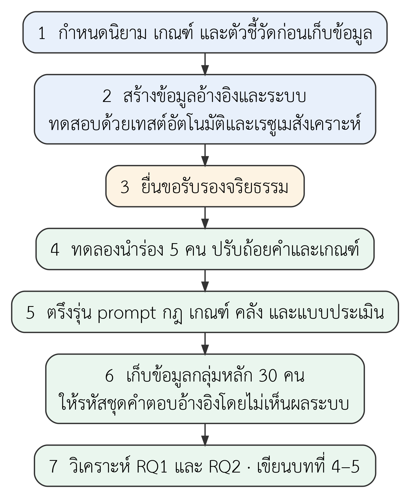
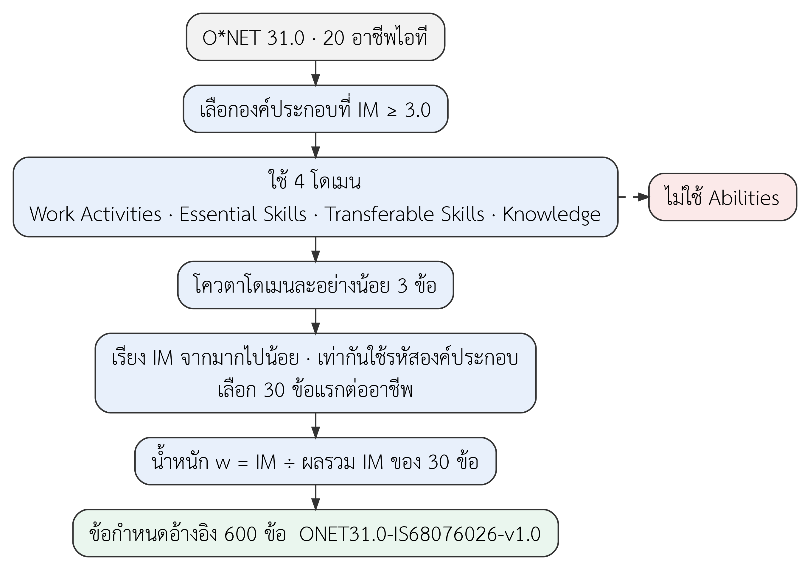
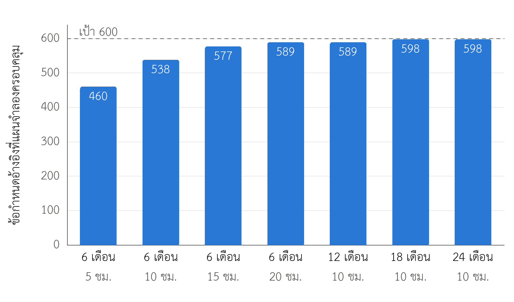
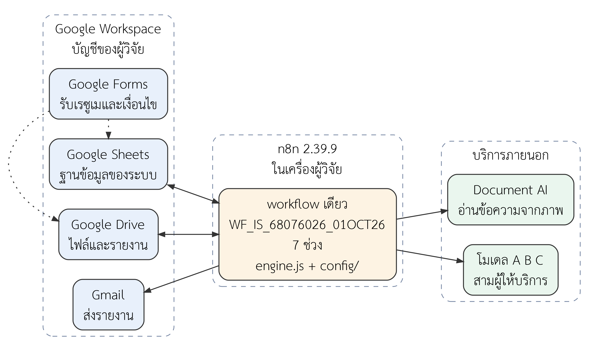
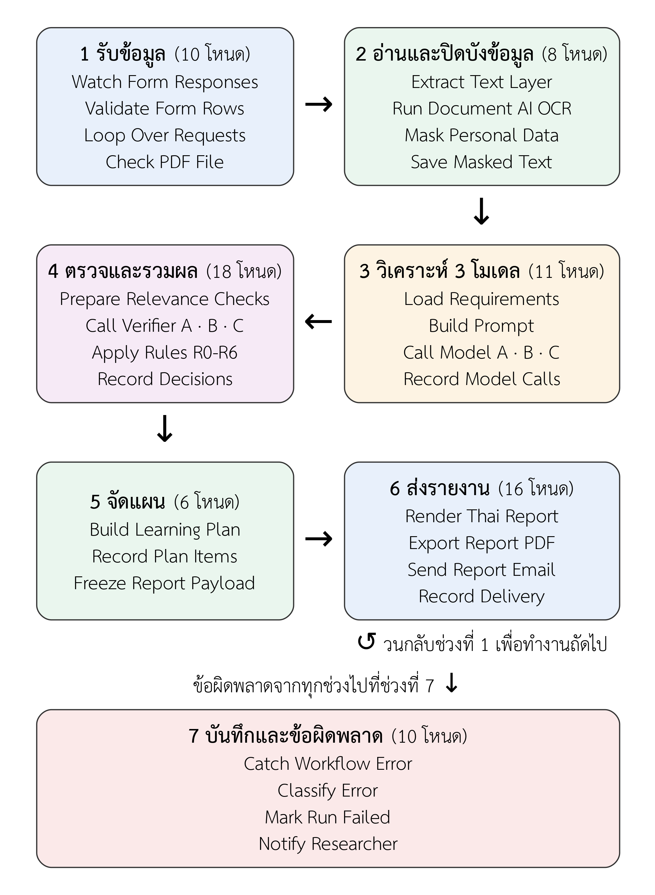
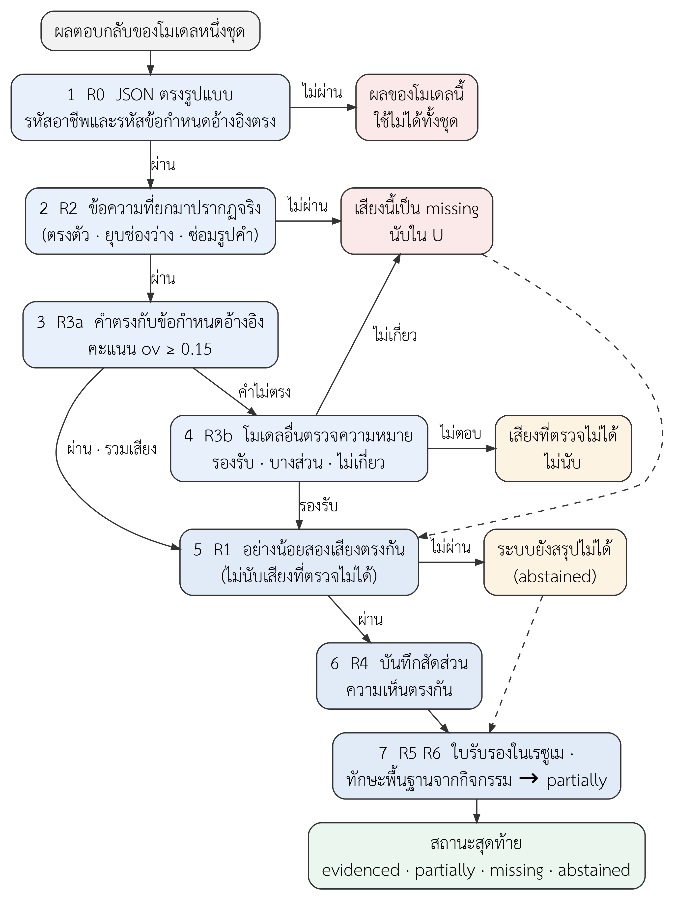
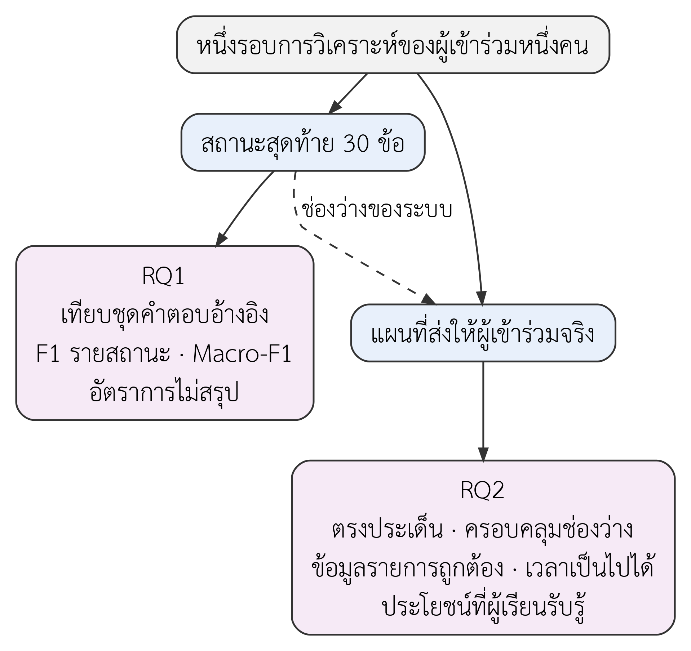
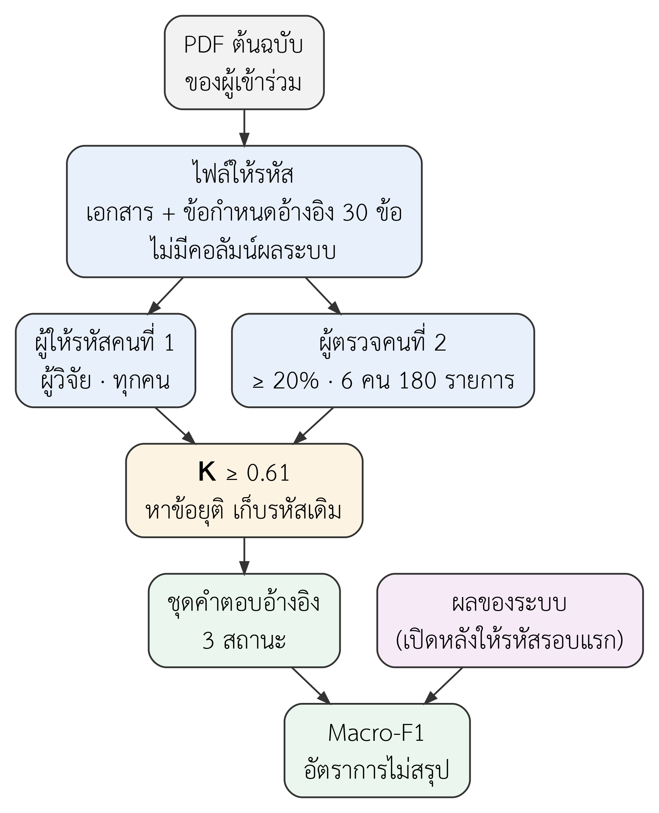

# บทที่ 3 วิธีดำเนินการวิจัย

บทนี้อธิบายสิ่งที่ผู้อ่านต้องรู้เพื่อเชื่อผลของการวิจัย ได้แก่ ข้อมูลอ้างอิงที่ระบบใช้ ระบบที่สร้างขึ้น วิธีตัดสินสถานะของข้อกำหนดอ้างอิงแต่ละข้อ วิธีจัดแผนการเรียนรู้ การทดสอบระบบ และแผนการประเมินกับผู้เข้าร่วม รายละเอียดที่ใช้ตรวจย้อนหรือทำซ้ำ เช่น รายโหนด รายคอลัมน์ และรายกรณีใช้งาน อยู่ในภาคผนวก

## 3.1 ภาพรวมการวิจัยและขั้นตอน

การวิจัยนี้สร้างระบบหนึ่งระบบแล้วประเมินระบบนั้นด้วยเกณฑ์ที่กำหนดก่อนเก็บข้อมูล หัวข้อนี้บอกแนวทางวิจัย ลำดับขั้นตอน สิ่งที่ทำแล้วกับสิ่งที่ยังเป็นแผน และตัวอย่างที่ใช้เดินเรื่องตลอดบท

### 3.1.1 แนวทางการวิจัย

งานนี้ใช้แนวทางการวิจัยเชิงออกแบบ (Design Science Research) คือออกแบบและสร้างสิ่งประดิษฐ์ (artifact) ขึ้นมาแก้ปัญหาหนึ่ง แล้ววัดผลของสิ่งประดิษฐ์ตามเกณฑ์ที่กำหนดไว้ก่อน [@hevner2004] ปัญหาของงานนี้คือระบบวิเคราะห์เรซูเมด้วยโมเดลภาษาไม่บอกว่าข้อสรุปแต่ละข้อมาจากข้อความใด สิ่งประดิษฐ์คือระบบที่บังคับให้ทุกข้อสรุปมีข้อความอ้างอิงจากเอกสารและตรวจข้อความนั้นด้วยโปรแกรม

การประเมินถือว่าระบบทั้งระบบเป็นเงื่อนไขเดียว งานนี้ไม่เทียบโมเดลแต่ละตัว ไม่สร้างระบบโมเดลเดี่ยวไว้เปรียบเทียบ และไม่ถอดองค์ประกอบออกทีละส่วน ระบบยังเก็บผลของแต่ละโมเดลไว้ เพื่อใช้ตรวจย้อนหลังและหาสาเหตุเมื่อผลผิด

### 3.1.2 ขั้นตอนการดำเนินงาน

งานแบ่งเป็นเจ็ดขั้นตามรูปที่ 3.1 สองขั้นแรกคือการกำหนดเกณฑ์และการสร้างระบบ ซึ่งเป็นเนื้อหาของเล่มนี้ ขั้นที่สามคือการยื่นขอรับรองจริยธรรม ส่วนขั้นที่สี่ถึงเจ็ดทำกับผู้เข้าร่วมจริง จึงเริ่มได้หลังได้หนังสือรับรองเท่านั้น

*รูปที่ 3.1* ขั้นตอนการดำเนินการวิจัย

ลำดับในรูปที่ 3.1 วางเกณฑ์ไว้หน้าการเก็บข้อมูลโดยตั้งใจ ระบบมีสถานะ "ระบบยังสรุปไม่ได้" ที่ต้องรายงานแยกจากสถานะอื่น ถ้าเลือกวิธีนับหลังเห็นผล ค่าความถูกต้องอาจดูดีขึ้นเพียงเพราะไม่นับข้อที่ระบบตัดสินไม่ได้ งานนี้จึงกำหนดนิยาม ตัวหาร และวิธีจัดการกรณีพิเศษให้ครบก่อนขั้นที่สี่

หลังการทดลองนำร่อง ผู้วิจัยจะตรึงรุ่นของ prompt กฎตรวจหลักฐาน ค่าเกณฑ์ คลังรายการเรียนรู้ และแบบประเมิน แล้วใช้รุ่นนั้นตลอดการเก็บข้อมูลกลุ่มหลัก การปรับค่าใดหลังจุดนี้จะทำให้ผลของผู้เข้าร่วมแต่ละคนเทียบกันไม่ได้

### 3.1.3 สิ่งที่ทำแล้วและสิ่งที่เป็นแผน

เล่มนี้ครอบคลุมบทที่ 1 ถึงบทที่ 3 ทุกข้อความเกี่ยวกับผู้เข้าร่วมจึงเป็นแผน ผลที่มีจริงมีสามชุด คือผลการทดสอบระบบด้วยเรซูเมสังเคราะห์ ผลการจำลองแผนการเรียนรู้ และผลการทดลองต้นแบบกับเรซูเมของผู้วิจัยเอง ซึ่งนำไปสู่การปรับกฎตรวจหลักฐานในหัวข้อ 3.4.4 ตารางที่ 3.1 แยกสถานะของแต่ละกิจกรรมพร้อมหลักฐาน

**ตารางที่ 3.1** สถานะของกิจกรรมในการวิจัย ณ วันที่จัดทำเล่ม

| กิจกรรม | สถานะ | หลักฐานหรือสิ่งที่รอ |
|---|---|---|
| ข้อกำหนดอ้างอิง 600 ข้อจาก O*NET 31.0 | ทำแล้ว | ชุดข้อมูล ONET31.0-IS68076026-v1.0 สร้างซ้ำได้ด้วยสคริปต์ |
| คลังรายการเรียนรู้และความเชื่อมโยง | ทำแล้ว | คลังรุ่น {{corpus_version}} จำนวน {{corpus_items}} รายการ |
| ความครอบคลุม 600 ข้อกำหนดอ้างอิง | ทำบางส่วน | รอผู้วิจัยเปิดตรวจรายการใหม่ {{add_pending}} รายการ และ URL ค้าง {{url_pending_urls}} URL |
| workflow เดียวและตรรกะของระบบ | ทำแล้ว | {{wf_name}} จำนวน {{wf_nodes}} โหนด ผ่านตัวตรวจ |
| เทสต์อัตโนมัติและเรซูเมสังเคราะห์ | ทำแล้ว | ผ่าน {{tests_pass}} จาก {{tests_total}} กรณี และสี่กรณีสังเคราะห์ในภาคผนวก ง |
| ปรับกฎตรวจหลักฐานหลังทดลองกับเรซูเมจริงของผู้วิจัย | ทำแล้ว | ชุดกฎ {{rules_version}} และ prompt {{prompt_version}} |
| ตรวจความตรงของคะแนนกับโมเดลจริง | ยังไม่ทำ | เครื่องมือและเรซูเมสมมติพร้อมแล้ว รอเชื่อมบริการจริงและผู้ให้ป้ายคนที่สอง (หัวข้อ 3.6.4) |
| ทดสอบใน n8n กับบริการจำลอง | ทำแล้ว | n8n รุ่น {{n8n_version}} ผ่าน {{n8n_pass}} จาก {{n8n_cases}} กรณี |
| เชื่อมบริการจริง | ยังไม่ทำ | รอตั้งค่าบัญชีบริการและทดสอบเชื่อมต่อโมเดลทั้งสาม |
| ยื่นขอรับรองจริยธรรม | ยังไม่ทำ | เอกสารร่างพร้อมให้อาจารย์ที่ปรึกษาตรวจ |
| นำร่อง 5 คน เก็บข้อมูล 30 คน วิเคราะห์ผล | แผน | เริ่มหลังได้หนังสือรับรองจริยธรรม |

ตารางที่ 3.1 แสดงว่างานส่วนระบบพร้อมสำหรับการทดสอบกับบริการจริง แต่ข้อมูลอ้างอิงยังมีงานที่ผู้วิจัยต้องตรวจด้วยตนเองก่อนตรึงรุ่น

### 3.1.4 ตัวอย่างเดินเรื่อง

บทนี้ใช้เรซูเมสังเคราะห์กรณี A เป็นตัวอย่างตั้งแต่รับไฟล์จนได้แผน กรณี A เป็นเรซูเมภาษาอังกฤษของวิศวกรซอฟต์แวร์สายระบบหลังบ้าน ผู้วิจัยแต่งขึ้นเพื่อทดสอบระบบ จึงไม่มีข้อมูลของบุคคลจริง ผู้เรียนสมมติเลือกอาชีพ R01 กรอบเวลา 6 เดือน เรียนได้ 10 ชั่วโมงต่อสัปดาห์ และรับคำแนะนำทั้งหลักสูตรและใบรับรอง

เรซูเมนี้มีทั้งข้อความที่เป็นหลักฐานชัด เช่น การสร้างบริการด้วยภาษา Python และข้อความกว้าง ๆ เช่น รายชื่อทักษะที่ไม่มีบริบทการใช้งาน ผู้วิจัยกำหนดเฉลยของทุกข้อก่อนเขียนเรซูเม และไม่ส่งเฉลยให้โมเดล ตัวเลขของกรณี A ที่อ้างในบทนี้มาจากผลตอบกลับจำลอง ไม่ใช่การเรียกโมเดลจริง

## 3.2 ข้อมูลอ้างอิง

ระบบเทียบเรซูเมกับข้อกำหนดอ้างอิงที่ตรึงไว้ แล้วเลือกรายการเรียนรู้จากคลังที่ตรึงไว้เช่นกัน หัวข้อนี้อธิบายที่มาของข้อมูลทั้งสองชุด และรายงานว่าคลังรองรับข้อกำหนดอ้างอิงครบ 600 ข้อแล้วหรือยัง

### 3.2.1 ข้อกำหนดอ้างอิง 600 ข้อ

ที่มาของข้อกำหนดอ้างอิงคือ O*NET 31.0 [@onet31] ฐานข้อมูลนี้เผยแพร่ภายใต้สัญญาอนุญาต CC BY 4.0 งานนี้บันทึกชุดที่คัดแล้วเป็นรุ่นคงที่ชื่อ ONET31.0-IS68076026-v1.0 และสร้างซ้ำได้ด้วยสคริปต์ของโครงการ การคัดใช้กฎตายตัวตามรูปที่ 3.2

*รูปที่ 3.2* การคัดข้อกำหนดอ้างอิงจาก O*NET 31.0

กฎแรกตัดองค์ประกอบที่มีค่าความสำคัญ (Importance, IM) ต่ำกว่า 3.0 ออก กฎที่สองใช้สี่โดเมนที่อธิบายได้ด้วยข้อความในเรซูเม และไม่ใช้กลุ่ม Abilities กฎที่สามให้แต่ละโดเมนมีอย่างน้อย 3 ข้อ เพื่อไม่ให้ข้อกำหนดอ้างอิงกระจุกในโดเมนเดียว กฎสุดท้ายเรียงตามค่า IM แล้วเลือก 30 ข้อแรกของแต่ละอาชีพ ถ้าค่าเท่ากันใช้รหัสองค์ประกอบตัดสิน

อาชีพเป้าหมายมี 20 อาชีพในเจ็ดสายงานตามตารางที่ 3.2 อาชีพส่วนใหญ่มีรหัส SOC ตรงกับ O*NET มี {{roles_proxy}} อาชีพ ({{roles_proxy_ids}}) ที่ O*NET ไม่มีรหัสเฉพาะ จึงเทียบกับรหัสที่ใกล้ที่สุด เหตุผลของแต่ละอาชีพอยู่ในภาคผนวก ฉ

**ตารางที่ 3.2** อาชีพเป้าหมาย 20 อาชีพ

{{roles_table}}

ที่มา ประมวลจาก O*NET 31.0 [@onet31] (CC BY 4.0)

การจับรหัสแบบใกล้เคียงทำให้ข้อกำหนดอ้างอิงของห้าอาชีพนั้นสะท้อนอาชีพแม่แบบ ไม่ใช่ชื่อตำแหน่งที่ผู้เรียนเลือกโดยตรง ข้อนี้ต้องอ่านคู่กับผลรายอาชีพเสมอ

ผลการคัดกระจายตามโดเมนในตารางที่ 3.3 โดเมน Work Activities มีมากที่สุด เพราะเป็นกลุ่มที่มีองค์ประกอบผ่านเกณฑ์ IM มากที่สุดในอาชีพไอที

**ตารางที่ 3.3** จำนวนข้อกำหนดอ้างอิงแยกตามโดเมนของ O*NET

{{domain_table}}

ที่มา ประมวลจาก O*NET 31.0 [@onet31] (CC BY 4.0)

โดเมน Transferable Skills กับ Knowledge แยกกันด้วยคำถามง่าย ๆ ข้อหนึ่ง โดเมนแรกถามว่าเจ้าของเรซูเมทำอะไรได้ ส่วนโดเมนหลังถามว่ารู้เรื่องอะไร งานนี้ไม่จัดโดเมนเอง แต่ใช้กลุ่มรหัสตามที่ O*NET กำหนด ได้แก่ 2.B สำหรับ Transferable Skills และ 2.C สำหรับ Knowledge

น้ำหนักของข้อกำหนดอ้างอิงแต่ละข้อมาจากค่า IM ที่ปรับให้รวมกันเป็น 1 ภายในอาชีพเดียวกัน ตามสมการที่ 3.1

$$ w_i = \frac{IM_i}{\sum_{j=1}^{30} IM_j} \tag{3.1} $$

โดยที่ $w_i$ คือน้ำหนักของข้อกำหนดอ้างอิงข้อที่ $i$ และ $IM_i$ คือค่าความสำคัญจาก O*NET ตัวหารคือผลรวมค่า IM ของ 30 ข้อในอาชีพนั้น

ชุด 30 ข้อครอบคลุมน้ำหนักของข้อที่ผ่านเกณฑ์เบื้องต้นได้ไม่เท่ากันในแต่ละอาชีพ ค่านี้อยู่ระหว่าง {{wsp_min}} ถึง {{wsp_max}} อาชีพที่ได้ค่าต่ำมีองค์ประกอบสำคัญที่ถูกตัดออกไปมากกว่า ระบบบันทึกค่านี้ไว้ในคอลัมน์ weight_share_of_pool

ตารางที่ 3.4 แสดงข้อกำหนดอ้างอิงของอาชีพ R01 โดเมนละสองข้อ เพื่อให้เห็นรหัส น้ำหนัก และคำพ้องที่กฎ R3 ใช้ในหัวข้อ 3.4.4

**ตารางที่ 3.4** ข้อกำหนดอ้างอิงแปดข้อแรกของ R01

{{req_r01_table}}

ที่มา ประมวลจาก O*NET 31.0 [@onet31] (CC BY 4.0) และรายการคำพ้องของโครงการ

รหัสข้อกำหนดอ้างอิงประกอบด้วยรหัสอาชีพและรหัสองค์ประกอบของ O*NET ผู้อ่านจึงย้อนจากรายงานกลับไปหาคำนิยามต้นทางได้ทุกข้อ

### 3.2.2 คลังรายการเรียนรู้และความเชื่อมโยง

คลังรายการเรียนรู้ (corpus) เป็นชุดหลักสูตรและใบรับรองที่ผู้วิจัยคัดและตรึงไว้ ระบบเลือกคำแนะนำจากคลังนี้เท่านั้น และไม่ให้โมเดลตั้งชื่อรายการขึ้นเอง คลังรุ่น {{corpus_version}} มี {{corpus_items}} รายการ แบ่งเป็นหลักสูตร {{corpus_courses}} รายการและใบรับรอง {{corpus_certs}} รายการ

แต่ละรายการบันทึกชื่อ ผู้ให้บริการ ลิงก์ ชั่วโมงประมาณการ ราคา และประเภทคำแนะนำที่ใช้ได้ ชั่วโมงอยู่ระหว่าง {{hours_min}} ถึง {{hours_max}} ชั่วโมง ค่ามัธยฐาน {{hours_median}} ชั่วโมง ชั่วโมงเหล่านี้เป็นค่าประมาณเพื่อวางแผน ไม่ใช่ค่าที่ผู้ให้บริการรับรอง

ความเชื่อมโยง (mapping) บอกว่ารายการใดสอนข้อกำหนดอ้างอิงข้อใด คลังมีความเชื่อมโยง {{map_total}} แถว แบ่งเป็นสองชั้น ชั้น L1 เป็นความเชื่อมโยงที่ผู้วิจัยกำกับเอง {{map_L1}} แถว ชั้น L2 เป็นความเชื่อมโยงที่กฎขยายผลให้ {{map_L2}} แถว ตัวจัดแผนใช้เฉพาะชั้น L1 และค่านี้เขียนไว้ในโค้ดของระบบ จึงผ่อนเกณฑ์ด้วยการแก้ไฟล์ตั้งค่าไม่ได้

ทุกแถวเริ่มที่สถานะ pending_review แล้วผ่านการตรวจด้วยสคริปต์ตามเกณฑ์ห้าข้อในตารางที่ 3.5 แถวที่ผ่านทุกข้อได้สถานะ source_checked_by_script และเป็นแถวเดียวที่ตัวจัดแผนนำไปใช้

**ตารางที่ 3.5** เกณฑ์ตรวจความเชื่อมโยงและผลการตรวจ

| เกณฑ์ | สิ่งที่ตรวจ |
|---|---|
| C1 | รายการผ่านการตรวจ URL แล้ว (verified) และลิงก์ขึ้นต้นด้วย https |
| C2 | ข้อกำหนดอ้างอิงอยู่ในชุด 30 ข้อของอาชีพเดียวกับรายการ |
| C3 | ความเชื่อมโยงอยู่ในชั้น L1 |
| C4 | รหัสข้อกำหนดอ้างอิงปรากฏในคอลัมน์ competency_ids_l1 ของรายการด้วย |
| C5 | รายการมีชั่วโมงมากกว่าศูนย์และระบุประเภทคำแนะนำ |
| ผล | ผ่านทุกข้อ {{map_passed}} แถว · ไม่ผ่านเพราะไม่ใช่ L1 {{map_failed_not_L1}} แถว · L1 ที่ไม่ผ่านเพราะ URL ยังไม่ได้ตรวจ {{map_failed_L1_other}} แถว |

ผ่านเกณฑ์ C1 ถึง C5 หมายถึงข้อมูลสองแหล่งในคลังตรงกันและรายการพร้อมใช้ ไม่ได้หมายถึงผู้เชี่ยวชาญรับรองเนื้อหาของหลักสูตร การประเมินแผนในหัวข้อ 3.7 จึงตรวจเนื้อหาของรายการที่ระบบเลือกอีกชั้นหนึ่ง

ระบบหยุดทำงานพร้อมข้อความ "ข้อผิดพลาดของข้อมูลอ้างอิง" ในสองกรณี กรณีแรกคือไม่พบผลการตรวจความเชื่อมโยง กรณีที่สองคือแถว L1 ผ่านการตรวจน้อยกว่าร้อยละ 90 ทั้งสองกรณีบ่งว่าการนำเข้าข้อมูลผิดพลาด การทำงานต่อโดยไม่แจ้งจะทำให้แผนว่างโดยไม่มีใครรู้สาเหตุ

คลังมีรายการสองแบบ แบบแรกเป็นรายการเฉพาะสายงาน ซึ่งเป็นส่วนใหญ่ของคลัง แบบที่สองเป็นรายการพื้นฐานที่สอนสมรรถนะร่วมของทุกอาชีพ เช่น การคิดวิเคราะห์ การค้นและประมวลสารสนเทศ และการจัดลำดับงาน รายการพื้นฐานสั้นกว่าใบรับรองมาก จึงมีผลต่อความครอบคลุมของแผนที่ชั่วโมงจำกัด

### 3.2.3 ความครอบคลุม 600 ข้อกำหนดอ้างอิง

หัวข้อนี้ตอบว่าคลังรองรับข้อกำหนดอ้างอิงครบหรือไม่ และแผนที่จัดได้ภายในเวลาจริงครอบคลุมได้แค่ไหน งานนี้ใช้ตัวชี้วัดสองตัวที่นิยามตามตารางที่ 3.6 และตั้งเป้าทั้งสองตัวที่ 600 ข้อ

**ตารางที่ 3.6** นิยามของความครอบคลุมและค่าที่นับได้จริง

| ตัวชี้วัด | นิยาม | เป้า | ค่าปัจจุบัน |
|---|---|---|---|
| ความครอบคลุมของคลัง | จำนวนข้อกำหนดอ้างอิงที่มีรายการเรียนรู้รองรับอย่างน้อยหนึ่งรายการ โดยนับเฉพาะ L1 ที่ผ่าน C1 ถึง C5 และ URL ผ่านการตรวจ | 600 | {{cov_corpus}} |
| ความครอบคลุมของแผนจำลอง | ผลรวมของ 20 อาชีพ ของจำนวนข้อกำหนดอ้างอิงที่แผนครอบคลุม เมื่อสมมติว่าผู้เรียนขาดทั้ง 30 ข้อ เรียน 6 เดือน 10 ชั่วโมงต่อสัปดาห์ และรับทั้งหลักสูตรและใบรับรอง | 600 | {{cov_plan}} |

ค่าปัจจุบันในตารางที่ 3.6 {{cov_status_note}}

ความครอบคลุมของแผนจำลองต่างจากความครอบคลุมของคลังตรงที่มีเวลาเป็นข้อจำกัด รายการที่รองรับข้อกำหนดอ้างอิงข้อหนึ่งอาจยาวจนแผนรับไว้ไม่ได้ กรณีเลวร้ายที่สุดใช้เป็นเกณฑ์เพราะเป็นภาระสูงสุดที่ตัวจัดแผนอาจเจอ ถ้าผ่านกรณีนี้ ผู้เรียนที่ขาดน้อยกว่าย่อมได้แผนที่ครอบคลุมช่องว่างของตนได้เช่นกัน

รูปที่ 3.3 แสดงความครอบคลุมของแผนจำลองที่เงื่อนไขต่าง ๆ จากข้อมูลที่นับได้จริง เงื่อนไข 6 เดือน 10 ชั่วโมงต่อสัปดาห์เป็นตัวชี้วัดหลัก ส่วนเงื่อนไขอื่นเป็นตัวชี้วัดรองที่รายงานตามจริงโดยไม่ตั้งเป้า

*รูปที่ 3.3* ความครอบคลุมของแผนจำลองตามกรอบเวลาและชั่วโมงเรียนต่อสัปดาห์

ความครอบคลุมเพิ่มขึ้นตามเวลาที่ผู้เรียนมี {{cov_24m_note}} ส่วนผู้ที่รับเฉพาะหลักสูตรได้ {{sim_course_6m10h}} ข้อ และผู้ที่รับเฉพาะใบรับรองได้ {{sim_cert_6m10h}} ข้อ ค่าหลังต่ำเพราะใบรับรองหนึ่งรายการใช้เวลานานและไม่สอนสมรรถนะร่วมโดยตรง

เพื่อหาสาเหตุของข้อที่ขาด ผู้วิจัยวินิจฉัยคลังก่อนเพิ่มรายการใหม่ (สถานะหลังขยายรายการพื้นฐาน) โดยคำนวณชั่วโมงขั้นต่ำที่ต้องใช้เพื่อครอบคลุมทุกข้อของแต่ละอาชีพ ปัญหานี้คือปัญหาครอบคลุมเซตแบบถ่วงน้ำหนัก (weighted set cover) ซึ่งแก้ได้แม่นตรงด้วยกำหนดการเชิงเส้นจำนวนเต็ม (Integer Linear Programming, ILP) ผลคือชั่วโมงขั้นต่ำอยู่ระหว่าง {{ilp_min_lo}} ถึง {{ilp_min_hi}} ชั่วโมง ขณะที่ 6 เดือน 10 ชั่วโมงต่อสัปดาห์ให้เวลา {{Hmax_6m10h}} ชั่วโมง

ผลข้างต้นแปลว่าตัวจัดแผนไม่ใช่สาเหตุหลัก ถ้าเลือกแบบเหมาะที่สุดด้วย ILP แผนจำลองครอบคลุมได้สูงสุด {{ilp_max_cov}} ข้อ เมื่อแยกสาเหตุของข้อที่ขาด พบว่าเกิดจากชั่วโมงไม่พอ {{cause_hours}} ข้อ ลำดับการเลือก {{cause_selection}} ข้อ และไม่มีรายการเลย {{cause_no_item}} ข้อ ทางแก้จึงอยู่ที่คลัง คือต้องมีรายการสั้นที่สอนสมรรถนะซึ่งตอนนี้มีเฉพาะในใบรับรองยาว

ผู้วิจัยจึงทำสองอย่าง อย่างแรกใช้รายการพื้นฐานเดิมกับทุกอาชีพที่มีองค์ประกอบเดียวกัน ซึ่งเพิ่มความเชื่อมโยง L1 {{foundation_ext_maps}} แถว อย่างที่สองเปิดหน้าเว็บจริงเพื่อหาหลักสูตรสั้นเพิ่ม {{add_total}} รายการ ยาว {{add_hours_lo}} ถึง {{add_hours_hi}} ชั่วโมง รายการใหม่จะเข้าคลังเมื่อผู้วิจัยเปิดตรวจด้วยตนเองแล้วเท่านั้น ตามหลักห้ามเดาลิงก์ของโครงการ

การจำลองชุดเดียวกันโดยสมมติว่ารายการใหม่ผ่านการตรวจครบให้ความครอบคลุมของคลัง {{cov_whatif_corpus}} ข้อ และของแผนจำลอง {{cov_whatif_plan}} ข้อ ชั่วโมงขั้นต่ำรายอาชีพลดลงเหลือ {{ilp_min_lo_add}} ถึง {{ilp_min_hi_add}} ชั่วโมง ตัวเลขชุดนี้เป็นการจำลองเพื่อวางแผนงานตรวจ ไม่ใช่ผล ตารางรายอาชีพอยู่ในภาคผนวก จ

## 3.3 ระบบและ workflow เดียว

ระบบทำงานอัตโนมัติตั้งแต่ผู้เรียนส่งแบบฟอร์มจนได้รับรายงานทางอีเมล หัวข้อนี้อธิบายส่วนประกอบของระบบ ลำดับการทำงานใน workflow เดียว กรณีใช้งาน ที่เก็บข้อมูล ค่าควบคุม และบริการภายนอกที่ระบบเรียก

### 3.3.1 สถาปัตยกรรมของระบบ

ระบบมีสามส่วนตามรูปที่ 3.4 ส่วนแรกคือบริการของ Google Workspace ในบัญชีของผู้วิจัย ทำหน้าที่รับแบบฟอร์ม เก็บไฟล์ เก็บผล และส่งอีเมล ส่วนที่สองคือ n8n รุ่น {{n8n_version}} ที่ติดตั้งในเครื่องของผู้วิจัย ส่วนที่สามคือบริการภายนอก ได้แก่ บริการอ่านข้อความจากภาพ และโมเดล Generative AI สามโมเดล

*รูปที่ 3.4* สถาปัตยกรรมของระบบ

workflow เป็นจุดเดียวที่ติดต่อบริการภายนอก ข้อมูลของผู้เรียนจึงออกนอกบัญชีของผู้วิจัยได้เฉพาะเส้นทางที่ workflow กำหนด ผู้วิจัยไม่ได้สร้างเซิร์ฟเวอร์ของตนเอง กฎและการคำนวณทุกส่วนเขียนไว้ในไฟล์ engine.js ไฟล์เดียว ซึ่งสคริปต์ของโครงการฝังลงในโหนดที่ต้องใช้แบบตรงทุกไบต์ และตัวตรวจเทียบค่าแฮชของโค้ดที่ฝังกับไฟล์ต้นทางทุกครั้งที่สร้าง workflow

การเก็บตรรกะไว้ไฟล์เดียวมีผลสองข้อ ข้อแรก เทสต์อัตโนมัติเรียกฟังก์ชันชุดเดียวกับที่ระบบใช้จริง ข้อที่สอง การแก้ตรรกะต้องแก้ที่ไฟล์ต้นทางแล้วสร้าง workflow ใหม่ ผู้ดูแลจึงแก้โค้ดในหน้าจอ n8n เงียบ ๆ ไม่ได้ เพราะตัวตรวจจะไม่ผ่าน

### 3.3.2 workflow เจ็ดช่วง

ระบบทั้งหมดอยู่ใน workflow เดียวชื่อ {{wf_name}} มี {{wf_nodes}} โหนด แบ่งเป็น {{wf_sections}} ช่วงตามลำดับงานจากซ้ายไปขวาในรูปที่ 3.5 ทุกโหนดตั้งชื่อเป็นคำกริยาตามด้วยกรรม เช่น Apply Rules R0-R6 หรือ Send Report Email ผู้อ่านจึงรู้หน้าที่ของโหนดจากชื่อ

*รูปที่ 3.5* ช่วงการทำงานเจ็ดช่วงของ workflow

ช่วงที่ 1 รับข้อมูลตรวจแถวใหม่ของแบบฟอร์มทุกหนึ่งนาที ตรวจความยินยอมและข้อมูลเข้า กันงานซ้ำ แล้วส่งงานเข้าลูปที่ทำทีละงาน ช่วงที่ 2 อ่านข้อความจาก PDF และปิดบังข้อมูลระบุตัว ช่วงที่ 3 เรียกโมเดลสามโมเดล ช่วงที่ 4 ตรวจและรวมผลด้วยกฎ R0 ถึง R6 ข้อความที่คำไม่ตรงกับข้อกำหนดอ้างอิงจะถูกส่งให้โมเดลอีกตัวตรวจความหมายในช่วงนี้ ช่วงที่ 5 จัดแผนการเรียนรู้ ช่วงที่ 6 สร้างรายงานและส่งอีเมล ถ้าส่งไม่สำเร็จจะแจ้งผู้วิจัยทางอีเมล แล้ววนกลับไปทำงานถัดไป

ช่วงที่ 7 ทำงานเมื่อโหนดใดในช่วงที่ 1 ถึง 6 ล้มเหลว ช่วงนี้หารหัสงานที่ล้ม ทำเครื่องหมายว่างานนั้นล้มเหลว บันทึกเหตุการณ์ และแจ้งผู้วิจัยทางอีเมล งานอื่นที่มาในรอบเดียวกันแต่ยังไม่ได้เริ่มจะถูกบันทึกว่าล้มเหลวด้วยรหัส batch_aborted เพื่อให้ผู้วิจัยติดต่อให้ส่งใหม่ คำขอจึงไม่หายไปเงียบ ๆ ผู้เรียนจะไม่เห็นข้อความข้อผิดพลาดทางเทคนิค

ระบบเดิมแยกเป็นห้า workflow ที่เรียกกันเป็นทอด ๆ การส่งข้อมูลข้าม workflow ทำให้ต้องตั้งค่ารหัส workflow ลำดับการนำเข้า และสิทธิ์ของแต่ละไฟล์ให้ตรงกัน งานนี้จึงรวมเป็นไฟล์เดียว และให้ตัวตรวจไม่ผ่านถ้าพบการเรียกข้าม workflow รายละเอียดรายโหนดอยู่ในภาคผนวก ค ส่วนตารางเทียบสิ่งที่ระบบต้องทำกับโหนดและเทสต์ที่ยืนยัน มี {{trace_rows}} แถวในเอกสารหลักฐานของโครงการ

ลูปที่ทำทีละงานมีความเสี่ยงเฉพาะ คือโหนดหนึ่งอาจอ่านผลของโหนดก่อนหน้าที่ไม่ได้ทำงานในรอบนี้ แล้วได้ค่าของงานคนก่อนไป ตัวตรวจของโครงการวิเคราะห์เส้นทางในลูป และไม่ผ่านถ้าโหนดใดอ้างผลของโหนดที่ไม่อยู่บนทุกเส้นทางก่อนหน้าตัวมันเอง

### 3.3.3 กรณีใช้งาน

ระบบมีผู้กระทำสี่ราย คือ ผู้เข้าร่วม ผู้วิจัย บริการอ่านข้อความ และผู้ให้บริการโมเดล กรณีใช้งานทั้งแปดกรณีสรุปไว้ในตารางที่ 3.7 คำอธิบายรายกรณีพร้อมเงื่อนไขก่อน ลำดับเหตุการณ์ และข้อยกเว้นอยู่ในภาคผนวก ก

**ตารางที่ 3.7** กรณีใช้งานแปดกรณีของระบบ

| รหัส | กรณีใช้งาน | ผู้กระทำ | ช่วงของ workflow | ผลเมื่อจบกรณี |
|---|---|---|---|---|
| UC-01 | ส่งเรซูเมและเงื่อนไขการเรียน | ผู้เข้าร่วม | 1 | แถวใหม่ในแท็บ form_responses และไฟล์ใน Drive |
| UC-02 | อ่านข้อความและปิดบังข้อมูลระบุตัว | ระบบ บริการอ่านข้อความ | 2 | ข้อความหลังปิดบังหนึ่งชุด ซึ่งโมเดลทุกตัวและกฎ R2 อ่านเหมือนกัน |
| UC-03 | หาช่องว่างทักษะตามอาชีพที่เลือก | ระบบ | 3 ถึง 5 | สถานะครบ 30 ข้อและแผนพร้อมส่ง |
| UC-04 | ตรวจและรวมผลของสามโมเดล | ระบบ ผู้ให้บริการโมเดล | 3 และ 4 | แถว findings รายโมเดลและแถว decisions รายข้อ |
| UC-05 | จัดแผนภายในเวลาที่ผู้เรียนมี | ระบบ | 5 | แถว plan_items เรียงตามลำดับความสำคัญ |
| UC-06 | รับรายงานทางอีเมล | ผู้เข้าร่วม ระบบ | 6 | สถานะงาน delivered และรายงาน PDF หนึ่งฉบับ |
| UC-07 | ติดตามสถานะงานและเหตุการณ์ | ผู้วิจัย | 7 | รู้สถานะและสาเหตุของทุกงานจากสเปรดชีต |
| UC-08 | ให้รหัสชุดคำตอบอ้างอิงและตรวจแผน | ผู้วิจัย ผู้ตรวจคนที่สอง | นอก workflow | ชุดคำตอบอ้างอิงและผลตรวจแผน |

กรณี UC-03 รวมกรณี UC-02 UC-04 และ UC-05 ไว้เป็นขั้นย่อย กรณี UC-08 ทำนอก workflow เพราะผู้ให้รหัสต้องไม่เห็นผลของระบบ

### 3.3.4 ที่เก็บข้อมูลและค่าควบคุม

ระบบเก็บข้อมูลใน Google Sheets ไฟล์เดียว มี {{tabs_total}} แท็บตามตารางที่ 3.8 แท็บแบ่งเป็นสี่กลุ่ม คือ แท็บผลการทำงานที่ workflow เขียน แท็บการประเมินที่ผู้วิจัยกรอก แท็บข้อมูลอ้างอิงที่นำเข้าครั้งเดียว และแท็บที่ Google Forms เขียนเอง

**ตารางที่ 3.8** แท็บในฐานข้อมูลของระบบ

{{tabs_table}}

แท็บ runs เป็นจุดเริ่มของการตรวจย้อน ทุกแถวในแท็บอื่นมีรหัสงาน (run_id) เดียวกัน ผู้วิจัยจึงไล่จากงานหนึ่งไปถึงการเรียกโมเดล ข้อสรุปรายโมเดล สถานะสุดท้าย แผน และผลการส่งได้ คำอธิบายรายคอลัมน์อยู่ในภาคผนวก ข

สถานะของงานในแท็บ runs มีสี่ค่า งานเริ่มที่ running เปลี่ยนเป็น ready เมื่อจัดแผนเสร็จ แล้วจบที่ delivered หรือ failed ฟังก์ชันใน engine.js ปฏิเสธการเปลี่ยนสถานะที่ข้ามลำดับ เช่น จาก running ไป delivered ตรง ๆ

ค่าที่ควบคุมพฤติกรรมของระบบอยู่ในไฟล์ตั้งค่าของโครงการ ไม่กระจายอยู่ในโหนด ตารางที่ 3.9 สรุปค่าที่มีผลต่อผลการวิจัย ตัวตรวจของ workflow เทียบค่าที่ฝังในทุกโหนดกับไฟล์ตั้งค่า ถ้าแก้ไฟล์แล้วไม่สร้าง workflow ใหม่ ตัวตรวจจะไม่ผ่าน

**ตารางที่ 3.9** ค่าควบคุมของระบบ

{{config_table}}

ที่มา ไฟล์ config/project.json และ config/models.json ของโครงการ

ค่าทุกค่าในตารางที่ 3.9 เปลี่ยนได้ก่อนตรึงรุ่นเท่านั้น และการเปลี่ยนแต่ละครั้งต้องบันทึกในทะเบียนการตัดสินใจของโครงการพร้อมวิธีย้อนกลับ

### 3.3.5 โมเดลและบริการอ่านข้อความ

ระบบเรียกโมเดลจากผู้ให้บริการสามรายตามตารางที่ 3.10 โมเดลทุกตัวได้ prompt และข้อความเหมือนกัน และไม่มีตัวใดเห็นคำตอบของอีกตัว รหัสรุ่นของโมเดลอ่านจากตัวแปรสภาพแวดล้อม จึงเปลี่ยนรุ่นได้โดยไม่แก้ตรรกะ แต่ต้องบันทึกรุ่นที่เรียกจริงทุกครั้ง

**ตารางที่ 3.10** โมเดลและบริการภายนอกที่ระบบเรียก

| ส่วน | ผู้ให้บริการและปลายทาง | ตัวแปรที่เก็บรหัสรุ่น | สถานะ |
|---|---|---|---|
| โมเดล A | OpenAI · chat completions | MODEL_A_ID | รอทดสอบเชื่อมต่อ |
| โมเดล B | Anthropic · messages | MODEL_B_ID | รอทดสอบเชื่อมต่อ |
| โมเดล C | Google · generative language | MODEL_C_ID | รอทดสอบเชื่อมต่อ |
| อ่านชั้นข้อความ | โหนด Extract From File ของ n8n | ไม่มี | ทดสอบในเทสต์อัตโนมัติแล้ว |
| อ่านข้อความจากภาพ | Google Document AI ชนิด OCR [@docai] | DOCAI_PROCESSOR_ID | รอตั้งค่า |
| สำรองอ่านข้อความ | บริการ OCR ในเครื่อง | LOCAL_OCR_URL | ยังไม่ตั้งค่า |

ตารางที่ 3.10 แสดงว่ารุ่นของโมเดลยังว่าง ก่อนเก็บข้อมูลกลุ่มหลัก ผู้วิจัยต้องทดสอบเชื่อมต่อ แล้วบันทึกรหัสรุ่นที่เรียกจริงและวันที่ทดสอบลงในเล่มฉบับสมบูรณ์

เหตุผลที่ใช้สามโมเดลจากสามผู้ให้บริการมีสามข้อ ข้อแรก เกณฑ์รวมผลต้องการอย่างน้อยสองเสียง สามเสียงจึงหาเสียงข้างมากได้เสมอโดยไม่ต้องมีกติกาแก้คะแนนเท่ากัน ข้อที่สอง โมเดลของบริษัทเดียวกันมีแนวโน้มพลาดแบบเดียวกัน ข้อที่สาม ทั้งสามรายรองรับผลตอบกลับแบบ JSON และรับข้อความยาวระดับเรซูเมได้ในการเรียกครั้งเดียว ไฟล์ตั้งค่าไม่อนุญาตให้นับการเรียกบริการรายเดียวซ้ำสามรอบเป็นสามโมเดล

ค่าควบคุมการเรียกโมเดลกำหนดไว้ดังนี้ ค่าความสุ่ม (temperature) เท่ากับ 0 ผลตอบกลับของการวิเคราะห์ยาวไม่เกิน {{max_output_tokens}} token และของการตรวจความหมายไม่เกิน {{verifier_max_tokens}} token รอไม่เกิน 90 วินาที และเรียกซ้ำไม่เกินสองครั้งเฉพาะเมื่อผู้ให้บริการตอบรหัส 429 หรือหมดเวลา โดยรอ {{retry_backoff_text}} ก่อนเรียกซ้ำครั้งที่หนึ่งและครั้งที่สองตามลำดับ ระบบบันทึกการเรียกทุกครั้งในแท็บ model_calls รวมครั้งที่ล้มเหลว ค่าความสุ่มยังต้องยืนยันตอนทดสอบเชื่อมต่อ เพราะโมเดลรุ่นใหม่บางรุ่นไม่รับค่านี้ เพดานของการวิเคราะห์ตั้งไว้สูงเพราะผลตอบกลับต้องครอบคลุมทั้งข้อกำหนดอ้างอิงและงานหลักของอาชีพ และโมเดลรุ่นใหม่นับ token ที่ใช้คิดรวมอยู่ในเพดานเดียวกัน ถ้าผลถูกตัดกลางทาง R0 จะตัดสินว่าใช้ไม่ได้

โมเดลทั้งสามมีหน้าที่ที่สองคือตรวจความหมายให้กันตามลำดับหมุนเวียน โมเดล B ตรวจข้อความที่โมเดล A ยกมา โมเดล C ตรวจของ B และโมเดล A ตรวจของ C ถ้าโมเดลที่ถึงรอบตรวจล้มตั้งแต่ขั้นวิเคราะห์ ระบบใช้โมเดลที่เหลือแทน และไม่ให้โมเดลใดตรวจข้อความของตนเอง การเรียกเพื่อตรวจถูกบันทึกในแท็บ model_calls โดยระบุหน้าที่ของการเรียกไว้แยกจากการวิเคราะห์

## 3.4 การวิเคราะห์หลักฐาน

หัวข้อนี้ตอบคำถามหลักของงาน คือระบบตัดสินสถานะของข้อกำหนดอ้างอิงแต่ละข้ออย่างไร และรู้ได้อย่างไรว่าข้อความที่โมเดลยกมาเชื่อถือได้ คำตอบสั้นคือ ระบบไม่เชื่อคำตอบของโมเดลโดยตรง แต่ตรวจข้อความที่โมเดลยกมาเทียบกับเอกสารด้วยกฎที่ตรึงไว้ เมื่อคำในข้อความไม่ตรงกับข้อกำหนดอ้างอิงก็ให้โมเดลอีกตัวตรวจความหมาย แล้วจึงรวมเสียงของสามโมเดล

### 3.4.1 การเตรียมข้อความก่อนส่งให้โมเดล

ระบบอ่านข้อความจากชั้นข้อความของ PDF ก่อน ถ้าได้อักขระที่ไม่ใช่ช่องว่างตั้งแต่ {{text_layer_min_chars}} ตัวขึ้นไป ระบบใช้ข้อความนั้นโดยไม่ส่งไฟล์ออกไปภายนอก ถ้าไม่ถึงหรืออ่านไม่ได้ เช่น ไฟล์สแกน ระบบส่งไฟล์ให้ Document AI และถ้าบริการนั้นล้ม ระบบใช้บริการ OCR ในเครื่องแทน ชื่อบริการที่ใช้จริงถูกบันทึกทุกงาน

ข้อความที่ได้ผ่านการปรับรูปด้วยกฎคงที่ห้าข้อ คือ รวมรูปแบบการขึ้นบรรทัด แทนช่องว่างพิเศษด้วยช่องว่างปกติ แทนขีดและอัญประกาศหลายแบบด้วยแบบเดียว ยุบช่องว่างซ้ำ และลดบรรทัดว่างที่ติดกันให้เหลือไม่เกินสองบรรทัด ขั้นถัดมาเป็นการซ่อนข้อมูลที่ชี้ตัวบุคคลสี่ชนิด ได้แก่ ที่อยู่อีเมล ลิงก์เว็บ เบอร์โทรศัพท์ และเลขบัตรสิบสามหลัก แล้วแทนด้วย [EMAIL] [URL] [PHONE] และ [ID]

เรซูเมกรณี A มีอีเมล ลิงก์ และหมายเลขโทรศัพท์อย่างละหนึ่งจุด ระบบปิดบังได้ {{cA_pii}} จุด ชื่อบุคคลและชื่อบริษัทยังคงอยู่ เพราะไม่ตรงรูปแบบใดในสี่รูปแบบ ข้อจำกัดนี้อธิบายไว้ในหัวข้อ 3.8

โมเดลทั้งสามและกฎตรวจหลักฐานอ่านข้อความหลังปิดบังชุดเดียวกันนี้ ระบบบันทึกค่าแฮช SHA-256 ของข้อความนี้ และเก็บข้อความเต็มเป็นไฟล์ในโฟลเดอร์ส่วนตัวของผู้วิจัย ค่าแฮชยืนยันว่าทั้งสามโมเดลได้ข้อความเดียวกัน ส่วนไฟล์ข้อความทำให้ผู้ให้รหัสเทียบตำแหน่งตัวอักษรในรายงานกับข้อความเต็มได้

### 3.4.2 prompt และรูปแบบผลตอบกลับ

ระบบใช้ prompt รุ่น {{prompt_version}} ชุดเดียวกับทั้งสามโมเดล prompt มีกฎสิบข้อ สาระสำคัญคือ โมเดลต้องพิจารณาแต่ละข้อจากเนื้อความในเรซูเมที่ได้รับเท่านั้น และห้ามเดาทักษะจากชื่อตำแหน่ง ชื่อองค์กร หรือจำนวนปีที่ทำงาน แต่ใช้กิจกรรม ผลงาน เครื่องมือ รายวิชา ใบรับรอง และวุฒิที่เรซูเมบรรยายไว้เป็นหลักฐานได้ รวมถึงทักษะพื้นฐาน เช่น การฟัง การอ่าน และการคิดเชิงวิเคราะห์ เมื่อกิจกรรมนั้นต้องใช้ทักษะดังกล่าวอย่างชัดเจน ทุกข้อที่ตอบเป็นสถานะอื่นนอกจาก missing ต้องแนบข้อความจากเรซูเมหนึ่งหรือสองช่วง แต่ละช่วงต่อเนื่อง ยาว 20 ถึง 160 ตัวอักษร คัดลอกทุกตัวอักษร ไม่เรียบเรียงใหม่ ไม่แก้ตัวสะกด และไม่เปลี่ยนรูปกริยา โดยเลือกช่วงที่สั้นที่สุดที่แสดงข้อกำหนดอ้างอิงได้

prompt รุ่นก่อน (analyst_v1.0) ขอข้อความยาวได้ถึง 300 ตัวอักษรเพียงช่วงเดียว และไม่ได้บอกว่ากิจกรรมใช้เป็นหลักฐานของทักษะพื้นฐานได้ การทดลองกับเรซูเมจริงของผู้วิจัยในหัวข้อ 3.4.4 พบสองปัญหาที่ตามมา คือข้อความยาวมีคำอื่นปนมากจนตกสมการที่ 3.2 และโมเดลตอบ missing กับทักษะพื้นฐานแทบทุกข้อ รุ่นปัจจุบันจึงแก้ทั้งสองจุด

ผลตอบกลับต้องเป็น JSON ที่มีรุ่นของรูปแบบ รหัสอาชีพ รายการผลรายข้อกำหนดอ้างอิง และรายการผลรายงานหลักของอาชีพ แต่ละข้อมีรหัส สถานะที่เลือก ข้อความอ้างอิง ชนิดของหลักฐาน (การกระทำ ผลลัพธ์ รายการเครื่องมือ ใบรับรอง วุฒิการศึกษา หรืออื่น ๆ) และระดับความมั่นใจซึ่งโมเดลประเมินตนเอง ค่าความมั่นใจนี้ไม่ใช่ความน่าจะเป็นที่ถูกต้อง และไม่ลบล้างผลการตรวจข้อความ ส่วนงานหลักของอาชีพอธิบายในหัวข้อ 3.4.6

prompt ไม่มีคำพ้องของข้อกำหนดอ้างอิงและไม่มีน้ำหนัก คำพ้องใช้ในกฎ R3 ฝั่งโปรแกรม ถ้าส่งคำพ้องให้โมเดลด้วย โมเดลอาจหยิบคำพ้องเหล่านั้นมาตอบแทนข้อความจริงในเรซูเม และกฎ R3 ก็จะผ่านทุกครั้งโดยไม่ได้ตรวจอะไร

การตรวจความหมายใช้ prompt อีกชุดหนึ่งคือ {{verifier_prompt_version}} โมเดลผู้ตรวจได้รับรายการคู่ของข้อความที่ถูกยกมากับข้อกำหนดอ้างอิงหรืองานที่ข้อความนั้นอ้าง และต้องตอบรายคู่ว่าข้อความรองรับ รองรับบางส่วน หรือไม่เกี่ยวข้อง ผู้ตรวจไม่เห็นเรซูเมทั้งฉบับ ไม่เห็นสถานะที่โมเดลแรกเสนอ และไม่เห็นคำพ้อง prompt นี้กำหนดว่าคำอื่นที่มีความหมายเดียวกันและศัพท์เฉพาะของสายงานนับเป็นการรองรับได้ แต่ชื่อตำแหน่ง ชื่อองค์กร หรือจำนวนปีอย่างเดียวไม่นับ

### 3.4.3 สี่สถานะของผลการตรวจหลักฐาน

ระบบรายงานผลของแต่ละข้อกำหนดอ้างอิงด้วยสี่สถานะตามตารางที่ 3.11 สามสถานะแรกเป็นข้อสรุปเกี่ยวกับเอกสาร ส่วนสถานะที่สี่เป็นผลของกลไกระบบ ผู้ให้รหัสชุดคำตอบอ้างอิงใช้เกณฑ์ชุดเดียวกันนี้ด้วย

**ตารางที่ 3.11** สี่สถานะของผลการตรวจหลักฐาน

| สถานะ | คำที่แสดงในรายงาน | เกณฑ์ |
|---|---|---|
| evidenced | พบหลักฐานตามเกณฑ์ | ข้อความระบุงาน เครื่องมือ หรือผลงานที่ตรงองค์ประกอบ ไม่ใช่แค่ชื่อทักษะ |
| partially | พบหลักฐานบางส่วน | ข้อความรองรับบางส่วน หรือกล่าวถึงในระดับรายวิชา การอบรม หรือชื่อทักษะที่ไม่มีบริบทการใช้งาน |
| missing | ไม่พบหลักฐานที่ผ่านเกณฑ์ | ไม่มีข้อความที่เกี่ยวข้อง หรือข้อความที่โมเดลยกมาไม่ผ่าน R2 หรือผู้ตรวจตัดสินว่าไม่เกี่ยวข้อง |
| abstained | ระบบยังสรุปไม่ได้ | โมเดลที่ใช้ได้น้อยกว่าสอง หรือไม่มีสถานะใดได้ถึงสองเสียง รวมถึงกรณีที่บางเสียงตรวจความหมายไม่ได้ |

"ระบบยังสรุปไม่ได้" ต่างจาก "ไม่พบหลักฐานที่ผ่านเกณฑ์" ในเรื่องที่ระบบรู้ สถานะ missing หมายถึงระบบตัดสินแล้วว่าเอกสารไม่มีข้อความที่ผ่านเกณฑ์ จึงนับเป็นช่องว่างและใช้จัดแผนได้ สถานะ abstained หมายถึงระบบยังไม่มีเสียงพอจะตัดสิน จึงไม่นับเป็นช่องว่าง และรายงานแยกให้ผู้เรียนเห็น

การตัดสินเกิดขึ้นสามระดับ ระดับแรกคือสถานะที่โมเดลเสนอ ระดับที่สองคือสถานะหลังตรวจข้อความของโมเดลนั้น ซึ่งอาจถูกปรับเป็น missing ลดเป็น partially หรือกลายเป็นเสียงที่ตรวจไม่ได้ ระดับที่สามคือสถานะสุดท้ายหลังรวมเสียงและหลังกฎฐานขั้นต่ำ รายงานระบุที่มาของหลักฐานในระดับนี้ว่ามาจากข้อความที่โมเดลยก ใบรับรองในเรซูเม หรือความเชื่อมโยงของ O*NET ระบบเก็บสองระดับแรกในแท็บ findings และระดับที่สามในแท็บ decisions คำถามการวิจัยข้อ 1 ใช้สถานะระดับที่สาม

### 3.4.4 กฎการตรวจหลักฐาน R0 ถึง R6

กฎตรวจหลักฐานมีเจ็ดข้อ ชุดกฎรุ่น {{rules_version}} รหัสของกฎเป็นชื่อเรียก ไม่ใช่ลำดับ ลำดับการทำงานจริงคือ R0 R2 R3 R1 R4 R5 และ R6 ตามรูปที่ 3.6 กฎ R0 ทำงานกับผลตอบกลับทั้งชุดของโมเดลหนึ่ง กฎ R2 และ R3 ทำงานกับข้อสรุปรายข้อของโมเดลหนึ่ง โดย R3 มีสองชั้น ส่วนกฎ R1 R4 R5 และ R6 ทำงานกับข้อกำหนดอ้างอิงหลังรวมเสียงทุกโมเดล

*รูปที่ 3.6* ลำดับการตรวจหลักฐานด้วยกฎ R0 ถึง R6

ด้านขวาของรูปที่ 3.6 คือผลเมื่อไม่ผ่านกฎ ผลทั้งชุดของโมเดลถูกตัดเมื่อไม่ผ่าน R0 ถ้าข้อความไม่ผ่าน R2 หรือผู้ตรวจใน R3 ตัดสินว่าไม่เกี่ยวข้อง เสียงของโมเดลตัวนั้นในข้อนั้นถูกนับเป็น missing ถ้าผู้ตรวจไม่ตอบ เสียงนั้นเป็นเสียงที่ตรวจไม่ได้และไม่ถูกนับ ถ้าข้อใดไม่ผ่าน R1 ข้อนั้นได้สถานะ abstained กฎ R4 ไม่ปฏิเสธข้อใด ส่วน R5 และ R6 ยกข้อที่ยังเป็น missing หรือ abstained ขึ้นเป็น partially ได้เมื่อมีหลักฐานที่โปรแกรมตรวจได้เอง ตารางที่ 3.12 สรุปกฎทั้งเจ็ดตามลำดับการทำงาน

**ตารางที่ 3.12** กฎการตรวจหลักฐานตามลำดับการทำงาน

| ลำดับ | กฎ | ระดับ | สิ่งที่ตรวจ | ผลเมื่อไม่ผ่าน |
|---|---|---|---|---|
| 1 | R0 | ผลตอบกลับของโมเดลหนึ่ง | เป็น JSON ตรงรูปแบบ รหัสอาชีพตรง รหัสข้อกำหนดอ้างอิงอยู่ในชุดที่ส่งไป และตอบอย่างน้อยครึ่งหนึ่ง | ผลทั้งชุดของโมเดลนั้นใช้ไม่ได้ |
| 2 | R2 | ข้อสรุปรายข้อ | ข้อความที่ยกมาปรากฏจริงในข้อความหลังปิดบัง (ตรงตัว ยุบช่องว่าง หรือซ่อมรูปคำ) | เสียงเปลี่ยนเป็น missing และนับใน U |
| 3 | R3a | ข้อสรุปรายข้อ | คำในข้อความตรงกับข้อกำหนดอ้างอิงถึงเกณฑ์ $\theta$ | ส่งให้ผู้ตรวจ (R3b) |
| 4 | R3b | ข้อสรุปรายข้อ | โมเดลอีกตัวตัดสินว่าข้อความรองรับข้อกำหนดอ้างอิง | ไม่เกี่ยวข้อง: missing และนับใน U · ไม่ตอบ: เสียงที่ตรวจไม่ได้ |
| 5 | R1 | ข้อกำหนดอ้างอิงหลังรวมเสียง | มีสถานะที่ได้อย่างน้อยสองเสียง โดยไม่นับเสียงที่ตรวจไม่ได้ | ได้สถานะ abstained |
| 6 | R4 | ข้อกำหนดอ้างอิงหลังรวมเสียง | สัดส่วนโมเดลที่เห็นตรงกับข้อสรุป | ไม่มี ใช้แสดงในรายงาน |
| 7 | R5 R6 | ข้อกำหนดอ้างอิงที่ยัง missing หรือ abstained | ใบรับรองในคลังที่ปรากฏในเรซูเม (R5) · ทักษะพื้นฐานที่เชื่อมกับกิจกรรมที่มีหลักฐาน (R6) | ไม่มี ถ้าพบได้ partially |

ผลตอบกลับที่ไม่ผ่าน R0 ได้รหัสสาเหตุหนึ่งในห้ารหัสตามตารางที่ 3.13 ระบบบันทึกรหัสนี้ไว้ในสรุปสถานะของโมเดลในแท็บ runs ผู้วิจัยจึงแยกได้ว่าโมเดลไม่ตอบ ตอบผิดรูปแบบ หรือตอบผิดอาชีพ

**ตารางที่ 3.13** รหัสสาเหตุเมื่อผลตอบกลับไม่ผ่านกฎ R0

| รหัส | เงื่อนไข |
|---|---|
| no_output | ไม่มีผลตอบกลับ หรือการเรียกล้มเหลวครบทุกครั้ง |
| invalid_json | แปลงเป็น JSON ไม่ได้ |
| schema_mismatch | รุ่นของรูปแบบไม่ตรง หรือโครงสร้างผลรายข้อไม่ถูกต้อง |
| role_mismatch | รหัสอาชีพในผลตอบกลับไม่ตรงกับที่ส่งไป |
| incomplete_coverage | ตอบน้อยกว่าครึ่งหนึ่งของข้อกำหนดอ้างอิงที่ส่งไป |

กฎ R2 ค้นข้อความที่ยกมาในข้อความหลังปิดบังสามขั้น ขั้นแรกค้นแบบตรงตัว ขั้นที่สองยุบช่องว่างซ้ำของทั้งสองฝั่งแล้วค้นอีกครั้ง สำหรับไฟล์ที่ตัวอ่านข้อความเว้นวรรคไม่ตรงกับต้นฉบับ ขั้นที่สามใช้เมื่อข้อความยาวอย่างน้อยห้าคำ ระบบเลื่อนหาช่วงในเรซูเมที่มีจำนวนคำใกล้เคียงกัน และนับลำดับคำที่ตรงกันหลังตัดคำต่อท้าย ถ้าตรงกันอย่างน้อยร้อยละ {{r2_repair_pct}} ระบบถือว่าพบ และใช้ข้อความจริงจากเรซูเมช่วงนั้นแทนข้อความที่โมเดลส่งมา

ขั้นที่สามรองรับกรณีที่โมเดลเปลี่ยนรูปกริยาหรือตัวพิมพ์ เช่น เรซูเมเขียนว่า directing แต่โมเดลส่งมาเป็น Directed ข้อความที่ปรากฏในรายงานจึงตรงกับเรซูเมทุกตัวอักษรเสมอ ข้อความที่ค้นเจอจะถูกบันทึกพร้อมตำแหน่งต้นและตำแหน่งท้าย ตำแหน่งเริ่มนับจาก 0 ตำแหน่งสิ้นสุดเป็นตำแหน่งถัดจากอักขระสุดท้าย และบันทึกว่าพบในขั้นใด

กฎ R3 ตรวจว่าข้อความที่ยกมาเกี่ยวข้องกับข้อกำหนดอ้างอิงจริงหรือไม่ ชั้นแรก (R3a) ให้คะแนนความเกี่ยวข้องระหว่างข้อความ $q$ กับข้อกำหนดอ้างอิง $r$ จากคำที่ใช้ร่วมกัน ถ้าข้อความมีคำพ้องของข้อกำหนดอ้างอิงที่ยาวอย่างน้อย 4 ตัวอักษรปรากฏแบบทั้งคำ คะแนนเท่ากับ 1 ทันที กรณีอื่นใช้สมการที่ 3.2

$$ ov(q, r) = \frac{|T(q) \cap T(r)|}{\min(|T(q)|, 25)} \tag{3.2} $$

โดยที่ $T(q)$ คือชุดรากคำที่ไม่ซ้ำกันในข้อความอ้างอิง หลังตัดคำทั่วไปที่ไม่มีความหมายเฉพาะและตัดคำต่อท้าย เช่น directed และ directing มีรากคำเดียวกัน $T(r)$ คือชุดรากคำของชื่อองค์ประกอบ คำอธิบาย และคำพ้องทั้งหมดของข้อกำหนดอ้างอิงนั้น และ 25 คือเพดานของตัวหาร ถ้าเซตใดว่าง คะแนนเท่ากับ 0 ข้อสรุปผ่าน R3a เมื่อ $ov(q, r) \geq \theta$ งานนี้กำหนด $\theta$ เท่ากับ {{theta}}

ข้อสรุปที่ผ่าน R2 แต่ไม่ผ่าน R3a ถูกส่งไปยังชั้นที่สอง (R3b) คือโมเดลอีกตัวตรวจความหมายด้วย prompt ในหัวข้อ 3.4.2 ถ้าผู้ตรวจตอบว่ารองรับ เสียงนั้นคงสถานะเดิม ถ้าตอบว่ารองรับบางส่วน เสียงลดเป็น partially ถ้าตอบว่าไม่เกี่ยวข้อง เสียงเปลี่ยนเป็น missing และนับใน U ถ้าผู้ตรวจไม่ตอบหรือตอบผิดรูปแบบ เสียงนั้นเป็นเสียงที่ตรวจไม่ได้ ไม่นับเป็นความคลาดเคลื่อนของข้อมูล และไม่นับใน R1

เหตุผลของการแยกสองชั้นมาจากการทดลอง Demo กับเรซูเมจริงของผู้วิจัยเอง ซึ่งเป็นผู้จัดการโครงการไอทีและไม่ได้เป็นผู้เข้าร่วม R3 รุ่นก่อนซึ่งมีแต่ชั้นคำซ้ำตัดข้อสรุปที่ผ่าน R2 ไป {{real_r3_rejected}} จาก {{real_claims}} ข้อ ป้ายเบื้องต้นชี้ว่าชั้นคำซ้ำเก็บข้อสรุปที่เกี่ยวข้องไว้ได้ในสัดส่วน {{real_rec_lex}} และการตัดคำต่อท้ายเพิ่มได้เพียง {{real_rec_stem}} เรซูเมจริงเขียนแบบเน้นผลงานและตัวเลข เช่น ระบุว่าส่งมอบโครงการเร็วกว่ากำหนดและต่ำกว่างบ ซึ่งไม่มีคำในคำอธิบาย Monitoring and Controlling Resources ของ O*NET เลย การเพิ่มคำพ้องหรือลด $\theta$ ทำให้คู่ที่ไม่เกี่ยวผ่านมากขึ้นตาม ส่วนเรซูเมสังเคราะห์ที่ใช้เลือก $\theta$ เดิมเขียนด้วยคำใกล้ O*NET จึงไม่พบปัญหานี้ งานนี้จึงคง R3a เป็นด่านแรกที่ตรวจซ้ำได้และให้ผลแม่น แล้วใช้ R3b เฉพาะข้อที่คำไม่ตรง

การเปลี่ยนเสียงเป็น missing เมื่อไม่ผ่าน R2 หรือเมื่อผู้ตรวจตัดสินว่าไม่เกี่ยวข้องเป็นการเลือกเชิงออกแบบ ข้อสรุปที่ไม่มีข้อความรองรับจึงไม่มีน้ำหนักเท่าข้อสรุปที่ผ่านการตรวจ ข้อความชิ้นหนึ่งที่ไม่ผ่านไม่ได้พิสูจน์ว่าเรซูเมไม่มีข้อความอื่นรองรับ ระบบจึงนับข้อที่โมเดลตอบ missing เองแยกจากข้อที่ถูกปรับเป็น missing และการวิเคราะห์ข้อผิดพลาดจะตรวจสองกลุ่มนี้แยกกัน ส่วนกรณีที่ผู้ตรวจไม่ตอบเป็นปัญหาของระบบ ไม่ใช่หลักฐานว่าข้อสรุปผิด จึงไม่ปรับเป็น missing

กรณีสังเคราะห์ D มีตัวอย่างของกฎทั้งสองชั้น ข้อ Coordinating the Work and Activities of Others โมเดล A ส่งข้อความโดยเปลี่ยนรูปกริยาคำแรก R2 ขั้นที่สามจึงซ่อมให้เป็นข้อความจริงจากเรซูเม ข้อความนั้นเล่าว่าลดรอบการสั่งซื้อจาก 30 วันเหลือ 9 วันโดยทำงานกับฝ่ายการเงินและคลังสินค้า คำไม่ตรงกับคำอธิบายของ O*NET จึงไม่ผ่าน R3a แต่โมเดล B ในฐานะผู้ตรวจตัดสินว่ารองรับ เสียงจึงคงเป็น evidenced

กรณี D ยังกำหนดให้โมเดล C ตอบการตรวจผิดรูปแบบ ข้อความของโมเดล B ที่ส่งให้ C ตรวจจึงเป็นเสียงที่ตรวจไม่ได้ทั้งหมด เช่น ข้อ English Language ที่ B ยกบรรทัดชื่อตำแหน่งและชื่อบริษัทมา เสียงนั้นไม่ถูกนับ ข้อนี้ได้ missing จากเสียงของ A และ C ส่วนข้อ Identifying Objects, Actions, and Events ได้ abstained เพราะเหลือสองเสียงที่นับได้และไม่ตรงกัน

### 3.4.5 การรวมผลและเงื่อนไขการหยุดสรุป

ระบบนับเฉพาะโมเดลที่ผ่าน R0 ให้ $m$ คือจำนวนโมเดลที่ใช้ได้ในงานนั้น ถ้า $m < 2$ ระบบไม่สรุปข้อใดเลย ทุกข้อได้สถานะ abstained และคะแนน R เป็น N/A ระบบจึงไม่มีทางออกรายงานจากความเห็นของโมเดลตัวเดียว

เมื่อ $m \geq 2$ ระบบนับเสียงของแต่ละสถานะหลังตรวจ R2 และ R3 แล้ว โดยไม่นับเสียงที่ตรวจไม่ได้ สถานะสุดท้ายคือสถานะที่ชนะเสียงข้างมากและมีโมเดลเลือกตั้งแต่สองตัวขึ้นไป ถ้าไม่มีสถานะใดได้ถึงสองเสียง ข้อนั้นได้ abstained ระบบมีลำดับสำรองเมื่อสองสถานะได้เสียงเท่ากัน โดยให้ missing มาก่อน partially และ evidenced แต่เมื่อมีไม่เกินสามโมเดล กรณีนี้เกิดไม่ได้ ลำดับสำรองจึงมีไว้รองรับการเพิ่มโมเดลในอนาคต

สัดส่วนความเห็นตรงกันของข้อกำหนดอ้างอิงข้อที่ $i$ คำนวณตามสมการที่ 3.3 และแสดงในรายงานทุกข้อ

$$ a_i = \frac{n_i^{agree}}{m_i} \tag{3.3} $$

โดยที่ $n_i^{agree}$ คือจำนวนโมเดลที่ให้สถานะตรงกับสถานะสุดท้าย และ $m_i$ คือจำนวนโมเดลที่ผ่าน R0 และตอบข้อนั้น ค่า $a_i$ บอกว่าเห็นตรงกันทั้งสามหรือสองในสาม ไม่ใช่ความน่าจะเป็นที่ข้อสรุปถูกต้อง

รายงานแสดงข้อความหลักฐานหนึ่งข้อความต่อข้อ โดยคัดจากโมเดลที่ตอบตรงกับสถานะสุดท้ายและข้อความผ่าน R2 ระบบเลือกข้อความที่มีคะแนน $ov$ สูงสุด ถ้าเท่ากันเลือกข้อความที่สั้นกว่า แล้วจึงใช้รหัสโมเดล ข้อมูลเข้าชุดเดิมจึงได้ข้อความหลักฐานเดิมทุกครั้ง

หลังรวมเสียง ระบบใช้กฎฐานขั้นต่ำสองข้อกับข้อที่ยังเป็น missing หรือ abstained ยกเว้นเมื่อหยุดสรุปทั้งฉบับ กฎ R5 ค้นชื่อ รหัสสอบ หรือตัวย่อของใบรับรองในคลังที่มีความเชื่อมโยงชั้น L1 ผ่านการตรวจสำหรับอาชีพนั้น ถ้าพบแบบทั้งคำในบรรทัดที่ไม่ได้ระบุว่ากำลังเตรียมสอบหรือกำลังเรียน ข้อกำหนดอ้างอิงที่ใบรับรองนั้นเชื่อมโยงจะได้ partially และใช้บรรทัดนั้นเป็นหลักฐาน กฎนี้สอดคล้องกับนิยามใน prompt ที่ให้ใบรับรองเป็นหลักฐานบางส่วน และทำให้ใบรับรองที่โมเดลมองข้ามไม่หายไปจากผล

กฎ R6 ใช้กับทักษะพื้นฐาน (Essential Skills) เท่านั้น O*NET ระบุความเชื่อมโยงระหว่างทักษะพื้นฐานกับกิจกรรมการทำงานไว้ {{skill_links_total}} คู่ เช่น Reading Comprehension เชื่อมกับ Getting Information ถ้ากิจกรรมที่เชื่อมกันอยู่ใน 30 ข้อของอาชีพเดียวกันและได้ evidenced จากเสียงของโมเดล ทักษะพื้นฐานข้อนั้นได้ partially ซึ่งเป็นการอนุมาน ไม่ใช่ข้อความในเรซูเมที่พูดถึงทักษะนั้นโดยตรง ระบบจึงระบุที่มาในรายงาน รายงานจำนวนข้อที่ได้จาก R5 และ R6 แยกไว้ และไม่ยกข้อใดขึ้นเป็น evidenced ด้วยสองกฎนี้

### 3.4.6 คะแนนหลักฐานและตัวชี้วัดควบคุมคุณภาพ

ระบบรายงานตัวเลขสามตัวคู่กันเสมอ คือ คะแนนหลักฐาน R สัดส่วนน้ำหนักของข้อที่ตัดสินแล้ว C และสัดส่วนข้อสรุปที่ตกเกณฑ์ U ตัวเลขทั้งสามตอบคำถามต่างกัน จึงไม่รวมเป็นคะแนนเดียว

ให้ $D$ คือเซตข้อกำหนดอ้างอิงที่ระบบสรุปได้ คือข้อที่ไม่ใช่ abstained และให้คะแนนของสถานะ $s_i$ เท่ากับ 1 สำหรับ evidenced 0.5 สำหรับ partially และ 0 สำหรับ missing คะแนนหลักฐานคำนวณตามสมการที่ 3.4

$$ R = \frac{\sum_{i \in D} s_i w_i}{\sum_{i \in D} w_i} \times 100 \tag{3.4} $$

โดยที่ $w_i$ คือน้ำหนักตามสมการที่ 3.1 ตัวหารใช้เฉพาะข้อที่สรุปได้ ถ้า $D$ ว่าง ระบบรายงาน N/A แทน 0 เพราะ 0 แปลว่าไม่พบหลักฐานในทุกข้อที่สรุปได้ ซึ่งเป็นคนละเรื่องกับการที่ระบบยังสรุปไม่ได้ R จึงวัดเพียงว่าเรซูเมมีหลักฐานผ่านเกณฑ์มากน้อยเพียงใด ไม่ใช่ผลทดสอบทักษะหรือโอกาสได้งาน

เมื่อระบบตัดสินได้น้อยข้อ ตัวหารของ R ก็เล็กลง รายงานทุกฉบับจึงแสดง C ตามสมการที่ 3.5 ไว้ข้างกัน

$$ C = \frac{\sum_{i \in D} w_i}{\sum_{i \in A} w_i} \tag{3.5} $$

โดยที่ $A$ คือข้อกำหนดอ้างอิงทั้ง 30 ข้อของอาชีพ C คิดจากผลรวมน้ำหนัก ไม่ได้นับจำนวนข้อ คะแนน R เท่ากันสองค่าอ่านต่างกันได้ ถ้าค่าหนึ่งมาจาก C เท่ากับ 1 และอีกค่ามาจาก C เท่ากับ 0.2

สมการที่ 3.6 ให้ค่า U คือสัดส่วนข้อสรุปที่ตกเกณฑ์ตรวจหลักฐาน ตัวหารนับเฉพาะข้อสรุปที่โมเดลตอบเป็นสถานะอื่นที่ไม่ใช่ missing เพราะเฉพาะข้อสรุปเหล่านี้ต้องมีข้อความอ้างอิง

$$ U = \frac{n_{rejected}}{n_{claims}} \tag{3.6} $$

โดยที่ $n_{rejected}$ คือจำนวนข้อสรุปที่ไม่ผ่าน R2 หรือที่ผู้ตรวจใน R3 ตัดสินว่าไม่เกี่ยวข้อง และ $n_{claims}$ คือจำนวนข้อสรุปที่เสนอสถานะ evidenced หรือ partially เสียงที่ตรวจไม่ได้ไม่อยู่ในตัวเศษ แต่รายงานจำนวนแยกไว้ ระบบรายงาน U ทั้งระดับรวมและรายโมเดล ค่านี้คือความคลาดเคลื่อนของข้อมูลตามนิยามของงานนี้ในส่วนที่กฎตรวจได้ และใช้ควบคุมคุณภาพ ไม่ใช้จัดอันดับโมเดล

ข้อกำหนดอ้างอิง 30 ข้อของแต่ละอาชีพเป็นองค์ประกอบทั่วไปของ O*NET ซึ่งอาชีพไอทีใช้ร่วมกันมาก อาชีพ R19 กับ R15 ใช้องค์ประกอบร่วมกัน {{role_shared_19_15}} จาก 30 ข้อ และทุกคู่อาชีพในงานนี้ใช้ร่วมกันเฉลี่ยร้อยละ {{role_shared_mean_pct}} คะแนน R จึงบอกได้ไม่ชัดว่าหลักฐานตรงกับอาชีพที่เลือกมากกว่าอาชีพใกล้เคียงหรือไม่ รายงานจึงมีดัชนีเฉพาะอาชีพอีกสองค่าที่อ่านแยกจาก R และไม่รวมเป็นคะแนนเดียว

ดัชนีงานหลักของอาชีพ T ใช้งานชนิด Core ของอาชีพนั้น {{role_tasks_per_role}} งานแรกตามค่าความสำคัญของงานใน O*NET (รวม {{role_tasks_total}} งานสำหรับ 20 อาชีพ) โมเดลประเมินงานเหล่านี้ใน prompt เดียวกับข้อกำหนดอ้างอิง และระบบตรวจด้วย R0 R2 R3 R1 แบบเดียวกัน แต่ไม่ใช้ R5 และ R6 ค่า T คือค่าเฉลี่ยคะแนนสถานะของงานที่สรุปได้คูณ 100 โดยให้ทุกงานมีน้ำหนักเท่ากัน ถ้าไม่มีงานใดสรุปได้ รายงาน N/A ดัชนีเทคโนโลยี H นับเทคโนโลยีที่ O*NET ระบุว่าตลาดต้องการสำหรับอาชีพนั้น (รวม {{role_tech_total}} รายการ) ที่ปรากฏแบบทั้งคำในเรซูเม และรายงานเป็นจำนวนที่พบจากทั้งหมด ค่า H ไม่ใช้โมเดล จึงไม่มีความคลาดเคลื่อนจากการสร้างข้อความ

ระบบคำนวณ R ซ้ำอีกสามแบบจากผลเรียกโมเดลชุดเดียวกันเพื่อใช้เปรียบเทียบ ได้แก่ R เมื่อ R3 มีแต่ชั้นคำซ้ำ R เมื่อไม่มี R3 และ R เมื่อไม่มีกฎฐานขั้นต่ำ ค่าเหล่านี้ไม่แสดงต่อผู้เรียน แต่บันทึกในแท็บ audit_log เพื่อใช้วิเคราะห์ในหัวข้อ 3.7.4

ตารางที่ 3.14 เดินข้อกำหนดอ้างอิงหนึ่งข้อของกรณี A ผ่านกฎทั้งเจ็ด ข้อนี้คือ REQ-R01-2.B.3.e องค์ประกอบ Programming ซึ่งเรซูเมมีประโยค "Built and deployed a Python programming service for batch data processing used by 40 internal teams."

**ตารางที่ 3.14** ข้อ Programming ของกรณี A ผ่านกฎ R0 ถึง R6

| ลำดับ | กฎ | สิ่งที่เกิดขึ้น | สถานะหลังขั้นนี้ |
|---|---|---|---|
| 1 | R0 | ผลตอบกลับของทั้งสามโมเดลเป็น JSON ตรงรูปแบบ จึงใช้ได้ทั้งสาม | ข้อสรุปเข้าสู่การตรวจรายข้อ |
| 2 | R2 | ข้อความที่ยกมาพบแบบตรงตัวที่ตำแหน่ง {{cA_prog_s}} ถึง {{cA_prog_e}} | ทุกเสียงยังเป็น evidenced |
| 3 | R3 | คำพ้อง programming ปรากฏทั้งคำและยาวเกิน 4 ตัวอักษร คะแนนจึงเท่ากับ 1 ผ่าน R3a โดยไม่ต้องส่งให้ผู้ตรวจ | ทุกเสียงยังเป็น evidenced |
| 4 | R1 | สถานะ evidenced ได้อย่างน้อยสองเสียง | สถานะสุดท้าย evidenced |
| 5 | R4 | สัดส่วนความเห็นตรงกัน {{cA_prog_agree}} | แสดงในรายงาน |
| 6 | R5 R6 | ไม่ใช้ เพราะข้อนี้ได้ evidenced แล้ว | สถานะสุดท้าย evidenced |

ทั้งงานของกรณี A ระบบสรุปได้ {{cA_decided}} จาก 30 ข้อ ได้ evidenced {{cA_ev}} ข้อ partially {{cA_pa}} ข้อ และ missing {{cA_mi}} ข้อ คะแนน R เท่ากับ {{cA_R}} สัดส่วน C เท่ากับ {{cA_C}} และมีข้อสรุปไม่ผ่านเกณฑ์ตรวจหลักฐาน {{cA_U}} จาก {{cA_claims}} ข้อสรุป ตัวเลขชุดนี้มาจากผลตอบกลับจำลอง จึงใช้ยืนยันว่าระบบคำนวณตามนิยาม ไม่ใช่ค่าความถูกต้องของระบบ

## 3.5 การจัดแผนการเรียนรู้และผลการจำลอง

หัวข้อนี้อธิบายว่าระบบเปลี่ยนสถานะรายข้อเป็นแผนการเรียนรู้อย่างไร แผนต้องตอบช่องว่างของผู้เรียน อยู่ในเวลาที่ผู้เรียนมี และบอกเหตุผลของแต่ละรายการได้

### 3.5.1 ช่องว่างและจำนวนชั่วโมงเรียนสูงสุด

ช่องว่างทักษะคือข้อกำหนดอ้างอิงที่มีสถานะสุดท้ายเป็น missing หรือ partially ข้อที่ได้ abstained อยู่นอกช่องว่าง เนื่องจากยังไม่มีคำตัดสิน รายงานจะแสดงข้อเหล่านี้ไว้อีกส่วนหนึ่ง จำนวนชั่วโมงเรียนสูงสุดคำนวณจากเงื่อนไขที่ผู้เรียนกรอกตามสมการที่ 3.7

$$ H_{max} = M \times 4.33 \times h \tag{3.7} $$

โดยที่ $M$ คือจำนวนเดือนของกรอบเวลา $h$ คือชั่วโมงที่เรียนได้ต่อสัปดาห์ และ 4.33 คือจำนวนสัปดาห์เฉลี่ยต่อเดือน กรณี A เรียน 6 เดือน 10 ชั่วโมงต่อสัปดาห์ จึงมี $H_{max}$ เท่ากับ {{cA_Hmax}} ชั่วโมง และมีช่องว่าง {{cA_gaps}} ข้อ

### 3.5.2 การเลือกรายการเรียนรู้

ระบบพิจารณาเฉพาะรายการที่ผ่านเงื่อนไขครบ คือ ความเชื่อมโยงอยู่ชั้น L1 และผ่านการตรวจ ข้อกำหนดอ้างอิงที่เชื่อมโยงเป็นช่องว่างของผู้เรียนคนนั้น รายการผ่านการตรวจ URL มีชั่วโมงมากกว่าศูนย์ และประเภทคำแนะนำตรงกับที่ผู้เรียนเลือก

การเลือกเป็นปัญหาครอบคลุมสูงสุดภายใต้งบเวลา (budgeted maximum coverage) ซึ่งวิธีละโมบ (greedy) ที่เลือกตามประโยชน์ต่อหน่วยต้นทุนให้ผลใกล้คำตอบที่ดีที่สุดในทางทฤษฎี [@khuller1999] แต่ละรอบระบบเลือกรายการที่มีค่า $d_k$ ตามสมการที่ 3.8 สูงสุด

$$ d_k = \frac{\sum_{i \in (G_k \cap G_{gap}) \setminus S} w_i}{h_k} \tag{3.8} $$

โดยที่ $G_k$ คือเซตข้อกำหนดอ้างอิงที่รายการ $k$ เชื่อมโยง $G_{gap}$ คือเซตช่องว่างของผู้เรียน $S$ คือเซตช่องว่างที่รายการซึ่งเลือกไว้แล้วครอบคลุม และ $h_k$ คือชั่วโมงของรายการ ตัวเศษรวมน้ำหนักของช่องว่างที่ยังไม่มีรายการใดรองรับ missing และ partially ใช้น้ำหนักเต็มเท่ากัน เพราะทั้งสองยังต้องพัฒนา

ระบบข้ามรายการที่ทำให้ชั่วโมงสะสมเกิน $H_{max}$ แต่ยังพิจารณารายการที่สั้นกว่าต่อ และจบการเลือกเมื่อไม่เหลือรายการที่เพิ่มข้อใหม่ได้ภายในเวลา ถ้า $d_k$ เท่ากัน ระบบใช้จำนวนข้อใหม่ต่อชั่วโมง แล้วจึงใช้รหัสรายการตัดสิน ข้อมูลเข้าชุดเดิมจึงได้แผนเดิมทุกครั้ง รายการที่รองรับหลายข้อถูกนับชั่วโมงเพียงครั้งเดียว

ผู้วิจัยเทียบวิธีนี้กับอีกสองวิธีด้วยการจำลองกรณีเลวร้ายที่สุด วิธีแรกเลือกตามจำนวนข้อใหม่ต่อชั่วโมงแทนน้ำหนัก วิธีที่สองใช้ ILP หาคำตอบที่ดีที่สุด ผลที่ 6 เดือน 10 ชั่วโมงต่อสัปดาห์คือ {{cov_plan}} {{cov_plan_cf}} และ {{ilp_max_cov_now}} ข้อตามลำดับ สองวิธีแรกต่างกันไม่เกินหนึ่งข้อ ส่วน ILP ทำงานใน n8n ไม่ได้เพราะไม่มีตัวแก้ปัญหา ระบบจึงคงสมการที่ 3.8 ซึ่งอธิบายเหตุผลของแต่ละรายการให้ผู้เรียนเข้าใจได้ง่ายกว่า

ระบบปรับการเลือกตามประสบการณ์ของผู้เรียนข้อเดียว คือ ประมาณจำนวนปีทำงานจากช่วงปีที่เรซูเมระบุ ถ้าได้ตั้งแต่ {{plan_experienced_years}} ปีขึ้นไป รายการระดับเริ่มต้น (Beginner) จะไม่ถูกนับว่าครอบคลุมช่องว่างที่มีหลักฐานบางส่วนแล้ว แต่ยังใช้กับช่องว่างที่เป็น missing ได้ตามปกติ เหตุผลคือผู้มีประสบการณ์ที่มีหลักฐานบางส่วนอยู่แล้วได้ประโยชน์จากรายการพื้นฐานน้อย การทดลองกับเรซูเมจริงของผู้วิจัยพบว่าแผนรุ่นก่อนแนะนำรายการระดับเริ่มต้นหลายรายการให้ผู้มีประสบการณ์แปดปี ช่องว่างที่ถูกกันออกด้วยเงื่อนไขนี้รายงานแยกไว้ จำนวนปีที่ประมาณใช้เลือกระดับรายการเท่านั้น ไม่ใช้คำนวณ R

ช่องว่างที่ไม่มีรายการรองรับ และช่องว่างที่มีรายการแต่เกินเวลา ถูกรายงานแยกกันพร้อมรหัสข้อกำหนดอ้างอิง ระบบไม่ซ่อนและไม่แทนด้วยรายการที่ใกล้เคียง ลำดับในแผนเป็นลำดับความสำคัญเพื่อวางแผน ไม่ใช่ลำดับความรู้พื้นฐานที่ต้องเรียนก่อน เพราะคลังไม่ได้บันทึกความสัมพันธ์นั้นครบทุกรายการ

### 3.5.3 แผนของกรณี A

ตารางที่ 3.15 คือแผนที่ระบบจัดให้กรณี A จากช่องว่าง {{cA_gaps}} ข้อ แผนมี {{cA_items}} รายการ รวม {{cA_hours}} ชั่วโมง ไม่เกิน $H_{max}$ ความครอบคลุมช่องว่างของแผนเท่ากับ {{cA_gapcov}} และมีช่องว่างที่มีรายการรองรับแต่เกินเวลา {{cA_overcap}} ข้อ

**ตารางที่ 3.15** แผนการเรียนรู้ของกรณี A

{{cA_plan_table}}

ที่มา ผลการรันระบบกับเรซูเมสังเคราะห์กรณี A และคลังรุ่น {{corpus_version}}

รายการต้น ๆ ของแผนเป็นรายการสั้นที่ครอบคลุมหลายข้อ ส่วนรายการยาวมาท้าย เพราะ $d_k$ ให้ค่าสูงกับรายการที่ได้น้ำหนักมากต่อชั่วโมง ผู้เรียนจึงเห็นสิ่งที่เริ่มได้ทันทีก่อน

### 3.5.4 รายงานและการส่ง

ผลทั้งหมดอยู่ในรายงานภาษาไทยฉบับเดียว รายงานมีห้าส่วน ได้แก่ สรุปตัวเลข R C U จำนวนโมเดลที่ใช้ได้ และดัชนี T กับ H ผลรายข้อจัดกลุ่มตามสถานะพร้อมข้อความหลักฐาน ตำแหน่งตัวอักษร ที่มาของหลักฐาน และผลรายงานหลักของอาชีพ แผนการเรียนรู้พร้อมเหตุผลและชั่วโมงสะสม รายละเอียดการเรียกโมเดล และข้อจำกัดของผลพร้อมค่าแฮช

ก่อนสร้างรายงาน ระบบตรึงชุดข้อมูลรายงานเป็นรุ่นคงที่ ชุดนี้บันทึกรุ่นของข้อกำหนดอ้างอิง คลัง prompt และกฎ พร้อมค่าแฮชของข้อความ ข้อมูลอ้างอิง prompt สถานะสุดท้าย และแผน แล้วคำนวณค่าแฮชของทั้งชุด รายงานสองฉบับที่มีค่าแฮชเดียวกันจึงมาจากข้อมูลชุดเดียวกัน

ข้อความทุกชิ้นที่มาจากเรซูเมหรือโมเดลถูกแปลงอักขระพิเศษก่อนใส่ในรายงาน ลิงก์ที่แสดงต้องขึ้นต้นด้วย https เนื้อหาที่ระบบไม่ได้ควบคุมจึงทำงานเป็นโค้ดในรายงานไม่ได้

ระบบสร้างไฟล์ PDF ด้วยการอัปโหลด HTML เป็นเอกสาร Google Docs แล้วส่งออกเป็น application/pdf ตามรูปแบบที่ Google Drive รองรับ [@driveexport] วิธีนี้ไม่ต้องติดตั้งบริการเพิ่มและแสดงภาษาไทยได้ ข้อแลกเปลี่ยนคือควบคุมการตัดหน้าได้น้อย ระบบส่งอีเมลผ่านโหนด Gmail ที่ผูกสิทธิ์แบบ OAuth2 ตามคำแนะนำของ n8n [@n8ngoogle] ไปยังอีเมลที่ Google ยืนยันแล้วเท่านั้น ทีละฉบับต่อหนึ่งคน

ทุกเส้นทางของการส่งมาบรรจบที่โหนดเดียวที่บันทึกผลการส่งครั้งเดียวต่องาน ถ้าอัปโหลด PDF ขึ้น Drive ไม่สำเร็จแต่อีเมลที่แนบ PDF ส่งสำเร็จ ระบบถือว่าส่งรายงานแล้ว และบันทึกรหัส pdf_upload_failed ไว้ให้ผู้วิจัยตามแก้ ถ้างานเดิมเคยส่งสำเร็จ ระบบไม่ส่งซ้ำ แต่ใช้ผลการส่งเดิม

## 3.6 การทดสอบระบบ

ระบบผ่านการทดสอบสามชั้นก่อนใช้กับผู้เข้าร่วม และมีชุดตรวจความตรงของคะแนนเป็นชั้นที่สี่ หัวข้อนี้บอกว่าแต่ละชั้นยืนยันอะไร และยังยืนยันอะไรไม่ได้

### 3.6.1 เทสต์อัตโนมัติและตัวตรวจ workflow

ชั้นแรกคือเทสต์อัตโนมัติ {{tests_total}} กรณี ผ่าน {{tests_pass}} กรณี เทสต์เรียกฟังก์ชันจาก engine.js ไฟล์เดียวกับที่ฝังใน workflow และรันโค้ดของโหนดใน workflow จริงกับข้อมูลจำลอง ชุดเครื่องมือวิเคราะห์ผลการประเมินมีเทสต์แยกอีกชุด ตารางที่ 3.16 สรุปสิ่งที่แต่ละกลุ่มยืนยัน

**ตารางที่ 3.16** กลุ่มของการทดสอบและสิ่งที่ยืนยัน

| กลุ่ม | สิ่งที่ยืนยัน |
|---|---|
| ข้อมูลอ้างอิง | 600 ข้อกำหนดอ้างอิง น้ำหนักรวมอาชีพละ 1 การตรวจ C1 ถึง C5 และค่าแฮชของไฟล์ตรงกับทะเบียน |
| ข้อมูลเข้าและข้อความ | การตรวจความยินยอม ขนาดไฟล์ จำนวนหน้า การกันงานซ้ำ กฎปรับรูปข้อความ และการปิดบังสี่รูปแบบ |
| กฎและคะแนน | R0 ถึง R6 การตัดคำต่อท้าย การซ่อมข้อความ การหมุนเวียนผู้ตรวจ เสียงที่ตรวจไม่ได้ สมการที่ 3.2 ถึง 3.6 ดัชนี T และ H และตัวอย่างการคำนวณที่ทราบคำตอบ |
| การจัดแผน | สมการที่ 3.7 และ 3.8 การตัดสินกรณีเท่ากัน การไม่ใช้รายการที่ยังไม่ผ่านการตรวจ และการเลือกระดับรายการตามประสบการณ์ |
| workflow | ฟอร์มสองแถวในรอบเดียว โมเดลล้มครบสามตัว ผู้ตรวจไม่มีข้อให้ตรวจหรือตอบผิดรูปแบบ ล้มกลางลูป อัปโหลดล้มแต่อีเมลสำเร็จ ไฟล์เกินขนาดหรือเกินหน้า และไม่ให้ความยินยอม |
| ข้อผิดพลาดของรุ่นก่อน | ข้อบกพร่อง 11 ลักษณะที่เคยพบระหว่างพัฒนา เช่น เงื่อนไขเทียบข้อความกับค่าตรรกะ และไฟล์แนบหลุด |

ตัวตรวจ workflow ตรวจโครงสร้างโดยไม่ต้องรัน n8n ได้แก่ จำนวนโหนดและช่วง ชื่อโหนด การไม่มีการเรียกข้าม workflow การที่ทุกโหนดที่ถูกอ้างมีอยู่จริง การไม่อ้างค่าข้ามรอบของลูป ค่าตั้งค่าที่ฝังตรงกับไฟล์ตั้งค่า และโค้ดของ engine.js ที่ฝังตรงทุกไบต์

### 3.6.2 เรซูเมสังเคราะห์

ชั้นที่สองคือการรันทั้งเส้นทางกับเรซูเมสังเคราะห์สี่กรณี ผู้วิจัยสร้างแต่ละกรณีตามลำดับที่กันเฉลยรั่ว คือ กำหนดสถานะที่ถูกของทุกข้อก่อน เขียนประโยคจากสถานะนั้น บันทึกตำแหน่งของหลักฐาน แล้วสร้าง PDF ทั้งแบบมีชั้นข้อความและแบบสแกน แนวคิดการกำหนดเฉลยก่อนสร้างข้อมูลสังเคราะห์สอดคล้องกับงานของ Magron และคณะ [@magron2024]

กรณี A เป็นวิศวกรซอฟต์แวร์ที่มีหลักฐานชัดหลายข้อ กรณี B เป็นผู้สมัครสายข้อมูลที่หลักฐานน้อย ใช้ทดสอบว่าระบบไม่เดาเมื่อข้อมูลไม่พอ กรณี C เป็นไฟล์สแกนของนักวิเคราะห์ระบบ และให้โมเดล C ตอบรหัส 429 ทุกครั้ง เพื่อทดสอบการอ่านข้อความจากภาพและการทำงานเมื่อเหลือสองโมเดล กรณี D เป็นผู้จัดการโครงการไอทีที่เขียนเรซูเมแบบเน้นผลงานและตัวเลขเหมือนเรซูเมจริงที่ผู้วิจัยทดลอง คำในเรซูเมจึงไม่ตรงกับคำอธิบายของ O*NET กรณีนี้ใช้ทดสอบ R3 สองชั้น การซ่อมข้อความ กฎ R5 และกรณีที่ผู้ตรวจตอบผิดรูปแบบ ผู้ตรวจในเรซูเมสังเคราะห์ตอบตามเฉลยของกรณี จึงยืนยันได้เพียงว่าระบบใช้คำตัดสินของผู้ตรวจถูกต้อง ไม่ได้ยืนยันว่าผู้ตรวจที่เป็นโมเดลจริงตัดสินถูก ผลสรุปอยู่ในตารางที่ 3.17

**ตารางที่ 3.17** ผลการรันระบบกับเรซูเมสังเคราะห์สี่กรณี

{{synthetic_table}}

ที่มา ผลการรันระบบด้วยผลตอบกลับจำลองของโมเดล ไม่ใช่การเรียกบริการจริง

ตารางที่ 3.17 ยืนยันว่าระบบคำนวณและส่งข้อมูลตามนิยามในทั้งสี่สถานการณ์ กรณี C แสดงว่าเมื่อโมเดลหนึ่งล้ม ระบบยังสรุปได้จากสองโมเดลและแยกข้อที่ยังสรุปไม่ได้ออกมา กรณี D แสดงผลของ R3 สองชั้นชัดที่สุด คะแนน R เท่ากับ {{cD_R}} แต่ถ้าใช้ R3 ชั้นคำซ้ำอย่างเดียวจะเหลือ {{cD_Rlex}} ทั้งที่หลักฐานเป็นชุดเดียวกัน กรณี A ถึง C ซึ่งเขียนด้วยคำใกล้ O*NET ได้คะแนนสองแบบใกล้กัน ตัวเลขชุดนี้ไม่ใช่ค่าความถูกต้องของระบบ เพราะผลตอบกลับจำลองถูกเขียนให้มีข้อผิดพลาดตามที่ผู้วิจัยกำหนด

### 3.6.3 การทดสอบใน n8n และการนำร่อง

ชั้นที่สามคือการทดสอบกับของจริง ส่วนแรกคือการนำเข้า workflow ใน n8n รุ่น {{n8n_version}} แล้วให้บริการจำลองของ Google และผู้ให้บริการโมเดลตอบแทนบริการจริง เพราะเทสต์อัตโนมัติรันโค้ดของโหนดได้แต่ไม่ได้รันกลไกของ n8n เช่น ลูป การรอทุกขา และ Error Trigger ผู้วิจัยรัน {{n8n_cases}} กรณี ได้แก่ เรซูเมที่มีชั้นข้อความ เรซูเมแบบสแกน สองคำขอในรอบเดียว การไม่ให้ความยินยอม ไฟล์เกินหน้า ความล้มเหลวกลางลูป โมเดลล้มครบ และความล้มเหลวในการอัปโหลดหรือส่ง ผลคือผ่าน {{n8n_pass}} กรณี

การทดสอบชั้นนี้พบข้อบกพร่องที่เทสต์อัตโนมัติตรวจไม่พบ ข้อสำคัญที่สุดคือ n8n รุ่น 2 รันโค้ดของโหนดในกระบวนการแยก ข้อผิดพลาดที่ส่งกลับมาจึงไม่มีรหัสสถานะของผู้ให้บริการ ระบบรุ่นก่อนจึงไม่เรียกซ้ำเมื่อโมเดลตอบรหัส 429 ระบบรุ่นนี้อ่านรหัสจากผลตอบกลับโดยตรง และผลรันยืนยันว่าเรียกซ้ำครบสองครั้งพร้อมเวลารอตามที่กำหนด รายการข้อบกพร่องทั้งหมดและวิธีแก้อยู่ในเอกสารหลักฐานของโครงการ ส่วนการเชื่อมบัญชี Google และโมเดลจริงยังต้องทดสอบบนเครื่องของผู้วิจัยก่อนนำร่อง

ส่วนที่สองคือการนำร่องกับคนห้าคนซึ่งแยกจากกลุ่มหลัก ผู้วิจัยจะดูว่าผู้เข้าร่วมเข้าใจคำชี้แจง ฟอร์ม รายงาน และแบบประเมินตรงกับที่ตั้งใจหรือไม่ โดยขอให้เล่าความหมายของแต่ละข้อคำถามเป็นภาษาของตน และจะใช้รอบนี้ทบทวนเกณฑ์ในคู่มือให้รหัสกับค่า $\theta$ ผลนำร่องใช้ปรับก่อนตรึงรุ่น และไม่รวมกับผลของกลุ่มหลัก

### 3.6.4 การตรวจความตรงของคะแนน

สามชั้นแรกยืนยันว่าระบบคำนวณตามนิยามและ workflow ทำงานครบ แต่ไม่ได้ยืนยันว่าคะแนนสมเหตุสมผลกับเรซูเมจริง ผลการทดลองต้นแบบกับเรซูเมของผู้วิจัยชี้ช่องว่างนี้ชัด ผู้วิจัยทำงานเป็นผู้จัดการโครงการไอทีมาแปดปี แต่ได้คะแนน R เพียง {{real_R19}} เมื่อเลือกอาชีพ R19 และได้ {{real_R15}} เมื่อเลือกวิศวกรเครือข่าย R15 สาเหตุหลักคือ R3 ชั้นคำซ้ำ และแม้ตัด R3 ออกทั้งหมด R15 ก็ยังได้ {{real_R15_r2only}} สูงกว่า R19 ที่ได้ {{real_R19_r2only}} เพราะโมเดลตอบ missing กับข้อที่เป็นงานของผู้จัดการโครงการหลายข้อ และข้อกำหนดอ้างอิงของสองอาชีพซ้ำกันมาก ผู้วิจัยจึงกำหนดชุดตรวจความตรงของคะแนนสี่ชุดในตารางที่ 3.18 ไว้ใช้ก่อนนำร่อง

**ตารางที่ 3.18** ชุดตรวจความตรงของคะแนนและเกณฑ์ผ่าน

| ชุดตรวจ | วิธี | เกณฑ์ผ่าน |
|---|---|---|
| ชุดคู่อ้างอิงของ R3 | คู่ของข้อความที่ยกมากับข้อกำหนดอ้างอิง ผู้ให้ป้ายสองคนตัดสินว่าเกี่ยวข้อง เกี่ยวข้องบางส่วน หรือไม่เกี่ยว แยกชุดที่ใช้ปรับเกณฑ์ออกจากชุดที่ใช้ตรวจ | ความสอดคล้องของผู้ให้ป้าย κ ไม่ต่ำกว่า 0.61 · ความแม่นไม่ต่ำกว่า 0.90 · ความระลึกไม่ต่ำกว่า 0.75 |
| กลุ่มที่ทราบผล | เรซูเมสมมติของผู้ที่ทำอาชีพนั้นอยู่แล้วสี่อาชีพ ส่งวิเคราะห์กับทั้งสี่อาชีพ | T ของอาชีพตัวเองสูงสุด และ R ของอาชีพตัวเองไม่ต่ำกว่าค่ามัธยฐานของอาชีพอื่นบวก 10 |
| ความไม่ไวต่อสไตล์การเขียน | ข้อเท็จจริงชุดเดียวกันเขียนสามแบบ คือ ใช้คำใกล้ O*NET เน้นผลงานและตัวเลข และรายการทักษะ | R ของแบบแรกกับแบบที่สองต่างกันไม่เกิน 10 |
| ความคงที่ | รันเรซูเมเดิมซ้ำสามรอบ | สถานะรายข้อตรงกันทุกรอบไม่ต่ำกว่าร้อยละ 85 |

ชุดคู่อ้างอิงรุ่นแรกมี {{syn_pairs}} คู่จากกรณีสังเคราะห์ ใช้ป้ายจากเฉลยของกรณี บนชุดนี้ R3 ชั้นคำซ้ำมีความระลึก {{syn_rec_lex}} และเมื่อรวมผู้ตรวจจำลองได้ {{syn_rec_hyb}} ที่ความแม่น {{syn_prec_hyb}} ตัวเลขชุดนี้ยืนยันกลไก ไม่ใช่ความแม่นของผู้ตรวจที่เป็นโมเดลจริง ส่วนคู่จากเรซูเมของผู้วิจัยเก็บแยกไว้ในพื้นที่ส่วนตัวของโครงการ และยังรอผู้ให้ป้ายสองคน ชุดที่สองถึงสี่ใช้เรซูเมสมมติสี่บุคคลสามสไตล์ ส่งผ่าน Demo ที่เรียก Gemini จริงด้วยสคริปต์ของโครงการ ถ้าชุดใดไม่ผ่านเกณฑ์ ผู้วิจัยจะปรับกฎหรือ prompt ก่อนนำร่อง บันทึกการเปลี่ยนในทะเบียนการตัดสินใจ และรันทุกชุดซ้ำ

## 3.7 การประเมิน

หัวข้อนี้เป็นแผนการประเมินกับผู้เข้าร่วม ทุกขั้นจะเริ่มหลังได้หนังสือรับรองจริยธรรม การประเมินแยกเป็นสองส่วนที่ใช้ผลจากรอบการวิเคราะห์เดียวกันตามรูปที่ 3.7 ส่วนแรกตอบคำถามการวิจัยข้อ 1 ส่วนที่สองตอบข้อ 2

*รูปที่ 3.7* แบบแผนการประเมินตามคำถามการวิจัยสองข้อ

การใช้รอบเดียวกันทำให้ไล่สาเหตุของแผนที่ไม่เหมาะสมกลับไปถึงขั้นวิเคราะห์หลักฐานได้ ระบบจะจัดแผนจากช่องว่างที่ระบบระบุเอง ไม่แทนด้วยช่องว่างจากชุดคำตอบอ้างอิง การประเมินแผนจึงสะท้อนสิ่งที่ผู้เรียนได้รับจริง

### 3.7.1 ผู้เข้าร่วมและหน่วยวิเคราะห์

ผู้วิจัยจะเลือกกลุ่มหลัก 30 คนแบบเจาะจงจากนักศึกษาระดับปริญญาโทสาขาเทคโนโลยีสารสนเทศ ผู้เข้าร่วมต้องมีเรซูเมเป็นภาษาอังกฤษและยินดีเข้าร่วมเอง ผู้เข้าร่วมจะเลือกอาชีพเป้าหมายเองหนึ่งอาชีพ การกระจายของอาชีพจึงเป็นข้อมูลพรรณนา ไม่มีโควตารายอาชีพ กลุ่มนำร่องจะเป็นผู้เข้าร่วมอีก 5 คนที่ไม่อยู่ในกลุ่มหลัก

จำนวน 30 คนมาจากเหตุผลสามข้อ ข้อแรก งานนี้ประเมินต้นแบบเพื่อดูว่าระบบทำงานตามนิยามและผิดพลาดแบบใด ไม่ได้ประมาณค่าของประชากร ข้อที่สอง หนึ่งคนให้ข้อมูล 30 ข้อกำหนดอ้างอิง รวมสูงสุด 900 รายการ ซึ่งพอสำหรับตารางเทียบสถานะและค่า F1 รายสถานะ ข้อที่สาม การให้รหัสด้วยมือทุกรายการต้องเสร็จภายในเวลาของการศึกษา งานนี้ไม่อ้างว่า 30 คนพอสำหรับเปรียบเทียบรายอาชีพ

หน่วยย่อยที่สุดของคำถามข้อ 1 คือข้อกำหนดอ้างอิงหนึ่งข้อของผู้เข้าร่วมหนึ่งคน ข้อทั้ง 30 ข้อของคนเดียวกันมาจากเอกสารฉบับเดียว จึงไม่อิสระจากกัน ผลหลักจึงสรุปที่ระดับผู้เข้าร่วม สำหรับคำถามข้อ 2 หน่วยวิเคราะห์คือแผนหนึ่งแผนต่อผู้เข้าร่วมหนึ่งคน และนับรายการเรียนรู้ที่ไม่ซ้ำในแผน

### 3.7.2 ชุดคำตอบอ้างอิงและความสอดคล้องของผู้ให้รหัส

ชุดคำตอบอ้างอิงจะจัดทำโดยไม่เห็นผลของระบบตามรูปที่ 3.8 ผู้ให้รหัสคนที่ 1 คือผู้วิจัย ผู้ตรวจคนที่ 2 มีพื้นความรู้ระดับเดียวกันและไม่ได้ร่วมพัฒนาระบบ ทั้งสองจะศึกษาคู่มือให้รหัสที่ใช้เกณฑ์ตามตารางที่ 3.11 และซ้อมกับเรซูเมของกลุ่มนำร่องก่อน ชุดคำตอบอ้างอิงมีแค่สามสถานะ เนื่องจาก abstained เกิดจากการทำงานของระบบ เอกสารเองไม่มีสถานะนี้

*รูปที่ 3.8* การจัดทำชุดคำตอบอ้างอิงโดยไม่เห็นผลของระบบ

ผู้ให้รหัสจะได้ไฟล์ที่มีเพียงเรซูเมและข้อกำหนดอ้างอิง 30 ข้อของคนนั้น ไม่มีคอลัมน์ผลของระบบ และสิทธิ์เข้าถึงแท็บผลการวิเคราะห์จะถูกจำกัดจนการให้รหัสรอบแรกเสร็จ ผู้ให้รหัสจะใช้ไฟล์ PDF ต้นฉบับเป็นหลัก ความถูกต้องที่รายงานจึงรวมความผิดพลาดจากการอ่านข้อความด้วย ถ้าข้อความที่ระบบอ่านต่างจากต้นฉบับจนกระทบข้อสรุป ผู้ให้รหัสจะบันทึกกรณีนั้นแยก

ผู้ตรวจคนที่ 2 จะให้รหัสอย่างอิสระอย่างน้อยร้อยละ 20 ของผู้เข้าร่วม คือ 6 คนหรือ 180 รายการ เลือกแบบสุ่มเป็นระบบจากลำดับการส่งแบบฟอร์ม และทบทวนทุกกรณีที่ผู้เข้าร่วมแจ้งว่าไม่เห็นด้วย ฐานข้อมูลจะเก็บรหัสเดิมของทั้งสองคนก่อนหาข้อยุติ ความสอดคล้องวัดด้วยค่า Cohen's kappa [@cohen1960] ตามสมการที่ 3.9

$$ \kappa = \frac{p_o - p_e}{1 - p_e} \tag{3.9} $$

โดยที่ $p_o$ คือสัดส่วนรายการที่ผู้ให้รหัสสองคนให้สถานะตรงกัน และ $p_e$ คือสัดส่วนที่คาดว่าจะตรงกันโดยบังเอิญจากการกระจายของสถานะของแต่ละคน เกณฑ์ขั้นต่ำคือ $\kappa \geq 0.61$ ซึ่งเป็นระดับความสอดคล้องมากตามการแบ่งของ Landis และ Koch [@landis1977] ถ้าต่ำกว่าเกณฑ์ ผู้วิจัยจะปรับคู่มือ ฝึกใหม่ และให้รหัสชุดนั้นใหม่ก่อนใช้

ข้อมูลทักษะที่ผู้เข้าร่วมบอกเพิ่มนอกเรซูเมจะบันทึกแยก และไม่ใช้เปลี่ยนชุดคำตอบอ้างอิง เหตุผลคือคำถามข้อ 1 วัดว่าระบบอ่านหลักฐานในเอกสารถูกหรือไม่ ไม่ได้วัดทักษะที่บุคคลมีจริง

### 3.7.3 ตัวชี้วัด

ตัวชี้วัดของคำถามทั้งสองข้อสรุปไว้ในตารางที่ 3.19 ทุกตัวกำหนดตัวเศษ ตัวหาร และกรณีพิเศษก่อนเก็บข้อมูล

**ตารางที่ 3.19** ตัวชี้วัดของคำถามการวิจัย

| ตัวชี้วัด | วิธีคำนวณ | ใช้ตอบ |
|---|---|---|
| Macro-F1 สามสถานะ | ค่าเฉลี่ยของ F1 รายสถานะ evidenced partially และ missing บนข้อที่ระบบสรุปได้ | ตัวชี้วัดหลักของข้อ 1 |
| อัตราการไม่สรุป | จำนวนข้อ abstained หารด้วยจำนวนข้อทั้งหมดที่วิเคราะห์ | รายงานคู่กับ Macro-F1 เสมอ |
| ตารางสถานะอ้างอิงเทียบผลระบบ | ตารางนับ 3 × 4 (สถานะในชุดคำตอบอ้างอิง × สถานะที่ระบบให้) | อธิบายรูปแบบความผิดพลาดของข้อ 1 |
| อัตรา U | ตามสมการที่ 3.6 ระดับรวมและรายโมเดล | ควบคุมคุณภาพ ไม่ใช้เทียบโมเดล |
| ความตรงประเด็น | สัดส่วนรายการในแผน (ไม่นับซ้ำ) ที่รองรับช่องว่างตามชุดคำตอบอ้างอิงได้ตั้งแต่หนึ่งข้อ | ข้อ 2 |
| ความครอบคลุมช่องว่าง | ช่องว่างอ้างอิงที่มีรายการในแผนรองรับ หารด้วยช่องว่างอ้างอิงทั้งหมดของผู้เรียน | ข้อ 2 · ไม่มีช่องว่างอ้างอิงรายงาน N/A |
| ความถูกต้องของข้อมูลรายการ | รายการไม่ซ้ำที่รหัส ชื่อ ผู้ให้บริการ ลิงก์ และสถานะตรงกับคลัง หารด้วยรายการไม่ซ้ำในแผน | ข้อ 2 |
| ความเป็นไปได้ด้านเวลา | แผนที่ชั่วโมงรวมไม่เกิน $H_{max}$ หารด้วยจำนวนแผน | ข้อ 2 |
| ประโยชน์ที่ผู้เรียนรับรู้ | ค่าเฉลี่ย ส่วนเบี่ยงเบนมาตรฐาน และจำนวนผู้ตอบ แยกทีละข้อของแบบประเมิน | ข้อ 2 ส่วนผู้เรียน |

ค่า F1 ของแต่ละสถานะคำนวณจากความแม่น (precision) และความระลึก (recall) ของสถานะนั้น แล้วเฉลี่ยโดยให้แต่ละสถานะมีน้ำหนักเท่ากัน [@sokolova2009] ตามสมการที่ 3.10

$$ F1_k = \frac{2 P_k R_k}{P_k + R_k}, \qquad \text{Macro-F1} = \frac{1}{|K|} \sum_{k \in K} F1_k \tag{3.10} $$

โดยที่ $P_k$ และ $R_k$ คือความแม่นและความระลึกของสถานะ $k$ และ $K$ คือเซตสถานะที่นำมาเฉลี่ย ถ้าสถานะใดไม่มีในชุดคำตอบอ้างอิง ความระลึกไม่นิยาม สถานะนั้นจะไม่เข้าเฉลี่ย ถ้าระบบไม่เคยให้สถานะที่มีอยู่จริงในชุดคำตอบ F1 ของสถานะนั้นเท่ากับ 0 การรายงานจะบอกจำนวนสถานะที่นำมาเฉลี่ยทุกครั้ง

ค่าหลักคิดเฉพาะข้อที่ระบบตัดสินแล้ว และต้องแสดงพร้อมอัตราการไม่สรุปทุกครั้ง มิฉะนั้นระบบที่เลี่ยงข้อยากจะดูแม่นเกินจริง ค่าประกอบอีกค่าคิดจากทั้ง 30 ข้อ และถือว่าข้อที่ได้ abstained ตอบผิด

ความตรงประเด็นนับรายการไม่ซ้ำ เพราะรายการหนึ่งเชื่อมโยงได้หลายข้อ ตัวหารของความครอบคลุมช่องว่างคือจำนวนช่องว่างตามชุดคำตอบอ้างอิงของผู้เรียนรายนั้น ไม่ใช่ขนาดของคลัง เพราะอย่างหลังวัดคลัง ไม่ได้วัดแผน กรณีพิเศษห้ากรณีจะรายงานเป็นจำนวนแยก ได้แก่ แผนว่างเพราะไม่มีช่องว่าง แผนว่างเพราะไม่มีรายการ ไม่ทราบชั่วโมงที่เรียนได้ ส่งรายงานไม่สำเร็จ และผู้เข้าร่วมไม่ตอบแบบประเมิน

ผู้ประเมินแผนจะจำแนกสาเหตุของคำแนะนำที่ไม่เหมาะสมเป็นสี่แบบ ได้แก่ ช่องว่างถูกระบุผิด รายการเชื่อมโยงกับข้อกำหนดอ้างอิงผิด ข้อมูลรายการคลาดเคลื่อน หรือคลังไม่มีรายการที่ดีกว่า สาเหตุแต่ละแบบชี้ไปยังขั้นตอนที่ต้องปรับ

แบบประเมินประโยชน์ที่ผู้เรียนรับรู้มีคำถามมาตรประมาณค่า 3 ข้อและคำถามปลายเปิด 1 ข้อ ใช้แนวคิดการรับรู้ประโยชน์ของ Davis [@davis1989] เป็นกรอบตั้งคำถาม แต่งานนี้ไม่ทดสอบแบบจำลองการยอมรับเทคโนโลยี ข้อคำถามจะผ่านการตรวจความสอดคล้องกับจุดประสงค์ (IOC) โดยผู้เชี่ยวชาญสามคนก่อนนำร่อง รายละเอียดอยู่ในภาคผนวก ช

### 3.7.4 การวิเคราะห์ข้อมูล

ผลของคำถามข้อ 1 จะประกอบด้วยความแม่น ความระลึก และ F1 ของแต่ละสถานะ ค่า Macro-F1 ตารางนับ 3 × 4 และอัตราการไม่สรุป ค่าหลักคือค่าเฉลี่ยของ Macro-F1 รายผู้เข้าร่วม ส่วนค่าจากข้อมูลรวมทุกคนรายงานเป็นข้อมูลประกอบ เพราะหน่วยสรุปผลหลักคือผู้เข้าร่วม

ช่วงความไม่แน่นอนจะคำนวณด้วยการสุ่มซ้ำแบบ bootstrap ที่ระดับผู้เข้าร่วม [@efron1993] คือสุ่มผู้เข้าร่วมแบบแทนที่ 30 คนต่อรอบ คำนวณค่าที่สนใจใหม่ 2,000 รอบ แล้วรายงานเปอร์เซ็นไทล์ที่ 2.5 ถึง 97.5 การสุ่มที่ระดับผู้เข้าร่วมจำเป็นเพราะ 900 รายการไม่ใช่หน่วยอิสระ 900 หน่วย

คำถามข้อ 2 จะรายงานสัดส่วนของตัวชี้วัดด้านข้อมูลพร้อมตัวเศษและตัวหาร และรายงานแบบประเมินแยกรายข้อพร้อมจำนวนผู้ตอบจริง งานนี้จะไม่รวมตัวชี้วัดต่างชนิดเป็นคะแนนเดียว เพราะคะแนนการรับรู้ที่สูงไม่ควรชดเชยแผนที่ไม่ตรงประเด็นหรือเกินเวลา คำตอบปลายเปิดจะสรุปเป็นกลุ่มประเด็นพร้อมจำนวนผู้ที่กล่าวถึง ตารางที่ 3.20 จับคู่คำถามแต่ละข้อกับข้อมูลที่ใช้และตัวชี้วัด

**ตารางที่ 3.20** คำถามการวิจัยกับข้อมูลและตัวชี้วัดที่ใช้ตอบ

| คำถาม | ผลที่ประเมิน | ข้อมูลอ้างอิง | ตัวชี้วัด |
|---|---|---|---|
| ข้อ 1 | สถานะสุดท้ายของข้อกำหนดอ้างอิงแต่ละข้อ | ชุดคำตอบอ้างอิงที่ให้รหัสโดยไม่เห็นผลระบบ | F1 รายสถานะ · Macro-F1 · ตารางเทียบสถานะ · อัตราการไม่สรุป |
| ข้อ 2 ด้านข้อมูล | แผนที่ส่งให้ผู้เข้าร่วมจริง | ช่องว่างตามชุดคำตอบอ้างอิง รายละเอียดรายการ และชั่วโมงต่อสัปดาห์ที่ผู้เรียนกรอก | ความตรงประเด็น · ความครอบคลุมช่องว่าง · ความถูกต้องของข้อมูลรายการ · ความเป็นไปได้ด้านเวลา |
| ข้อ 2 ด้านผู้เรียน | การรับรู้ประโยชน์หลังอ่านรายงาน | แบบประเมินและคำถามปลายเปิด | ค่าเฉลี่ยรายข้อ · จำนวนผู้ตอบ · กลุ่มประเด็น |

ผลแยกรายโมเดลมีไว้ไล่หาสาเหตุของข้อผิดพลาด ไม่ได้ใช้ทดสอบว่าสามโมเดลดีกว่าโมเดลเดียว ส่วนค่า R สามแบบที่ระบบคำนวณซ้ำจากผลเรียกโมเดลชุดเดียวกัน (หัวข้อ 3.4.6) ใช้รายงานว่าการเปลี่ยน R3 จากชั้นคำซ้ำอย่างเดียวเป็นสองชั้น และการใช้กฎฐานขั้นต่ำ ทำให้สถานะและคะแนนเปลี่ยนไปเท่าใด ระบบจะคำนวณ Macro-F1 ของแต่ละแบบเทียบกับชุดคำตอบอ้างอิงเดียวกัน และรายงานเป็นการวิเคราะห์ประกอบ จำนวนผู้เข้าร่วมรายอาชีพจะรายงานเป็นข้อมูลประกอบ และไม่ทดสอบความต่างระหว่างอาชีพ

## 3.8 จริยธรรมและการคุ้มครองข้อมูลส่วนบุคคล

ผู้วิจัยจะไม่เก็บข้อมูลจากผู้เข้าร่วมคนใดจนกว่าคณะกรรมการจริยธรรมการวิจัยในมนุษย์ของสถาบันจะรับรองโครงการ ขณะเขียนเล่มนี้ โครงการยังไม่ได้ยื่นขอรับรอง เรซูเมสังเคราะห์ใช้ทดสอบระบบได้ก่อน เพราะไม่มีข้อมูลของบุคคลจริง

แบบฟอร์มมีคำถามความยินยอมเป็นข้อบังคับ และระบบตรวจค่านี้ก่อนประมวลผล คำตอบที่ไม่ยินยอมถูกปฏิเสธตั้งแต่ช่วงรับข้อมูล คำชี้แจงที่หัวแบบฟอร์มจะบอกว่าเก็บข้อมูลอะไร ใช้ทำอะไร ส่งให้ใคร เก็บนานเท่าใด และถอนตัวอย่างไร

ตารางที่ 3.21 ระบุผู้รับภายนอกสามกลุ่มที่ได้รับข้อมูลของผู้เข้าร่วมจากบัญชีของผู้วิจัย ตารางนี้ต้องตรงกับเอกสารชี้แจงผู้เข้าร่วม

**ตารางที่ 3.21** ผู้รับข้อมูลของผู้เข้าร่วม

| ผู้รับ | ข้อมูลที่ได้รับ | การคุ้มครอง |
|---|---|---|
| บริการอ่านข้อความ (เฉพาะไฟล์ที่ไม่มีชั้นข้อความ) | ไฟล์ PDF ทั้งไฟล์ ก่อนปิดบัง | ส่งเฉพาะไฟล์ที่ต้องใช้ OCR · บันทึกชื่อบริการทุกงาน |
| ผู้ให้บริการโมเดลสามราย | ข้อความหลังปิดบังสี่รูปแบบ และสำหรับการตรวจความหมาย เฉพาะข้อความสั้นที่ถูกยกมา | ไม่ส่งอีเมล ลิงก์ โทรศัพท์ และเลขประจำตัว · บันทึกรุ่นที่เรียกและหน้าที่ของการเรียก |
| ผู้เข้าร่วมเอง | รายงานของตนทางอีเมล | ส่งไปอีเมลที่ Google ยืนยันแล้ว · ทีละฉบับต่อหนึ่งคน |

การปิดบังครอบคลุมเฉพาะข้อมูลที่ตรงรูปแบบสี่ชุด ชื่อบุคคล ที่อยู่ ชื่อบริษัท และชื่อสถาบันยังอาจอยู่ในข้อความที่ส่งให้โมเดล ชื่อบริษัทและสถาบันถูกคงไว้เป็นบริบทของประโยค และ prompt ห้ามอนุมานทักษะจากชื่อเหล่านี้ ถ้าคณะกรรมการจริยธรรมกำหนดให้ปิดบังเพิ่ม ผู้วิจัยจะเพิ่มรูปแบบที่ต้องซ่อน แล้วรายงานว่าการเปลี่ยนนั้นกระทบผลการตัดสินอย่างไร

การประมวลผลข้อมูลส่วนบุคคลอยู่ภายใต้พระราชบัญญัติคุ้มครองข้อมูลส่วนบุคคล พ.ศ. 2562 [@pdpa2562] งานนี้ใช้ความยินยอมโดยชัดแจ้งเป็นฐานในการเก็บและใช้ข้อมูลตามมาตรา 19 แจ้งวัตถุประสงค์ ข้อมูลที่เก็บ ระยะเวลาเก็บ ผู้รับข้อมูล และสิทธิของเจ้าของข้อมูลก่อนเก็บตามมาตรา 23 การส่งข้อมูลให้ผู้ให้บริการที่อาจประมวลผลนอกประเทศเป็นการส่งข้อมูลไปต่างประเทศตามมาตรา 28 เอกสารชี้แจงจึงต้องระบุชื่อผู้ให้บริการแต่ละราย และถ้าเกิดเหตุละเมิดข้อมูล ผู้วิจัยต้องแจ้งตามมาตรา 37(4) การใช้ฐานทางกฎหมายนี้ต้องผ่านการพิจารณาของคณะกรรมการจริยธรรมก่อน

ไฟล์ที่อัปโหลด ข้อความหลังปิดบัง ผลการวิเคราะห์ และรายงานอยู่ในบัญชีของผู้วิจัย และแชร์เฉพาะบัญชีที่ใช้ประมวลผล ไม่เปิดการเข้าถึงแบบสาธารณะ ข้อมูลจะเก็บ {{retention_days}} วันหลังส่งผล แล้วลบไฟล์และแถวที่ระบุตัวบุคคล ผู้เข้าร่วมขอลบก่อนกำหนดได้ทางอีเมล {{deletion_contact}} ซึ่งระบุในอีเมลรายงานทุกฉบับ

ระบบไม่ตัดสินใจแทนผู้เรียน และไม่ให้คะแนนเพื่อคัดเลือกบุคคล ผลทั้งหมดส่งให้เจ้าของเรซูเมใช้วางแผนการเรียนของตนเอง รายงานทุกฉบับระบุว่าผลอ่านจากข้อความในเอกสารเท่านั้น

## 3.9 ข้อจำกัดของวิธีดำเนินการ

ข้อจำกัดแรกมาจาก R3 สองชั้น ชั้นคำซ้ำตรวจซ้ำได้และบอกเหตุผลได้ แต่ไม่เข้าใจการเขียนอ้อมหรือใช้คำอื่น ส่วนชั้นที่สองแก้ปัญหานั้นด้วยการให้โมเดลอีกตัวตัดสิน ซึ่งเป็นการตัดสินของโมเดลภาษาและอาจผิดได้ ผู้ตรวจอาจยอมรับข้อความที่เกี่ยวข้องเพียงหลวม ๆ หรือปฏิเสธข้อความที่เกี่ยวข้องจริง งานนี้จำกัดผลของผู้ตรวจไว้ที่ข้อความที่ผ่าน R2 แล้วเท่านั้น ผู้ตรวจจึงสร้างหลักฐานใหม่ไม่ได้ และรายงานผลของแต่ละชั้นแยกกัน ความแม่นของผู้ตรวจที่เป็นโมเดลจริงต้องยืนยันด้วยชุดคู่อ้างอิงในหัวข้อ 3.6.4 กฎ R6 เป็นการอนุมานจากความเชื่อมโยงของ O*NET จึงอาจให้ partially กับทักษะที่ผู้เรียนไม่ได้มีจริง ผลของ R6 จึงแสดงที่มาและไม่ยกข้อใดขึ้นเป็น evidenced

ข้อจำกัดที่สองคือเกณฑ์สองเสียงตรงกันทำให้อัตราการไม่สรุปสูงขึ้นเมื่อโมเดลเห็นต่างกันมาก งานนี้จึงรายงานอัตราการไม่สรุปคู่กับความถูกต้องเสมอ

ข้อจำกัดที่สามคือคุณภาพของแผนขึ้นกับคลัง ณ วันที่จัดทำเล่ม ความครอบคลุมของคลังเท่ากับ {{cov_corpus}} ข้อ และของแผนจำลองเท่ากับ {{cov_plan}} ข้อจากเป้า 600 ข้อ ผู้เรียนที่มีช่องว่างในข้อที่ยังไม่มีรายการรองรับจะได้ความครอบคลุมช่องว่างต่ำกว่า 1 ส่วนชั่วโมงในคลังเป็นค่าประมาณ ความเป็นไปได้ด้านเวลาจึงตรวจว่าแผนอยู่ในเงื่อนไขที่ประกาศ ไม่ได้ยืนยันว่าผู้เรียนจะใช้เวลาเท่านั้นจริง

ข้อจำกัดที่สี่คือการใช้สามโมเดลเป็นส่วนหนึ่งของระบบที่ประเมิน ไม่ใช่ตัวแปรที่ทดลอง ผลที่ได้จึงไม่ตอบว่าการใช้หลายโมเดลช่วยลดความคลาดเคลื่อนของข้อมูลเมื่อเทียบกับทางเลือกอื่นได้แค่ไหน

ข้อจำกัดที่ห้าคือข้อกำหนดอ้างอิงมาจาก O*NET ซึ่งอธิบายอาชีพในบริบทของสหรัฐอเมริกา และห้าอาชีพใช้รหัสใกล้เคียง ผลจึงใช้วางแผนพัฒนาทักษะได้ แต่ไม่ได้บอกว่าผู้เรียนมีคุณสมบัติตามประกาศรับสมัครงานในประเทศไทย ผู้เข้าร่วม 30 คนมาจากสถาบันเดียว ผลจึงอธิบายต้นแบบในกลุ่มที่ศึกษา ไม่ใช่ค่าของประชากรหรือค่ารายอาชีพ

ข้อจำกัดสุดท้ายคือเล่มนี้มีเพียงบทที่ 1 ถึงบทที่ 3 ตัวเลขทุกตัวที่เป็นผลมาจากเรซูเมสังเคราะห์ ผลตอบกลับจำลอง และการจำลองแผน ไม่ใช่ผลจากผู้เข้าร่วมหรือจากการเรียกบริการจริง
