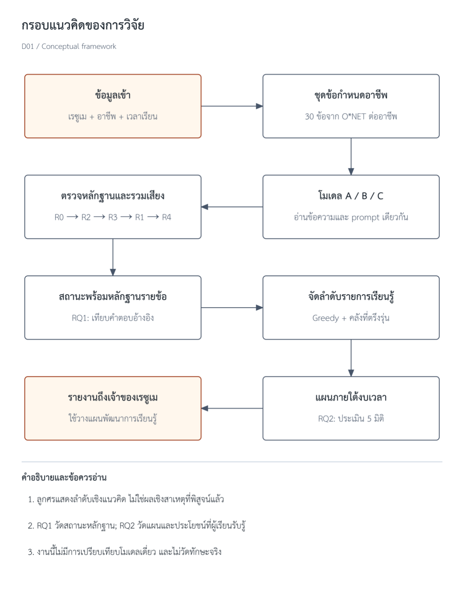

<!-- ถอดจาก PDF ฉบับขอสอบ หน้า 18–22 โดย scripts/pdf_to_markdown.py -->

# บทที่ 2 เอกสารและงานวิจัยที่เกี่ยวข้อง

หมายเหตุเรื่องการนับหมายเลขเอกสารอ้างอิง หมายเลขในวงเล็บเหลี่ยมเรียงตามลำดับการอ้างครั้งแรกของทั้งเล่มตามรูปแบบ IEEE เอกสารอ้างอิงหมายเลข [1] ถึง [5] ถูกอ้างครั้งแรกไปแล้วในบทที่ 1 การอ้างในบทนี้บางหัวข้อจึงเริ่มจากหมายเลขที่มากกว่า ไม่ใช่การเรียงลำดับผิด

บทนี้จัดกลุ่มเอกสารและงานวิจัยตามแนวคิดที่นำมาใช้ออกแบบการศึกษา เริ่มจากการใช้ข้อมูลในเรซูเมเพื่อวางแผนพัฒนาทักษะ การอ่านข้อความจากเอกสาร การใช้ LLM วิเคราะห์ข้อความและข้อจำกัดด้านหลักฐาน การรวมผลจากหลายโมเดล ข้อมูลอ้างอิงอาชีพ และการแนะนำรายการเรียนรู้ แต่ละหัวข้ออธิบายนิยามหรือผลจากแหล่งอ้างอิง และเหตุผลที่นำแนวคิดนั้นมาใช้ในการศึกษานี้

## 2.1 ข้อมูลในเรซูเมกับการวางแผนพัฒนาทักษะ

เรซูเมถูกใช้เป็นข้อมูลตั้งต้นในสองบริบทที่มีเป้าหมายต่างกัน บริบทแรกคือการคัดเลือกบุคลากร ซึ่งผู้ใช้ผลลัพธ์คือองค์กรและเป้าหมายคือจัดอันดับหรือคัดกรองผู้สมัคร บริบทที่สองคือการให้คำแนะนำแก่เจ้าของเอกสารเอง ซึ่งผู้ใช้ผลลัพธ์คือผู้เรียนและเป้าหมายคือระบุสิ่งที่ควรศึกษาเพิ่มเติม การศึกษานี้อยู่ในบริบทที่สอง ผลวิเคราะห์จึงส่งกลับให้เจ้าของเรซูเมเท่านั้น และไม่ถูกใช้จัดอันดับระหว่างบุคคล

งานที่ประเมินการใช้ LLM กับเรซูเมให้ข้อมูลที่เป็นประโยชน์กับทั้งสองบริบท Vaishampayan และคณะ [1] เปรียบเทียบคะแนนความเหมาะสมของผู้สมัครกับตำแหน่งที่ GPT-4 ให้กับเรซูเม 736 ฉบับ เทียบกับคะแนนของผู้ประเมินที่เป็นมนุษย์ และรายงานว่าความสัมพันธ์ระหว่างคะแนนทั้งสองชุดอยู่ในระดับต่ำ ส่วน de Quadros และคณะ [2] ประเมินโมเดล 6 โมเดลในงานสกัดข้อมูลเชิงโครงสร้างจากเรซูเมภาษาโปรตุเกส โดยเปรียบเทียบการใช้ prompt แบบไม่ให้ตัวอย่าง (zero-shot) กับแบบให้ตัวอย่างหนึ่งรายการ (one-shot) และรายงานว่าความแตกต่างระหว่างโมเดลมีนัยสำคัญทางสถิติ

งานที่นำมาทบทวนสองเรื่องนี้รายงานผลที่ระดับคะแนนรวมหรือค่าความคล้าย และไม่ได้กำหนดให้โมเดลชี้ตำแหน่งข้อความที่ใช้ตัดสิน การศึกษานี้จึงมุ่งให้ผู้ใช้ตรวจสอบข้อความที่รองรับผลวิเคราะห์ได้รายข้อ

## 2.2 การอ่านข้อความจากเอกสารด้วย OCR

เรซูเมที่ผู้ใช้ส่งเข้าระบบมีสองแบบที่ต่างกัน แบบแรกคือไฟล์ PDF ที่ผลิตจากโปรแกรมประมวลผลคำและยังมีชั้นข้อความอยู่ การดึงข้อความจากไฟล์แบบนี้ทำได้จากชั้นข้อความโดยตรง แบบที่สองคือไฟล์สแกนซึ่งเป็นภาพล้วน ต้องใช้การอ่านข้อความจากเอกสารด้วย OCR (Optical Character Recognition) ความแตกต่างนี้มีผลต่อการรายงาน เพราะระบบที่อ่านจากชั้นข้อความแต่รายงานว่าใช้ OCR ทำให้ผู้อ่านเข้าใจว่าระบบผ่านการทดสอบกับเอกสารสแกนแล้ว

Smith [6] อธิบายสถาปัตยกรรมของ Tesseract ซึ่งเป็นเครื่องมือ OCR แบบโอเพนซอร์สที่ยังใช้อ้างอิงเป็นฐานเปรียบเทียบในงานรุ่นหลัง ส่วนบริการเชิงพาณิชย์อย่าง Google Document AI [7] ให้ processor เฉพาะทางสำหรับงาน OCR พร้อมข้อมูลตำแหน่งของข้อความในหน้า ซึ่งจำเป็นเมื่อระบบต้องอ้างตำแหน่งของหลักฐาน การศึกษานี้เลือก Document AI เป็นบริการหลักตามเหตุผลด้านข้อมูลตำแหน่ง และกำหนดให้ระบบบันทึกชื่อบริการกับรุ่นที่ใช้จริงทุกรอบ เพื่อไม่ให้การสลับไปใช้บริการสำรองเกิดขึ้นโดยไม่มีร่องรอย เอกสารอ้างอิง [7] ใช้รองรับความสามารถของบริการตามที่ผู้ให้บริการประกาศ ไม่ใช่บันทึกการใช้งานของโครงการ

## 2.3 การใช้ LLM วิเคราะห์ข้อความและข้อจำกัดด้านหลักฐาน

Ji และคณะ [3] ทบทวนพฤติกรรม hallucination ในงานสร้างภาษาธรรมชาติ และชี้ว่าโมเดลมีแนวโน้มสร้างข้อความที่อ่านแล้วน่าเชื่อแต่ไม่มีแหล่งรองรับ การศึกษานี้ใช้แนวคิดดังกล่าวเป็นที่มาของนิยามความคลาดเคลื่อนของข้อมูลในหัวข้อ 1.6 แต่จำกัดขอบเขตให้วัดได้ด้วยกฎ จึงไม่ถือว่าทุกข้อสรุปที่ไม่ผ่านกฎเป็น hallucination ตามนิยามทั่วไปของงานนั้น

ในด้านการวัดว่าข้อความมีแหล่งรองรับหรือไม่ Rashkin และคณะ [4] เสนอกรอบ Attributable to Identified Sources (AIS) ซึ่งให้ผู้ประเมินตัดสินว่าข้อความที่ระบบสร้างขึ้นได้รับการรองรับจากแหล่งข้อมูลที่ระบุไว้หรือไม่ กรอบนี้เป็นการประเมินโดยมนุษย์ตามเกณฑ์ที่กำหนด ไม่ใช่การค้นหาข้อความย่อยโดยอัตโนมัติ Min และคณะ [8] เสนอ FActScore ซึ่งแตกข้อความยาวเป็นข้อเท็จจริงย่อยแล้วให้คะแนนความถูกต้องทีละหน่วยเทียบกับฐานความรู้ ส่วน Gao และคณะ [9] เสนอวิธี Retrofit Attribution using Research and Revision (RARR) ที่ค้นหาหลักฐานหลังการสร้างข้อความแล้วแก้ไขข้อความให้ตรงกับหลักฐานที่ค้นได้ แนวคิดร่วมของสามงานนี้คือการแยกขั้นสร้างข้อความออกจากขั้นตรวจสอบ

การศึกษานี้ใช้แนวคิดการแยกสองขั้นดังกล่าวในรูปแบบที่แคบลง คือกำหนดให้โมเดลคัด

ลอกข้อความจากเอกสารมาตรงตัว แล้วให้โปรแกรมตรวจว่าข้อความนั้นปรากฏในเอกสารจริงและมีคำที่เกี่ยวข้องกับข้อกำหนดหรือไม่ วิธีนี้ไม่ต้องเรียกโมเดลเพิ่มและให้ผลเดิมทุกครั้งที่ข้อมูลเข้าเหมือนกัน ข้อแลกเปลี่ยนคือการตรวจระดับข้อความยืนยันได้เพียงว่าข้อความอ้างอิงผ่านเกณฑ์ที่กำหนด ไม่ได้รับรองว่าโมเดลตีความข้อความนั้นถูกต้อง ความถูกต้องของสถานะสุดท้ายจึงต้องประเมินเทียบกับชุดคำตอบอ้างอิงที่จัดทำแยกจากผลของระบบ

## 2.4 การรวมผลจากหลายโมเดล

Wang และคณะ [10] แสดงว่าการสุ่มคำตอบหลายเส้นทางจากโมเดลเดียวแล้วเลือกคำตอบที่ปรากฏบ่อยที่สุด ให้ความแม่นยำสูงกว่าการเลือกผลลัพธ์ที่มีความน่าจะเป็นสูงสุดทีละขั้น (greedy decoding) ในงานให้เหตุผล ผลดังกล่าวเป็นแรงสนับสนุนทางแนวคิดว่าการพิจารณาคำตอบหลายชุดช่วยลดการพึ่งพาคำตอบเดียว แต่ไม่ใช่หลักฐานว่าการใช้โมเดลจากผู้ให้บริการสามรายให้ผลดีกว่าวิธีอื่นในงานนี้ การศึกษานี้เลือกใช้โมเดลจากผู้ให้บริการต่างรายโดยให้เหตุผลว่าคำตอบจากโมเดลเดียวกันมีแนวโน้มคลาดเคลื่อนในทิศทางเดียวกัน แต่ไม่ได้ศึกษาความสัมพันธ์ของความผิดพลาดระหว่างโมเดล จึงไม่อ้างว่าความผิดพลาดของทั้งสามโมเดลเป็นอิสระทางสถิติ

การให้โมเดลตัดสินผลของโมเดลอื่นเป็นอีกทางเลือกหนึ่ง Zheng และคณะ [11] วัดความสอดคล้องระหว่างโมเดลผู้ตัดสินกับมนุษย์ในงานเปรียบเทียบคำตอบและพบว่าอยู่ในระดับสูง แต่ก็รายงานความลำเอียงเชิงตำแหน่งของตัวเลือกและแนวโน้มที่โมเดลให้คะแนนคำตอบยาวสูงกว่า การศึกษานี้จึงไม่ใช้โมเดลเป็นผู้ตัดสิน แต่ใช้กฎที่เขียนด้วยโปรแกรมตรวจว่าข้อความที่โมเดลยกมาปรากฏจริงในเอกสารหรือไม่ เพราะกฎแบบนี้ให้ผลเดิมทุกครั้งและอธิบายได้ว่าข้อสรุปหนึ่งถูกปฏิเสธเพราะเหตุใด ข้อสรุปเรื่องความลำเอียงข้างต้นจำกัดอยู่ในบริบทการทดลองของงานนั้น และไม่ใช้เป็นเหตุผลปฏิเสธการใช้โมเดลเป็นผู้ตัดสินในทุกกรณี

## 2.5 ข้อมูลอ้างอิงอาชีพจากฐานข้อมูล O*NET

การศึกษานี้ใช้ฐานข้อมูล O*NET [5] เป็นแหล่งข้อกำหนดอ้างอิงของอาชีพ ฐานข้อมูลนี้อธิบายอาชีพด้วยองค์ประกอบหลายกลุ่ม เช่น Essential Skills, Transferable Skills, Knowledge และ Work Activities พร้อมค่าความสำคัญและค่าระดับที่ได้จากการสำรวจ องค์ประกอบแต่ละรายการมีรหัสกำกับ จึงใช้เชื่อมโยงผลวิเคราะห์กับข้อมูลต้นทางได้ ฐานข้อมูลรุ่น 31.0 เผยแพร่ภายใต้สัญญาอนุญาต Creative Commons Attribution 4.0 การศึกษานี้ใช้ค่าความสำคัญเป็นฐานของน้ำหนัก และไม่ใช้กลุ่ม Abilities เพราะองค์ประกอบในกลุ่มนั้นอธิบายความสามารถเชิงจิตวิทยาที่ไม่ปรากฏเป็นข้อความในเรซูเม

เนื่องจาก O*NET อธิบายอาชีพในบริบทของสหรัฐอเมริกา การนำมาใช้ในการศึกษานี้จึงเป็นการใช้เกณฑ์อ้างอิงเพื่อวางแผนพัฒนาทักษะ ผลวิเคราะห์ไม่ได้แสดงว่าผู้เรียนมีคุณสมบัติครบตามเงื่อนไขการรับสมัครงานขององค์กรในประเทศไทย

ฝั่งยุโรปใช้ระบบจัดหมวดหมู่ทักษะ (taxonomy) ชื่อ ESCO เป็นฐานอ้างอิง งานสกัดทักษะจำนวนมากจึงตั้งโจทย์เป็นการจับคู่ข้อความกับรหัสในระบบจัดหมวดหมู่ Magron และคณะ [12] เสนอ JOBSKAPE ซึ่งสร้างประกาศงานสังเคราะห์ที่มีหลายทักษะต่อประโยค แล้วใช้ชุดข้อมูลนั้นฝึกการจับคู่ทักษะกับ ESCO ผลของงานนั้นแสดงว่าข้อมูลสังเคราะห์ที่กำหนดเงื่อนไขไว้ล่วงหน้าใช้ประเมินระบบจับคู่ได้ การศึกษานี้ใช้เหตุผลเดียวกันในการสร้างชุดทดสอบ โดยกำหนดเฉลยของหลักฐานก่อนแล้วจึงประกอบข้อความเรซูเมขึ้นจากเฉลยนั้น ทั้งนี้การสร้างข้อมูลสังเคราะห์ในบริบทของประกาศงานไม่ได้ยืนยันคุณภาพของชุดทดสอบสามกรณีในโครงการนี้โดยอัตโนมัติ

## 2.6 การแนะนำรายการเรียนรู้และประโยชน์ที่ผู้เรียนรับรู้

Li และคณะ [13] ทบทวนงานแนะนำเส้นทางการเรียนรู้ที่ใช้กราฟความรู้ และอธิบายความต่างระหว่างรายการเรียนรู้ที่จัดอันดับตามความเกี่ยวข้อง กับเส้นทางที่กำหนดความสัมพันธ์ของการเรียนระหว่างหัวข้อ ประเด็นที่งานทบทวนนั้นระบุว่ายังเป็นข้อจำกัดคือความสามารถในการอธิบายเหตุผลของคำแนะนำ

การศึกษานี้เลือกคำแนะนำจากคลังรายการเรียนรู้ที่กำหนดไว้ล่วงหน้า และเลือกรายการด้วย Greedy algorithm ที่มีเกณฑ์ประกาศไว้ก่อน ทุกคำแนะนำจึงระบุได้ว่าครอบคลุมข้อกำหนดข้อใด ใช้เวลาเท่าใด และเหลือช่องว่างข้อใดที่ยังไม่มีรายการรองรับ ข้อแลกเปลี่ยนคือคุณภาพของแผนขึ้นกับความครอบคลุมของคลังโดยตรง หากคลังไม่มีรายการที่ตรงกับช่องว่างข้อหนึ่ง ระบบรายงานว่าไม่มีรายการรองรับแทนการเสนอรายการที่ใกล้เคียง ตามนิยามในหัวข้อ 1.6 ผลลัพธ์ของระบบเป็นลำดับความสำคัญ ไม่ใช่เส้นทางที่ยืนยัน prerequisite ครบถ้วน

ความเหมาะสมของแผนแบ่งได้เป็นสองส่วน ส่วนแรกตรวจได้จากข้อมูล ได้แก่ ความสอดคล้องระหว่างช่องว่างกับเนื้อหาของรายการ ความครอบคลุมของช่องว่าง ความถูกต้องของชื่อและแหล่งที่มา และชั่วโมงรวมที่ไม่เกินเวลาที่ผู้เรียนจัดสรรได้ ส่วนที่สองขึ้นกับผู้เรียน คือผู้เรียนเห็นว่ารายงานช่วยระบุสิ่งที่ควรเริ่ม ช่วยจัดลำดับการพัฒนา และเหมาะกับเวลาของตนเพียงใด แนวคิดประโยชน์ที่รับรู้ของ Davis [14] ใช้เป็นกรอบกำหนดคำถามของส่วนหลัง การศึกษานี้ไม่ได้ทดสอบแบบจำลองการยอมรับเทคโนโลยีหรือความสัมพันธ์เชิงสาเหตุระหว่างตัวแปร และไม่เรียกแบบสอบถามที่ปรับขึ้นใช้ในงานนี้ว่ามาตรวัดฉบับสมบูรณ์

## 2.7 การสังเคราะห์งานที่เกี่ยวข้องและกรอบแนวคิดของการศึกษา

ตารางที่ 2.1 เปรียบเทียบงานที่นำมาทบทวนกับการศึกษานี้ในสี่มิติเดียวกัน ได้แก่ ข้อมูลที่ใช้ หน่วยของผลลัพธ์ วิธีตรวจหลักฐาน และการจัดการเมื่อยังสรุปไม่ได้ ข้อความ "ไม่ระบุในส่วนที่ทบทวน" หมายถึงยังไม่พบข้อมูลดังกล่าวจากส่วนที่ผู้วิจัยอ่าน ไม่ใช่ข้อยืนยันว่างานต้นทางไม่มีคุณลักษณะนั้น

**ตารางที่ 2.1  การเปรียบเทียบงานที่นำมาทบทวนกับการศึกษานี้**

| งาน | ข้อมูลที่ใช้ | หน่วยของผลลัพธ์ | วิธีตรวจหลักฐาน | การจัดการเมื่อยังสรุปไม่ได้ |
|---|---|---|---|---|
| Vaishampayan และคณะ [1] | เรซูเมจริง 736 ฉบับ | คะแนนความเหมาะสมต่อตำแหน่ง | ไม่ระบุในส่วนที่ทบทวน | ไม่ระบุในส่วนที่ทบทวน |
| de Quadros และคณะ [2] | เรซูเมภาษาโปรตุเกส | เขตข้อมูลที่สกัดได้ | ไม่ระบุในส่วนที่ทบทวน | ไม่ระบุในส่วนที่ทบทวน |
| Min และคณะ [8] | ข้อความยาวที่โมเดลสร้าง | ข้อเท็จจริงย่อย | ตรวจข้อเท็จจริงย่อยกับฐานความรู้ | ไม่ระบุในส่วนที่ทบทวน |
| Gao และคณะ [9] | ข้อความที่โมเดลสร้าง | ข้อความหลังแก้ไข | ค้นหลักฐานแล้วแก้ข้อความ | ไม่ระบุในส่วนที่ทบทวน |
| Magron และคณะ [12] | ประกาศงานสังเคราะห์ | คู่ประโยคกับรหัสทักษะ | เทียบกับเฉลยที่กำหนดไว้ล่วงหน้า | ไม่ระบุในส่วนที่ทบทวน |
| การศึกษานี้ | เรซูเม PDF ที่อ่านด้วย OCR | สถานะของข้อกำหนดอ้างอิงรายข้อ | ตรวจข้อความที่โมเดลยกมาด้วยกฎ R2 และ R3 | มีสถานะ abstained แยกจาก missing |

กรอบแนวคิดของการศึกษาสรุปความสัมพันธ์ระหว่างข้อมูลเข้า การวิเคราะห์หลักฐาน การจัดแผน และผลลัพธ์ตามคำถามวิจัย ดังแสดงในรูปที่ 2.1

*รูปที่ 2.1  กรอบแนวคิดของการวิจัย*
