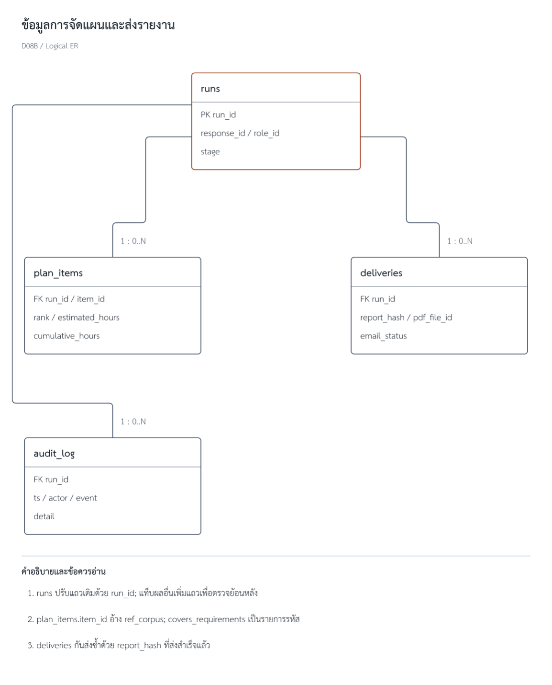
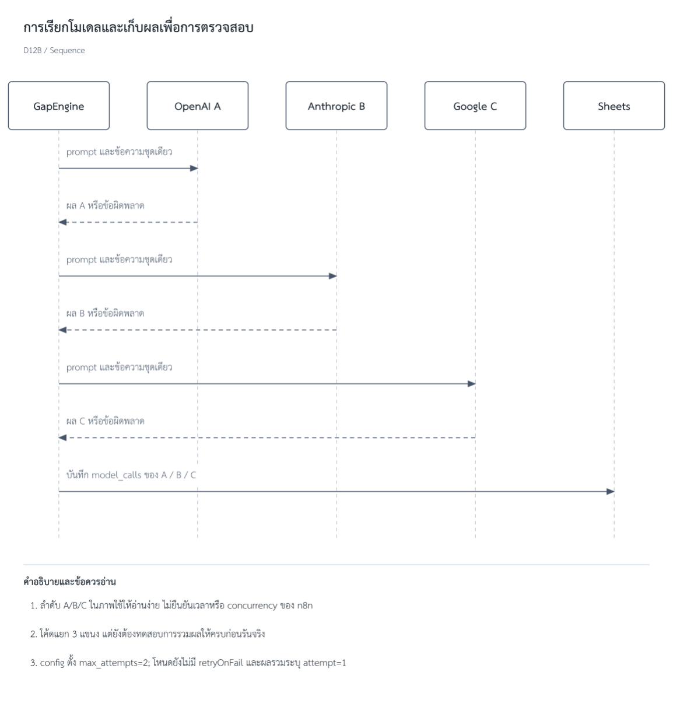
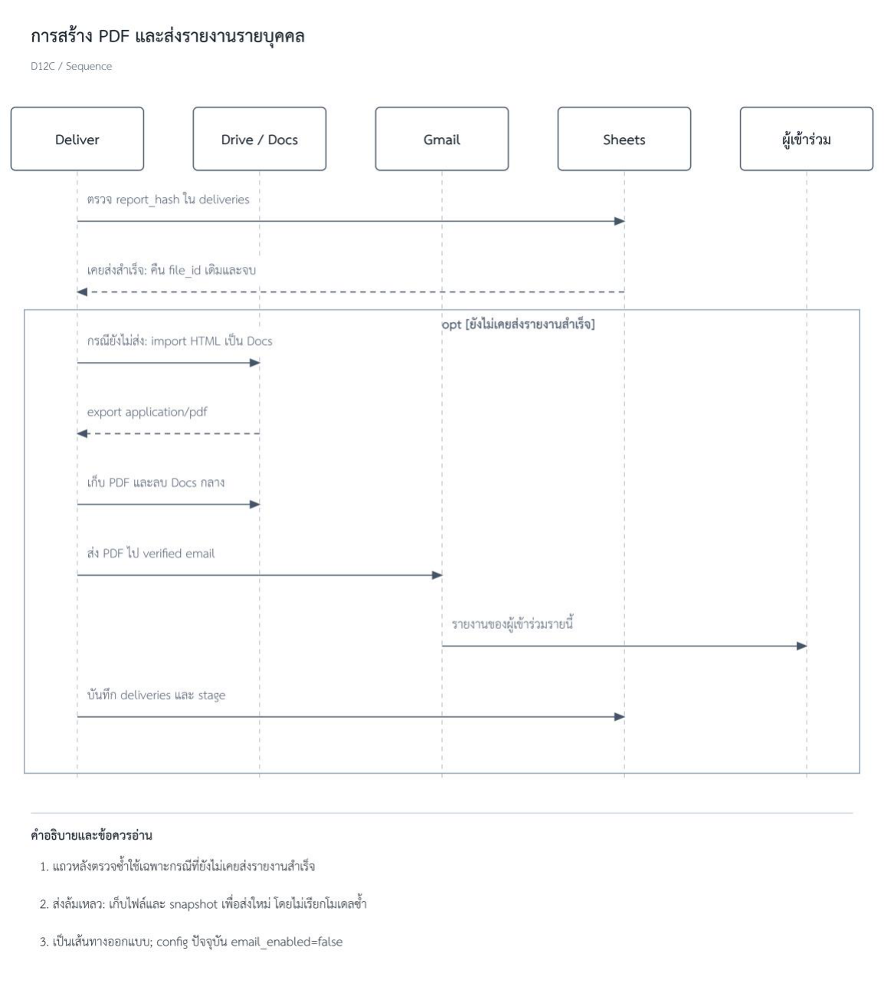

<!-- ถอดจาก PDF ฉบับขอสอบ หน้า 105–112 โดย scripts/pdf_to_markdown.py -->

*รูปที่ จ.1  การตรวจคลังรายการเรียนรู้และความเชื่อมโยง*

*รูปที่ จ.2  แบบจำลองข้อมูลการส่งรายงานและการตรวจสอบย้อนหลัง*

*รูปที่ จ.3  แบบจำลองข้อมูลฟอร์มและการประเมิน*

*รูปที่ จ.4  กิจกรรมเมื่อเกิดข้อยกเว้นและการกู้คืนงาน*

*รูปที่ จ.5  ลำดับการเรียกโมเดลและรวมผล*

*รูปที่ จ.6  ลำดับการสร้างและส่งรายงาน*

*รูปที่ จ.7  การรวมเสียงและการสรุปสถานะหลักฐาน*

*รูปที่ จ.8  ตัวอย่างการเลือกแผนภายใต้งบเวลา*
