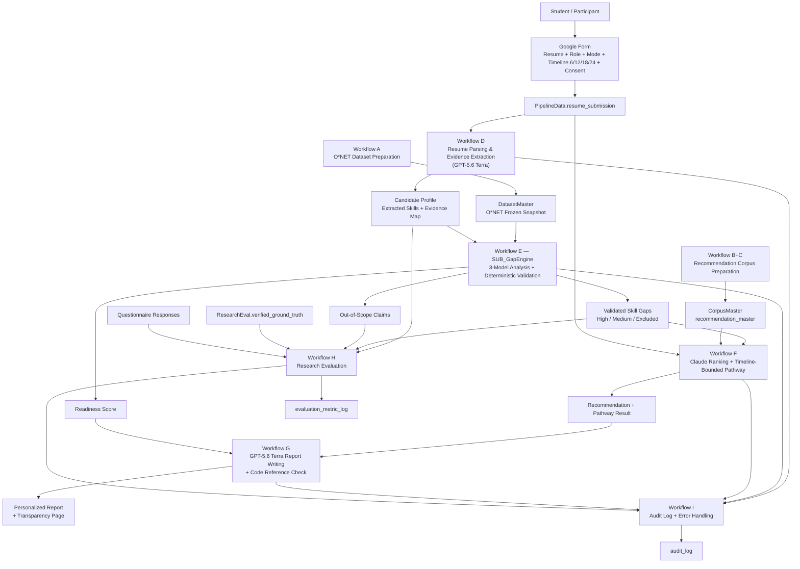

# System Architecture v3

**Project:** A Multi-Model Generative-AI Framework for Reducing Hallucination in Resume-Based Skill-Gap Analysis and Personalized Learning Pathways

**Reference Document:** `IS1_Proposal_v11.docx` (บทที่ 1–3 ฉบับสมบูรณ์) — **แทนที่ Proposal 07JUL26 ทั้งฉบับ**

**Companion Documents:** `Guideline_IS_n8n.md` (v1) · `Guideline_IS_n8n_v2.md` · `Guideline_IS_n8n_v3.md`

**Architecture Status:** Build-ready specification — ใช้เป็น guideline ในการพัฒนาระบบจริง

**Primary Implementation Platform:** n8n + Google Workspace + LLM APIs

**Version:** 3.0 · **Date:** 26 สิงหาคม 2026 · **สถานะ:** ฉบับสมบูรณ์ พร้อมลงมือพัฒนา

**หลักการเลือกโมเดล:** เลือกรุ่นที่ทำให้ **ตั้งค่า reasoning ให้ใกล้เคียงกันได้มากที่สุดทั้งสามโมเดล** เพราะการควบคุมตัวแปรสำคัญกว่าการได้รุ่นใหม่ที่สุด

**การตัดสินใจที่ปิดแล้วใน v3:** DECISION-01 — ใช้ **GLM 5.2 พร้อมปิด reasoning** (ทางเลือก A) ดูบันทึกการตัดสินใจใน §0.0

---

## 0. Decision Record และ Change Log

### 0.0 DECISION-01 — GLM 5.2 + ปิด reasoning (ปิดการตัดสินใจแล้ว)

**คำถามที่ตัดสิน:** ควรใช้ GLM 5.2 แล้วปิด reasoning หรือใช้ GLM 5.3 แล้วเปิด reasoning ให้ทุกโมเดลเหมือนกัน

**ผลการตัดสิน: ทางเลือก A — GLM 5.2 + ปิด reasoning ทุกโมเดลเท่าที่ผู้ให้บริการอนุญาต**

| | **A — GLM 5.2 ปิด** ✅ เลือก | B — GLM 5.3 เปิด `low` |
|---|---|---|
| ความสมมาตรของ config | **ปิดสนิทได้ 2 จาก 3 โมเดล** | ปิดสนิทได้ 1 จาก 3 |
| หน่วยที่ใช้ควบคุม | ทุกค่ายมีจุดอ้างอิงร่วมคือ "ต่ำสุด/ปิด" ซึ่งตรวจสอบได้ด้วย `reasoning_tokens` | สามค่ายใช้สเกลคนละแบบ (`reasoning_effort` / `budget_tokens` / `thinking_level`) เทียบกันไม่ได้ |
| ความเสี่ยง deprecation | 🔴 **สูง** — เป็นรุ่นก่อนหน้าหลัง 5.3 ออก 14 ส.ค. 2026 | 🟢 ต่ำ |
| ต้นทุน / latency | ต่ำกว่า | สูงกว่า (reasoning token คิดราคาแบบ output) |
| เสี่ยง JSON ถูกตัดกลาง | ต่ำ | สูงกว่า — reasoning token กิน `max_tokens` |
| open-weight baseline | ไม่มี | 🟡 มีโอกาส |

**เหตุผลหลักของการเลือก A:** *"ปิด" เป็นจุดอ้างอิงร่วมที่ตรวจสอบได้เชิงประจักษ์ แต่ "เปิดเท่ากัน" นิยามไม่ได้* — ไม่มีหลักการใดบอกได้ว่า GLM `low` เท่ากับ Claude `budget_tokens=4000` หรือเท่ากับ Gemini `low` การอ้างในเล่มว่าตั้งค่าเท่ากันทั้งที่สเกลเทียบกันไม่ได้ จะแย่กว่าการประกาศความไม่สมมาตรอย่างตรงไปตรงมา นอกจากนี้ GLM 5.3 ใช้ base model เดียวกับ 5.2 ต่างกันที่ post-training เท่านั้น ประโยชน์ด้านความสามารถจึงไม่ชดเชยต้นทุนเชิงวิธีวิจัย

**⚠ ต้นทุนที่ยอมรับแล้วและต้องบริหาร:**

| ประเด็น | การรับมือที่ผูกไว้ในเอกสารนี้ |
|---|---|
| GLM 5.2 เป็นรุ่นก่อนหน้า → เสี่ยงถูก deprecate | **GATE-01** ต้องยืนยัน EOL date กับ Z.ai ก่อนเริ่มพัฒนา (§2.3.2) |
| เสียโอกาส open-weight baseline | ชดเชยด้วย **replay harness** (§13.5) ที่ให้ reviewer คำนวณผลซ้ำจาก raw log โดยไม่ต้องมี API key |
| อาจถูกแย้งว่า baseline ถูกทำให้อ่อนเกินจริง | เพิ่ม **robustness check เงื่อนไข C10** รัน reasoning เปิดบน 10 เรซูเม (§12.2, §12.5) |
| parity ไม่สมบูรณ์เพราะ Gemini ปิดไม่ได้ | **PROTOCOL-01** วัด `reasoning_tokens` จริงและรายงานเป็นหลักฐาน (§2.3.3) |

**สิ่งที่ตัดออกอย่างชัดเจนเพื่อไม่ให้ scope บานปลาย:** ไม่ทำการเปรียบเทียบ "ปิด vs เปิด" เป็นปัจจัยที่สองของการทดลอง เพราะจะกลายเป็น 2 × 4 = 8 เงื่อนไข ต้องมี RQ ใหม่และสถิติ interaction ซึ่งเกินขอบเขตของ IS 6 เดือนที่ n = 30 — C10 เป็นเพียง robustness check เชิงสำรวจ ไม่ใช่เงื่อนไขหลัก

---

### 0.1 การเปลี่ยนแปลงที่สั่งมาโดยตรง

| # | เปลี่ยนอะไร | v1 | **v2** | กระทบส่วนใด |
|---|---|---|---|---|
| **1** | **Report writer / OpenAI model** | ChatGPT 5.5 | **GPT-5.6 Terra** (`gpt-5.6-terra`) | §2.4, §5.3, §12, §18 |
| **2** | **Target timeline option** | 6 / 12 / **15** / 24 เดือน | 6 / 12 / **18** / 24 เดือน | §1, §2.8, §3.1, §9.2, §9.5, §11.6, §17 |
| **3** | **Model A** | GLM 5.2 | **GLM 5.2 + ปิด reasoning** *(DECISION-01)* | §0.0, §2.3.1 |

> เหตุผลเต็มของข้อ 3 อยู่ใน §0.0 DECISION-01

### 0.2 การเปลี่ยนแปลงที่ตามมาโดยจำเป็น (เพื่อให้เอกสารสอดคล้องกับ Proposal v11)

| # | เปลี่ยนอะไร | v1 | **v2** | เหตุผล |
|---|---|---|---|---|
| 4 | **Model C** | Gemini 3.1 | **Gemini 3.7 Flash** | Proposal v11 §1.5(3), §3.5.1, §3.8 และแบบเสนอหัวข้อที่อนุมัติแล้วระบุ 3.7 Flash — v1 ยังค้างที่ 3.1 |
| 5 | **Reference document** | Proposal 07JUL26 | **IS1_Proposal_v11.docx** | เอกสารฐานเปลี่ยน |
| 6 | **Resume parsing model** | "AI Agent" ไม่ระบุค่าย | **GPT-5.6 Terra** (ค่ายที่ไม่ใช่ analyst) | ตัด correlated bias — reviewer จะถามแน่ว่าใครสกัด |

### 0.3 สิ่งที่เพิ่มเข้ามาใหม่ (สะสมจาก Guideline v1–v3 และ v3 นี้)

| # | เพิ่มอะไร | อยู่ที่ |
|---|---|---|
| 7 | **Evidence Relevance Rule** — กฎตรวจความสอดคล้องเชิงความหมายด้วย code | §10.5, §10.6 |
| 8 | **Out-of-scope claim handling** — ข้ออ้างนอก O\*NET ถูกนับเข้า hallucination rate | §10.5, §13.3 |
| 9 | **`confidence` logged but never used in decisions** | §10.4, §10.5 |
| 10 | **`model_registry` table** — หลักฐาน reproducibility ตาม Proposal §3.9(3), §3.11 | §5.5 |
| 11 | **`reasoning_config`** — บันทึกค่า reasoning ที่ส่งไปจริงของแต่ละโมเดล เพื่อพิสูจน์ว่าตั้งค่าเท่ากันจริง | §2.3.1, §5.5 |
| 12 | **Workflow E แยกเป็น sub-workflow `SUB_GapEngine`** | §4, §10.2 |
| 13 | **Ablation conditions** — agreement only / +evidence / +relevance | §13.2 |
| 14 | **แผนวิเคราะห์ยกระดับ** — Holm–Bonferroni, bootstrap CI, Fleiss' kappa, repeat-run stability | §13.4 |
| 15 | **n8n Evaluations** เป็น test harness ทางการ | §16 |
| 16 | **Data governance ต่อผู้ให้บริการ + ขั้นตอนลบข้อมูลจริง** | §15.3 |
| 17 | **Corpus รวมเป็นตารางเดียว `recommendation_master`** | §5.2 |
| **18** | 🆕 **GATE-01** — decision gate เรื่อง EOL ของ `glm-5.2` ก่อนเริ่มพัฒนา | §2.3.2 |
| **19** | 🆕 **PROTOCOL-01** — วัด `reasoning_tokens` จริงเพื่อพิสูจน์ parity เชิงประจักษ์ | §2.3.3 |
| **20** | 🆕 **เงื่อนไข C10 `ROBUSTNESS_REASONING_ON`** — ตอบคำถาม "baseline อ่อนไปหรือเปล่า" ด้วย 10 เรซูเม | §12.2, §12.5 |

---

## 1. Architecture Purpose

เอกสารนี้อธิบาย System Architecture ฉบับละเอียดสำหรับงานวิจัยเรื่องการลด hallucination ในการวิเคราะห์ skill gap จาก resume และการสร้าง personalized learning pathway โดยยึด **IS1_Proposal_v11.docx** เป็นแหล่งอ้างอิงหลัก

เป้าหมายของ architecture นี้ไม่ใช่การสร้าง production SaaS แต่คือการสร้าง research artifact ที่:

1. อ่าน resume และสกัดทักษะโดยอ้างอิงหลักฐานจริงจากข้อความใน resume ได้
2. เปรียบเทียบ skill gap กับ required competencies จาก O\*NET frozen snapshot โดยไม่ให้ AI สร้าง required skills เอง
3. ใช้ LLM 3 ตัววิเคราะห์อย่างอิสระ แล้วให้ deterministic code layer เป็นผู้ตัดสินผลขั้นสุดท้าย
4. ลด unsupported skill-gap claims หรือ hallucination เมื่อเทียบกับ single-model baselines พร้อมรายงานต้นทุนของการกรอง
5. แนะนำ course/cert จาก whitelist ที่ผู้วิจัยตรวจสอบและ freeze ไว้ก่อนเก็บข้อมูลจริง
6. สร้าง learning pathway ตามกรอบเวลาที่ผู้ใช้เลือกตั้งแต่ต้น คือ **6, 12, 18 หรือ 24 เดือน**
7. เก็บ log, version, prompt, model output, reasoning config และ metric ให้ตรวจสอบย้อนกลับได้
8. **คำนวณผลลัพธ์ทั้งหมดซ้ำได้จาก raw log โดยไม่ต้องเรียก API ใหม่** (replay harness)

**หลักการที่ไม่มีวันเปลี่ยน:** *LLM อ่าน ตีความ และเรียบเรียง — Code เป็นผู้ตัดสินความจริง*

---

## 2. Core Design Principles

### 2.1 Evidence-Grounded Output

ทุก claim ที่เกี่ยวกับทักษะของผู้เข้าร่วมต้องอ้างอิง `evidence_text` จาก resume จริง

กฎสำคัญ:

- `evidence_text` ต้องเป็น substring ที่ตรวจสอบย้อนกลับได้จาก **evidence corpus** ซึ่งประกอบด้วย resume text ดิบ **บวกกับทุก string ใน structured profile JSON**
- skill ที่ไม่มี evidence ต้องถูกตัดออกหรือบันทึกเป็น unsupported claim
- report ต้องแสดง evidence trace ในส่วนที่เกี่ยวข้อง
- ระบบต้องบันทึก `evidence_verified_ratio` ต่อ submission เป็นตัวชี้วัดคุณภาพขั้นสกัด

### 2.2 O\*NET-Grounded Role Requirements

Required skills ของแต่ละ target role ต้องมาจาก O\*NET snapshot เท่านั้น ไม่ให้ LLM แต่งรายการทักษะที่ตำแหน่งงานต้องการเอง

กฎสำคัญ:

- target role ทั้ง 20 roles ต้อง map กับ O\*NET SOC code ล่วงหน้า
- role ที่ไม่มี O\*NET match ตรงต้องถูกระบุเป็น proxy mapping พร้อมเหตุผล
- required skill lookup ต้องเป็น deterministic Google Sheets / Code lookup
- O\*NET snapshot ต้องมี `snapshot_version`, source version, checksum และ row count
- **ข้ออ้างที่กล่าวถึงสมรรถนะนอก required set ต้องถูกตัดออกก่อนนับเสียง และบันทึกเป็น `out_of_scope_claim`** (Proposal v11 §3.5.2)

### 2.3 Three-Model Independent Analysis

LLM 3 ตัวจากสามผู้ให้บริการวิเคราะห์ input เดียวกันอย่างอิสระ:

| Model | Vendor | Condition tag | Model ID |
|---|---|---|---|
| **GLM 5.2** | Zhipu / Z.ai | `GLM-5.2` | `glm-5.2` |
| **Claude Sonnet 5** | Anthropic | `Claude-Sonnet-5` | `claude-sonnet-5` |
| **Gemini 3.7 Flash** | Google | `Gemini-3.7-Flash` | `gemini-3.7-flash` |

input ของทั้ง 3 โมเดลต้องเหมือนกันทุกประการ:

- structured resume profile
- evidence map
- target role
- O\*NET required skill list
- prompt version เดียวกัน (`GA-3.0`)
- temperature เดียวกัน (0.2)

output ของแต่ละโมเดลเป็น **candidate judgment เท่านั้น** ยังไม่ถือเป็นความจริงสุดท้าย

#### 2.3.1 Reasoning Configuration Parity (สำคัญ — เป็นเหตุผลของการเลือกรุ่น)

แกนของการออกแบบการทดลองคือ *"ตัวแปรเดียวที่ต่างระหว่างสามเงื่อนไขคือความหลากหลายของโมเดล"* ดังนั้นโหมดการให้เหตุผลของทั้งสามโมเดลต้องตั้งค่าให้ใกล้เคียงกันมากที่สุด **นี่คือเกณฑ์ที่ใช้เลือกรุ่นของแต่ละโมเดล ไม่ใช่ความใหม่ของรุ่น**

**นโยบายที่ระบบต้องบังคับ:**

| Model | การตั้งค่า | บันทึกใน `model_registry` | ปิด reasoning ได้จริงหรือไม่ |
|---|---|---|---|
| **GLM 5.2** | `thinking: {"type": "disabled"}` | `thinking=disabled` | ✅ ปิดได้ ⚠ ยืนยันกับ docs |
| **Claude Sonnet 5** | ไม่ส่ง `thinking` block (extended thinking ปิดโดย default) | `thinking=off` | ✅ ปิดได้ |
| **Gemini 3.7 Flash** | `thinkingConfig.thinkingLevel: "minimal"` | `thinkingLevel=minimal` | 🟡 **ใกล้เคียงที่สุด แต่ไม่ใช่ศูนย์** |

**สิ่งที่ต้องพูดตามตรง:** ตระกูล Gemini 3.x เปลี่ยนจากระบบ `thinking_budget` (ซึ่งตั้งเป็น 0 เพื่อปิดได้) มาเป็นระบบระดับ `thinking_level` โดยรุ่น **Flash รองรับระดับ `minimal`** ซึ่งเป็นระดับต่ำสุดและถือเป็น "ใกล้เคียงการปิดที่สุด" แต่เอกสารไม่ได้รับประกันว่าเป็นศูนย์ ส่วนรุ่น Pro ปิดไม่ได้เลย

⚠ **ต้องยืนยันว่า `gemini-3.7-flash` รองรับ `thinkingLevel: "minimal"` จริง** ก่อน implement ถ้ารองรับเพียง `low` ให้ใช้ `low` แล้วบันทึกไว้

**ข้อความสำเร็จรูปสำหรับ Proposal §3.5.1:**

> ทั้งสามโมเดลได้รับ prompt เดียวกัน schema เดียวกัน ค่า temperature เดียวกัน และตั้งค่าโหมดการให้เหตุผลให้ปิดหรืออยู่ที่ระดับต่ำสุดที่ผู้ให้บริการอนุญาต ค่าที่ส่งไปจริงของแต่ละโมเดลถูกบันทึกไว้ใน model registry งานวิจัยจึงควบคุมตัวแปรด้านการให้เหตุผลได้ในระดับที่เทียบเคียงกัน โดยระบุไว้ว่าผู้ให้บริการบางรายอนุญาตให้ลดระดับได้ต่ำสุดเพียงระดับหนึ่ง ไม่ใช่ปิดสนิท

**ผลพลอยได้จากการปิด reasoning ทั้งสามตัว:**

| ผล | รายละเอียด |
|---|---|
| ✅ ความแปรผันระหว่างรันต่ำลง | ทำให้ผลลัพธ์เสถียรขึ้นและตีความง่ายขึ้น |
| ✅ ต้นทุนและ latency ต่ำลง | ไม่มี reasoning token เข้ามาใน output |
| ✅ ข้ออ้างเรื่องการควบคุมตัวแปรแข็งขึ้น | ตอบ reviewer ได้ตรง ๆ ว่าตั้งค่าเท่ากัน |
| ⚠ **ยังต้องวัด repeat-run stability อยู่ดี** | temperature 0.2 ไม่ใช่ 0 และ LLM เชิงพาณิชย์ไม่รับประกัน determinism แม้ปิด reasoning — ยังต้องรันซ้ำ k=3 บน subsample 20% ตาม §12.4 ข้อ 5 |

#### 2.3.2 GATE-01 — ต้องยืนยัน EOL ของ `glm-5.2` ก่อนเริ่มพัฒนา

DECISION-01 เลือกรุ่นก่อนหน้าโดยเจตนา ความเสี่ยงเดียวที่สำคัญจึงเป็นการที่ผู้ให้บริการปิดรุ่นกลางการเก็บข้อมูล **ต้องผ่าน gate นี้ก่อนเริ่มงานเดือน 2**

| ผลการยืนยันจาก Z.ai | การกระทำ |
|---|---|
| ยืนยันให้บริการต่อ **เกิน 12 เดือน** | ✅ เดินหน้าตาม DECISION-01 บันทึกคำยืนยันและวันที่ลง `model_registry.notes` |
| ยืนยันได้ **6–12 เดือน** | 🟡 เดินหน้าได้ แต่ต้อง **บีบหน้าต่างเก็บข้อมูลให้ ≤ 3 สัปดาห์** และเตรียมแผนสำรองตาม §13.4 ให้พร้อมใช้ |
| **ยืนยันไม่ได้ หรือแจ้งว่าจะปิดภายใน 6 เดือน** | 🔴 **พลิกไปทางเลือก B ทันที** (GLM 5.3 + `reasoning_effort: low`) แล้วแก้ §2.3.1, §9.3, §15 ให้สอดคล้อง พร้อมเขียนความไม่สมมาตรเป็นข้อจำกัดใน Proposal §1.11 — ต้นทุนของการถูกตัดกลางทางสูงกว่าต้นทุนของความไม่สมมาตรมาก |

**ผู้รับผิดชอบ:** ผู้วิจัย · **กำหนดเสร็จ:** ก่อนสิ้นเดือน 1 · **หลักฐาน:** อีเมล/หน้าเอกสาร lifecycle บันทึกวันที่เข้าถึง

#### 2.3.3 PROTOCOL-01 — พิสูจน์ parity ด้วยตัวเลข ไม่ใช่ด้วยชื่อพารามิเตอร์

เนื่องจาก Gemini ปิด reasoning สนิทไม่ได้ ข้ออ้างเรื่องความสมมาตรต้องมีหลักฐานเชิงประจักษ์รองรับ ไม่ใช่อ้างจากชื่อค่าที่ตั้ง

**ขั้นตอน (ทำในช่วง pilot 5 คน ก่อน freeze):**

1. เรียก analyst ทั้งสามด้วย config จริงตาม §15 บนเรซูเม pilot ทั้ง 5 ชุด
2. บันทึก `reasoning_tokens` ต่อ call จากทุกค่าย (ถ้าค่ายใดไม่รายงาน ให้บันทึกว่า `not_reported` และใช้ผลต่างของ output token เทียบกับความยาวคำตอบเป็นตัวประมาณ)
3. คำนวณค่าเฉลี่ยต่อ call ของแต่ละโมเดล
4. รายงานเป็นตารางในภาคผนวกของเล่ม

**เกณฑ์ที่ประกาศไว้ล่วงหน้า (a priori):**

> ถือว่าการตั้งค่า reasoning อยู่ในระดับเทียบเคียงกันได้ เมื่อ `reasoning_tokens` เฉลี่ยต่อ call ของทุกโมเดล **ไม่เกิน 5% ของ output token ทั้งหมด** ของโมเดลนั้น หากโมเดลใดเกินเกณฑ์ ต้องรายงานค่าจริงและระบุไว้เป็นข้อจำกัดของการควบคุมตัวแปรอย่างชัดเจนใน Proposal §1.11 แทนการอ้างว่าตั้งค่าเท่ากัน

**ทำไมคุ้มค่าที่จะทำ:** ตารางนี้เปลี่ยนข้ออ้างจาก *"เราตั้งค่าให้เท่ากัน"* ซึ่งเป็นคำพูด เป็น *"นี่คือตัวเลขที่วัดได้"* ซึ่ง reviewer ตรวจได้ — เป็นหลักฐานที่แข็งกว่าและใช้ต้นทุนเพียง 15 API call

---

### 2.4 GPT-5.6 Terra-Assisted Report Writing

**GPT-5.6 Terra** ใช้เป็น model สำหรับเขียน final report และ learning pathway narrative หลังจาก deterministic validation, Claude-assisted ranking และ pathway allocation เสร็จแล้วเท่านั้น

| หัวข้อ | ค่า |
|---|---|
| Model ID | **`gpt-5.6-terra`** — ระบุ ID ตรง ๆ เสมอ ไม่พึ่ง alias |
| Endpoint | `https://api.openai.com/v1/chat/completions` |
| ตำแหน่งในตระกูล | **ระดับกลาง** ของ GPT-5.6 (Sol > **Terra** > Luna) |
| เหตุผลที่เลือก Terra | สมดุลระหว่างคุณภาพการสกัดกับต้นทุน — งานทั้งสองที่ OpenAI รับผิดชอบถูกล้อมด้วยโค้ดตรวจสอบทั้งสองด้านอยู่แล้ว (§2.4.1) จึงไม่จำเป็นต้องใช้ระดับสูงสุด |
| ⚠ ราคา | **แหล่งข้อมูลสาธารณะขัดกัน** — บางแหล่งระบุ $2.50/$15 ต่อ 1M token บางแหล่งระบุ $2/$12 หลังปรับราคา 30 ก.ค. 2026 → **ต้องตรวจหน้า pricing จริงก่อนคำนวณตารางต้นทุน** (§16.4) |
| ⚠ alias | **ห้ามใช้ alias `gpt-5.6`** เพราะ alias ชี้ไปที่ Sol ไม่ใช่ Terra — จะได้โมเดลผิดรุ่นโดยไม่รู้ตัว |

บทบาทของ GPT-5.6 Terra:

- เขียนรายงานให้อ่านง่ายและลื่นไหล
- อธิบาย verified gaps ด้วยภาษาที่ผู้เข้าร่วมเข้าใจ
- เรียบเรียงเหตุผลของ course/cert recommendation
- สรุป timeline-bounded learning pathway
- เขียน transparency section จาก validation log
- **แปลงเรซูเมเป็น structured profile ใน Workflow D** (§2.4.1)

ข้อห้าม:

- ห้ามเพิ่ม skill gap ใหม่
- ห้ามเลือก course/cert ใหม่
- ห้ามเปลี่ยน confidence tier
- ห้ามแก้ readiness score
- ห้ามเปลี่ยน timeline allocation
- ต้องเขียนจาก verified JSON payload เท่านั้น

หลังเขียนรายงาน ต้องมี **Code Reference Check** ตรวจว่า `gap_id`, `course_id`, `certification_id`, readiness score และ timeline references ทุกตัวตรงกับ payload ที่ผ่าน validation แล้ว ถ้าไม่ผ่านช่องใด ให้ทิ้งข้อความช่องนั้นและใช้ deterministic template แทน พร้อมบันทึก `report_mode`

#### 2.4.1 ทำไม GPT-5.6 Terra จึงรับหน้าที่ Resume Parsing ด้วย

OpenAI **ไม่ใช่หนึ่งในสาม analyst** ดังนั้นการให้ GPT-5.6 Terra เป็นผู้สกัด profile ทำให้:

- ไม่มี analyst ตัวใดได้เปรียบจากการวิเคราะห์ผลลัพธ์ที่ตนเองสกัดออกมา
- profile กลายเป็น **อินพุตกลางที่เหมือนกันทุกเงื่อนไขการทดลอง**
- ปิดคำถามเรื่อง correlated bias ที่ reviewer จะถามแน่นอน

*หมายเหตุด้านต้นทุน:* หากต้องการปรับระดับขึ้นหรือลง สามารถทำได้เฉพาะขั้น parsing **โดยยังคงความ vendor-disjoint** เพราะยังเป็น OpenAI เหมือนเดิม เกณฑ์ตัดสินต้องเป็นเชิงประจักษ์และประกาศก่อนทำ pilot:

- ถ้า pilot 5 คนได้ `evidence_verified_ratio` เฉลี่ย **< 0.90** → ยกระดับขั้น parsing เป็น `gpt-5.6-sol`
- ถ้าได้ **≥ 0.95** และต้องการลดต้นทุน → ลดเป็น `gpt-5.6-luna` ได้
- ทุกการเปลี่ยนต้องบันทึกเหตุผลและวันที่ลง `model_registry`

### 2.5 Deterministic Validation Layer

**ไม่มี LLM ตัวที่ 4 ทำหน้าที่ตัดสินผล การตัดสินขั้นสุดท้ายต้องมาจาก code เท่านั้น** (Proposal v11 §2.5, §3.5.2, §3.12)

Validation layer ต้องทำหน้าที่ตามลำดับ:

1. ตัด out-of-scope claims (สมรรถนะที่ไม่อยู่ใน O\*NET required set)
2. นับ model agreement
3. ตรวจ evidence reference แบบ verbatim substring
4. **ตรวจความสอดคล้องเชิงความหมายด้วย Evidence Relevance Rule**
5. จัด confidence tier
6. ตัด unsupported claims และบันทึก excluded reason
7. คำนวณ readiness score เหนือ validated findings เท่านั้น

**ค่าที่โมเดลรายงานเองห้ามเข้าสู่การตัดสิน** — `confidence` ที่โมเดลส่งมาถูกบันทึกเพื่อวิเคราะห์ calibration ภายหลัง แต่ห้ามปรากฏในเงื่อนไขใด ๆ ของกฎ เพราะเป็นค่าที่ไม่ผ่านการสอบเทียบและอาจสะท้อนรูปแบบการตอบมากกว่าความถูกต้อง (สอดคล้องกับ Proposal §2.4 ที่วิจารณ์อคติของ LLM-as-a-judge)

### 2.6 Closed-World Recommendation with Claude-Assisted Ranking

ระบบแนะนำได้เฉพาะ course/cert ที่อยู่ใน whitelist ซึ่งผู้วิจัยตรวจสอบและ freeze ไว้ก่อน data collection

กฎสำคัญ:

- AI ช่วย draft candidate list ได้ในช่วงเตรียม corpus เท่านั้น
- runtime recommendation ต้องเลือกจาก `recommendation_master`
- ห้าม AI สร้าง course name, URL, provider, certification หรือ exam code ใหม่ใน runtime
- Code pre-filter ต้องคัด candidate จาก whitelist ก่อนส่งให้ Claude Sonnet 5
- Claude Sonnet 5 ช่วย **จัดอันดับ** จาก candidate list เท่านั้น
- Code post-validation ต้องตรวจว่า Claude เลือกเฉพาะ ID ที่มีอยู่จริง และไม่เกิน timeline/capacity
- pathway allocation ต้องทำด้วย Code/Template หลัง ranking ผ่าน validation แล้ว
- **ถ้า candidate ว่าง ระบบต้องไม่แนะนำอะไรเลย ดีกว่าแนะนำของที่ไม่มีอยู่จริง** — fail-safe โดยเจตนา

### 2.7 Dynamic Recommendation Mode

ผู้ใช้เลือกใน Google Form ว่าต้องการ recommendation แบบใด:

- `course_only` — แนะนำเฉพาะคอร์ส
- `certification_only` — แนะนำเฉพาะใบรับรอง/แผนเตรียมสอบ
- `both` — ออกแบบทั้งคอร์สและ certification ร่วมกัน

ระบบต้องใช้ `recommendation_mode` เป็น hard constraint ใน Workflow F:

- `course_only` → ห้าม output certification plan
- `certification_only` → ห้าม output course plan ยกเว้น prep course ที่ถูกผูกเป็น dependency ใน master data
- `both` → ต้องจัด balance โดยให้ความสำคัญกับการปิด core gap ก่อนการเตรียมใบรับรอง

### 2.8 Timeline-Bounded Learning Pathway

ระบบต้องใช้กรอบเวลาที่ผู้ใช้เลือกเป็น hard constraint:

- **6 เดือน**
- **12 เดือน**
- **18 เดือน** ← *เปลี่ยนจาก 15 เดือนใน v1*
- **24 เดือน**

ระบบต้องจัดลำดับการเรียนตาม priority ของ verified gaps และต้องไม่เกิน learning capacity ที่คำนวณจาก `available_learning_time_per_week`

---

## 3. Scope

### 3.1 In Scope

- Google Form สำหรับรับ resume, target role, learning preferences, recommendation mode, available time/week, **target timeline (6/12/18/24 เดือน)** และ consent
- O\*NET frozen snapshot สำหรับ 20 predefined IT occupations
- Recommendation corpus ประมาณ 10 courses + 10 certifications ต่อ occupation รวมประมาณ 400 รายการ
- n8n workflows สำหรับ ingest, parsing, evidence extraction, skill normalization, O\*NET lookup, model analysis, deterministic validation, recommendation, pathway generation, report generation และ evaluation
- Research evaluation เทียบ 4 conditions หลัก:
  - GLM 5.2 only
  - Claude Sonnet 5 only
  - Gemini 3.7 Flash only
  - Proposed three-model deterministic validation framework
- **Ablation conditions** ที่คำนวณจาก log เดิมโดยไม่ต้องเรียก API เพิ่ม
- Participant-verified ground truth
- Acceptance questionnaire สำหรับ RQ3
- **Replay harness** สำหรับคำนวณผลซ้ำจาก raw response

### 3.2 Out of Scope

- Production web application เต็มรูปแบบ
- Account system, payment, dashboard, marketplace integration
- Live scraping/search ระหว่าง evaluation
- Objective recommendation accuracy แบบให้ผู้เชี่ยวชาญจัดอันดับความเกี่ยวข้องของคอร์ส
- Expert panel ground truth
- Production-scale security hardening
- การยืนยัน objective skill possession นอกเหนือจากสิ่งที่ resume evidences และ participant ยืนยัน
- Multi-tenant / enterprise deployment (อยู่ใน roadmap §19 ไม่อยู่ในขอบเขตวิทยานิพนธ์)

---

## 4. High-Level Architecture



### 4.1 การแยก Workflow E เป็น Sub-workflow (เปลี่ยนจาก v1)

Workflow E ถูก implement เป็น **sub-workflow แยกชื่อ `SUB_GapEngine`** ที่ workflow อื่นเรียกผ่าน Execute Workflow node

**เหตุผล 3 ข้อ:**

1. **ทดสอบแยกได้** — จูน Evidence Relevance Rule และทดสอบ regression ได้โดยไม่ต้องส่งฟอร์มใหม่ทุกครั้ง (§16)
2. **เป็นหลักฐานเชิงโครงสร้าง** — เปิดดูได้ใน 11 node ว่าไม่มี LLM อยู่ในเส้นทางการตัดสิน ตรงตามที่ Proposal §3.12 อ้าง
3. **เป็นสินทรัพย์ที่นำไปใช้ต่อได้** — เปลี่ยนแค่ requirement source ก็ใช้กับ competency framework ขององค์กรได้ (§19)

**ต้องแยกก่อนเก็บข้อมูล ไม่ใช่หลัง** เพราะ Proposal §3.11 สัญญาว่าระบบที่รันคือระบบที่เผยแพร่ — การ refactor หลังเก็บข้อมูลทำให้ artifact ที่เผยแพร่ไม่ใช่ตัวที่ใช้จริง

**Interface สัญญา (ห้ามเปลี่ยนโดยพลการ):**

```
INPUT  { submission_id, resume_text, profile_json, requirements[] }
OUTPUT { submission_id, readiness, n_requirements, n_models_responded,
         n_validated, n_excluded, n_out_of_scope,
         validated[], excluded[], out_of_scope[],
         tier_agreement_only[], tier_with_evidence[], confidence_json }
```

---

## 5. Data Architecture

ระบบใช้ Google Sheets เป็น data store สำหรับ research prototype โดยแบ่งเป็น **5 spreadsheet groups**

### 5.1 DatasetMaster

| Table | Purpose | Key Columns |
|---|---|---|
| `occupation_master` | รายชื่อ occupations | `occupation_id`, `soc_code`, `onet_title`, `display_role_name`, `description`, `snapshot_version` |
| `role_mapping_master` | map target role 20 รายการกับ SOC code | `target_role_id`, `target_role_name`, `soc_code`, `mapping_type`, `proxy_flag`, `mapping_confidence`, `mapping_note` |
| `skill_master` | controlled vocabulary | `skill_id`, `skill_name`, `skill_type`, `onet_element_id`, `aliases`, `snapshot_version` |
| `occupation_skill_requirement` | required competencies ต่อ role | `requirement_id`, `soc_code`, `skill_id`, `element_name`, `description`, **`element_aliases`**, `importance`, `level`, `weight`, `criticality`, `snapshot_version` |
| `dataset_version_log` | versioning | `snapshot_version`, `source_name`, `source_version`, `downloaded_at`, `checksum`, `row_count`, `created_by` |

> **เปลี่ยนจาก v1:** `element_aliases` (คั่นด้วย `;`) ใช้ใน Evidence Relevance Rule (§10.5) เพื่อไม่ให้กฎตัดข้ออ้างที่ถูกต้องเพียงเพราะใช้คำต่างกัน

### 5.2 CorpusMaster

**เปลี่ยนจาก v1:** รวม `course_master` + `certification_master` เป็นตารางเดียวชื่อ **`recommendation_master`** ที่มีคอลัมน์ `item_type` เพราะ schema เดิมซ้ำกันประมาณ 85% และ `recommendation_mode` บังคับให้ต้อง filter ด้วย `item_type` อยู่แล้ว การรวมทำให้ Workflow B และ C ยุบเป็นเส้นทางเดียวที่ parameterized ได้

| Table | Purpose | Key Columns |
|---|---|---|
| `recommendation_master` | course + certification whitelist | `item_id`, **`item_type`** (`course`/`certification`), `occupation_id`, `target_role`, `soc_code`, `name`, `provider_or_issuer`, `url`, `exam_code`, `level`, `related_skill_ids`, `skill_tags`, `duration_hours_est`, `cost_category`, `prereq_item_ids`, **`rationale`**, `confidence`, `generated_by`, `generated_at`, `verification_status`, `verified_at`, `snapshot_version` |
| `corpus_review_log` | review history | `review_id`, `item_id`, `item_type`, `review_status`, `review_note`, `reviewed_by`, `reviewed_at` |
| `corpus_build_errors` | แถวที่ไม่ผ่าน parse หรือ completeness gate | `item_type`, `target_role`, `soc_code`, `error_type` (`parse`/`incomplete`), `error_message`, `raw_response_snippet`, `logged_at` |

**Target corpus:** 20 occupations × (10 courses + 10 certifications) ≈ **400 รายการ ทุกแถวผ่าน human review** ตาม Proposal v11 §1.5(4)

> ⚠ **ต้องสร้างครบ 20 บทบาท ไม่ใช่เฉพาะบทบาทที่มีผู้เลือก** — Proposal §1.9 กำหนดให้ตรึง corpus ใน **เดือน 2** แต่รับสมัครผู้เข้าร่วมใน **เดือน 3** ตอนสร้างจึงยังไม่มีทางรู้ว่าใครเลือกบทบาทใด

### 5.3 PipelineData

| Table | Purpose | Key Columns |
|---|---|---|
| `resume_submission` | ข้อมูลจาก Google Form | `submission_id`, `participant_id`, `target_role_id`, **`target_timeline_months`** (6/12/18/24), `available_learning_time_per_week`, `recommendation_mode`, `learning_preference`, `consent_status`, `status`, `created_at` |
| `resume_raw_text` | resume text หลัง PII masking | `submission_id`, `file_hash`, `raw_text_masked`, `extraction_method`, `text_density_score`, `ocr_engine`, `avg_ocr_confidence`, `created_at` |
| `candidate_profile` | structured profile | `submission_id`, `education`, `experience`, `projects`, `tools`, `certifications`, `summary_json`, **`evidence_verified_ratio`**, `needs_review` |
| `extracted_skill` | skills ที่สกัดจาก resume | `skill_instance_id`, `submission_id`, `raw_skill_name`, `canonical_skill_id`, `skill_type`, `confidence`, `evidence_id` |
| `resume_evidence_map` | evidence trace | `evidence_id`, `submission_id`, `evidence_text`, `section`, `start_offset`, `end_offset`, `substring_verified` |
| `model_a_result` | **GLM 5.2** output | `submission_id`, `requirement_id`, `decision`, **`confidence`**, `evidence_id`, `evidence_quote`, `rationale`, `model_id`, `prompt_version`, **`reasoning_config`**, `tokens_in`, `tokens_out`, **`reasoning_tokens`**, `latency_ms`, `parse_error`, `http_error` |
| `model_b_result` | **Claude Sonnet 5** output | same schema as model A |
| `model_c_result` | **Gemini 3.7 Flash** output | same schema as model A |
| `validation_result` | deterministic validation output | `submission_id`, `requirement_id`, `agreement_count`, `final_decision`, `confidence_tier`, `excluded_reason`, `evidence_verified`, **`relevance_overlap`**, **`tier_agreement_only`**, **`tier_with_evidence`** |
| `out_of_scope_claim` | 🆕 ข้ออ้างนอก O\*NET required set | `submission_id`, `model_tag`, `claimed_element`, `decision`, `evidence_quote`, `logged_at` |
| `readiness_score_result` | readiness score | `submission_id`, `score`, `weighted_evidenced_sum`, `weighted_total`, **`n_validated`**, **`n_excluded`**, `formula_version` |
| `course_recommendation_result` | ranked courses | `submission_id`, `gap_id`, `item_id`, `rank`, `coverage_score`, `estimated_hours`, `ranked_by`, `ranking_reason` |
| `certification_recommendation_result` | ranked certifications | `submission_id`, `gap_id`, `item_id`, `rank`, `fit_score`, `estimated_prep_hours`, `ranked_by`, `ranking_reason` |
| `pathway_result` | timeline-bound pathway | `submission_id`, `phase_no`, `week_start`, `week_end`, `gap_ids`, `item_ids`, `estimated_hours`, `status` |
| `deferred_recommendations` | รายการที่เกิน capacity | `submission_id`, `item_id`, `gap_id`, `reason`, `estimated_hours` |
| `report_writer_result` | **GPT-5.6 Terra** narrative output | `submission_id`, `report_json`, `model_id`, `prompt_version`, `created_at` |
| `report_reference_check_result` | code check หลังเขียนรายงาน | `submission_id`, `check_status`, `missing_reference_count`, `invalid_reference_count`, **`report_mode`** (`llm`/`partial_fallback`/`full_fallback`), `violations_json`, `created_at` |
| `email_report_log` | report delivery log | `submission_id`, `report_file_id`, `report_url`, `sent_status`, `created_at` |

### 5.4 ResearchEval

| Table | Purpose | Key Columns |
|---|---|---|
| `researcher_annotation` | annotation รอบแรก | `submission_id`, `requirement_id`, `ground_truth_decision`, `evidence_note`, `annotation_round`, **`annotator_id`** |
| `participant_verification` | participant ยืนยัน/แก้ | `submission_id`, `requirement_id`, `participant_confirmed_decision`, `correction_note`, `verified_at` |
| `verified_ground_truth` | frozen ground truth | `submission_id`, `requirement_id`, `final_ground_truth_decision`, `evidence_source`, `frozen_at` |
| `questionnaire_response` | RQ3 survey | `participant_id`, `usefulness`, `ease_of_use`, `trust`, `explainability`, `perceived_relevance`, `intention_to_act`, `open_comment` |
| `evaluation_metric_log` | metric results | `condition`, `submission_id`, `metric_name`, `metric_value`, `computed_at`, `script_version` |

> **เปลี่ยนจาก v1:** `annotator_id` รองรับผู้ตรวจคนที่สองสำหรับ inter-rater reliability (§13.4)
> **หมายเหตุ:** ตาราง `baseline_*_result` ของ v1 ถูกยกเลิก — ผลของ baseline ทั้งสามอ่านจาก `model_a/b/c_result` ได้โดยตรง เพราะทุกเงื่อนไขมาจาก API call ชุดเดียวกัน ไม่ต้องเรียกซ้ำ

### 5.5 ModelRegistry (เปลี่ยนจาก v1)

จำเป็นตาม Proposal v11 §3.9(3) ที่ระบุ model registry เป็นเครื่องมือวิจัยชิ้นที่ 3 และ §3.11 ที่สัญญาว่าจะตรึง model IDs, temperatures และ prompt versions ก่อนเก็บข้อมูล

| Table | Key Columns |
|---|---|
| `model_registry` | `run_id`, `stage` (parse/analyze_a/analyze_b/analyze_c/rank/report/corpus), `model_tag`, `model_id`, `endpoint`, `temperature`, **`reasoning_config`**, `prompt_version`, `access_date`, `price_input_per_1m`, `price_output_per_1m`, `notes` |

---

## 6. Workflow A: O\*NET Dataset Preparation

### 6.1 Goal

เตรียม O\*NET frozen snapshot สำหรับ 20 predefined IT occupations เพื่อให้ required skills เป็น externally grounded และ reproducible

### 6.2 Inputs

- O\*NET database snapshot
- target role list 20 roles
- mapping guideline
- O\*NET SOC code candidates

### 6.3 Processing Steps

| Step | Node Type | Description |
|---|---|---|
| A1 Start O\*NET Prep | Manual Trigger | เริ่ม workflow แบบ manual ก่อน data collection |
| A2 Import O\*NET Files | Manual File / HTTP Request | นำเข้า O\*NET tables |
| A3 Validate Source Version | Code | ตรวจ source version, file count, checksum |
| A4 Load Target Role List | Google Sheets Read | อ่าน 20 target roles |
| A5 Map Role to SOC | Code + Manual Review | map target role กับ SOC code |
| A6 Flag Proxy Roles | Code | role ที่ไม่มี match ตรงต้อง flag เป็น proxy |
| A7 Extract Required Skills | Code | ดึง skills/knowledge/technology skills ที่เกี่ยวข้อง |
| A8 Normalize Requirement Records | Code | normalize skill names, IDs, scales |
| **A9 Build Element Aliases** | Code + Manual | 🆕 สร้าง `element_aliases` จากชื่อพ้องและศัพท์เทคนิคที่ใช้จริง |
| A10 Calculate Weights | Code | แปลง importance/level เป็น weight |
| A11 Write DatasetMaster | Google Sheets Append/Update | เขียน master tables |
| A12 Freeze Snapshot | Code | lock `snapshot_version` |
| A13 Log Dataset Version | Google Sheets Append | บันทึก reproducibility metadata |

### 6.4 Outputs

`occupation_master` · `role_mapping_master` · `skill_master` · `occupation_skill_requirement` · `dataset_version_log`

### 6.5 Validation Rules

- 20 target roles ต้องมี mapping ครบ
- ทุก requirement ต้องมี `soc_code` และ `snapshot_version`
- proxy mapping ต้องมี `proxy_flag=true` และ `mapping_note`
- **ห้ามใช้ LLM generate required skills**
- `element_aliases` ต้องถูก freeze พร้อม snapshot — ห้ามแก้หลังเริ่มเก็บข้อมูล

---

## 7. Workflow B+C: Recommendation Corpus Preparation

> **เปลี่ยนจาก v1:** Workflow B (course) และ C (certification) ของ v1 มีโครงเหมือนกันเกือบทั้งหมด จึงยุบเป็น workflow เดียวที่ parameterized ด้วย `item_type` ลดจาก 10 node เหลือ 4 node ในส่วนที่ซ้ำ โดยผลลัพธ์เท่าเดิม

### 7.1 Goal

สร้าง course + certification whitelist ที่ถูกตรวจสอบล่วงหน้า เพื่อใช้ recommendation แบบ closed-world

### 7.2 Inputs

- 20 occupations (**ไม่ filter เฉพาะบทบาทที่มีผู้เลือก** — ดู §5.2)
- required skill list จาก DatasetMaster
- candidate sources ที่ผู้วิจัยอนุมัติ

### 7.3 Processing Steps

| Step | Node Type | Description |
|---|---|---|
| BC1 Start Corpus Build | Manual Trigger | เริ่มสร้าง corpus |
| BC2 Load Occupations and Skills | Google Sheets Read | อ่าน 20 roles และ skills |
| BC3 Build Prompts | Code | ต่อ 1 role → emit 2 items (`item_type` = course / certification) พร้อม whitelist `skill_id` และกติกาเฉพาะประเภท |
| BC4 Draft Candidates | AI Assist (GPT-5.6 Terra) | ร่าง candidate list — **ยังไม่ approved** |
| BC5 Parse and Filter Tags | Code | แกะ JSON · **ตัด `skill_tags` ที่อยู่นอก whitelist ด้วยโค้ด** · สร้าง `item_id` · ตั้ง `verification_status=pending` |
| **BC6 Completeness Gate** | Code + IF | 🆕 `url` ว่าง ∨ `skill_tags` ว่าง ∨ `duration_hours_est` ว่าง → ส่งไป `corpus_build_errors` **ไม่เข้า master** (Proposal §3.4) |
| BC7 Validate URL | HTTP Request / Manual | ตรวจ URL และ official domain |
| BC8 Map to Skills | Code + Manual Review | map กับ `skill_id` ที่มีอยู่จริง |
| BC9 Human Review | Google Sheets Review Tab | ผู้วิจัย approve/reject ทุกแถว |
| BC10 Save Approved Items | Google Sheets Append | เขียน `recommendation_master` |
| BC11 Freeze Corpus | Code | lock `snapshot_version` |
| BC12 Log Review | Google Sheets Append | บันทึก review trail |

### 7.4 กฎกัน Hallucination ใน Corpus Prompt (4 ข้อ ห้ามตัด)

1. prompt ต้องประกาศชัดว่าผลลัพธ์เป็น **draft ที่มนุษย์จะตรวจ** ไม่ใช่ข้อมูลสุดท้าย
2. เลือก `skill_tags` ได้เฉพาะจาก whitelist ที่ให้มาเท่านั้น
3. **ไม่แน่ใจ URL หรือ exam code ให้เว้นว่าง ห้ามเดา** — แถวที่เว้นว่างจะถูก Completeness Gate คัดออกเอง
4. ต้องระบุ `confidence` และ `rationale` ต่อรายการ

### 7.5 Outputs

`recommendation_master` · `corpus_review_log` · `corpus_build_errors`

### 7.6 Acceptance Criteria

- อย่างน้อย 10 approved courses + 10 approved certifications ต่อ occupation
- รวมประมาณ 400 approved items ครบ 20 occupations
- ทุกรายการต้องมี URL จริงและผ่าน review
- exam code ถ้ามีต้องตรงกับ official source
- ทุกรายการต้อง map กับ `skill_id` ที่มีอยู่จริง
- **ไม่มี runtime item generation**
- corpus freeze แล้วก่อน data collection พร้อมบันทึก `snapshot_version`

> **ประมาณการภาระงาน:** verify ~400 แถว ≈ 2–3 วันทำงาน ต้องเผื่อไว้ในเดือน 2 และควรเริ่มรัน BC1 ทันทีที่ `occupation_skill_requirement` พร้อม เพื่อให้ verify คู่ขนานไปกับการพัฒนา workflow อื่น

---

## 8. Workflow D: Resume Submission and Parsing

### 8.1 Goal

รับ resume, validate form inputs, mask PII, extract structured profile และสร้าง evidence map

### 8.2 Inputs

- Resume file (PDF)
- Target role (1 ใน 20)
- **Target timeline: 6, 12, 18 หรือ 24 เดือน**
- Available learning time per week
- Recommendation mode: `course_only` / `certification_only` / `both`
- Learning preference
- Consent

### 8.3 Processing Steps

| Step | Node Type | Description |
|---|---|---|
| D1 New Submission Trigger | Form Trigger | รับ submission ใหม่ |
| D2 Check Consent | IF | ตรวจด้วย `equals` ประโยคยินยอมเต็ม — reject ถ้าไม่ตรง |
| D3 Validate Form Inputs | Code + IF | ตรวจ role, **timeline ∈ {6,12,18,24}**, time/week และ recommendation mode |
| D4 Init Submission | Code | สร้าง `submission_id`, timestamp, **คำนวณ `capacity_hours`** |
| D5 Duplicate Check | Sheets Read + IF | ตรวจ email ซ้ำจาก `email_report_log` |
| **D6 Reattach Resume Binary** | Code | 🆕 ดึง binary กลับหลังผ่าน Sheets node — **บั๊กสำคัญที่ต้องมี ห้ามลบ** |
| D7 Hash and Type Check | Code | ตรวจ file type และสร้าง SHA-256 |
| D8 Extract Text | Extract from File | extract PDF text |
| D9 Density Check | Code | < 300 chars/page → route ไป OCR |
| D10 Document AI OCR | HTTP (Google Document AI) | OCR แบบ non-generative สำหรับเอกสารสแกน |
| D11 PII Masking | Code | mask name, email, phone, address **ก่อนส่งเข้า LLM ทุกตัว** |
| D12 Save Raw Text | Google Sheets Append | บันทึก masked text |
| D13 Resume Parsing | HTTP (**GPT-5.6 Terra**) | แปลง resume เป็น structured profile + สกัด skills/tools/certs พร้อม `evidence_text` |
| D14 Evidence Substring Check | Code | ตรวจ evidence ใน evidence corpus → คำนวณ `evidence_verified_ratio` |
| D15 Quality Gate | IF | ratio < 0.5 → `needs_review`; < 0.3 → แจ้งผู้วิจัย (**flag ไม่ block**) |
| D16 Save Profile and Evidence | Google Sheets Append | เขียน profile, skills, evidence |
| D17 Set Status | Google Sheets Update | status = `parsed` |

> **เปลี่ยนจาก v1:** v1 แยก D10 Resume Parsing Agent กับ D11 Skill Extraction Agent เป็นสอง agent — v2 รวมเป็น call เดียว (D13) ด้วย JSON schema เดียว เพราะทั้งสองอ่าน input ชุดเดียวกันและการแยกทำให้เสีย token ซ้ำโดยไม่ได้ความแม่นยำเพิ่ม

### 8.4 Outputs

`resume_submission` · `resume_raw_text` · `candidate_profile` · `extracted_skill` · `resume_evidence_map`

### 8.5 Validation Rules

- **`target_timeline_months` ต้องเป็น 6, 12, 18 หรือ 24 เท่านั้น**
- `available_learning_time_per_week` ต้องเป็นตัวเลขมากกว่า 0
- `recommendation_mode` ต้องเป็น `course_only`, `certification_only` หรือ `both`
- `target_role_id` ต้องมีอยู่ใน `role_mapping_master`
- PII ต้องถูก mask ก่อนส่งเข้า model analysis
- ทุก extracted skill ต้องมี evidence
- evidence ที่ตรวจไม่ผ่านต้องไม่เข้าสู่ validated skill set

---

## 9. Workflow E — `SUB_GapEngine`: Skill Gap Analysis and Deterministic Cross-Validation

### 9.1 Goal

ให้ LLM 3 ตัววิเคราะห์ skill gap อย่างอิสระ แล้วใช้ deterministic code layer รวมผลและตัดสิน final output

### 9.2 Inputs

structured candidate profile · extracted skills · evidence map · target role mapping · O\*NET required skills (พร้อม `element_aliases`) · model configuration

### 9.3 Processing Steps

| Step | Node Type | Description |
|---|---|---|
| E1 Execute Workflow Trigger | Trigger | รับ payload จาก Workflow D |
| E2 Normalize Skills | Code | map raw skills เป็น canonical skills |
| E3 Build Model Payload | Code | สร้าง **identical payload** สำหรับ 3 models (prompt `GA-3.0`) |
| E4a **GLM 5.2** Analysis | HTTP | `thinking: {type:"disabled"}`, temp 0.2, retry 3×, `onError: continueRegularOutput` |
| E4b **Claude Sonnet 5** Analysis | HTTP | thinking off, temp 0.2, retry 3×, continue on error |
| E4c **Gemini 3.7 Flash** Analysis | HTTP | `thinkingLevel: "minimal"`, temp 0.2, retry 3×, continue on error |
| E5 Merge Model Outputs | Merge (3-in, append) | รักษาลำดับ index 0/1/2 = A/B/C |
| E6 Normalize Model Responses | Code | แกะ text ตาม schema แต่ละค่าย · ติด `model_tag`/`model_id`/`reasoning_config`/tokens/latency · จับ `parse_error` และ `http_error` **โดยไม่ throw** |
| E7 Save Model Results | Google Sheets Append | **นี่คือข้อมูล baseline ทั้ง 3 เงื่อนไขของ RQ2** |
| E8 Deterministic Cross-Validation | Code | §10.5 — out-of-scope → agreement → evidence → relevance → tier |
| E9 Readiness Score | Code | §10.7 |
| E10 Save Validation Results | Google Sheets Append | `validation_result`, `out_of_scope_claim`, `readiness_score_result` |
| E11 Set Metrics *(เฉพาะโหมดทดสอบ)* | Evaluation node | บันทึก metric เข้าแท็บ Evaluations เมื่อรันผ่าน Evaluation Trigger (§16) |

**ถ้าโมเดลใดล่ม** ระบบเดินต่อด้วย 2 โมเดล และเพดาน confidence tier จะเป็น `medium` โดยอัตโนมัติตามตรรกะ agreement — ไม่ต้องมีตรรกะพิเศษ

### 9.4 Model Output Schema

แต่ละ model ต้องตอบเป็น structured JSON เท่านั้น (บังคับด้วย native structured output ของแต่ละค่าย ไม่ใช่แค่สั่งใน prompt):

```json
{
  "submission_id": "",
  "model_id": "",
  "requirements": [
    {
      "requirement_id": "",
      "decision": "evidenced|partially_evidenced|missing",
      "confidence": 0.0,
      "evidence_id": "",
      "evidence_quote": "",
      "rationale": ""
    }
  ]
}
```

> **เปลี่ยนจาก v1:** เพิ่ม `confidence` ตาม Proposal v11 §3.5.1 — **ค่านี้ถูกบันทึกแต่ห้ามเข้าสู่กฎการตัดสิน** (§2.5) ต้องใส่ comment กำกับในโค้ดเพื่อไม่ให้ใครแก้ทีหลังโดยไม่ตั้งใจ

### 9.5 Deterministic Validation Rules

| # | Rule | Description |
|---|---|---|
| **R0** | **Role membership rule** 🆕 | `requirement_id` ต้องอยู่ใน `occupation_skill_requirement` ของ `soc_code` นี้ — ถ้าไม่อยู่ ให้บันทึกเป็น `out_of_scope_claim` และ **ตัดออกก่อนนับเสียง** |
| R1 | Evidence rule | `evidence_id` ต้องมีจริงใน `resume_evidence_map` |
| R2 | Substring rule | `evidence_quote` ต้องเป็น verbatim substring ของ evidence corpus (resume ดิบ + ทุก string ใน profile JSON) |
| R3 | Agreement rule | agreement count ต้องคำนวณด้วย code เท่านั้น |
| **R4** | **Evidence Relevance Rule** 🆕 | ดู §9.6 |
| R5 | No-new-skill rule | model output เพิ่ม required skill ใหม่ไม่ได้ |
| R6 | Exclusion rule | claim ที่ evidence ไม่ผ่าน หรือ model เห็นด้วยน้อยกว่า 2 ตัว ต้อง excluded |
| R7 | Tie rule | กรณีเสียงเท่ากัน (เช่น 1-1-1) ต้องบันทึก `excluded_reason = no_majority_agreement_tied` แยกจาก `no_majority_agreement` |
| R8 | Confidence rule | `confidence` ที่โมเดลรายงานห้ามปรากฏในเงื่อนไขใด ๆ ของ R0–R7 |

### 9.6 Evidence Relevance Rule (เปลี่ยนจาก v1)

**ปัญหาที่แก้:** code ตรวจได้ว่า evidence เป็น substring จริงหรือไม่ แต่ตรวจไม่ได้ว่า evidence นั้น *พิสูจน์ competency* จริงหรือเปล่า เช่น resume เขียนว่า "used Excel" แล้วโมเดลอ้างว่าครอบคลุม "Statistical Analysis"

```text
สำหรับ claim ที่ majority ∈ {evidenced, partially_evidenced}:

  tokens_ev  = normalize(evidence_quote)
               → lowercase, strip punctuation, simple stemming
  tokens_req = normalize(element_name + description) − STOPWORDS
  req_core   = คำนาม/ศัพท์เทคนิคใน element_name
  overlap    = |tokens_ev ∩ req_core| / |req_core|

  IF overlap < THETA  AND  ไม่มี token ใดใน element_aliases ปรากฏใน evidence_quote:
       → ลด confidence tier ลงหนึ่งขั้น (high→medium, medium→excluded)
       → excluded_reason = 'evidence_relevance_below_threshold'
       → บันทึกค่า overlap ไว้ทุกครั้ง
```

**เงื่อนไขบังคับเพื่อความน่าเชื่อถือ:**

- `THETA` (ค่าตั้งต้น a priori = **0.15**) และ `element_aliases` ต้อง **freeze ก่อนเก็บข้อมูลจริง**
- **จูนบน pilot set 5 คนที่อยู่นอกกลุ่มตัวอย่างเท่านั้น** — จูนบน n=30 คือ data leakage
- ต้องรายงานผล **ทั้งแบบมีและไม่มีกฎนี้** ในตาราง ablation (§13.2)
- ทุกการลด tier ต้องถูก log พร้อมค่า `overlap` เพื่อให้ reviewer ตรวจย้อนได้

### 9.7 Confidence Tier

| Tier | Rule | Report Visibility |
|---|---|---|
| `high_confidence` | 3/3 models agree + evidence verified + relevance passed | แสดงใน report |
| `medium_confidence` | 2/3 models agree + evidence verified + relevance passed | แสดงใน report |
| `excluded` | 0–1 model asserts · evidence ไม่ผ่าน · relevance ไม่ผ่าน · หรืออยู่นอก O\*NET required set | ไม่แสดงเป็นคำแนะนำหลัก แต่แสดงใน transparency page และ log |

**ต้อง log ทั้งสามระดับต่อ requirement** (`tier_agreement_only`, `tier_with_evidence`, `tier_final`) เพื่อให้คำนวณ ablation ได้ภายหลังโดยไม่ต้องเรียก API ใหม่

### 9.8 Readiness Score

Readiness score เป็น **coverage score ไม่ใช่ employability score**

```text
readiness_score = 100 × Σ(requirement_weight × evidence_value) / Σ(requirement_weight)
```

โดย:

- `evidenced` = 1.0 · `partially_evidenced` = 0.5 · `missing` = 0
- **i วิ่งเฉพาะ validated findings เท่านั้น — requirement ที่ถูก exclude ไม่ถูกนับทั้งในตัวเศษและตัวส่วน**

> **เหตุผลที่ต้องเขียนให้ชัด:** การนับ excluded item ไว้ในตัวส่วนเท่ากับถือว่าผู้เรียนไม่มีสมรรถนะนั้น ซึ่งเป็นข้อสรุปที่หลักฐานไม่รองรับ — ระบบเพียงแค่ *ตัดสินไม่ได้* Proposal §3.6 ปัจจุบันเขียนสูตรโดยไม่ระบุขอบเขตของ i **ต้องแก้ให้ตรงกับข้อนี้** มิฉะนั้นตัวเลขในเล่มกับในระบบจะไม่ตรงกัน

ต้องรายงาน `n_validated` และ `n_excluded` ควบคู่กับ readiness score เสมอ

---

## 10. Workflow F: Claude-Assisted Ranking and Timeline-Bounded Pathway

### 10.1 Goal

เลือก course/cert จาก whitelist โดยให้ Claude Sonnet 5 ช่วยจัดอันดับจาก candidate list ที่ Code pre-filter แล้ว จากนั้นใช้ Code validation และสร้าง learning pathway ตาม timeline ที่ผู้ใช้เลือก

### 10.2 Inputs

validated gaps · target timeline (6/12/18/24) · available time/week · `recommendation_master` · recommendation mode · learning preference

### 10.3 Processing Steps

| Step | Node Type | Description |
|---|---|---|
| F1 Trigger | Sheets Trigger | เริ่มเมื่อ status = `validated` |
| F2 Load Gaps and Preferences | Google Sheets Read | โหลด gaps + timeline + time/week + mode |
| F3 Read Recommendation Master | Google Sheets Read | อ่าน `recommendation_master` filter `verified` + `target_role` |
| F4 Candidate Filter | Code | filter ด้วย `item_type` ตาม mode ∧ `skill_tags ∩ gap_ids ≠ ∅` ∧ ตัดสมรรถนะที่ evidenced เต็มแล้ว |
| F5 Build Ranking Payload | Code | payload จำกัดเฉพาะ verified gaps และ whitelist IDs |
| F6 Claude Ranker | HTTP (Claude Sonnet 5, temp 0) | จัดอันดับจาก candidate list เท่านั้น |
| F7 Whitelist and Mode Check | Code | ตรวจว่าทุก ID มีอยู่ใน candidate list และตรง mode |
| F8 Capacity Planner | Code | คำนวณ planning weeks และ total capacity |
| F9 Pathway Builder | Code + Template | วาง pathway phases จาก ranked items ที่ผ่าน validation |
| F10 Reference and Timeline Check | Code | ตรวจ references, mode constraints, timeline bounds, workload |
| F11 Build Verified Payload | Code | ประกอบ payload ชุดเดียวที่ report writer จะได้เห็น |
| F12 Save Results | Google Sheets Append | บันทึก recommendations / pathway / deferred |
| F13 Set Status | Google Sheets Update | status = `recommended` |

### 10.4 Claude Ranking Rules

Claude Sonnet 5 ใช้ได้เฉพาะเป็น **contextual ranker ภายใน closed-world whitelist**:

- input ต้องมีเฉพาะ `validated_gaps`, `candidates`, `recommendation_mode`, `target_timeline_months`, `available_learning_time_per_week` และ learning preference
- output ต้องเป็น JSON ตาม schema เท่านั้น
- **ห้ามสร้าง `item_id` ใหม่ · ห้ามแก้ชื่อ/URL/provider**
- ห้ามเสนอ skill gap ใหม่
- ห้ามเปลี่ยน confidence tier หรือ readiness score
- ต้องให้เหตุผลโดยอ้าง `gap_id` และ `item_id` ที่มีอยู่จริง
- `addresses_gap_ids` ต้องเป็น subset ของ verified gaps
- ถ้า candidate ไม่พอ ต้องตอบ `insufficient_candidates` แทนการแต่งรายการใหม่

Expected JSON:

```json
{
  "recommendation_mode": "course_only|certification_only|both",
  "course_rankings": [
    { "item_id": "", "gap_ids": [], "rank": 1, "fit_reason": "", "estimated_hours": 0 }
  ],
  "certification_rankings": [
    { "item_id": "", "gap_ids": [], "rank": 1, "fit_reason": "", "estimated_prep_hours": 0 }
  ],
  "deferred_items": [ { "gap_id": "", "reason": "" } ]
}
```

**Code post-validation ต้องบังคับกฎทุกข้อซ้ำอีกชั้น** — ถ้า Claude ส่ง `item_id` ที่ไม่มีจริง ให้ตัดทิ้งเงียบ ๆ บันทึก `rank_violations` และถ้าเหลือไม่พอโควตาให้เติมจากอันดับที่ code คำนวณเอง (Σ gap weight) **ระบบจึงไม่มีวันแนะนำของที่ไม่มีอยู่ในคลัง**

### 10.5 Recommendation Mode Rules

| Mode | Output Allowed | Rule |
|---|---|---|
| `course_only` | Courses + pathway | ห้ามมี certification recommendation |
| `certification_only` | Certifications + prep pathway | ห้ามมี general course ยกเว้น prep course ที่ผูกเป็น `prereq_item_ids` ของ cert ที่เหลืออยู่ |
| `both` | Courses + certifications + pathway | ต้อง balance workload โดยให้ core skill closure มาก่อน cert prep |

Code validation ต้อง reject output ที่ผิด mode

### 10.6 Timeline Rules

| User Choice | Planning Horizon | Phase Design |
|---:|---:|---|
| 6 เดือน | 26 weeks | 3 phases: foundation, core gap closure, portfolio/cert readiness |
| 12 เดือน | 52 weeks | 4 phases: foundation, core gaps, applied projects, certification/portfolio |
| **18 เดือน** | **78 weeks** | **5 phases: foundation, core gaps, advanced gaps, applied projects, certification/portfolio** |
| 24 เดือน | 104 weeks | 6 phases: foundation, core gaps, advanced specialization, projects, certification, review/next role |

> **เปลี่ยนจาก v1:** แถว 15 เดือน / 65 weeks ถูกแทนที่ด้วย **18 เดือน / 78 weeks** (18 × 4.33 ≈ 78) โดยคงจำนวน phase ไว้ที่ 5

### 10.7 Capacity Rules

```text
planning_weeks       = target_timeline_months × 4.33
total_capacity_hours = available_learning_time_per_week × planning_weeks
```

กฎควบคุม:

- total estimated hours ของ selected items ต้องไม่เกิน capacity
- ถ้าเกิน capacity ต้องจัด priority และย้ายบางรายการไป `deferred_recommendations` **พร้อมเหตุผล ไม่ใช่บีบให้พอดี**
- high-confidence / high-weight gaps ต้องมาก่อน medium/low-weight gaps
- ใน mode `both` certification plan ต้องไม่แย่งเวลา core skill gaps ที่สำคัญกว่า
- ทุก pathway item ต้องอ้าง `gap_id`
- ทุก item ต้องมีอยู่จริงใน whitelist
- output ต้องตรงกับ `recommendation_mode`

### 10.8 Outputs

`course_recommendation_result` · `certification_recommendation_result` · `pathway_result` · `deferred_recommendations`

---

## 11. Workflow G: Report Generation

### 11.1 Goal

สร้าง personalized report ที่อ่านเข้าใจง่าย อธิบายผลลัพธ์ได้ และตรวจสอบย้อนกลับได้

### 11.2 Inputs

candidate profile · extracted skills · evidence map · validated gaps · readiness score · recommendations · recommendation mode · learning pathway · excluded claims · out-of-scope claims

### 11.3 Processing Steps

| Step | Node Type | Description |
|---|---|---|
| G1 Trigger | Sheets Trigger | เริ่มเมื่อ status = `recommended` |
| G2 Assemble Report Payload | Code | รวม verified JSON (ทำใน F11 แล้ว) |
| G3 Report Writer | HTTP (**GPT-5.6 Terra**) | เขียน narrative จาก verified payload เท่านั้น |
| G4 Code Reference Check | Code | §11.5 |
| G5 HTML Template | Code / HTML Template | render report — ตาราง ตัวเลข roadmap สร้างด้วย code 100% |
| G6 PDF Generate | HTML-to-PDF | สร้าง PDF |
| G7 Upload PDF | Google Drive | เก็บ report |
| G8 Log Report | Google Sheets Append | log พร้อม `report_mode` |
| G9 Set Status | Google Sheets Update | status = `reported` |

### 11.4 การควบคุมความแปรผันของรายงาน (สำคัญต่อ RQ3)

รายงานคือ **stimulus ของแบบสอบถาม TAM** ถ้าปล่อยให้ LLM เขียนอิสระ ความยาวและน้ำเสียงจะแปรผันระหว่างผู้เข้าร่วมและกลายเป็น confound

**กติกาที่บังคับด้วย code:**

1. โครงรายงานตายตัว 100% — หัวข้อ ลำดับ ตาราง ตัวเลข roadmap สร้างด้วย code
2. LLM เขียนได้เฉพาะ **3 ช่อง**: `intro_paragraph`, `gap_rationale` (สูงสุด 5 อัน), `pathway_summary`
3. แต่ละช่องมี **word budget ตายตัว** (เช่น 80–120 คำ) และใช้ prompt เดียวกันทุกคน
4. ถ้า Reference Check ไม่ผ่านช่องใด → ทิ้งข้อความช่องนั้น ใช้ deterministic template แทน
5. บันทึก `report_mode` ∈ {`llm`, `partial_fallback`, `full_fallback`} และรายงานการกระจายใน Chapter 4

### 11.5 Report Sections

1. Candidate profile summary
2. Target role and O\*NET mapping (ระบุถ้าเป็น proxy)
3. Resume evidence summary
4. Extracted skills table
5. Skill match/gap table
6. Readiness score พร้อม disclaimer และ `n_validated` / `n_excluded`
7. Priority verified gaps
8. Recommended courses
9. Optional certification plan
10. Timeline-bounded learning pathway (6/12/18/24 เดือน)
11. Deferred recommendations, if any
12. **Transparency page** — จำนวนโมเดลที่ตอบ, สรุป excluded reasons, out-of-scope count, corpus version, model registry reference

### 11.6 Report Safety Rules

- ห้าม report writer เพิ่ม fact ใหม่
- ห้ามสร้าง course/cert ใหม่
- ห้ามเขียน recommendation ที่ขัดกับ `recommendation_mode`
- readiness score ต้องอธิบายว่าเป็น evidence coverage ไม่ใช่ employability judgment
- report ต้องระบุว่าเป็น decision-support tool
- excluded claims ต้องมี summary ใน transparency page
- **Code Reference Check ต้องผ่านก่อนสร้าง PDF** — ตรวจว่า `gap_id`, `item_id`, readiness score, timeline references และตัวเลขทุกตัวตรงกับ payload

### 11.7 Outputs

`report_writer_result` · `report_reference_check_result` · PDF report file · `email_report_log`

---

## 12. Workflow H: Research Evaluation

### 12.1 Goal

วัดว่า proposed framework ลด hallucination ได้มากกว่า single-model baselines หรือไม่ และมี recall cost เท่าใด พร้อมระบุว่ากฎแต่ละข้อมีส่วนช่วยเท่าใด

### 12.2 Conditions

| Condition | Description | RQ |
|---|---|---|
| C1 `GLM-5.2` | GLM 5.2 วิเคราะห์เพียงตัวเดียว ไม่มี validation layer | RQ1, RQ2 |
| C2 `Claude-Sonnet-5` | Claude Sonnet 5 วิเคราะห์เพียงตัวเดียว | RQ1, RQ2 |
| C3 `Gemini-3.7-Flash` | Gemini 3.7 Flash วิเคราะห์เพียงตัวเดียว | RQ1, RQ2 |
| C4 `FRAMEWORK` | Three-model analysis + deterministic validation | RQ1, RQ2 |
| C5 `FRAMEWORK_EXCLUSION_TRADEOFF` | recall cost + false exclusion rate | RQ2 |
| C6 `EXTRACTION` | P/R/F1 ของการสกัดทักษะเทียบ ground truth | RQ1 |
| **C7 `ABLATION_AGREEMENT_ONLY`** 🆕 | ใช้เพียงกฎเสียงข้างมาก ไม่ตรวจ evidence | RQ2 |
| **C8 `ABLATION_NO_RELEVANCE`** 🆕 | agreement + verbatim evidence แต่ไม่ใช้ relevance rule | RQ2 |
| **C9 `RECOMMENDATION_VALIDITY`** 🆕 | whitelist / mode / gap coverage / timeline / reference validity | RQ3 |
| **C10 `ROBUSTNESS_REASONING_ON`** 🆕 | รัน analyst ทั้งสามด้วย reasoning เปิดระดับต่ำสุด บน subsample 10 เรซูเม — **exploratory ไม่ใช่เงื่อนไขหลัก** | เสริม (§12.5) |

> **C7–C9 คำนวณจาก log ที่มีอยู่แล้วทั้งหมด ไม่ต้องเรียก API เพิ่มแม้แต่ครั้งเดียว** เพราะกฎทุกข้อเป็น pure function ของ `model_a/b/c_result` และ `report_log`
> **C10 ต้องเรียก API เพิ่ม 30 ครั้ง** (3 โมเดล × 10 เรซูเม) แต่ไม่ต้องแตะผู้เข้าร่วม ไม่ต้อง annotate เพิ่ม และไม่เพิ่ม RQ

### 12.3 Metrics

| Metric | Purpose | RQ |
|---|---|---|
| Extraction Precision / Recall / F1 | ความถูกต้องและความครอบคลุมของ extracted skills | RQ1 |
| Gap Accuracy | ความถูกต้องของ gap decision | RQ1 |
| **Hallucination Rate** | unsupported gap claims **รวมข้ออ้างที่อยู่นอก O\*NET required set** | RQ2 |
| **Out-of-Scope Claim Rate** 🆕 | สัดส่วนข้ออ้างที่กล่าวถึงสมรรถนะนอก required set — **ควรเป็น 0 สำหรับ FRAMEWORK โดยโครงสร้าง** | RQ2 |
| Validation Recall Cost | true gaps ที่ถูก validation layer ตัดทิ้ง | RQ2 |
| False Exclusion Rate | excluded claims ที่จริง ๆ เป็น correct claims | RQ2 |
| **Inter-Model Agreement (Fleiss' κ)** 🆕 | ทดสอบสมมติฐานตั้งต้นว่าโมเดลต่างค่ายให้คำตอบต่างกันจริง | RQ2 |
| **Confidence Calibration** 🆕 | `confidence` ที่โมเดลรายงาน เทียบความถูกต้องจริง | เสริม |
| **Recommendation Validity** | whitelist / mode / gap coverage / timeline feasibility / reference validity | RQ3 |
| Cost & Latency per condition | ความเป็นไปได้เชิงปฏิบัติ | เสริม |
| Usefulness · Ease of Use · Trust · Explainability · Perceived Relevance · Intention to Act | acceptance constructs | RQ3 |

**นิยาม Hallucination Rate ที่ต้องแก้ใน Proposal §3.8:**

> สัดส่วนข้ออ้างช่องว่างทักษะที่ไม่มีใน Ground Truth และไม่มีหลักฐานตรวจสอบได้ในเรซูเม **รวมถึงข้ออ้างที่กล่าวถึงสมรรถนะซึ่งไม่อยู่ในชุดข้อกำหนดของบทบาทเป้าหมายตาม O\*NET** โดยรายงานสัดส่วนของข้ออ้างนอกขอบเขตแยกอีกหนึ่งรายการ

**ทำไมสำคัญ:** Out-of-Scope Claim Rate จะเป็น **0 สำหรับ FRAMEWORK โดยโครงสร้าง** (กฎ R0 ตัดออกก่อนนับเสียง) แต่ **ไม่เป็นศูนย์สำหรับ baseline** จึงเป็นตัวเลขที่แสดงพลังของการยึดโยงกับ O\*NET ได้ชัดที่สุดในทั้งงาน

### 12.4 Analysis Plan

**เกณฑ์ตีความที่กำหนดก่อนเก็บข้อมูล (a priori):** validation ถือว่ามีประโยชน์เมื่อ hallucination rate ของกรอบที่เสนอต่ำกว่าโมเดลเดี่ยวทุกตัว **และ** validation recall cost ไม่เกินร้อยละ 10 — การรายงานสองค่าคู่กันป้องกันการสรุปว่าระบบดีขึ้นเพียงเพราะกรองผลลัพธ์ทิ้งจำนวนมาก

| # | วิธี | รายละเอียด |
|---|---|---|
| 1 | Wilcoxon signed-rank test | เปรียบเทียบ framework กับ baseline แต่ละตัว บนค่าจับคู่รายเรซูเมของ F1, gap accuracy, hallucination rate ที่ α = 0.05 สองทาง |
| 2 | **Holm–Bonferroni correction** 🆕 | มี 3 การเปรียบเทียบต่อ metric — **ถ้าไม่ปรับ family-wise error จะสูงถึงประมาณ 37% ที่ 9 การทดสอบ** ต้องรายงานทั้ง p ดิบและ p ที่ปรับแล้ว |
| 3 | Effect size | `r = Z / √n` ควบคู่ค่า p ทุกครั้ง |
| 4 | **Bootstrap 95% CI** 🆕 | ช่วงความเชื่อมั่นของผลต่างเฉลี่ย จากการสุ่มซ้ำ 10,000 รอบ ด้วย seed ที่ตรึงไว้ |
| 5 | **Repeat-run stability** 🆕 | รันซ้ำ k=3 ครั้ง config เดียวกัน บน subsample 20% แล้วรายงานความสอดคล้องระหว่างรอบ — **แม้ปิด reasoning แล้ว ยังจำเป็น** เพราะ temperature เท่ากับ 0.2 ไม่ใช่ 0 และผู้ให้บริการเชิงพาณิชย์ไม่รับประกัน determinism (§2.3.1) |
| 6 | **Fleiss' kappa** 🆕 | ความสอดคล้องระหว่างสามโมเดลต่อ requirement — ตัวเลขที่พิสูจน์หรือหักล้างความเสี่ยงที่ Proposal §1.11 ระบุไว้เองว่า *"หากโมเดลทั้งสามผิดในทิศทางเดียวกัน ข้อผิดพลาดอาจผ่านกฎความเห็นพ้องได้"* |
| 7 | **Ablation ladder** 🆕 | agreement only → + evidence → + relevance rule เพื่อระบุว่ากฎข้อใดสร้างผลจริง |
| 8 | Recall cost / false exclusion | รายงานค่าเฉลี่ย SD และตาราง 2×2 เทียบ ground truth แบบ descriptive |
| 9 | **Power / sensitivity** 🆕 | รายงาน effect size ที่ n=30 ตรวจจับได้ที่ power 0.80 พร้อมย้ำ framing แบบ DSR |
| 10 | Questionnaire | descriptive statistics + Cronbach's alpha ต่อ construct |
| 11 | Trust vs intention to act | Spearman correlation แบบ exploratory |
| 12 | **Inter-rater reliability** 🆕 | ผู้ตรวจคนที่สอง annotate 20% แบบอิสระ → รายงาน inter-rater Cohen's kappa เพิ่มจาก intra-rater ที่มีอยู่ |

> **หมายเหตุ:** Proposal v11 §3.10 และ §1.8(5) ปัจจุบันระบุเฉพาะ Wilcoxon, effect size และ Spearman — **ต้องแก้ทั้งสองจุดให้ครอบคลุมข้อ 2, 4, 5, 6, 9 และ 12**

---

### 12.5 C10 — Robustness Check เรื่องการปิด reasoning

**คำถามที่ต้องตอบล่วงหน้า:** reviewer อาจแย้งว่า *"การปิด reasoning ทำให้ single-model baseline อ่อนแอเกินจริง แล้วกรอบที่เสนอจึงชนะได้ง่าย"* ซึ่งเป็นข้อสงสัยที่ชอบธรรมและควรตอบด้วยข้อมูล ไม่ใช่ด้วยการโต้แย้ง

**ข้อเท็จจริงที่ต้องเขียนให้ชัดก่อน:** การปิด reasoning **ไม่กระทบ internal validity** เพราะ baseline ทั้งสามและ framework มาจาก API call ชุดเดียวกัน ทุกเงื่อนไขจึงถูกตั้งค่าเหมือนกันหมด สิ่งที่กระทบคือ **external validity ของตัวเลข hallucination rate ของโมเดลเดี่ยว** เท่านั้น ว่าสะท้อนการใช้งานจริงที่คนมักเปิด reasoning หรือไม่

**วิธีทำ:**

| ขั้น | รายละเอียด |
|---|---|
| 1 | สุ่ม 10 เรซูเมจาก 30 ชุดที่เก็บแล้ว (สุ่มด้วย seed ที่บันทึกไว้) |
| 2 | รัน analyst ทั้งสามซ้ำด้วย **reasoning เปิดที่ระดับต่ำสุดของแต่ละค่าย** ทุกอย่างอื่นคงเดิม |
| 3 | ผ่านชั้น validation เดิม คำนวณ hallucination rate และ gap accuracy ด้วย ground truth ชุดเดิม |
| 4 | เทียบทิศทางของผลกับเงื่อนไขหลัก |

**สิ่งที่ต้องรายงาน (หนึ่งย่อหน้าใน Discussion ไม่ใช่หัวข้อผลการวิจัย):**

> เพื่อตรวจสอบว่าข้อสรุปขึ้นกับการตั้งค่าโหมดการให้เหตุผลหรือไม่ งานวิจัยรันกลุ่มตัวอย่างย่อย 10 ราย ซ้ำด้วยการเปิดโหมดการให้เหตุผลที่ระดับต่ำสุดของแต่ละผู้ให้บริการ แล้วรายงานว่าทิศทางของผลเปลี่ยนไปหรือไม่ ผลนี้เป็นการตรวจสอบความคงทนเชิงสำรวจ ไม่ใช่เงื่อนไขการทดลองหลัก และไม่ได้ออกแบบมาเพื่อทดสอบนัยสำคัญทางสถิติ

**ข้อควรระวังในการตีความ:** ถ้าเปิด reasoning แล้ว hallucination rate ของโมเดลเดี่ยวลดลงจนช่องว่างแคบลง **ห้ามสรุปว่ากรอบไม่มีประโยชน์** เพราะ n = 10 ไม่มี power พอ ให้รายงานทิศทางและขนาดของความต่างตามตรง แล้วเสนอเป็น future work

**ห้ามทำ:** ห้ามยกระดับ C10 เป็นปัจจัยที่สองของการทดลอง (reasoning on/off × 4 conditions = 8 เงื่อนไข) เพราะต้องมี RQ ใหม่ ต้องมีสถิติ interaction และต้องเพิ่ม ground truth — **เกินขอบเขตของ IS 6 เดือนที่ n = 30 อย่างชัดเจน**

---

## 13. Workflow I: Audit Log and Error Handling

### 13.1 Goal

ทำให้ทุก run ตรวจสอบย้อนหลังได้ และรองรับ reproducibility ของงานวิจัย

### 13.2 Audit Log Fields

| Field | Description |
|---|---|
| `run_id` | unique run ID |
| `submission_id` | submission reference |
| `workflow_name` | workflow A–I |
| `node_name` | n8n node |
| `status` | success / fail / skipped |
| `model_name` | model name, if applicable |
| `model_id` | **exact model ID เช่น `glm-5.2`, `gpt-5.6-terra`** |
| `prompt_version` | prompt version |
| `temperature` | model temperature |
| **`reasoning_config`** | 🆕 `reasoning_effort` / `thinkingLevel` / `thinking` ที่ส่งไปจริง |
| `token_usage` | prompt / completion token count |
| **`reasoning_tokens`** | 🆕 แยกออกมาถ้า API รายงาน — จำเป็นต่อการคำนวณต้นทุนที่ถูกต้อง |
| `latency_ms` | runtime latency |
| **`access_date`** | 🆕 วันที่เรียก API — หลักฐานว่าใช้โมเดลรุ่นใดในช่วงเวลาใด |
| `error_message` | error detail |
| `created_at` | timestamp |

### 13.3 Error Handling Rules

| สถานการณ์ | การจัดการ |
|---|---|
| consent failure | หยุดประมวลผล mark `rejected_no_consent` |
| invalid timeline (ไม่ใช่ 6/12/18/24) | หยุดประมวลผล mark `invalid_form_input` |
| duplicate submission | บันทึกและหยุด |
| insufficient resume text | route ไป OCR; ถ้ายังไม่พอ mark `needs_human_review` |
| evidence check failure | exclude claim (ไม่ล้ม workflow) |
| **model timeout / HTTP error** | retry 3 ครั้ง หน่วง 5 วินาที; ถ้ายังล้ม → บันทึก `http_error` และ **เดินต่อด้วยโมเดลที่เหลือ** โดย tier เพดานเป็น medium |
| parse error | บันทึก `parse_error`, assessments = [] และเดินต่อ |
| whitelist failure | ตัด recommendation นั้นออกและบันทึก `rank_violations` |
| timeline overload | defer items และบันทึกเหตุผล |
| reference check failure | ใช้ deterministic template และบันทึก `report_mode` |

**Error Workflow** ต้องผูกเป็น Error Workflow ให้ครบทุก workflow รวมทั้ง `SUB_GapEngine`

### 13.4 Model Version Drift Policy (เปลี่ยนจาก v1)

**ความเสี่ยงอันดับหนึ่งของโครงการ** และ v2.1 ทำให้ความเสี่ยงนี้สูงขึ้นในด้านหนึ่ง:

| โมเดล | สถานะความเสี่ยง |
|---|---|
| **GLM 5.2** | 🔴 **สูงสุด** — เป็นรุ่นก่อนหน้าแล้วหลัง GLM 5.3 ออกเมื่อ 14 ส.ค. 2026 นี่คือราคาที่จ่ายเพื่อแลกกับความสามารถในการปิด reasoning **ต้องยืนยัน EOL date ก่อนเริ่มเก็บข้อมูล** |
| Gemini 3.7 Flash | 🟠 ออกใหม่มาก (13 ส.ค. 2026) พฤติกรรมอาจเปลี่ยนระหว่างช่วงเก็บข้อมูล |
| GPT-5.6 Terra | 🟡 ออก 9 ก.ค. 2026 มีการปรับราคาแล้วครั้งหนึ่ง |
| Claude Sonnet 5 | 🟡 ต้องตรวจ lifecycle policy |

**แผนสำรองสำหรับ GLM 5.2 โดยเฉพาะ:** ถ้าถูก deprecate ระหว่างเก็บข้อมูล ทางเลือกคือย้ายไป GLM 5.3 ซึ่งจะทำให้เสียความสมมาตรของ reasoning config → ต้อง **รันซ้ำทุกเรซูเมที่เก็บไปแล้ว** และรายงานเป็นสองชุด พร้อมระบุความไม่สมมาตรเป็นข้อจำกัด — เหตุผลนี้ทำให้ข้อ 1 ด้านล่าง (รันในหน้าต่างเวลาเดียวให้สั้นที่สุด) สำคัญยิ่งกว่าเดิม

1. **รันทุก condition ในหน้าต่างเวลาเดียว** ให้สั้นที่สุด เป้าหมาย ≤ 3 สัปดาห์ (ทำได้อยู่แล้วเพราะ baseline ทั้งสามและ framework มาจาก API call ชุดเดียวกัน)
2. บันทึก `access_date` ทุก call
3. ถ้าผู้ให้บริการ deprecate รุ่นกลางคัน → **รันซ้ำทุกเรซูเมที่เก็บไปแล้ว** ด้วยรุ่นทดแทน แล้วรายงานทั้งสองชุด **ห้ามผสมสองรุ่นในชุดข้อมูลเดียว**
4. **เก็บ raw response JSON ทุก call** ไม่ใช่แค่ส่วนที่ parse แล้ว
5. ระบุใน Proposal §1.11 ว่าข้อค้นพบผูกกับ model version เฉพาะ ไม่ generalize ข้ามรุ่น

### 13.5 Replay Harness (เปลี่ยนจาก v1)

เพราะกฎทุกข้อใน §9.5 เป็น pure function ของ `model_a/b/c_result` จึงต้องมีสคริปต์เดียวที่ **คำนวณ validation, readiness และ metric ทั้งหมดใหม่จาก raw response โดยไม่ต้องมี API key**

- reviewer ตรวจซ้ำได้จริงแม้โมเดลถูก deprecate ไปแล้ว
- เปลี่ยนค่า `THETA` แล้วดูผลใหม่ได้ทันทีสำหรับ sensitivity analysis
- **นี่คือสิ่งที่ทำให้คำสัญญาเรื่อง reproducibility ใน Proposal §3.11 เป็นเรื่องจริง ไม่ใช่คำประกาศ**

---

## 14. Security, Privacy and Ethics

### 14.1 Privacy Controls

- informed consent ก่อนรับ resume (ตรวจด้วย `equals` ประโยคเต็ม)
- **PII masking ก่อนส่งข้อมูลเข้า LLM ทุกตัว** รวมถึงขั้น parsing
- resume file hash สำหรับ trace โดยไม่เปิดเผยข้อมูลส่วนตัว
- restricted access ใน Google Drive/Sheets
- data retention ไม่เกิน 1 ปีหลังเผยแพร่ ตาม Proposal §3.11

### 14.2 Ethical Positioning

ระบบนี้เป็น **decision-support tool เท่านั้น** ไม่ใช่ระบบตัดสินความสามารถหรือความพร้อมทำงาน

ต้องสื่อสารชัดเจนว่า:

- readiness score คือ coverage ของหลักฐานใน resume เทียบกับ O\*NET requirements
- ระบบไม่ได้ยืนยันว่าผู้เข้าร่วมมีหรือไม่มีทักษะในโลกจริง
- ผลลัพธ์ขึ้นกับข้อมูลที่ปรากฏใน resume
- ผู้เรียนยังเป็นผู้ตัดสินใจขั้นสุดท้าย

### 14.3 Data Governance ต่อผู้ให้บริการ (เปลี่ยนจาก v1)

Proposal §3.11 เขียนว่า *"ปิดตัวเลือกการเก็บข้อมูลหรือใช้ฝึกโมเดลเมื่อผู้ให้บริการรองรับ"* — ต้องแปลงเป็นการกระทำที่ตรวจสอบได้ ⚠ **ตรวจเงื่อนไขล่าสุดของแต่ละค่ายและแนบหลักฐานเข้าคำขอจริยธรรม**

| ค่าย | สิ่งที่ต้องทำ |
|---|---|
| **Zhipu / Z.ai** (GLM 5.2) | ⚠ **สำคัญที่สุด** — ใช้ endpoint สากล `api.z.ai` ไม่ใช่ `open.bigmodel.cn`; ตรวจที่ตั้งเซิร์ฟเวอร์และเงื่อนไขเก็บข้อมูล; เรซูเมเป็นข้อมูลส่วนบุคคล การส่งข้ามพรมแดนต้องมีฐานตาม PDPA |
| **Anthropic** (Claude Sonnet 5) | ตรวจนโยบายการใช้ข้อมูล API เพื่อฝึกโมเดลและตัวเลือกการเก็บข้อมูล |
| **Google** (Gemini 3.7 Flash) | ⚠ เงื่อนไขระดับฟรีต่างจากระดับเสียเงินในเรื่องการนำข้อมูลไปปรับปรุงบริการ → **ต้องใช้ระดับที่เสียเงินหรือ Vertex AI** และแนบหลักฐาน |
| **OpenAI** (GPT-5.6 Terra) | เปิด data control ระดับองค์กรให้ไม่ใช้ข้อมูลฝึกโมเดล |
| **Google Document AI** | เลือก region ที่เหมาะสม เช่น `asia-southeast1` ถ้ารองรับ |
| ทุกค่าย | ทำตาราง 1 หน้า: ค่าย · endpoint · region · นโยบายฝึกโมเดล · ระยะเก็บข้อมูล · วันที่ตรวจสอบ → แนบเข้าเอกสารจริยธรรมและภาคผนวก |

**ขั้นตอนลบข้อมูลจริง (ต้องมี ไม่ใช่แค่คำสัญญา):** ลบ Google Sheets ทุกตารางที่มีข้อมูลบุคคล · **ตั้ง execution data pruning ใน n8n ตั้งแต่ต้น** · ลบไฟล์ PDF ใน Google Drive · ลบสำเนาสำรอง · บันทึกวันที่ลบและผู้รับผิดชอบ

---

## 15. Model Configuration Reference

> ⚠ ทุกค่าในตารางนี้ต้องยืนยันกับ documentation จริงก่อน implement แล้วบันทึกลง `model_registry` พร้อม `access_date`

| Stage | Model | Endpoint | Key Parameters |
|---|---|---|---|
| Parse (D13) | `gpt-5.6-terra` | `api.openai.com/v1/chat/completions` | `temperature: 0.2`, `response_format: json_schema` |
| Analyze A (E4a) | `glm-5.2` | `api.z.ai/api/paas/v4/chat/completions` | `temperature: 0.2`, **`thinking: {"type":"disabled"}`**, `response_format: {type:"json_object"}`, timeout 120s ⚠ **อย่าส่ง `top_p` พร้อม `temperature`** และ temperature ต้องอยู่ในช่วง [0, 1] |
| Analyze B (E4b) | `claude-sonnet-5` | `api.anthropic.com/v1/messages` | `temperature: 0.2`, `output_config.format: json_schema`, header `anthropic-version: 2023-06-01`, ปิด extended thinking |
| Analyze C (E4c) | `gemini-3.7-flash` | `generativelanguage.googleapis.com/v1beta/models/gemini-3.7-flash:generateContent` | `temperature: 0.2`, `responseMimeType: application/json`, `responseSchema`, **`thinkingConfig.thinkingLevel: "minimal"`** ⚠ คงใช้ `generateContent` ตลอดการทดลอง และห้ามส่ง `thinking_budget` พร้อม `thinking_level` (จะได้ error 400) |
| Rank (F6) | `claude-sonnet-5` | เหมือน E4b | `temperature: 0` |
| Report (G3) | `gpt-5.6-terra` | เหมือน D13 | `temperature: 0.2` |
| Corpus draft (BC4) | `gpt-5.6-terra` | เหมือน D13 | `temperature: 0.2` |
| OCR (D10) | Google Document AI | Document AI API | non-generative, retry 3× |

**Retry policy ของทุก HTTP node:** `retryOnFail: true` · `maxTries: 3` · `waitBetweenTries: 5000` · `alwaysOutputData: true`
**เฉพาะ analyst ทั้งสาม:** `onError: continueRegularOutput`

---

## 16. Testing Strategy: n8n Evaluations (เปลี่ยนจาก v1)

n8n มีฟีเจอร์ **Evaluations** (ต้องใช้เวอร์ชัน **1.95.1 ขึ้นไป**) ที่อ่าน test dataset จาก Google Sheets หรือ Data Table แล้วรันผ่าน **workflow ตัวเดียวกับ production** พร้อมแท็บติดตาม metric ข้ามรอบ

**Node ที่เกี่ยวข้อง:** Evaluation Trigger · Evaluation node (`Set Outputs` / `Set Metrics` / `Check If Evaluating`)

### 16.1 ใช้ทำอะไร 4 อย่าง

| ใช้ทำ | รายละเอียด |
|---|---|
| **Golden set ก่อน freeze** | สร้าง resume จำลอง 15–20 ชุด พร้อมเฉลยตายตัว → รันผ่าน `SUB_GapEngine` โดยตรง |
| **Regression test ตอนแก้ prompt** | แก้ `GA-3.0` แล้วรันทั้ง dataset ซ้ำ → เห็นทันทีว่า metric ดีขึ้นหรือแย่ลง |
| **จูน `THETA`** | รันหลายค่าบน pilot set → เลือกค่าที่ดีที่สุด **แล้ว freeze** (ต้องเป็น pilot นอกกลุ่มตัวอย่างเท่านั้น) |
| **Repeat-run stability** | รัน dataset เดิม 3 รอบ config เดียวกัน → แท็บ Evaluations แสดงความต่างระหว่างรอบ (§12.4 ข้อ 5) |

### 16.2 🔴 ข้อห้ามที่สำคัญที่สุด

n8n มี built-in metric แบบ **AI-based** เช่น Correctness ที่ตัดสินด้วย LLM — **ห้ามใช้กับตัวเลขใด ๆ ที่จะรายงานในงานวิจัย** เพราะขัดกับข้ออ้างหลักของ Proposal §2.5 และ §3.12 ที่ว่าใช้กฎที่ทำซ้ำได้แทน LLM judge

**ใช้ได้เฉพาะ metric ที่คำนวณด้วย Code node เท่านั้น** — gap accuracy, hallucination rate, recall cost, P/R/F1 ล้วนเป็นสูตรคณิตศาสตร์อยู่แล้ว จึงไม่มีเหตุผลใดที่ต้องใช้ AI-based metric

### 16.3 ประโยชน์เชิงวิธีวิจัย

เพราะ Evaluation Trigger ใช้ **เส้นทางประมวลผลเดียวกับ production** จึงไม่มีปัญหา "โค้ดทดสอบกับโค้ดจริงไม่ตรงกัน" ซึ่งเป็น threat to validity ที่ reviewer สาย software engineering จับได้ทันที และเขียนลงเล่มได้ว่า *ระบบถูกทดสอบด้วยชุดข้อมูลอ้างอิงผ่านเส้นทางประมวลผลเดียวกับการทดลองจริง*

### 16.4 Cost Model ที่ต้องคำนวณก่อนเริ่ม

LLM calls ต่อ 1 submission = **6 ครั้ง** (parse 1 + analyst 3 + rank 1 + report 1)

GPT-5.6 Terra รับผิดชอบ 2 ใน 6 call และเป็นระดับกลางของตระกูล → ต้องคำนวณต้นทุนจริงจาก pilot 5 คน ก่อนเริ่มเก็บข้อมูล 30 คน แล้วบันทึกราคาต่อ 1M token ลง `model_registry`

**การปิด reasoning ทั้งสามโมเดลช่วยด้านต้นทุนโดยตรง** เพราะ reasoning token จะถูกนับเป็น output token ซึ่งแพงกว่า input หลายเท่า — การตั้งค่าเพื่อความสมมาตรจึงลดต้นทุนไปพร้อมกัน ยังคงต้องแยกคอลัมน์ `reasoning_tokens` ไว้ในตารางเผื่อ Gemini ที่ `minimal` ยังคงคิด token บางส่วน

---

## 17. Implementation Roadmap

map กับแผน 6 เดือนใน Proposal v11 §1.9

| เดือน | Proposal §1.9 | งานระบบที่ต้องทำ |
|---|---|---|
| **1** | ทบทวนวรรณกรรม ขอจริยธรรม ตรึง O\*NET + role mapping จัดทำ codebook/แบบสอบถาม | 🔴 **ผ่าน GATE-01 ก่อน (§2.3.2)** · Workflow A · สร้าง Sheets ทั้ง 5 กลุ่ม · ยืนยันค่าโมเดล 4 ตัว → `model_registry` · เตรียมเอกสาร data governance (§14.3) · แก้ Proposal ตามรายการ §18 |
| **2** | พัฒนาต้นแบบ + ตรึง corpus | Workflow B+C รันครบ 20 บทบาท · **verify ~400 แถวด้วยมือ** · สร้าง Workflow D, `SUB_GapEngine`, F, G, H, I · freeze corpus |
| **3** | รับสมัคร · annotation · ตรวจซ้ำ 20% · pilot แบบสอบถาม 5 คน | **pilot 5 คน** → จูน `THETA`/aliases/word budget ด้วย n8n Evaluations → **freeze** · **รัน PROTOCOL-01 วัด `reasoning_tokens` (§2.3.3)** · ตัดสินระดับ GPT ที่ใช้ parse ตามเกณฑ์ §2.4.1 · สร้าง golden set 15–20 ชุด · inter-rater 20% |
| **4** | ทดลอง 4 เงื่อนไข เก็บ log ยืนยัน ground truth | เก็บข้อมูลจริงในหน้าต่าง ≤ 3 สัปดาห์ · รันซ้ำ k=3 บน subsample 20% · freeze ground truth |
| **5** | ส่งรายงาน · เก็บแบบสอบถาม · วิเคราะห์ | Workflow H · รันสคริปต์วิเคราะห์ · **รัน C10 robustness check 10 เรซูเม (§12.5)** · สร้างตาราง ablation, calibration, cost/latency |
| **6** | เรียบเรียง ตรวจสอบ จัดทำต้นฉบับ | เขียนผลการวิจัย · เตรียม artifact + DOI · ภาคผนวก prompt ทั้ง 6 ตัว |

> **จุดเสี่ยงของแผน:** เดือน 2 ต้องทั้งพัฒนาระบบและ verify corpus 400 แถวพร้อมกัน — แนะนำเริ่มรัน Workflow B+C ตั้งแต่ต้นเดือน 2 ทันทีที่ `occupation_skill_requirement` พร้อม เพื่อให้ verify คู่ขนานไปกับการพัฒนา

---

## 18. Acceptance Criteria Before Starting Research

### 18.1 Documentation

- [x] **GLM 5.2 ตรงกับ Proposal v11 อยู่แล้ว — ไม่ต้องแก้**
- [ ] Proposal v11 แก้ `ChatGPT 5.6 (Luna)` → **`GPT-5.6 Terra`** ครบทุกจุด (§1.5(3), §1.8(2), §3.8)
- [ ] Proposal v11 แก้ timeline **15 → 18 เดือน** (§3.3)
- [ ] เพิ่มย่อหน้า reasoning parity ใน §3.5.1 (§2.3.1) — ระบุว่าปิด reasoning ทุกโมเดลเท่าที่ผู้ให้บริการอนุญาต และบันทึกค่าจริงไว้
- [ ] เพิ่มกติกา `confidence` ใน §3.5.2 (§2.5)
- [ ] แก้สูตร Readiness ใน §3.6 ให้ระบุขอบเขตของ i (§9.8)
- [ ] ระบุโมเดลที่สกัด profile ใน §3.4 (§2.4.1)
- [ ] แก้นิยาม Hallucination rate ใน §3.8 ให้รวม out-of-scope (§12.3)
- [ ] เพิ่มย่อหน้า ablation ใน §3.8 (§12.2)
- [ ] แก้ §3.10 และ §1.8(5) ให้ครอบคลุม Holm, bootstrap CI, Fleiss' kappa, repeat-run, power, inter-rater (§12.4)

### 18.2 Dataset

- [ ] มี target roles ครบ 20 roles
- [ ] ทุก role มี O\*NET SOC code หรือ proxy mapping พร้อมเหตุผล
- [ ] `element_aliases` ครบทุก requirement
- [ ] O\*NET snapshot freeze แล้ว
- [ ] `dataset_version_log` ครบ

### 18.3 Corpus

- [ ] มี approved items ครบประมาณ 400 รายการ **ครบทั้ง 20 occupations**
- [ ] ทุกรายการมี URL จริง, `skill_tags` และ `duration_hours_est`
- [ ] Completeness Gate ทำงาน — แถวไม่ครบไปอยู่ที่ `corpus_build_errors`
- [ ] corpus freeze แล้วก่อน data collection พร้อม `snapshot_version`

### 18.4 Pipeline

- [ ] Google Form เก็บ recommendation mode และ **timeline 6/12/18/24 เดือน** ได้
- [ ] resume parsing ทำงานกับ pilot resumes ได้ และ `evidence_verified_ratio` ≥ 0.90
- [ ] evidence substring check ทำงานกับ evidence corpus ที่รวม profile JSON
- [ ] PII masking ทำงานก่อนทุก LLM call
- [ ] Model A/B/C ได้ input เดียวกัน และ `reasoning_config` ถูกบันทึกครบ
- [ ] **GATE-01 ผ่านแล้ว** — มีคำยืนยัน EOL ของ `glm-5.2` จาก Z.ai พร้อมวันที่ (§2.3.2)
- [ ] **`thinking: {"type":"disabled"}` ของ GLM 5.2 ใช้ได้จริง** ยืนยันด้วย `reasoning_tokens` ≈ 0 ไม่ใช่ยืนยันด้วยการที่ API ไม่ error
- [ ] **PROTOCOL-01 รันแล้ว** — มีตาราง `reasoning_tokens` เฉลี่ยต่อ call ของทั้งสามโมเดล และผ่านเกณฑ์ 5% หรือมีการบันทึกข้อจำกัดไว้ (§2.3.3)
- [ ] R0 role membership rule ตัด out-of-scope claims และบันทึกได้
- [ ] Evidence Relevance Rule ทำงาน และ `THETA` freeze แล้ว
- [ ] deterministic validation layer ตัด unsupported claims ได้
- [ ] readiness score คำนวณซ้ำได้ และไม่นับ excluded ในตัวส่วน
- [ ] Claude ranking ถูกคุมด้วย whitelist + code post-validation
- [ ] pathway ไม่เกิน recommendation mode, timeline และ workload
- [ ] Reference Check ทำงานและ fallback template ใช้ได้จริง
- [ ] Error Workflow ผูกครบทุก workflow รวม `SUB_GapEngine`

### 18.5 Evaluation

- [ ] baseline ทั้ง 3 conditions อ่านจาก `model_a/b/c_result` ได้
- [ ] ablation conditions C7–C9 คำนวณจาก log ได้โดยไม่เรียก API
- [ ] แผนรัน C10 robustness check พร้อม พร้อม seed สำหรับสุ่ม 10 เรซูเม (§12.5)
- [ ] verified ground truth workflow พร้อม รวมช่อง `annotator_id`
- [ ] metric computation script พร้อม รวม Holm, bootstrap CI, Fleiss' kappa
- [ ] **replay harness ทำงาน** — คำนวณผลใหม่จาก raw log โดยไม่ต้องมี API key
- [ ] questionnaire พร้อม pilot และรายงาน Cronbach's alpha
- [ ] audit log เก็บ `model_id`, `prompt_version`, `reasoning_config`, token usage, `access_date`
- [ ] n8n เวอร์ชัน ≥ 1.95.1 และ golden set 15–20 ชุดพร้อมใช้

---

## 19. Path to Enterprise Framework

### 19.1 สินทรัพย์ที่งานวิจัยนี้สร้างขึ้นและต่อยอดได้

| สินทรัพย์ | ทำไมมีค่า |
|---|---|
| **`SUB_GapEngine`** | domain-agnostic — เปลี่ยนแค่ requirement source (O\*NET → competency framework ขององค์กร) ก็ใช้กับพนักงานได้ทันที |
| **กฎ validation ที่วัดผลแล้ว** | มีตัวเลข hallucination reduction และ recall cost จริงรองรับ ไม่ใช่คำโฆษณา |
| **โครงสร้าง corpus + กระบวนการ verify** | องค์กรนำไปใช้กับคลังคอร์สภายในได้ |
| **audit trail ครบทุกชั้น** | เป็นข้อกำหนดของการกำกับดูแล ไม่ใช่ของแถม |

### 19.2 สิ่งที่ต้องเพิ่มเมื่อขยายสู่องค์กร

| ด้าน | สิ่งที่ต้องเพิ่ม |
|---|---|
| Data layer | Google Sheets → Postgres หรือ n8n Data Tables (Sheets จะพังที่ระดับพันแถวและไม่มี concurrency control) |
| Requirement source | รองรับ ESCO และ competency framework ภายในองค์กร ควบคู่ O\*NET — ทำเป็น pluggable adapter |
| Multi-tenant | `tenant_id` ทุกตาราง · credential แยกต่อ tenant · RBAC |
| Corpus governance | owner, review cycle, expiry date + URL checker อัตโนมัติแจ้งเมื่อลิงก์ตาย |
| Model routing | abstraction layer เลือกโมเดลตาม cost/latency/ความอ่อนไหวของข้อมูล + fallback; รองรับ self-hosted สำหรับข้อมูลที่ห้ามออกนอกองค์กร |
| Drift monitoring | รัน golden set ผ่าน n8n Evaluations ทุกสัปดาห์ → แจ้งเตือนเมื่อ metric เปลี่ยนเกิน threshold |
| Human-in-the-loop | หน้าจอให้ HR/หัวหน้างานตรวจ gap ก่อนส่งถึงพนักงาน + ปุ่ม override พร้อมเหตุผล (log ทั้งหมด) |
| Observability | hallucination-flag rate · exclusion rate · cost per employee · p95 latency |

### 19.3 ⚠ การกำกับดูแลที่ต้องประเมินก่อนใช้กับพนักงานจริง

การใช้ระบบประเมินทักษะกับ **พนักงาน** ต่างจากใช้กับ **นักศึกษาอาสาสมัคร** อย่างมีนัยสำคัญ

1. **EU AI Act** — ระบบที่ใช้ในบริบทการจ้างงานหรือบริหารบุคลากร (ประเมิน เลื่อนตำแหน่ง จัดสรรงาน) อาจเข้าข่าย **high-risk ตาม Annex III** ซึ่งมีข้อกำหนดเรื่อง risk management, data governance, technical documentation, human oversight, transparency และ logging → **ต้องให้ฝ่ายกฎหมายประเมินก่อนใช้จริงกับพนักงานในสหภาพยุโรป**
   → สถาปัตยกรรมนี้ **ออกแบบมาตรงกับข้อกำหนดเหล่านั้นอยู่แล้ว** (audit trail ครบ, human verification gate, การตัดสินด้วย code, evidence traceability) — เป็นจุดขายเชิงพาณิชย์ที่ควรชูให้ชัด
2. **PDPA** — ฐานทางกฎหมายในบริบทนายจ้าง–ลูกจ้างต่างจาก consent ของงานวิจัย เพราะ consent จากลูกจ้างมักถือว่าไม่สมัครใจเต็มที่ → ต้องกำหนดฐานอื่นและทำ DPIA
3. **ตำแหน่งของระบบ** — ประกาศชัดว่าเป็น decision support และ **ห้ามใช้เป็นเกณฑ์เลิกจ้างหรือประเมินผลงาน** เขียนไว้ทั้งใน product และในสัญญา
4. **สิทธิของผู้ถูกประเมิน** — ต้องมีช่องทางโต้แย้งผล เข้าถึง evidence ที่ระบบใช้ และขอให้มนุษย์ทบทวน

---

## 20. ⚠ Verification Checklist Before Implementation

| # | ตรวจอะไร | ที่ไหน |
|---|---|---|
| 1 | `glm-5.2` — ยืนยันว่า **`thinking: {"type":"disabled"}` ใช้ได้จริงและ `reasoning_tokens` เป็นศูนย์** ⚠ ระวังตัวเชื่อมบางตัวที่แปลง `disabled`/`off`/`none` เป็น `low` ให้เงียบ ๆ แทนที่จะปิดจริง · model id · `response_format` · ช่วง temperature · ราคา | docs.z.ai / docs.bigmodel.cn |
| 2 | 🔴 **`glm-5.2` EOL / retirement date** — เป็นรุ่นก่อนหน้าแล้วหลัง GLM 5.3 ออก 14 ส.ค. 2026 **ต้องยืนยันก่อนเริ่มเก็บข้อมูล** และเตรียมแผนสำรองตาม §13.4 | Z.ai / Zhipu model lifecycle page |
| 3 | นโยบายข้อมูลและที่ตั้งเซิร์ฟเวอร์ของ `api.z.ai` | Z.ai ToS / DPA |
| 4 | `gpt-5.6-terra` — ยืนยัน model id (ห้ามใช้ alias `gpt-5.6`) และ **ราคาจริงต่อ 1M token** (แหล่งข้อมูลสาธารณะขัดกัน) | platform.openai.com |
| 5 | `gemini-3.7-flash` — **ยืนยันว่ารองรับ `thinkingLevel: "minimal"`** (ถ้าไม่ ใช้ `low` แล้วบันทึกไว้), deprecation policy, `responseSchema`, เงื่อนไขข้อมูลระดับฟรี vs เสียเงิน | ai.google.dev |
| 6 | `claude-sonnet-5` — model string, `output_config.format` หรือ beta header, ยืนยันว่า extended thinking ปิดอยู่เมื่อไม่ส่ง `thinking` block | platform.claude.com |
| 7 | O\*NET เวอร์ชัน / URL / license (CC BY 4.0) + SOC codes ครบ 20 บทบาท | onetcenter.org |
| 8 | n8n เวอร์ชัน **≥ 1.95.1** + typeVersion ของทุก node + ชื่อ binary property จาก Form Trigger | instance ตัวเอง |
| 9 | Google Document AI — region ที่รองรับ + `processorId` | Google Cloud Console |
| 10 | ราคาปัจจุบันทั้ง 4 โมเดล เพื่อคำนวณ cost/submission (§16.4) | หน้า pricing ของแต่ละค่าย |

---

## 21. Final Architecture Summary

แกนของระบบคือ:

```text
Resume Evidence
  -> GPT-5.6 Terra Structured Extraction (vendor-disjoint from all analysts)
  -> O*NET Required Skill Lookup (frozen snapshot)
  -> GLM 5.2 / Claude Sonnet 5 / Gemini 3.7 Flash Independent Analysis
       (reasoning disabled or minimal on all three -- matched configuration)
  -> Deterministic Cross-Validation
       (role membership -> agreement -> verbatim evidence -> relevance rule)
  -> Verified Skill Gaps + Readiness (over validated findings only)
  -> Claude-Assisted Whitelist Ranking + Code Enforcement
  -> Timeline-Bounded Learning Pathway (6 / 12 / 18 / 24 months)
  -> GPT-5.6 Terra Report Writing + Code Reference Check
  -> Baseline + Ablation + Acceptance Evaluation
```

Architecture นี้สอดคล้องกับ `IS1_Proposal_v11.docx` เพราะยึดหลักสำคัญ 9 ข้อ:

1. **LLM อ่านและตีความ แต่ code เป็นผู้ตัดสินความจริง** — ไม่มี LLM ตัวที่ 4 ทำหน้าที่ judge
2. Required skills มาจาก O\*NET ไม่ใช่ AI และข้ออ้างนอก required set ถูกนับเป็น hallucination
3. Course/cert recommendation มาจาก whitelist ไม่ใช่ runtime generation
4. Claude Sonnet 5 ช่วย rank ได้เฉพาะรายการที่ Code pre-filter จาก whitelist และ code ตรวจซ้ำทุกข้อ
5. ผู้ใช้เลือก recommendation mode ได้แบบ course only, certification only หรือทั้งสองอย่าง
6. **GPT-5.6 Terra ใช้เป็น parser และ report writer ไม่ใช่ตัวตัดสินผล และไม่เป็น baseline**
6.1 **เลือกรุ่นของทุกโมเดลโดยยึดความสามารถในการตั้งค่าให้เท่ากัน ไม่ใช่ความใหม่ของรุ่น** — จึงคงไว้ที่ GLM 5.2 ซึ่งปิด reasoning ได้ (DECISION-01)
6.2 **ข้ออ้างเรื่องความสมมาตรต้องมีตัวเลขรองรับ** — วัด `reasoning_tokens` จริงตาม PROTOCOL-01 แทนการอ้างจากชื่อพารามิเตอร์
6.3 **ข้อสงสัยที่คาดเดาได้ ตอบด้วยข้อมูลไม่ใช่การโต้แย้ง** — C10 robustness check ตอบคำถามว่า baseline ถูกทำให้อ่อนเกินจริงหรือไม่ โดยไม่ทำให้ scope บานปลาย
7. **ค่าที่โมเดลรายงานเอง เช่น confidence ถูกบันทึกแต่ไม่มีสิทธิ์ตัดสิน**
8. **ทุกผลลัพธ์คำนวณซ้ำได้จาก raw log โดยไม่ต้องเรียก API ใหม่**
9. Evaluation วัดทั้ง hallucination reduction, recall cost, ablation contribution และ student acceptance
